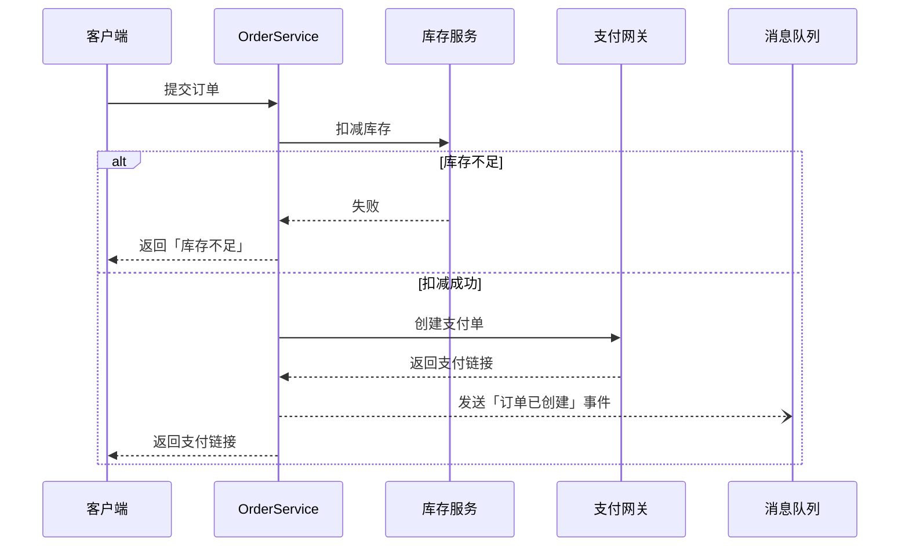

**怎么填变量**：[图的类型] 拿不准时写「让你判断」：多个系统之间来回调用适合时序图，单个函数里分支多适合流程图，订单、审批这类有状态的对象适合状态图。[读者] 是产品经理时，AI 会把技术细节收进备注里。

**常见坑**：
- AI 画图时容易「美化」流程，把代码里实际没有的校验步骤也画上去。模板要求只画代码里有的，缺失的放进「发现的问题」，这部分常常比图本身更有价值。
- Mermaid 对特殊字符比较敏感，节点文字里出现括号、冒号、引号时容易渲染失败。渲染报错时把错误信息贴回去让它修。
- 一张图塞几十个节点就没法看了，拆成总图加子图。

**追问技巧**：图出来后可以追问「标出这个流程中所有会访问数据库的步骤」或「在时序图上标注每一步的超时时间」，把图变成评审工具。

### 示例输出

> 示例，仅供参考（下单流程时序图）

| 节点 | 位置 |
|---|---|
| 扣减库存 | `order/service.py` 的 `create_order()` |
| 发送事件 | `order/events.py` 的 `publish_created()` |

**发现的问题**：创建支付单失败时，已扣减的库存没有回滚。
