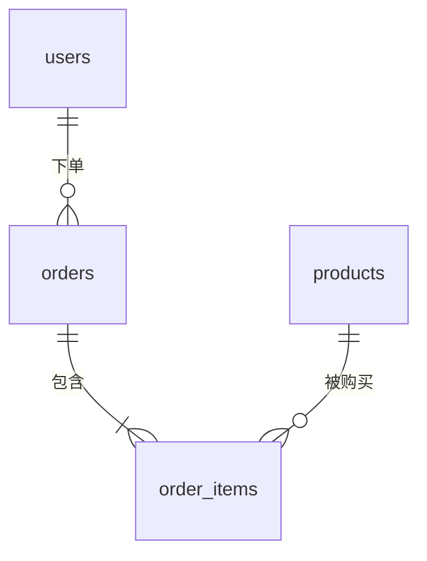

**怎么填变量**：[建表语句] 可以从数据库工具中直接导出。[样例数据] 非常有用：同一个字段名「status」，看到样例中的取值（1、2、3 还是 paid、shipped）才能推断含义。贴样例前务必把手机号、姓名、地址等个人信息脱敏。

**常见坑**：
- 字段名看起来一目了然，实际含义却不同，例如「amount」到底是原价、实付还是退款后金额。凡是推断的含义都要找业务或开发确认。
- 金额单位：有的系统用分存储整数，直接求和会把金额放大一百倍。
- 忽略逻辑删除字段，统计时把已删除的数据也算进去了。

**追问技巧**：确认完待确认问题后，把答复贴回来，说「根据这些答复更新数据字典，并删除对应的待确认标记」。精简版可以作为 Text-to-SQL 的表结构说明使用（可配合 1139 号提示词）。

### 示例输出

> 示例，仅供参考（字段说明节选）

**表 orders（订单主表，一行代表一个订单）**

| 字段 | 类型 | 业务含义 | 取值说明 | 来源 |
|---|---|---|---|---|
| id | bigint | 订单编号，主键 | — | 注释 |
| status | tinyint | 订单状态 | 样例中出现 0、1、3、9；推测 0 待支付、1 已支付、3 已发货、9 已取消 | 推断，待确认 |
| pay_amount | int | 实付金额 | 样例值如 12990，推测单位为分（即 129.90 元） | 推断，待确认 |
| is_deleted | tinyint | 逻辑删除标记 | 1 表示已删除，统计时需过滤 | 推断，待确认 |

