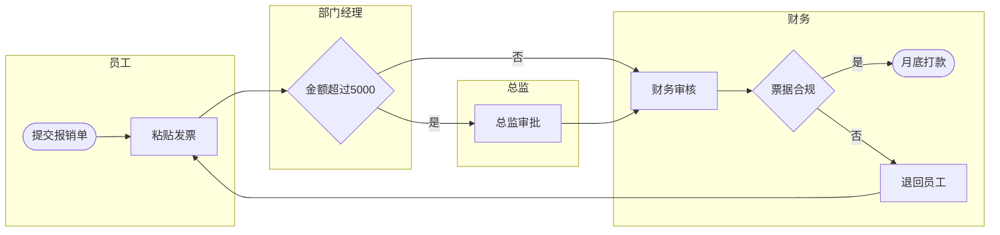

**怎么填变量**：[粘贴流程描述] 可以很口语化，比如「员工先在系统里填报销单，贴发票，部门经理审批，超过 5000 要总监再批，财务审核，有问题退回，没问题月底打款」。[已知问题] 写大家抱怨的点，比如「报销要等一个月」，诊断会更有针对性。

**常见坑**：AI 生成的 Mermaid 代码偶尔会因为节点文字里有括号、引号等符号而无法渲染，遇到报错就把错误信息贴回去让它修正。另一个常见问题是流程描述只写了「正常情况」，没有写被退回、被拒绝之后怎么办——这正是流程图最该画清楚的地方。

**迭代追问**：追问「把优化后的流程写成 SOP 文档」（可以配合 SOP 写作提示词）；需要放进 PPT 时，可以说「把流程简化成 5 个关键步骤，写成适合 PPT 的横向流程图描述」。

### 示例输出

> 示例，仅供参考（费用报销流程）

**流程诊断**：部门经理节点只有金额判断，缺少「经理审批不通过」的分支（断点）；员工被退回后无时限要求，容易长时间卡住（等待）。
