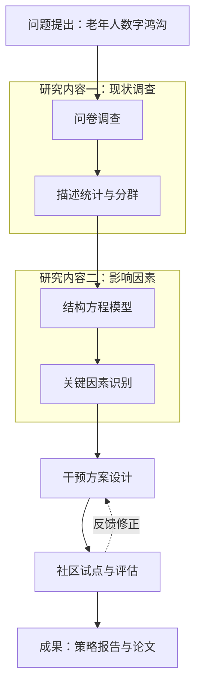

**怎么填变量**：[研究内容] 和 [方法与技术] 最好一一对应地写，比如「内容一：现状调查——问卷调查 + 描述统计」。这样 AI 生成的路线图逻辑清楚，评审专家一眼能看出「每件事怎么做」。[研究阶段] 可以写「前期准备 / 数据收集 / 分析建模 / 验证应用」这类阶段，图的左侧会多一列阶段标签。

**常见问题与调整**：
- Mermaid 渲染报错 → 把报错信息贴回去：「修复语法错误，节点文字中的括号和引号请转义或去掉。」
- 图太挤 → 追问：「把每个研究内容拆成单独的 subgraph，方向改为 TB，减少交叉箭头。」
- 评审要求「技术路线清晰可行」→ 追问：「检查这张图能否让外行在 30 秒内看懂研究的先后顺序，并提出简化建议。」

**配合使用**：申报书的研究内容与可行性分析可参考本站「开题报告怎么写」「国自然申请书怎么写」提示词。

### 示例输出

> 示例，仅供参考（课题：社区老年人数字技能提升策略研究）

