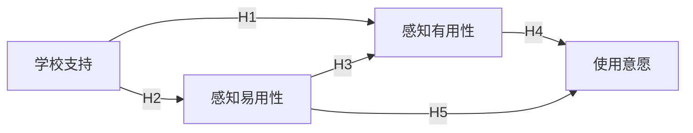

**怎么填变量**：[候选理论] 只写名字就行，比如「计划行为理论、技术接受模型」，AI 会比较它们与你研究问题的匹配度。如果不知道用什么理论，可以写「不确定，请根据研究问题推荐 2–3 个候选理论」，但推荐的理论一定要自己去读原始文献。

**常见问题与调整**：
- 理论和变量「两张皮」→ 追问：「逐条说明每个变量在所选理论中对应哪个构念，没有对应的变量说明保留理由。」
- 模型太复杂（十几个变量、多重中介）→ 追问：「按我的样本量和研究周期，删减到最核心的路径。」
- 调节效应画不出来：Mermaid 不支持「指向箭头的箭头」，常见做法是把调节变量节点用虚线连到路径中间的一个小节点，正式论文图可在 PPT 中重画。

**配合使用**：变量的测量方案用本站「变量操作化提示词」；假设写法用「研究假设怎么写」；数据分析可用「中介效应与调节效应分析提示词」。

### 示例输出

> 示例，仅供参考（研究问题：教师使用 AI 备课工具的意愿受哪些因素影响）

**主理论**：技术接受模型（核心构念：感知有用性、感知易用性 → 使用意愿）；**补充**：引入「学校支持」作为外部变量，解释组织情境的作用。

**一致性提醒**：横断面问卷只能检验变量间的关联，论文中「影响」宜表述为「与……正相关」或「正向预测」。
