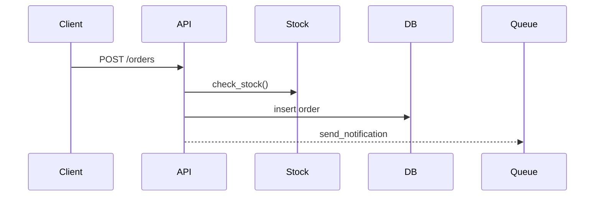

**怎么填变量**：[我的技术背景] 写实际情况，如「会 Python，第一次看 React」，解释深度会差很多；[目录结构] 可以用 `tree -L 2` 命令导出。代码太多时先贴入口文件，再按需追加。

**追问技巧**：对某段没懂，直接说「第 3 部分再讲细一点，举个具体输入的例子」；理解后可以追问「如果要加 [新功能]，给出改动方案」。

**适合模型**：通用大模型均可；整个代码库的理解建议用能读取项目文件的编程助手。

> 注意保密：公司代码请按团队规定使用经授权的 AI 工具。

### 示例输出

> 示例，仅供参考

**总览**：这是一个 Flask 接口，接收订单请求，校验库存后写入数据库，再异步发送通知。

**注意**：check_stock() 与扣减库存不在同一事务里，高并发时可能超卖（推测，需确认数据库配置）。
