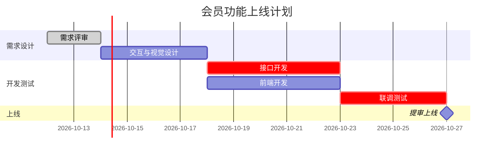

**怎么填变量**：[团队与角色] 里写上每人的投入比例（如「前端 1 人，50% 时间」），排期才不会假设所有人全职投入。[已知约束] 写清外部依赖，比如「法务审核合同一般要 5 个工作日」，这类等待最容易被漏排。

**常见坑**：模型默认按自然日排期、忘了节假日；任务之间没写依赖导致全部并行。拿到计划后追问「检查有没有同一个人在同一天被排了两个全职任务」。

**迭代追问**：项目进行中可以把实际进度贴回去：「任务 2.3 延期 3 天，重排后续计划并告诉我截止日期是否受影响」。需要汇报时说「把计划压缩成一页给老板看的里程碑版」。

### 示例输出

> 示例，仅供参考（小程序会员功能，4 周）

**关键路径**：需求评审 → 设计 → 接口开发 → 联调测试 → 提审。接口开发每延误 1 天，上线就推迟 1 天。
