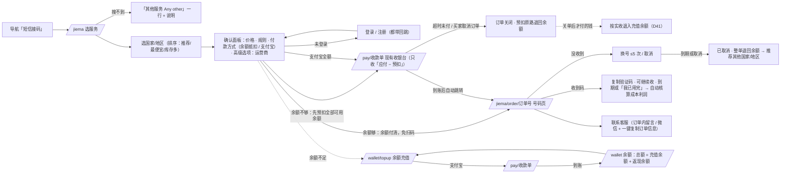
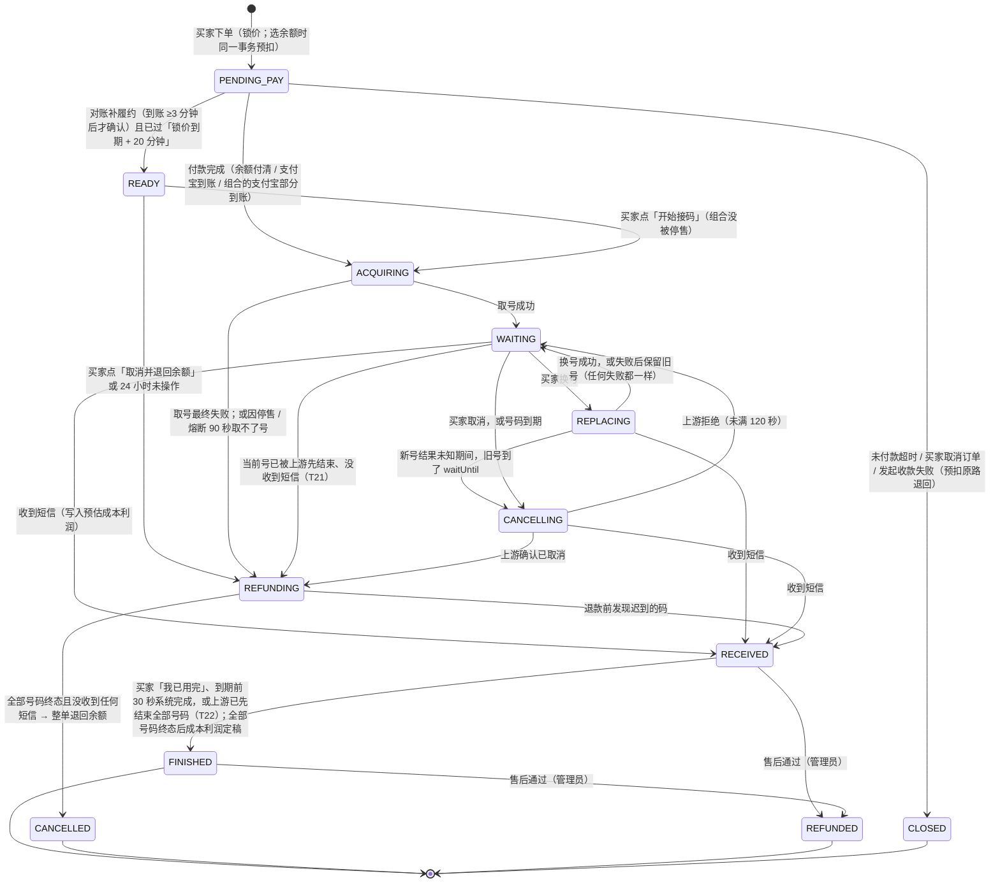
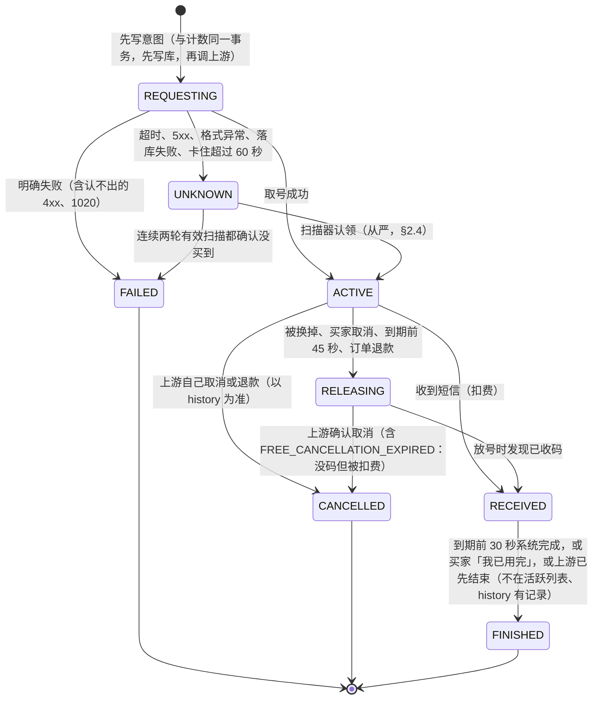
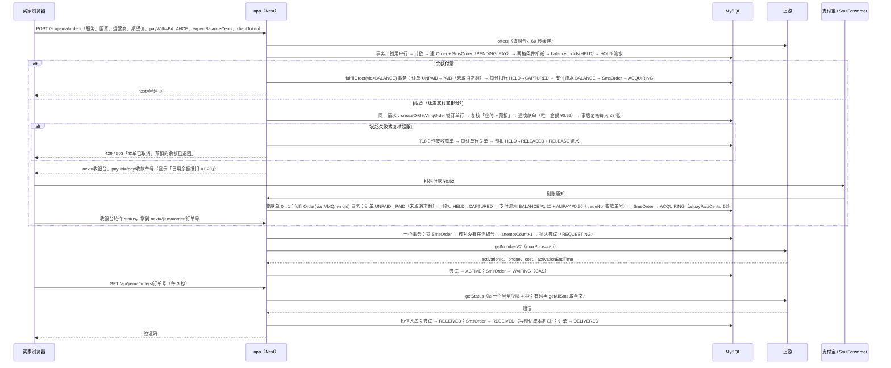
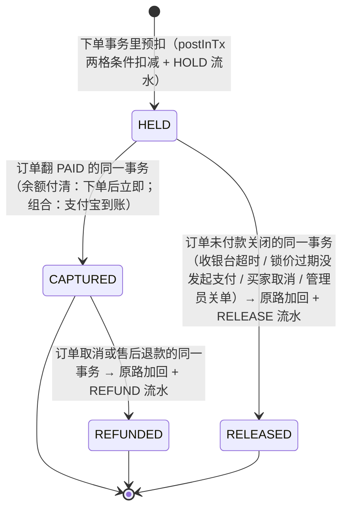

# 短信接码（通用板块）与站内余额 · 设计契约

**版本 v1.3 · 日期 2026-09-29 · 状态：站长已确认，待实施**

> **v1.3**：对 v1.2 做了一轮核验，29 条意见逐条处理（登记在文末「评审处理记录（v1.2 核验，2026-09-29）」），站长 Q1–Q16 的决定不变。主要改动：E26 在途占用改成一条精确公式（两种扣费口径取较大者、按 `eff(cap)=max(cap, 6700)` 计、锁价过期但收银台仍可付的待支付单照样计入），上游余额缓存移进进程内存；「新板块价格 ≥ 旧单品价格 × 0.8」写进 D13、§4.3 与定价预览，示例改成自洽的 y=¥4.40；开票提示的范围统一为「余额充值与短信接码订单」、显示位置统一成一张清单（含钱包页）；充值单笔上下限保留可配，但加保存校验、文案按配置渲染；重新发起支付被关单时按付款方式分文案；手动停售的三种机制在 gate 里列全；售价函数先兜最低售价再按角取整。
> **v1.2**：本版落实了站长 2026-09-29 对 §12.4 开放问题 Q1–Q16 的全部回复，并贯穿全文改写（不只改 §12.4）：定价默认值与后台自定义（Q1）、**不屏蔽任何平台与国家**（Q2，D25）、**不申请转售商身份**（Q3，D23）、**上游余额不设停售线与每日扣费上限、低于 $2 告警、下单锁价前核对余额够付本单**（Q4，E26）、**充值档位 ¥5/10/15/20/50 + 自定义 ¥1–1,000 整数元、取消充值余额总额上限**（Q5，D36）、**充值与余额消费不支持开票、提示联系客服开票处理**（Q8，D37），其余维持默认（Q6、Q7、Q9–Q16）。逐处改动登记在文末「站长决定落实记录（v1.2）」。**与 v1.1 及更早版本冲突之处一律以本版为准。**
> **v1.0 的来历**：v0.2 纳入了站长 09-29 追加的四件事（余额充值与管理、余额 / 组合支付、未接码整单退回余额、售价系数与成本汇率分开核算）；随后按惯例做了五路对抗评审（余额支付、资金状态机、上游事实、体验对标、仓库集成），79 条意见逐条核对代码和调研原件后，处理结果登记在文末「评审处理记录」。
> **v1.1**：对 v1.0 做了一轮核验，处理了 7 条没修到位的问题和 23 条新问题（迟到付款的手动 / 自动退入规则、组合单下单即发起收银台、充值下单串行化、在途单不依赖配置、订单级「上游先结束」迁移等），逐条登记在文末「评审处理记录（v1.1 核验遗留）」。
> 本文是「短信接码」板块及其依赖的**站内余额底座**的**契约**：页面、状态机、定价、数据表、接口、资金口径、实施分包都以这里为准。
> 事实来源是 `docs/短信接码-调研.md`（hero-sms 的 API、规则、实测、UX、竞品，以及本仓库集成点）。本文引用的「调研 §x」都指那份文件。
> 代码引用写成 `文件:行号`，行号以 2026-09-29 工作区为准（HEAD `4bddf33`）。
> 改动前必读：第 0 章（裁决表）、第 2 章（状态机，含 §2.7 余额预扣与迟到付款）、第 9 章（资金与余额总账）、附录 B（不能改错的地方）。

---

## 0. 执行摘要与裁决

### 0.1 执行摘要

1. **做什么**：导航加「短信接码」（`/jiema`）：上游支持的服务与国家/地区**全部开放、不设屏蔽**（含中国 +86、国内实名类、金融、加密货币平台，Q2）；搜服务（搜不到引导「其他服务 Any other」）→ 选国家/地区 → 可选运营商（站长说的「号码地区」）→ 人民币一口价（锁价）→ 付款 → 自动跳到号码页。收码前可免费换号 5 次，收码后不能换号或取消；号码页与客服页都能直接联系站长。
2. **定价与核算**：售价 = 上游美元报价 × 售价系数 x + 加价 y，**向上取整到分**（可选到角），不低于最低售价；**真实成本 = 上游实扣美元 × 成本汇率**（另一个配置项，与 x 无关）。默认 x=8.00、成本汇率 7.20、y=¥1.50、最低售价 ¥1.00，**后台都能改**，加价 y 与容差还能按服务 / 国家覆盖（Q1）。收码时写预估，订单结束且所有号码都终态时自动定稿成本与利润，后台订单与仪表盘可见。
3. **余额**：买家看到一个总余额，内部分两格——**充值余额**（支付宝充值、接码退款进这里，不可提现）与**返现余额**（现有 `users.balance`，可提现）；付款先扣充值格；目前只能付接码单，只在主站。充值档位 ¥5/10/15/20/50，也可自定义 ¥1–1,000 的整数元（单笔；上下限后台可在这个范围内调，D36），**不设充值余额总额上限**（Q5）；余额充值与短信接码订单（不论用余额还是支付宝付款）**不支持自助开票**，页面提示「暂不支持开票，可联系客服开票处理」（Q8，D37）。
4. **付款**：余额够就余额付清、免扫码；不够就在下单时预扣全部可用余额、差额走支付宝（组合支付）；或支付宝全额。要走支付宝的单，下单请求里就发起收银台，发起失败当场关单并退回预扣。预扣与「翻已付款」「关单」各在同一个事务里，全链路三道幂等。
5. **退款**：没收到码（到期或买家取消）整单（含支付宝付的部分）退回余额，订单记「已取消」，不计成本、利润、销量，不参与返现和抽奖；页面明确写「已退回到余额，可用于下次购物抵扣」。
6. **迟到付款**：接码单和充值单一旦关闭就不再复活；关单后才到的钱按实收退进充值余额。归属能确定的自动退，包括最常见的「付完马上取消」（按收款单表验证这个金额期间只分给过这一张单）；其余由站长核对支付宝账单、填交易号后一键退入。
7. **上游**：新客户端、新表，旧 Codex / Claude 单品零改动；取号结果不明绝不重取；号码到期前主动取消或完成，拿有文档的确定结果；按上游自己的口径监控成功率与线程，防封号（本期不申请转售商身份，按现有共用账户运行，Q3）。**上游余额不设停售线、不设每日扣费上限**，低于 $2 企业微信告警（节流）；唯一的物理约束是下单锁价前核对缓存余额够付本单的取号上限，不够就提示「暂不可购买」，免得买家付了款才取不到号（Q4，E26）。
8. **后台**：「短信接码」（概览、订单成本利润、定价、目录、售后、对账）与「余额与充值」（负债、两格调整、流水、充值单、预扣、对账）。
9. **上线**：B0 余额底座 → B1 充值（仅管理员）→ S0/S1 → S2 接码下单（仅管理员真钱验收）→ S3 → S4 对账上线后才对全部用户开放。
10. **站长已拍板**（2026-09-29）：§12.4 的 Q1–Q16 全部有了最终决定，本版已贯穿落实。

### 0.2 裁决表

> v0.2 改写了 D1–D4、D6、D11–D14、D16、D20、D21、D27、D28，新增 D29–D40。v1.0 按评审改写了 D3、D8、D9、D10、D17、D19、D20、D22、D24–D28、D35、D36、D39、D40，新增 D41–D44（迟到付款不复活、号码怎么结束、防封号监控、国家/地区命名）。**v1.2 按站长 09-29 的决定改写了 D12、D23、D25、D36、D37、D38**（Q1–Q5、Q8）。

| # | 决策 | 选择 | 理由 | 被否方案 |
|---|---|---|---|---|
| D1 | 付款模式 | **每单付款 + 站内余额**：每张接码单可以用余额付、支付宝付，或「余额 + 支付宝」组合付；余额可以用支付宝充值获得，接码退款也进余额 | 站长 2026-09-29 追加需求。保留「提交 → 付款页 → 号码页」的单次付款流程，第一次来的买家不必先充值；常客可以先充值，之后一键下单、免扫码；退款进余额后能直接再用 | 只做单次付款、不开充值（v1 的 D1，站长已否）；纯预充值再按次扣（hero 的模式：首单必须先充值，转化差） |
| D2 | 余额能付什么 | **目前只能付短信接码单**，只在主站。其他商品的下单与收银台不出现余额选项（Q11，站长确认本期不扩展） | 其他商品牵扯开票税费、推荐返现、优惠券、渠道结算，余额一旦能付就要逐个重定口径，另外立项。`PayMethod.BALANCE`（`prisma/schema.prisma:389-393`）和店面开关 `balancePay`（`src/lib/storefront/public.ts:23`）都已存在，**不用改枚举** | 全站商品都能用余额付 |
| D3 | 未接码的退款去向 | **整单自动退回站内余额**（含支付宝付的部分）：号码到期、买家手动取消、取号失败、付款确认迟到后买家选择退回，一律如此。上游确认号码已取消后，在同一个事务里入账（买家取消的通常 1 分钟内；到期的在号码到期前后几分钟内，D42）；上游联系不上时，最迟在号码到期后约 1 小时推定退回（E20）。订单记为「**已取消**」，**不计成本、利润、销量**，也不参与任何营销钩子。页面、流水、FAQ 统一告诉买家「已退回到余额，下次购买可直接抵扣（目前可用于短信接码）」 | 站长需求。本站收款是个人收款码加 SmsForwarder，**没有商户退款 API**（`src/lib/vmq.ts:537`，调研 §0-14），自动原路退回支付宝做不到；历史激活成功率只有 31%，逐单人工退款运营扛不住。到账时限只写代码做得到的（交接文档 1816 的教训），所以按 E20 的推定阈值写「最迟约 1 小时」 | 自动原路退回支付宝（做不到）；逐单人工退（现状：备注写【待退款】，`src/lib/sms.ts:140`）；承诺「最迟 25 分钟」（E20 做不到） |
| D4 | 退款金额与原路规则 | **退实收全额，按格原路**：余额抵扣的部分按预扣时的拆分原路退回（充值格回充值格、返现格回返现格）；支付宝付的部分（含识别尾差）退进**充值格** | 付多少退多少，免得解释「付了 1.72 怎么只退 1.70」；返现部分原路回返现格，买家可提现的钱不会被「洗」成不可提现；支付宝部分如果退进返现格，就出现「支付宝付款 → 取消 → 提现」的套现通道（D29） | 只退货款 `amount`；支付宝部分退进返现格；按比例拆回 |
| D5 | 是否锁价 | **锁价**：下单时锁定售价，买家付的就是报价；报价后 10 分钟内要发起支付，收银台再给 20 分钟（`vmq.ts:33`） | 上游价格一天跳好几次（调研 §4.5），不锁价就会出现「付完款又涨价」；10+20 分钟把价格风险窗口压到 30 分钟以内 | 付款后按实时价补差价；不锁价 |
| D6 | maxPrice 容差 | **cap = min(报价成本 × (1+25%), (售价 − 最低毛利 ¥0.50) ÷ 成本汇率)**，而且至少等于报价成本；**不用 fixedPrice** | 有容差，起价档卖光时还能拿下一档（阶梯库存，调研 §3.3）；毛利护栏的含义是「按**真实成本**算，任何一次取号最坏也赚 ¥0.50」，所以除以成本汇率（D38）；除以 x 会把 cap 压得过低（x 一般高于成本汇率），白白多出 WRONG_MAX_PRICE 退款；fixedPrice 只按一个价成交，失败更多 | 不传 maxPrice（亏损没有上限）；maxPrice 等于报价成本；护栏除以 x；fixedPrice=true |
| D7 | 换号次数、冷却、收费、成本归属 | 每单**免费换 5 次**（后台可配 0–10，也可以给某一单加赠）；冷却 = 当前号码取到后 **120 秒**（上游硬约束，配置不能低于它）；**不另收费**；新号成本在 cap 以内由我方承担，超过 cap 就不换，提示可以取消（整单退回余额） | 历史成功率 31%，同一单连换 5 个号的情况常见（调研 §3.2）；换掉的号上游会退费，成本接近 0；向买家二次收费等于劝退 | 沿用旧单品的 3 次（`sms.ts:223`）；按次收费（SMSPool 第 5 次起收 50%）；不限次数（拉低上游成功率，招来封禁） |
| D8 | 换号实现 | **自己做「先取新号 → CAS 切换 → 放旧号」**，不用 v1 `/replace`。上游线程受限（CHANNELS_LIMIT，E5）期间**暂停换号**，旧号继续有效，买家可以继续等或取消 | replace 的前置条件、计费、旧激活怎么处理都没有文档（调研 U3）；现有 retryActivation 的这个顺序已在线上跑过（`sms.ts:243-249`）；先取新号，换号失败时买家手上的旧号还能用。先取后放会瞬间多占一个线程，线程被限时换号必然失败，所以直接暂停，而不是改成「先放后取」让买家两手空空 | v1 replace；先取消再取新（新号取不到时买家两手空空）；受限时改先放后取 |
| D9 | 收码后「再收一条」 | **不提供按钮**。收到码后号码保留到有效期结束前 30 秒，后续短信自动显示；到那时由系统调 finish（D42），或买家点「我已用完，释放号码」（二次确认）时提前 finish。「可以继续收码」的提示只在取号返回 `canGetAnotherSms=true` 时显示 | 上游说额外短信免费、自动送达，hero 自己也把这个按钮做成永久置灰（调研 §4.6）；现有单品收到码立刻 finish（`sms.ts:158`），会丢掉后面的短信。能不能再收是逐单的（`canGetAnotherSms`，调研 §1.2、§2），不能对每一单都承诺 | setStatus=3 按钮；收码立即 finish；对所有单都承诺「可以继续收」 |
| D10 | Webhook 还是轮询 | **服务端集中轮询**：cron 每分钟启动一个 45 秒的循环，每 5 秒用 getActiveActivations 批量拉一次（一次调用覆盖 100 个激活）；买家在页面上时，对自己的号码至少隔 4 秒用 **getStatus**（状态枚举有完整文档）补查一次（用数据库 CAS 节流）；**前端只查我方数据库**。Webhook 放到 P2，只当作「提醒我们去查」的信号 | Webhook 没有签名、要开 2FA，IP 白名单又受 nginx 真实 IP 问题影响（调研 §6.9-13）；而且取消、超时、退款都不推送。批量接口让轮询成本和在线人数无关。getStatusV2 在等码时返回什么没有文档（调研 U5），拿它做单查会把正常的等码响应当成「未知」 | 以 webhook 为主；每个买家请求都透传到上游（现状 `api/orders/[id]/sms/route.ts:52`，量一大就撞 50 RPS）；用 getStatusV2 单查 |
| D11 | 是否上渠道分站 | **只在主站提供**：接码、余额支付、充值、钱包都一样。接口第一行 denyOnChannel，页面 notFoundOnChannel，导航用新开关 `jiema` 在渠道站隐藏；`balancePay`、`wallet` 对渠道站恒为关 | 渠道单需要进货价快照和 TenantListing，动态定价放不进去；多渠道设计 D5 明确「余额支付将来新增时必须按店面判断、渠道站拒绝」（`docs/多渠道分销-设计.md:22,1262`），渠道结算也处理不了用站长余额付的单。渠道站注册的用户（全局账号）到主站照样能用自己的余额 | 渠道站同步上线；渠道站也开余额支付 |
| D12 | 营销与业务钩子 | **接码单**（不论用什么付）**不参与**：优惠券、推荐返现与专属价、下单抽奖、下单开票、事后开票与收据（自助入口都不给，改为提示「暂不支持开票，可联系客服开票处理」，D37）、首页实时成交、付款邮件、企业微信「新订单 / 已付款」推送。**参与**：会员累计消费、营销「已购用户」、仪表盘营收（这三项只统计「已付款未取消」的单，已取消单自动排除）。**充值单什么都不参与，也不计营收**（D40） | 定价是成本加成、单价很低，用券或返现会直接吃掉利润；抽奖门槛默认 0（调研 §6.4）；开票需要品名；小单会刷屏；充值是预收款，买家用余额消费时才算营收 | 全部参与；全部排除 |
| D13 | 和 Codex / Claude 旧单品的关系 | **旧单品完全不动**（包括渠道站正在卖的），继续走 SmsActivation 旧链路，也**不能用余额付**（D2）。新板块有独立的表和引擎。以后可以用开关把**主站**旧单品迁进新引擎（P5，默认关）。新板块给 dr、acz 配加价规则，**判定标准（Q1）：dr、acz 每个组合的售价 ≥ 对应旧单品现价 × 0.8**（「对应」= 同服务、同国家/地区的上架单品；旧单品是随机地区的，与这个服务的每个国家/地区都比）；定价页预览逐行标 ✓ / ✗（§7.3），上线前热门组合全部 ✓（§11 S1） | 旧链路在线上稳定，渠道站依赖它；两条链路互不干扰，才能各自独立回滚 | 立即合并（迁移风险大，渠道站也没有退款去处）；下架旧单品 |
| D14 | 订单载体 | 建两个**下架的「系统载体商品」**：`deliveryType='SMS_POOL'`（接码单）和 `deliveryType='TOPUP'`（充值单），都是 `status=0`、`price=0`。每张接码单 1:1 挂一行 SmsOrder 快照；充值单只是一张普通订单。**只在「建单」和「发起支付」两处给这两种载体开例外** | 所有对外列表都按 `status: 1` 过滤（调研 §6.5），下架商品天然不会外泄（fail-closed）；充值复用订单 + 收银台 + 到账匹配 + 对账补履约，不给收款单加新的业务类型（`schema:516-532` 只认 order / invoice） | 商品上架但加一个「不列出」标记（要改十几处查询，漏一处就外泄）；给 Order 加 kind 列；给收款单加 bizType='topup'（要改到账匹配、对账、后台多处） |
| D15 | 一单多号怎么存 | 新建三张表：**SmsOrder**（与订单 1:1）、**SmsAttempt**（每次取号一行，1:N）、**SmsMessage**（每条短信一行）。旧表 SmsActivation 原样保留 | SmsActivation 的 orderId 唯一，换号时覆盖同一行（`sms.ts:305-317`），没法对账也没法举证；新表不碰旧表，不需要任何迁移 | 改造 SmsActivation（要去掉唯一约束，schema 铁律不允许删约束，旧代码也依赖它） |
| D16 | 主路由与入口 | 接码：主页面 `/jiema`，号码页 `/jiema/order/[orderNo]`，记录页 `/jiema/records`，导航显示「**短信接码**」，窄屏（md–lg）显示「接码」。余额：现有 `/wallet` 改造，新增充值页 `/wallet/topup`；**导航栏不加「充值」** | 和已有的 `/chongzhi` 拼音风格一致；`/sms` 容易和收款监控 `/api/pay/sms-notify`（`vmq.ts:1088`）混淆；导航里现有的「充值」是订阅代充落地页 `/chongzhi`，再放一个「余额充值」会让买家分不清 | `/sms`；`/receive-sms`；导航加「余额充值」 |
| D17 | 调哪些上游接口 | 取号用兼容协议 **getNumberV2**；查码用 **getActiveActivations 批量 + getStatus 单查**，取全文用 **getAllSms**；取消用 **setStatus 8**，完成用 setStatus 6；**号码已不在活跃列表、或返回 ACTIVATION_NOT_ACTIVE / NOT_FOUND 时，以 v1 history 为准**；UNKNOWN 认领用 **v1 `GET /activations`**（带运营商与带时区的创建时间）；报价用 **v1 offers**；成功率监控用 **v1 `/activations/stats`**；对账用 **v1 history** | getNumberV2 的错误码有完整文档，还会返回成本和 activationEndTime；v1 购买在余额不足、没号时返回什么，文档没写（调研 U9）。history 的 6 / 8 / 10 三种状态都有文档、`createDate` 实测带时区；getStatusV2 的等码形态和「上游退款后 getStatus 返回什么」都未确认（调研 U5） | 全部用 v1；沿用 getNumber（拿不到成本）；单查用 getStatusV2；认领用 getActiveActivations（没有运营商、时间不带时区） |
| D18 | 上游客户端 | **新写 `src/lib/jiema/upstream.ts`**（带超时、限流、错误归一、日志脱敏），**不改 `src/lib/herosms.ts` 的行为** | 给旧客户端加超时，旧的 acquireForOrder 就会出现「超时其实已经买到」、再被 GET /sms 的自愈重取一次的情况（调研 §6.9-4） | 直接改 herosms.ts |
| D19 | 取号结果未知 | 超时、5xx、格式异常、落库失败，**一律标 UNKNOWN，绝不重取**；由扫描器对照上游 v1 活跃列表去认领或确认没买到，最长 3 分钟。**认领条件从严**（§2.4）：服务、国家、运营商一致，上游创建时间落在本次请求的时间窗里，价格不超过 cap，同一组合没有别的在途请求，窗口内旧单品没有取号或换号动作——任何一条不满足就转人工，**宁可人工，不能把别人的号给错人** | 上游没有幂等键；重取就可能买两个号，还会拉低上游那边的成功率统计。旧单品会留下不在任何表里的孤儿号（`sms.ts:86-91,318-323`，取号 120 秒内取消必被拒），和新板块卖同样的热门组合，宽松认领就会把旧买家用过的号发给新买家 | 超时就重试；「同组合恰好 1 个候选就认领」 |
| D20 | 什么时候取消并退款 | **该单所有号码都进入终态、并且没有任何一个号收到过短信**（上游确认 8/10，或取号失败）时，才把订单改成「已取消」并整单退回余额。个别号码没收到码却被上游扣了费（`FREE_CANCELLATION_EXPIRED`、上游不可达时推定退款事后翻案），订单照样「已取消」、整单退回余额，那笔扣费单列为**亏损**（`lossCents`） | 上游只在没收到码时退费；按我方计时器退款，就会出现「退了款、码却到了」。站长规则是「没接到码就整单退回余额」，与上游扣没扣费无关；扣了费的部分是我方损失，单独记账，不混进利润 | 我方计时一到就退；扣了费就不退 |
| D21 | 报价成本基准 | 用 offers 的 `retail/min`（等于 getPrices 的 `cost`）；起价档没货时，取 map 里有货的最低一档。**这只是定价用的报价成本**；落账的真实成本见 D38、D39 | 账单实扣就是 retail（调研 §3.2）；用 default 会少算 17%；getTopCountries 的 price 是买不到的价 | default；getTopCountries.price |
| D22 | 价格缓存 | **三层**：① 全量 getPrices 每 10 分钟一次（列表「起价」，只判断「有货」，**不给库存档位**）；② 按服务拉的 offers 缓存 5 分钟，过期后先返回旧数据、后台刷新（国家列表、库存、推荐排序），**只有 cron 预热和近期有人下单的服务会触发上游**，匿名访问不触发；③ 下单时实时拉该组合的 offers，缓存 60 秒（锁价用）。getPrices 在规格里已标废弃，连续失败时自动降级（§6.3） | 全量 offers 有 3.4MB，1.8G 的机器不宜频繁拉；每层的粒度和精度正好对应它的用途。getPrices 的 count 等于任意价格下的总量（dr/16：16 万对起价档 63），拿来显示「充足」会严重高估；匿名触发刷新会被爬虫拿来占满上游并发，挤掉付款后的取号 | 定时拉全量 offers；每个请求都透传；第 ① 层也显示库存档位 |
| D23 | 转售商身份 | **本期不申请**（站长 09-29 决定，Q3），按当前共用账户运行，封号风险靠我方的「组合成功率自动停售」与上游口径监控兜底（D43）。代码里保留 `resellerMode` 开关（默认关，P2）：以后真要申请，拿到身份后打开它，切到 v1 `POST /activations`、传 `resellerUserId`（用户 id 的 HMAC），不用改表 | 站长判断申请流程不值得现在做；封禁按我们整个账户算（调研 §0-11），所以 D43 的停售与预警必须照常做；resellerUserId 只在 v1 文档里出现，预留开关的成本很低 | 现在就申请；在兼容协议里盲传这个参数 |
| D24 | 什么时候要求登录 | 浏览、搜索、看价格都不用登录；**点「去支付」时才要求登录**（先等 useHydrated 再判断）。选项存在 URL 里，回跳地址整体 `encodeURIComponent`；登录页的「注册」链接带上同一个 redirect，**注册成功后也回到确认面板** | hero 最大的转化杀手就是点一下国家就弹登录（调研 §4.1）。现有注册链接不带 redirect、注册成功固定回首页（`login/page.tsx:172`、`register/page.tsx:103`），而接码的主力客群恰恰是没有账号的首次访客 | 一进页面就要求登录；只管登录不管注册 |
| D25 | 开放范围（原「合规默认值」） | **不屏蔽任何平台与国家**（站长 09-29 决定，Q2）：上游支持的服务与国家/地区全部开放，包括中国 +86（国家 3）、国内实名类（微信、QQ、支付宝、京东、拼多多、滴滴、微博、B 站、百度、小红书等）、金融与支付、加密货币平台。**不设默认屏蔽名单、不做「命中即告知不提供」**；国内平台的拼音缩写（wx、zfb、dy…）改作对应服务的**搜索别名**（§1.5）。后台保留「手动下架某个服务 / 国家」的运维开关（`status=OFF`，要填原因、写审计），**默认下架列表为空**。按成功率自动停售（D43）是防封号的保护机制，照常保留。唯一的排除是 `full`（Full rent，租号）：它不是接码服务，属于本期「明确不做」的租号（§0.6），目录同步时直接过滤 | 站长决定：只要上游支持就全部支持。风险照实记下由站长承担：《反电信网络诈骗法》第 14 条与易码案（调研 §5.3）；上游规则禁止银行和金融用途，被判违规可能封整个账户、旧单品一起停摆（R3、R7）。保留的措施：条款禁止违法用途并逐单留痕、事件日志、组合成功率停售、后台手动下架开关。上游有些代码和中文拼音缩写撞车（wx=Apple、wb=WeChat、dy=Zomato、mt=Steam），所以买家搜索仍然**不匹配上游代码**，缩写只走别名 | 默认屏蔽国内实名、金融、加密货币与 +86 并明确告知「不提供」（v1.1 的默认，站长已否）；屏蔽但不告知；搜索匹配上游代码 |
| D26 | 库存和成功率怎么展示 | 显示「充足 / 较多 / 紧张」三档加约数（只用第 ② 层 offers 的起价档数据；只有第 ① 层数据时只显示「有货」）；售罄的组合灰显、排到最后；**不显示实体号 / 虚拟号**；「推荐」标签取上游的到达率排序，**本站样本满 20 单**才显示「本站成功率高」 | map 的语义没确认（调研 U1），精确数字可能误导；实体 / 虚拟无法按它下单，显示了反而误导 | 显示上游原始数字；显示成功率百分比 |
| D27 | 买家并发与频率 | 同时进行中的单 ≤3（**余额已预扣、等支付宝的待支付单也算**），每小时 ≤10 单，每天 ≤30 单（都可配）；在下单事务里锁住用户行再计数。**要走收银台的单（组合、支付宝）在预扣之前先检查现有的「每人待付款收款单 ≤3」**，超了就不建单、不预扣；预扣提交后**在同一个请求里发起收款单**并照 `pay/vmq/create` 做事后复核，发起失败或复核超限就在同一个请求里按 T18 关单、退回预扣，告诉买家「预扣已退回」 | 防止刷单占号、拉低成功率，也防止一个人同时挂很多张预扣单；进程内限流挡不住并发请求。先查只挡住大部分，收款单是之后才建的，并发请求会一起通过预检；把发起收款放进下单请求，失败出口（事后复核 429、金额池满、锁内复核不过）就都在同一个请求里收口，余额不会白占到锁价到期之后（`pay/vmq/create/route.ts:104,152`、`vmq.ts:272,387`） | 只靠进程内限流；预扣后再查；下单后由前端另发一次请求发起收款（失败时预扣要等 tick 才退） |
| D28 | 灰度 | 一个总开关，加一个受众开关（仅管理员 / 全部用户）。上线先设成「仅管理员」，用真钱下一单验证，**S4 的对账上线后**再对全部用户开放。充值有自己的开关，跟着接码一起对全部用户开放。**导航项和 sitemap 条目只在「总开关开 + 受众全部用户」时由服务端下发** | 钱的路径必须在生产环境用真钱验一次，每日对账也要先跑起来；余额目前只能付接码，接码没开放时开放充值等于收一笔用不了的钱。灰度期间导航挂着一个「即将开放」页、再被搜索引擎收录，没有意义 | 直接全量开放；导航和 sitemap 随代码上线 |
| D29 | 余额口径 | **一个余额分两格**（站长拍板）：买家看到一个总余额；内部分「**充值余额**」（支付宝充值、接码退款里支付宝付的部分、迟到付款退回，**不可提现**）和「**返现余额**」（现有 `users.balance`：推荐返现、后台手工调整，**可提现**）。提现只能提返现那一格 | 充值和退款如果混进可提现的余额，就是现成的套现通道（个人收款码进、人工提现出），提现的人工量也会失控（集成点地图 §3）；返现是买家挣的钱，必须保持可提现 | 一个余额全部可提现；单独开一个只给接码用的钱包（买家看到两个余额，易混淆） |
| D30 | 两格的数据模型 | **在 `users` 上加一列 `topup_cents`（Int 分，默认 0）作充值格；`users.balance` 原样作返现格，含义不变** | 两格在同一行：一条条件更新就能同时扣两格（原子）；所有现有写入方（返现结算 `referral.ts:79`、后台调余额 `admin/referrals/balance/route.ts:106-114`）本来就锁这一行，天然串行；**历史零回填**：新列默认 0，历史余额全部算返现，正是站长要求；现有读 `users.balance` 的代码（提现、内推面板）语义不变，提现自动只动返现格；新列用 Int 分（多渠道设计 5.0 第 7 条） | 新建钱包表（两处余额真相，要迁移并长期同步）；把 `users.balance` 改成总额、另加一列存返现（改变旧列语义，部署窗口里旧镜像会把充值的钱也当成可提现）；纯分录求和、不存余额（与现有模型不一致，扣款照样要锁用户行） |
| D31 | 流水模型 | **一次业务事件 = 一条流水 = 一个 bizKey**；两格变动写在同一行：原列 `delta` / `balance_after` 继续表示返现格，新列 `topup_delta_cents` / `topup_after_cents` 表示充值格，`biz_key` 可空 + 唯一。类型扩展为 TOPUP / HOLD / RELEASE / REFUND / LATEPAY / TOPUP_REFUND / CLAWBACK（原有 REFERRAL / ADJUST / WITHDRAW 不变）。**所有写余额的代码都走同一个记账函数** `wallet.ledger.postInTx` | 一笔组合扣款同时动两格，拆成两行就要两个幂等键、还要保证两行同进同退；写在一行，一个唯一键就挡住重放。每一格都满足「余额 = 流水之和」，历史行天然成立（新列默认 0） | 每格一行（两行两键）；新建流水表（历史流水要迁） |
| D32 | 扣款顺序 | **先扣充值格，再扣返现格**（站长拍板） | 对买家有利：可提现的钱留到最后；也先消化不可提现的预收款负债 | 先扣返现；按比例扣 |
| D33 | 组合支付的资金安全 | **建单时预扣**（Stripe「授权 → 确认 / 撤销」、电商「余额 + 银行卡」组合付的通行做法）：下单事务里锁用户行，用条件更新把可用余额从两格扣进一条 `balance_holds`（HELD）；支付宝部分到账后，**在翻 PAID 的同一事务里** CAS 成 CAPTURED；支付宝超时、买家取消、锁价过期没发起支付 → **在关单的同一事务里** CAS 成 RELEASED 并原路加回。预扣金额一经建立不可修改；一单最多一条；全链路靠「订单付款 CAS + 预扣状态 CAS + 流水 bizKey 唯一」三道幂等 | 收银台金额必须在出二维码时就确定；如果到账时才扣余额，这期间余额可能已被另一单用掉或被提现，钱就对不上。预扣直接从格里扣走，两个标签页同时下单也不会重复花同一笔余额。「关单 + 释放」「翻 PAID + 确认」各自同一事务，所以不存在「钱到了、预扣却退了」或「单关了、余额还扣着」的中间态 | 到账时才扣余额（可能扣不够）；只记冻结列、不扣（每个读余额的地方都要减冻结额，旧代码不认识它）；支付宝资金预授权（个人收款码做不了） |
| D34 | 付款方式能不能中途改 | **下单时选定，之后不改**。想换就「取消订单」（预扣立即退回），再重新下单 | 已出码的收银台金额和预扣额互相锁定，中途改要同时改收款单金额、预扣额和唯一金额锁，并发窗口多；取消重下只多点一次 | 待支付时允许切换 |
| D35 | 充值怎么做 | **复用订单 + 收银台**：`POST /api/wallet/topup` 建一张挂 `TOPUP` 载体的订单并立即发起收款（发起失败就在同一请求里关掉这张充值单）；到账后**在翻 PAID 的同一事务里**给充值格入账（按让它付款的那张收款单的实付，含识别尾差），订单直接 DELIVERED。迟到的钱不补单，按实收退进充值格（D41） | 到账匹配、对账补履约全部复用；入账和翻 PAID 同一事务，进程崩溃也不会出现「付了款没到账」；实付多少到账多少，最好解释 | 独立充值表 + 新 bizType；按订单金额入账（尾差被吞） |
| D36 | 充值档位与限额 | 档位 **¥5 / 10 / 15 / 20 / 50**，另支持**自定义金额**：单笔**不少于 ¥1、不高于 ¥1,000，只收整数元**（站长 09-29 决定，Q5）。档位与单笔上下限存在 `wallet_config`，后台可改，但**保存时 zod 强制**：`100 ≤ minCents ≤ maxCents ≤ 100000`，`minCents`、`maxCents` 与每个档位都是 100 的倍数，档位落在 `[minCents, maxCents]` 内，不合法拒绝保存（§5.3）；页面提示与 400 文案按接口返回的 `minCents`、`maxCents` 拼出来，条款写「以充值页为准」，所以调低上限不会让文案与校验对不上；上界 ¥1,000 是代码常量 `MAX_TOPUP_CENTS`，迟到退入的金额上界（¥1,000.49）依赖它（§2.7）。**不设充值余额总额上限**（站长没要求，v1.1 的「充值格上限 ¥1,000」与「本次最多可充」整套逻辑删除）；同一买家的待支付充值单 ≤2 张照旧。幂等、待支付张数、同金额复用都在锁住用户行的充值下单事务里算（§1.16），并发请求互相看得见 | 档位与上下限是站长定的；¥1 的下限挡住几毛钱的充值占用唯一金额池。**自定义金额只收整数元**，理由在收款识别机制：收银台按「基础金额 → +1 分 → +2 分 …」最多试 50 个候选分配唯一金额（`allocateAmount`，`vmq.ts:224-273`），所以整数元的充值单实付一定落在 [N.00, N.49]：①买家和客服一眼看出「¥12.03 = 充值 ¥12 + 3 分识别尾差」，「实付多少到账多少」好解释；②不同金额的充值单候选区间互不重叠，不会像 ¥12.34（候选 12.34–12.83）那样和 ¥12、¥12.50 的单抢同一批金额，高峰期「当前下单人数较多」更少；③迟到到账按金额反查订单（§2.7 候选订单、「数据验证唯一」）和「买家手输错金额」的判断更直观。单笔 ¥1,000 高于 v1.1 的 ¥500，个人收款码大额收款偶尔会触发支付宝风控，真遇到时再在 `wallet_config.maxCents` 调低（只能调低，不能超过 `MAX_TOPUP_CENTS`）。不设总额上限意味着主动预存的负债没有封顶（SMS-Activate 关停时余额被困，调研 §0-1），靠负债看板与每日对账盯住（§7.8、§9.4） | 自定义到分（候选区间互相重叠、尾差看不出来）；保留总额上限（站长没要求）；不设下限 |
| D37 | 充值开不开票 | **不支持自助开票**（站长 09-29 决定，Q8）：充值单、接码单（不论用余额还是支付宝付）都不给下单开票、事后开票、收据的自助入口（§6.6 第 18 条）；对买家的说法一律是「余额充值与短信接码订单（不论用余额还是支付宝付款）暂不支持自助开票」，不说成只限「充值与余额消费」。统一提示「**暂不支持开票，可联系客服开票处理**」，**显示位置以这张清单为准**（§1.8、§1.10、§1.15、§1.16、§6.6 第 27 条、§11 S2 ⑩、§12.3 第 126 条都按它写）：① 充值页说明区；② 钱包页「余额说明」与 `?topup=` 充值成功横幅；③ 接码确认面板主体末行；④ 号码页底部规则区，状态为 RECEIVED / FINISHED / REFUNDED / CANCELLED 时显示（PENDING_PAY 时买家刚在确认面板看过，CLOSED 没有付款，都不显示）；⑤ 「我的订单」里 `payStatus` 为 PAID 或 REFUNDED 的接码卡片（原「开具发票 / 收据」的位置）；⑥ 客服页接码分区与 FAQ 13；⑦ 条款第四节；⑧ 两个开票 / 收据接口的拒绝文案。客服收到请求后，站长用**现有后台工具线下处理，不新建开票流程**：发票用「发票管理 → 手动开票」（`POST /api/admin/invoices` → `createManualInvoice`，`src/lib/order-invoice.ts:473`，不关联站内订单、`source=MANUAL`；金额框填**含税**金额、抬头与税号必填，怎么填见 §8.5）或「生成开票填写链接」（`src/lib/invoice-request.ts:67`，金额由站长定、抬头由买家自己填）；收据用「收据管理 → 手动开具」（`POST /api/admin/receipts` → `createManualReceipt`，`src/lib/order-billing.ts:282`）。这些工具不改任何 `Order`，`Order.amount` 照样不含税 | 预收款开票的税目和时点（充值时开「预付卡销售和充值」不征税票，还是消费时开）对小商户口径不清；接码品名按开票规则只能留空（交接文档 899-901）；站内开票按 6% 收税费，几块钱的单不划算；现有手动工具本来就为「没有站内订单的发票 / 收据」设计，开多少、税费怎么收由站长线下和买家定 | 充值时开票；消费时开票；给载体单单独做开票流程 |
| D38 | 售价系数与成本汇率 | **两个独立配置项**：售价系数 x（定价用，一般高于真实汇率，默认 8.00）与成本汇率（记账用，站长给上游充值时实际的换汇价，默认 7.20）。**售价（分）= ⌈报价成本 USD × x × 100⌉ + y 分，先兜最低售价、再按取整规则（到分，可选到角）；真实成本（分）= ⌈上游实际扣费 USD × 成本汇率 × 100⌉**（整数实现是 §4.1 的 `salePriceCents`、`realCostCents`）。默认 x=8.00、成本汇率 7.20、y=¥1.50、最低售价 ¥1.00（站长 09-29 确认，Q1），**全部可在后台定价页改**；y 与容差另可按服务 / 国家覆盖（§4.3）。两者都在下单时快照进 SmsOrder | x 是定价系数，含了汇损、上游充值手续费和风险溢价；用 x 折算成本，「x − 汇率」那部分就被当成成本，利润被系统性低估；快照是为了改配置不追溯 | 一个汇率同时定价和记账（v1）；核算时读实时成本汇率（历史利润随配置漂移） |
| D39 | 成本利润什么时候核算 | **收到码时自动写入（预估）；订单结束（FINISHED 或售后 REFUNDED）并且该单所有号码都进入终态时定稿**；定稿前任何一个号码新被扣费，都立即重算。实际扣费 = 所有被扣费号码的 `activationCost` 之和（换号途中被取消的号上游已退费，不计）；真实成本向上取整到分；利润 = 售价 − 真实成本。**已取消单不计成本和利润（落库为空）**；售后退款单成本照计、利润 = −成本；已取消单上有号码被扣了费（E55、对账翻案），单列「亏损」，不改「已取消」的结论 | 站长要「接码完成后自动核算」；收码即写让后台实时可见。换号瞬间旧号和新号可能都被扣费（E14），被换下的号要等 120 秒才能放，买家点「完成」时它还没终态，这时定稿就会漏算；向上取整让利润宁低勿高 | 只在对账时算；按报价成本算（与实扣不符）；FINISHED 那一刻就定稿 |
| D40 | 充值与余额消费怎么计营收 | **充值不计营收**（是预收款负债）；用余额付的接码单照常按售价计营收（余额是付款方式，不是优惠，`Order.amount` 不减）。所有汇总 `Order.amount` 的地方都排除充值单（同一个 where 帮手，§6.6 第 17 条）。后台新增「余额与充值」（`/admin/wallet`）：负债看板、用户两格余额、按格调整（返现扣减 = 提现，充值扣减 = 充值退还）、流水、充值单、预扣、对账；现有「内推管理 → 提现/调整」保留，只作用于返现格 | 充值 ¥50 再用余额买 ¥50 的接码，如果两边都计营收就记了两次；余额成了真金白银的预收款，需要一个能对账的地方；旧入口保留是为了不打断站长的提现习惯 | 充值计营收、消费不计（接码的营收、利润就对不上单）；只在内推管理里加字段 |
| D41 | 迟到的付款 | **接码单和充值单一旦关闭（未付款 + 已取消）就永远不再翻成已付款**：`fulfillOrder` 对这两种载体的付款 CAS 额外要求「未取消」，后台「确认到账补单」对它们直接拒绝。关单之后才到、关单瞬间才到、重复付的钱，一律按**待核实条目里的实收金额**退进买家的**充值格**（流水 LATEPAY，幂等键是那条待核实条目）：钱能确定属于某张收款单的（「关单瞬间到账」「重复付款」两类）**自动退入**并通知买家；只有金额、但**按收款单表能验证**这个金额在期间只分给过一张已关闭的载体收款单的（最常见的「付完马上取消」，§2.7 的六个条件），同样自动退入（Q14，站长确认）；其余（「没有匹配的待付单」「可能重复」等）由站长核对支付宝账单后在待核实列表里**选定订单、填支付宝交易号、一键退入**，系统给出候选 | 接码单关单时预扣已退回、价格可能已变、买家可能已经离开；让它复活就得「按当前余额重扣预扣」，余额不够时收款单已被强制置为已付、订单却还关着，钱进退两难（`vmq.ts:960-963` 先无条件置 1 再履约）。一律退余额只有一条路径，与站长「没接到码退回余额」的口径一致；充值单同理，而且按实收入账，买家手输错金额也不会多入账 | 按当前余额重扣后复活（v0.2 的 H5）；按收款单金额入账；只能人工逐笔核实 |
| D42 | 号码怎么结束 | **我方主动、提前、拿有文档的结果**：没收到码的号在「到期前 45 秒」（且满 120 秒）由 tick 主动 setStatus 8，拿 `ACCESS_CANCEL`；收到码的号在「到期前 30 秒」主动 setStatus 6，拿 `ACCESS_ACTIVATION`。号码已不在上游活跃列表、或返回 ACTIVATION_NOT_ACTIVE / NOT_FOUND 时，**以 v1 history 的状态为准**（6 / 8 / 10 都有文档）。**40 / 45 / 60 分钟的例外时长组合**，在真钱验证「20 分钟后取消还能退费」之前，一律按「取号后 19 分钟没码就主动取消」处理，页面只显示 20 分钟。**是不是例外时长，按这个号取号返回的有效期判定**（`activationEndTime − 响应时刻 > 21 分钟`），不查 custom-durations 缓存；「验证过没有」下单时快照进 SmsOrder（`longWaitOk`） | 等上游自己到期，就和上游的自动退款撞在同一时刻，多数会拿到 ACTIVATION_NOT_ACTIVE，而上游退款之后 getStatus 返回什么没有文档（调研 U5）。规则页写「较长期限的购买仅可在 20 分钟内取消退款」，40–60 分钟的号算不算「较长期限」没有定论（调研 U13），按 60 分钟去等可能在第 21 分钟就被判 `FREE_CANCELLATION_EXPIRED`、白白扣费 | 等上游到期；按 activationEndTime 等满例外时长 |
| D43 | 防封号 | **按上游的口径监控**：本站组合「≥8 个号 0 收码」或「≥20 个号收码率 <12%」自动停售；tick 每 10 分钟拉一次上游 `/activations/stats`（包含旧单品与手动购买），组合接近上游封禁线（≥70 个号、<8%）停售并预警，账户整体 ≥350 个号且 <5% 时收紧换号次数并推送。线程受限（CHANNELS_LIMIT）时记下上限和重置时间（每天 21:00 UTC），**按剩余线程数收单**，并暂停换号；新板块同时在途的号码数另设上限，给旧单品留线程 | 上游封禁线是「同组合 ≥100 个号且成功率 <6%」「5 个以上组合被封则封整个账户」「≥500 个号且 <3% 限线程」（调研 §0 第 11 条、§2）。只抓 0 成功的组合拦不住 1%–5% 的组合；账户一被封，旧 Codex / Claude 单品一起停摆 | 只停「0 收码」的组合；线程受限就停售 10 分钟 |
| D44 | 国家与地区的命名 | 步骤、表头、搜索框、确认面板一律写「**国家/地区**」；上游的 Taiwan / Hong Kong / Macao 固定显示为「**中国台湾**」「**中国香港**」「**中国澳门**」（种子强制，后台不能改回），台湾不显示旗帜（用中性图标）；SEO 文案和结构化数据同样处理 | 主站是面向国内、可被搜索引擎收录的公开页面；把台湾列在「国家」里并配旗帜是明确的监管红线，后果远大于这个板块的收益 | 照搬上游的国家表与 flag-icons 旗帜 |

### 0.3 架构总览

```
 买家（主站）                                          站长
  /jiema  ─ 目录（公开，读缓存）                         /admin/jiema（adminGuard）
  /jiema/order/[no] ─ 号码页（本人）                      概览·订单（成本/利润）·定价（x、成本汇率）·目录·设置
  /jiema/records ─ 我的接码记录                           /admin/wallet（adminGuard）
  /wallet ─ 余额（两格、预扣、流水）                      负债·用户余额·按格调整·流水·充值单·预扣·对账
  /wallet/topup ─ 余额充值                                 │
        │ /api/jiema/* · /api/account/wallet · /api/wallet/* │ /api/admin/jiema/* · /api/admin/wallet/*
        ▼                                                  ▼
 src/lib/wallet/（B0/B1，通用底座，不 import 接码与 vmq）
   buckets（两格拆分纯函数：先充值格）  ledger（唯一记账函数：两格条件更新 + 一事件一行 + bizKey）
   hold（预扣 / 确认 / 释放 / 退款）  topup（充值下单与入账）  latepay（迟到付款退入余额，D41）
   config（wallet_config）  reconcile  dto
 src/lib/jiema/
   config（sms_config，fail-closed）  pricing（整数纯函数：售价、cap、真实成本）  search（同构纯函数）
   catalog（三层价格缓存）  engine（状态机推进：acquire / replace / cancel / finish / advance）
   refund（取消退款：调 wallet.hold；成本核算）  holds（停售与熔断）  reconcile  dto  upstream（独立于 lib/herosms.ts）
        │
 MySQL：users.topup_cents · balance_logs(+biz_key/topup_delta_cents/topup_after_cents) · balance_holds ·
        sms_orders / sms_attempts / sms_messages / sms_events / sms_services / sms_countries /
        sms_offer_cache / sms_price_rules / sms_holds / sms_complaints · settings(sms_config, sms_runtime, sms_catalog_at, wallet_config)
        │
 现有链路：orders（createShopOrder）→ /api/pay/vmq/create（收「应付 − 预扣」）→ 收银台 → 到账 →
          fulfillOrder(orderId, { via, vmqId })（同一事务：翻 PAID（载体单要求未取消）→ 确认预扣 →
            拆支付流水（ALIPAY 行记收款单号）→ 推进 SmsOrder / 充值入账）
          closeExpired（同一事务：关收款单 → 取消订单 → 释放预扣）
          待人工核实的到账 → 载体单一律「退入买家余额」（LATEPAY，D41），不补单
        │
 cron：jiema-tick（每分钟，单趟 ≤45 秒，每 5 秒一轮）· jiema-catalog（每 10 分钟）·
       wallet-reconcile（每天 03:10）· jiema-reconcile（每天 03:20）· vmq-close（现有，每分钟；B1 顺带关无收款单的充值单）
        └ 旧的 sms-poll 原样保留（旧单品）
```

`balance_holds`（余额预扣）和 `sms_holds`（接码停售）是两回事，名字相近，代码里分别只由 `lib/wallet/hold.ts` 和 `lib/jiema/holds.ts` 访问。

### 0.4 需要站长先知道的九件事

1. **退款是退到站内余额，不是退到支付宝**（D3）；**支付宝付的那部分进「充值余额」，不能提现**（D4、D29）。这一点在付款按钮下方、首单必勾的《余额与充值规则》里都会写明（§1.8）。页面上每一处都写「已退回到余额，下次购买可直接抵扣」。买家确有特殊情况（比如误付）要退回支付宝，只能由你人工核实、线下原路退款，再在后台记一笔「充值退还」（必须填支付宝流水号）。
2. **余额从此是真的预收款负债。** 「余额与充值」后台顶部就是负债总额（两格合计 + 预扣中），每天对账；按你的决定**不设充值余额总额上限**（单笔 ¥1–1,000，Q5），负债没有封顶，要靠看板盯；余额没有有效期。**充值不计营收**，买家用余额买接码时才计。**余额充值与短信接码订单（不论用余额还是支付宝付款）都不支持自助开票**，页面提示「暂不支持开票，可联系客服开票处理」；有人要票，你用后台现有的「手动开票 / 开票填写链接 / 手动开具收据」线下处理（D37；手动开票的金额框填含税金额，§8.5）。
3. **两个汇率别弄混**（D38）：售价系数 x 只决定卖多少钱；利润按「上游实扣美元 × 成本汇率」算。**成本汇率请填你给上游充值时实际的换汇价**（含手续费摊销），换汇价变了就改它；已下的单按下单时的快照算，不追溯。
4. **上游余额现在只有 $12.44（09-29）。** 按你的决定**不设停售线、不设每日扣费上限**；余额**低于 $2 时企业微信告警**（首次立即推，之后仍低于 $2 时 6 小时最多一次，回到 $2 以上后重置）。唯一保留的是物理约束：下单锁价前、重新发起支付前，核对缓存的上游余额够不够付这一单的取号上限（扣掉其他在途单已占用的部分；「在途」包括已经下单、还能付款的单——锁价 10 分钟内的，以及锁价过了但收银台二维码还没过期的——和已付款还没取到号、正在等码的单，E26 有精确公式），不够就对买家提示「暂不可购买」并推送，免得买家付了钱才取不到号；付款后仍遇到上游余额不足的，整单退回余额（E3、E26）。开放全部服务后余额消耗会明显加快，看到告警请及时充值。
5. **全部开放的合规风险由你承担。** 按你的决定不屏蔽任何平台与国家（D25，含 +86、国内实名类、金融、加密货币）。已知风险：《反电信网络诈骗法》第 14 条与易码案（调研 §5.3）；上游规则禁止银行和金融用途，被判违规可能封整个账户，旧 Codex / Claude 单品会一起停摆。保留的措施：条款写明禁止违法用途并逐单留痕、事件日志、组合成功率自动停售，以及后台随时手动下架某个服务或国家的开关（默认不下架任何一个）。
6. **旧单品会被新板块比价。** 比如新板块里「OpenAI · 美国」按 ⌈$0.66 × 8.00 × 100⌉ 分 + 150 分算是 ¥6.78，可能比「Codex 验证码」单品便宜。上线前要在后台给 dr、acz 配加价规则，**标准是（Q1）：每个组合的售价 ≥ 对应旧单品现价 × 0.8**（同服务、同国家/地区的单品；随机地区的单品与这个服务的所有国家/地区比）。例如单品「Codex 美区」¥12.00 → dr·美国至少 ¥9.60，配 `dr:187` 或 `dr:*` 的 y=¥4.40 → 528 + 440 = ¥9.68 ✓。定价页会并排显示单品价格、逐行标 ✓ / ✗（§7.3）。加价规则只有 y 一个旋钮，随机地区单品要让便宜国家也达标时，按组合单独配规则，比整体抬高 `dr:*` 更合适。
7. **支付宝付款仍要手输唯一金额**（现有收款方式），组合支付时收银台只收差额，也会带几分钱识别尾差；尾差在取消时一并退回余额。**余额付清的单不用扫码**，这是常客体验提升最大的地方。
8. **接码单和充值单的「迟到到账」不再补单**（D41）：收银台关了之后才付的钱，一律按实收退进买家的充值余额。能确定是哪张收款单的钱会自动退，包括最常见的「买家付完马上点了取消」（系统查收款单表确认这个金额期间只分给过这一张单，§2.7）；其余的，待核实列表里会给出候选订单，你**核对支付宝账单、把那笔的交易号填进去**再确认（同一个交易号只能退一次）。这两类单的「确认到账补单」按钮会被拒绝；「标记已处理」要选「线下已原路退回」或「核实不是新到账」。买家看到的口径是「能自动确认的几分钟内退回；需要客服核实的，在客服在线时间（9:00–22:00）内处理」。
9. **「号码地区」在页面上叫「运营商」**：上游这一项的选项是 Verizon、T-Mobile 这样的运营商，叫「地区」会让买家以为能选州或城市（§1.7）。它默认收在「高级选项」里。

### 0.5 风险表

| # | 风险 | 后果 | 本设计怎么压 |
|---|---|---|---|
| R1 | 取号结果不确定（超时） | 买两个号，付了钱没号，或者把别人的号认领给错的买家 | UNKNOWN 不重取、意图与计数同一事务先写库、扫描器按时间窗与旧链路闸门从严认领，不确定就转人工（D19、§2.4） |
| R2 | 退款错 | 退两次，或者该退的没退，或者退错格 | refundState CAS + 预扣状态 CAS + 流水 bizKey 唯一 + 上游确认后才退 + 按预扣拆分原路退（D4、D20、§9） |
| R3 | 上游封号或限流 | 全站（含旧单品）不能取号 | 按上游口径监控组合与账户成功率、按剩余线程收单、封禁透传、熔断（D43、§10）；本期不申请转售商身份（D23），封禁仍按整个账户算，这几项监控是唯一的防线；全部开放金融类平台（D25）会增加被判违规的概率 |
| R4 | 上游余额耗尽 | 付了款取不到号 | **不设停售线**（Q4）；下单锁价前、重新发起支付前核对「缓存余额 − 在途占用 ≥ 本单上限」、不够提示「暂不可购买」（E26，在途占用按 §3.2 含锁价过期但收银台仍可付的待支付单）；低于 $2 告警（节流）；付款后仍取不到号的自动取消并整单退回余额（E3） |
| R5 | 旧链路被连带 | Codex / Claude 单品出故障 | 新客户端、新表、新 cron 路由，旧代码零改动（D13、D18） |
| R6 | 成本泄露 / 越权 | 买家看到成本，或看到别人的号码、别人的余额 | DTO 白名单、按本人和本站查询、号码页 noindex（§10） |
| R7 | 合规 | 被用于诈骗；页面出现不合规的地区表述 | **站长决定不屏蔽任何平台与国家**（D25，风险由站长承担）；条款禁止违法用途并逐单留痕、事件日志、后台手动下架开关（默认空）、国家/地区命名（D25、D44、§10） |
| R8 | 余额记账错误 | 超扣成负数、同一笔记两次、两格串账、同一笔扣两次 | 一条带两个条件的更新同时扣两格、锁用户行；唯一记账函数（调用方不另写 UPDATE）；一事件一行一 bizKey；每天核「余额 = 流水之和」（D30、D31、§9.4） |
| R9 | 组合支付的半截状态 | 余额扣了、支付宝没付；或支付宝到了、余额却退了；或已关的单被复活、余额被再扣一次 | 预扣有期限；「关单 + 释放」「翻 PAID + 确认」各自同一事务；释放前必须没有待付或已付的收款单；载体单关了就不复活、迟到的钱退余额；tick 与对账兜底（D33、D41、§2.7） |
| R10 | 预收款负债与合规 | 余额越积越多；被认定为预付卡经营；平台出事时买家余额被困 | **站长决定不设总额上限**（Q5）：单笔 ¥1–1,000 整数元、待支付充值 ≤2 张、只做站内消费、不设有效期、条款写明、负债看板每日对账、大额充值与退款流入只标记知会（D36、§7.8、§10.1） |
| R11 | 兼容回归 | 推荐返现、提现、后台调余额、钱包页、后台订单页、仪表盘出错 | `users.balance` 语义不变；旧写入方只多写两列；部署窗口旧镜像兼容；载体单在通用订单后台整单只读；`itest-money` 等回归（§5.6、§6.6、§12） |
| R12 | 回滚断路 | 回滚到没有预扣逻辑的镜像后，待付单的预扣永远不释放 | 回滚前先排空（关开关、等在途单与 HELD 预扣清零），紧急时优先用开关降级（§11 第 10 步） |

### 0.6 范围

**本期做（B0、B1、S0–S4）**：余额两格与流水扩展（兼容现有返现、提现、调余额、钱包页）；支付宝充值；前面所有接码页面与后台；余额支付与「余额 + 支付宝」组合支付；未接码整单退回余额；成本利润自动核算；「余额与充值」后台；售后申请；监控与对账；灰度开关。
**P2 以后**：Webhook 加速、服务 SEO 落地页（`/jiema/telegram` 等）、收藏、搜索未命中统计、转售商模式（本期不申请身份，只保留 `resellerMode` 开关，D23）、主站旧单品迁入新引擎（P5）、按新成本汇率批量重算历史利润的工具、余额支付扩展到其他商品（另立项）、订单留言传图（本期售后截图走微信）、按本站取号结果把从没取到过号的运营商置灰、浏览器系统通知（Notification API）。
**明确不做**：租号（full rent）、长时效号码、FlashCall 来电验证、一号多服务、批量购买（数量固定 1）、自选出价、对外 API、**余额自助提现、充值余额提现、余额转赠、余额有效期、余额充值与短信接码订单（不论怎么付款）的自助开票**（Q8，客服用现有后台工具线下处理，D37）。
**站长 09-29 明确不设的限制**：默认屏蔽名单（Q2）、上游余额停售线与每日扣费上限（Q4）、充值余额总额上限（Q5）。

---

## 1. 用户旅程与页面

### 1.1 旅程总览



### 1.2 导航入口
- 在 `src/components/layout/header.tsx:29-38` 的数组里，在「商品」之后插入 `{ href: '/jiema', label: '接码', wide: '短信接码', feature: 'jiema' }`。lg 及以上显示「短信接码」，md–lg 之间显示「接码」（注释 `:13-24` 提醒过 768–900px 很挤）。高亮按前缀匹配（`:44-48`），所以子页面会自动点亮。**上线前要在 768 / 820 / 900px 三个宽度下验证不换行**；如果放不下，把「友链」挪到页脚（它是 09-15 才加的低频入口）。
- `StorefrontFeatures` 加一项 `jiema`：ALL_ON 为 true，ALL_OFF 为 false（`src/lib/storefront/public.ts:18-82`）。渠道站因此自动隐藏导航。
- **灰度期间不显示**（D28）：`jiema` 是静态的店面开关，主站恒为 true，挡不住灰度。前台外壳（`src/app/(shop)/layout.tsx`）在服务端多读一次 `sms_config`（进程内缓存 60 秒；读取失败按「关」），只有 `enabled && audience === 'ALL'` 时才给 Header 传 `jiemaOpen=true`，导航项同时要求 `features.jiema && jiemaOpen`。页脚入口、个人中心快捷入口同理。管理员在灰度期直接访问 `/jiema`。
- 其他入口：页脚「短信接码」；个人中心快捷功能「我的接码记录」；旧单品详情页加一行「需要其他国家或服务？→ 短信接码」（P1）；客服页接码分区。
- **余额入口**（D16）：个人中心「账户余额」卡片（现有，显示总余额，链接 `/wallet`，§1.15）；钱包页的「充值」按钮；确认面板余额不足时的「去充值」；号码页「已取消」状态的「查看余额明细」；充值页 `/wallet/topup`（§1.16）。**导航栏不加「充值」**：现有导航的「充值」是订阅代充落地页 `/chongzhi`，再放一个会让买家分不清。

### 1.3 路由与 SEO
| 路由 | 渲染 | 索引 | 说明 |
|---|---|---|---|
| `/jiema` | 服务端外壳 + 客户端交互组件 | **可以收录**（Q6，站长确认）；灰度期间（受众不是全部用户）输出 `noindex` | 外壳里服务端渲染 H1、说明、热门服务链接、规则摘要、FAQ（带 FAQPage 结构化数据，文字必须和页面上看得到的一致）；canonical 是 `/jiema`；**只在 `enabled && audience==='ALL'` 时加进 sitemap**（`src/app/sitemap.ts` 同样读 sms_config）。**标题和描述里用的中文关键词，上线前要用 Google 下拉建议实测**（站点惯例）；标题和描述里不主动出现国内平台名称（Q6 的默认，平台本身照常可买，D25）；地区表述按 D44 |
| `/jiema?s=tg&c=6&op=any` | 同上 | canonical 指向 `/jiema` | 查询参数只用来恢复选择状态（分享、登录回跳），不当成独立页面 |
| `/jiema/order/[orderNo]` | 客户端 | noindex | 需要登录并且是本人；`Cache-Control: no-store` |
| `/jiema/records` | 客户端 | noindex | 需要登录 |
| `/wallet` | 客户端（现有页改造） | noindex | 需要登录；`?topup=<orderNo>` 显示充值结果（§1.15） |
| `/wallet/topup` | 客户端 | noindex | 需要登录；充值未开放时显示「即将开放」（§1.16） |
| `/jiema/[slug]`（P2） | 服务端 | 可以收录 | 服务落地页，只做白名单里的 slug（openai、claude、telegram…），会预选该服务 |

页面第一行都调 `notFoundOnChannel()`（`src/lib/storefront/resolve.ts:264-267`），而且不要包进 try。

### 1.4 主页面 `/jiema`

**桌面（≥1024px）：左右两栏 + 底部固定确认条**

```
┌──────────────────────────────────────────────────────────────────────────────┐
│ 页头：首页 充值 商品 [短信接码] AI圈大事记 IP工具 论坛 客服 友链          [登录] │
├──────────────────────────────────────────────────────────────────────────────┤
│ 短信接码                              你有 1 个号码正在等短信 12:31 [查看 →]   │
│ 海外手机号在线收验证码 · 没收到短信自动退回余额 · 收码前可免费换号 5 次  我的接码记录 → │
│ ● 选服务 ───────── ○ 选国家/地区 ───────── ○ 确认支付                          │
├───────────────────────────────────┬──────────────────────────────────────────┤
│ ① 选择服务                          │ ② 选择国家/地区 · Telegram（电报） [× 重选] │
│ ┌───────────────────────────────┐ │ ┌──────────────────┐ [推荐][最便宜][库存多] │
│ │ 🔍 搜索服务：电报 / telegram     │ │ │ 🔍 国家/地区 / 区号 │        有效期 20 分钟 │
│ └───────────────────────────────┘ │ └──────────────────┘                       │
│ 最近用过 [Telegram·印尼] [OpenAI·英国]│ ┌──────────────────────────────────────┐ │
│ 热门                                 │ │ ▣ 印度尼西亚 +62   推荐   ● 充足 33万  ¥1.70 │ │
│ ┌───────────────────────────────┐ │ │ ▣ 菲律宾 +63              ● 充足 32万  ¥1.86 │ │
│ │ [图] OpenAI · ChatGPT   ¥1.73 起 │ │ │ ▣ 英国 +44                ● 充足 20万  ¥1.86 │ │
│ │ [图] Claude             ¥2.94 起 │ │ │ ▣ 荷兰 +31                ◐ 较多 870   ¥2.25 │ │
│ │ [图] Telegram · 电报    ¥1.70 起 │ │ │ ▣ 美国 +1                 ◔ 紧张 63    ¥5.88 │ │
│ │ [图] WhatsApp           ¥1.83 起 │ │ │ …（共 185 个，滚动加载）                   │ │
│ │ …                               │ │ │ ▣ 泰国 +66               ○ 售罄            — │ │
│ │ [?] 其他服务 Any other  ¥1.70 起 │ │ └──────────────────────────────────────┘ │
│ │     列表里没有的平台才选           │ │                                          │
│ └───────────────────────────────┘ │                                          │
│ 全部服务（726）按人气 ▾              │                                          │
├───────────────────────────────────┴──────────────────────────────────────────┤
│ [图] Telegram · ▣ 印度尼西亚 · 运营商：任意                  ¥1.70   [ 去支付 → ] │
│ 20 分钟有效 · 取号 2 分钟后可换号或取消 · 没收到短信整单退回站内余额（不可提现）      │
└──────────────────────────────────────────────────────────────────────────────┘
```

**手机（<768px）：分步全屏 + 底部抽屉**

```
┌─────────────────────────┐   ┌─────────────────────────┐   ┌─────────────────────────┐
│ 短信接码      记录 →     │   │ ← [Telegram ×]           │   │ ─── 确认订单 ─────── × │
│ ⏱ 1 个号码等短信 12:31 → │   │ 🔍 国家/地区 / 区号       │   │ 服务  Telegram（电报）   │
│ 🔍 搜索服务…             │   │ [推荐][最便宜][库存多]    │   │ 国家/地区 ▣ 印度尼西亚+62│
│ 最近 [TG·印尼][AI·英国]  │   │ ┌─────────────────────┐ │   │ 有效期 20 分钟            │
│ ┌─────────────────────┐ │   │ │▣ 印尼 +62  ●  ¥1.70 │ │   │ 换号  收码前免费 5 次      │
│ │[图] OpenAI    ¥1.73起│ │   │ │▣ 菲律宾    ●  ¥1.86 │ │   │ ▸ 高级选项（运营商：任意） │
│ │[图] Telegram  ¥1.70起│ │   │ │ …                   │ │   │ 应付 ¥1.70                │
│ │ …                   │ │   │ └─────────────────────┘ │   │ ◉ 余额抵扣 ¥1.20          │
│ │[?] 其他服务    ¥1.70起│ │   │                         │   │   + 支付宝 ¥0.50          │
│ └─────────────────────┘ │   │                         │   │ ○ 支付宝 ¥1.70            │
│                         │   │                         │   │ ☑《接码服务规则》          │
│                         │   │                         │   │ ☑《余额与充值规则》        │
│                         │   │ ┌─────────────────────┐ │   │═════ 底栏（钉住）════════ │
│                         │   │ │▣ 印尼 · ¥1.70 [下一步]│ │   │ [确认：余额1.20+支付宝0.50]│
│                         │   │ └─────────────────────┘ │   │ 没码整单退回余额·不可提现  │
└─────────────────────────┘   └─────────────────────────┘   └─────────────────────────┘
      第 1 步（全屏列表）            第 2 步（选中服务收成 chip）       第 3 步（底部抽屉，主体可滚动）
```

交互要点（「流畅」）：
- 首屏数据来自服务端外壳里预取的服务目录（整份约 15KB gzip），搜索完全在前端完成，没有网络往返。
- 鼠标悬停或触屏按下热门服务时，预取它的国家列表；国家列表加载时用骨架屏，不用转圈。
- 选中的服务和国家收成带 × 的 chip，点 × 回到上一步，其他选择保留。
- 排序偏好存在 localStorage（try/catch 包住），**换服务时不重置**（hero 会重置，调研 §4.3）。
- 列表超过 60 行时用虚拟滚动；「全部服务」默认按人气排序。
- 选择状态同步到 URL 的 query，刷新和登录回跳都不会丢。**桌面用 `history.replaceState`；手机每进一步用 `pushState`，并监听 `popstate`**：系统返回键或返回手势等于点 chip 上的 ×（回到上一步），不会直接离开 `/jiema`。
- **进行中订单提示条**：登录用户在 `/jiema` 顶部看到自己 WAITING、RECEIVED、PENDING_PAY 的单（最多 3 条，带倒计时，一键进号码页）。数据来自 `GET /api/jiema/orders?tab=active`，只在登录后请求。号码按分钟倒计时，买家回到板块首页时必须能一眼找回它，也避免在不知情时再下一单撞上 D27 的上限。
- **悬浮组件让位**：前台外壳里的 `LiveOrderNotification`（左下角成交弹窗，`fixed bottom-6 left-6 z-40`）在 `/jiema/*`、`/wallet/*` 不渲染；`FloatingContact`（右下角客服按钮，`fixed bottom-6 right-6 z-40`）**只在 `/jiema/*` 隐藏**（号码页有「联系客服」、主页面底部钉着确认条）。`/wallet`、`/wallet/topup` 没有钉在底部的操作条，**保留**右下角客服按钮——付了款没到账的买家在这两页上就能找到客服（§1.15、§1.16）。确认条、抽屉、号码页操作条的 z-index 统一用 `z-50`，高于 z-40。否则手机上客服圆按钮正好压在「下一步 / 去支付」上，成交弹窗每隔几秒遮住价格摘要（§6.6 第 31 条）。

### 1.5 服务选择

**数据**：`GET /api/jiema/catalog` 返回全部可售服务：`code, name（中文名优先）, en, aliases[], hot, fromCents, level`。**上游支持的服务全部可售**（D25，不屏蔽任何平台；只有后台手动下架的 `status=OFF` 不下发，默认没有）。`code` 只用作选择状态的键和 URL 参数，**不参与搜索**。

**列表**
- 「最近用过」：从本人最近 5 张付过款的接码单里取不重复的组合（登录后才有，不需要新表）。
- 「热门」：后台配置的顺序（默认是 dr、acz、tg、wa、go、ig、fb、tw、ds、am、wx、mm），最后固定放「其他服务 Any other」，这一行带副标题「列表里没有的平台才选」。
- 「全部服务」：按上游人气排序（getServicesList 全量列表的顺序）。
- 每行：图标（自托管的 simple-icons SVG，CC0 许可；没有图标的用字母头像，颜色按代码哈希确定）、中文名 · 英文名、右侧「¥x 起」。库存等级只在国家层显示，服务层只在「全部国家都售罄」时灰显并标「暂无号码」。
- **「¥x 起」只在真正能买的组合里算**：去掉 `gate` 判为不可售的组合——手动下架的服务 / 国家（默认没有）、`sms_holds` 里 global / `svc:` / `country:` / `combo:` 的停售、解析出 `disabled` 的覆盖规则（§6.1；上游余额核对只在下单时做，不参与列表）。价格一律用 `pricing.salePriceCents` 算（含覆盖规则的 y，§6.3），所以配了 `acz:*` 加价后 Claude 的起价也跟着变（上图 ¥2.94 起）。按这个服务手上有哪一层数据分两种算法（§6.3）：
  - **有第 ② 层 offers 数据的服务**：`defaultPrice=0` 的组合改用 map 里有货的最低档（与 §4.2 的报价口径一致），列表写「¥x 起」。
  - **只有第 ① 层 getPrices 数据的服务**（大多数冷门服务）：第 ① 层只存了 `{国家id:[costMicro,count]}`，没有 defaultPrice 和档位，只能按 getPrices 的 `cost` 算，列表写「**约** ¥x 起」；实际价以国家列表和下单时的实时报价为准，差价由下单时的 409 `PRICE_CHANGED` 兜住。
  - 否则列表写「¥1.58 起」、点进去最便宜的却是 ¥2.3，或者选中一个报价过低的组合，点确认必然弹「价格已更新」。

**搜索算法**（`src/lib/jiema/search.ts`，前后端同构的纯函数，可以单测）
1. 规范化：转小写；NFKD 后去掉变音符；全角转半角；去掉空格和标点。**输入法组字期间不过滤**（监听 compositionstart / compositionend），组字结束再过滤一次。
2. 匹配字段：英文名的每个词、中文名、别名（中文俗称、全拼、拼音首字母、常见英文缩写）。**不匹配上游代码**：代码是内部标识，买家看不到，而且和中文拼音缩写大量撞车（据调研原件 `resp_getServicesList.txt` 核对：wx=Apple、wb=WeChat、dy=Zomato、mt=Steam、bd=X5ID、ms=NovaPoshta、xy=Depop、zh=Zoho、bl=BIGO LIVE）。买家输入「wx」想要微信，按代码匹配排第一的却是 Apple；输入「dy」想要抖音，得到的是 Zomato。确实常用的英文缩写（如 tg、gpt）和国内平台的拼音缩写都放进别名（下面第 4、5 条）。
3. 打分：完全相等 0 < 前缀 1 < 包含 2 < 模糊 3（查询长度 ≥5 时，Damerau-Levenshtein 距离 ≤1）。分数相同时，热门在前，其次按人气。
4. 别名种子示例（`src/lib/jiema/seed/services-cn.json`，后台可以改）：
   - tg：tg、电报、纸飞机、飞机、dianbao、db
   - dr：ChatGPT、GPT、OpenAI、Codex
   - acz：Claude、Anthropic
   - go：谷歌、Gmail、YouTube、油管
   - tw：推特、X
   - fb：脸书
   - ig：ins、照片墙、Threads
   - lf（TikTok/Douyin）：TikTok、抖音、抖音国际版、douyin、dy
   - mm：微软、Outlook
   - wx（Apple）：苹果、Apple ID（**不收「wx」**，那是微信的拼音缩写，归 wb）
   - am：亚马逊
   - ka：虾皮
   - nf：奈飞
   - ot：其他、任意、不在列表
5. **国内平台的中文名与拼音缩写别名**（同一个种子文件；v1.1 的「屏蔽词表」`blocked-cn.json` 删除，这些词改为指向对应服务，D25）：wb（WeChat）：微信、weixin、wx、vx；hw（Alipay/Alibaba/1688）：支付宝、zfb、阿里巴巴、1688；za（JDcom）：京东、jd；zp（Pinduoduo）：拼多多、pdd；qf（RedBook）：小红书、xhs；kf（Weibo）：微博、weibo、wb（拼音缩写；不会因此命中代码为 wb 的微信，因为搜索不看代码）；li（Baidu）：百度、bd；qq（Tencent QQ）：QQ、腾讯；xk（DiDi）：滴滴、dd；zs（Bilibili）：哔哩哔哩、B站、bili、bz。快手、美团、淘宝在上游目录里没有单列的服务（`resp_getServicesList.txt` 核对），不配别名，搜它们按下面「搜不到」处理。

**搜不到时**（没有命中）：

```
┌──────────────────────────────────────────────┐
│ 🔍 mybankxyz                                  │
│ ┌──────────────────────────────────────────┐ │
│ │ [?] 其他服务 Any other            ¥1.70 起 │ │
│ └──────────────────────────────────────────┘ │
│ 没找到「mybankxyz」。可以选「其他服务」接收任意  │
│ 平台的短信。注意：列表里已有的平台请选对应项，    │
│ 选「其他服务」可能收不到它们的短信。             │
│ 换个说法搜？比如英文名、App 名称。              │
└──────────────────────────────────────────────┘
```

**选中「其他服务」时**（不论从搜索还是从热门进来）：国家步骤的标题下和确认面板里常驻一行适用范围说明：「『其他服务』用于列表里没有的平台。列表里已有的平台（如 OpenAI、Telegram）请选对应项，选这里多半收不到它们的短信，收不到时整单退回余额（不可提现）。」热门里的「其他服务」往往更便宜（ot/美国 $0.60，dr/美国 $0.66），买家很容易图便宜选它，说明不能只在搜不到时才出现。

**不再有「命中屏蔽平台 → 不提供」的提示**（v1.2 删除，D25）：搜「微信」「wx」直接命中 WeChat，和其他服务一样选国家/地区、下单。

**空态、错误态**：目录加载失败时显示「服务列表加载失败 [重试]」，并保留搜索框；目录超过 60 分钟没同步成功时，顶部灰字提示「价格每 10 分钟更新，下单时以实时价格为准」（这句话本来就一直显示）。

### 1.6 国家/地区选择

**数据**：`GET /api/jiema/catalog/[service]` → `countries[]`：`id, name（中文名）, en, iso2, dial, priceCents, stock（约数，可能为空）, level, tags[], durationMin`，以及 `sort.recommended[]`（排好序的国家 id）。

**命名（D44）**：步骤名、表头、搜索框、确认面板一律写「国家/地区」。上游 id 55 Taiwan、14 Hong Kong、20 Macao 固定显示为「中国台湾」「中国香港」「中国澳门」（种子写死，后台改不回去，§5.4）；台湾这一行不显示旗帜，用中性的地球图标。

**行内容**：旗帜（自托管的 SVG，从 flag-icons 包拷贝，MIT 许可，路径 `/flags/{iso2}.svg`；**不用 emoji**，Windows 上显示不出来；**不拷贝 `tw.svg`**）、中文名、`+区号`、标签（「推荐」「本站成功率高」）、库存等级（圆点加约数）、价格。例外时长组合在真钱验证之前不显示「45 分钟」「60 分钟」标签（D42），一律显示 20 分钟。

**库存等级**（口径见 §6.3；只用第 ② 层 offers 的起价档数据）：
- ● 充足：≥1000
- ◐ 较多：100–999
- ◔ 紧张：1–99
- ○ 售罄：灰显，排到列表最后，不能点
- 只有第 ① 层数据（这个服务的 offers 还没拉到）时：只显示「有货」，不显示约数、不评「充足」。getPrices 的 count 是任意价格下的总量，dr/16 是 16 万，起价档却只有 63 个。

约数的格式：≥1 万时显示「33 万」「1.2 万」，否则显示整数。

**排序**：
- 推荐（默认）：先按上游的 `deliverability` 顺序，再按 `rate` 顺序；本站近 7 天样本满 20 单、成功率 ≥40% 的组合往前提；「紧张」的组合往后挪一位。
- 最便宜：按价格升序。
- 库存多：按库存降序（只有第 ① 层数据时这个排序按钮置灰）。

**搜索**：中文名、英文名、ISO 代码、区号都可以（「+44」「44」都能命中英国）。

**缺货文案**：「该国家/地区暂时没有可用号码，换一个试试」；如果这个服务在全部国家都售罄：「该服务暂时没有可用号码。可以稍后再来，或选择『其他服务』」。

**被停售的组合**（在 sms_holds 里）：灰显，标「暂停销售」，悬停或点按显示原因，比如「近期成功率低，暂停到 18:40」。

### 1.7 运营商（站长需求里的「号码地区」）

- **页面上叫「运营商」**（Q13，站长确认），不叫「号码地区」：上游这一项的选项是 Verizon、T-Mobile、TextNow 这样的运营商名，叫「地区」会让买家以为能选州或城市，随手挑一个再取消兜底，就是必然失败的单。
- 放在确认面板的「▸ 高级选项」折叠区里（与 hero 的快速购买一致），**默认收起**，收起时显示当前值「运营商：任意」。下拉默认「任意运营商（推荐）」。选项来自 getOperators，每天缓存一次。显示名来自后台维护的映射（比如 `at_t → AT&T`、`tmobile → T-Mobile`），没有映射的就把代码转成首字母大写。
- 说明文字：「同一国家/地区内按运营商挑号，不影响价格。指定后可选的号码会变少，有的运营商可能没有号码。」
- 复选框「指定的运营商没号时，自动改用任意运营商」默认勾选；它同时作用于「没号」（NO_NUMBERS）和「该运营商在原价内没号」（WRONG_MAX_PRICE），见 E1、E2。**取消勾选时弹出提示**：「该运营商可能没有号码。取不到号时本单会取消，钱退回站内余额（不可提现），确定只要这个运营商吗？」
- **不显示运营商的库存**：公开 API 没有这个数据（getOperators 按国家给、不分服务），官网的内部接口不稳定（调研 §3.2、U12）；实测 acz/187 的 19 个运营商里有 11 个库存为 0。这个国家没有运营商数据时，高级选项里不出现运营商。P2：按本站近 30 天的取号结果，把从没取到过号的运营商置灰。

### 1.8 确认下单

确认面板（桌面是底部确认条展开，手机是第 3 步抽屉）的内容：服务、国家/地区（带区号）、有效期、换号规则、高级选项（运营商，默认收起）、应付金额、**付款方式**、条款勾选、按钮与退款说明。锁价倒计时**不在这里显示**：锁价从点「确认支付」那一刻才开始，倒计时只出现在待支付状态（号码页 PENDING_PAY、收银台）。

```
┌ 确认订单 ─────────────────────────────────────────────── × ┐
│ 服务  Telegram（电报）        国家/地区  ▣ 印度尼西亚 +62         │  ┐
│ 有效期 20 分钟 · 收码前可免费换号 5 次                              │  │
│ ▸ 高级选项（运营商：任意）                                          │  │
│ 应付  ¥1.70                                                     │  │
│ 付款方式                                                         │  │ 主体：
│ ◉ 余额抵扣   可用 ¥1.20（充值余额 ¥0.70 · 返现余额 ¥0.50）  [去充值] │  │ 超出时
│     余额抵扣 ¥1.20，还需支付宝 ¥0.50                               │  │ 在面板内
│     余额部分下单时先预扣；20 分钟内付完支付宝才算成功，                  │  │ 滚动
│     超时或取消订单，预扣的余额自动退回                                │  │
│ ○ 支付宝     ¥1.70                                               │  │
│ ☑ 我已阅读《接码服务规则》（首单必勾）                                │  │
│ ☑ 我已阅读《余额与充值规则》（首单必勾，不论用哪种付款方式）            │  │
│ 暂不支持开票，可联系客服开票处理                                     │  ┘
├──────────────────────────────── 底栏（钉住，永远可见）──┤
│ [    确认支付：余额 ¥1.20 + 支付宝 ¥0.50    ]                      │
│ 没收到短信整单退回站内余额（含支付宝付的部分）；退回的余额不能提现、     │
│ 不退回支付宝，目前可用于短信接码。                                   │
└─────────────────────────────────────────────────────────┘
```

- **限高与滚动（仓库硬约束，09-24 开票弹窗事故的教训）**：面板最大高度 `100dvh − 页头高度 − 16px`，主体 `overflow-y: auto`，按钮、金额和退款说明放在钉住的底栏里。内容最长的组合（组合支付 + 首单双条款 + 展开高级选项 + 指定运营商）在 1440×900、1366×768、375×812、375×667 四档下都要能看到并点到按钮（§12.3 第 69 条）。
- **价格一致性**：面板上显示的是目录价。点「确认支付」时，把这个价作为 `expectPriceCents` 提交；服务端用实时报价重算（§4），如果不一致，返回 409 `PRICE_CHANGED`，**同时带上按新价、在锁住用户行之后重算的余额拆分**（`priceCents, balanceCents, alipayCents`）。前端**一个弹窗同时确认价格和拆分**：「价格已更新为 ¥1.86（原 ¥1.70）：余额抵扣 ¥1.20 + 支付宝 ¥0.66，是否继续？ [继续支付] [重新选择]」，继续时把两个新值一起作为 expect 提交，不会再弹第二次。
- **付款方式的三种显示**（D1、D32–D34）：
  - 余额 ≥ 应付：「◉ 余额付清 ¥1.70 · 无需扫码」，按钮「确认支付（余额 ¥1.70）」。
  - 0 < 余额 < 应付：组合，如上图；按钮写清两段金额。
  - 余额为 0：余额选项灰显「余额 ¥0.00」，旁边「去充值」：新标签页打开 `/wallet/topup?returnTo=<当前选择的 /jiema?... 地址>`；回到本页时面板在 `visibilitychange` 里重新拉一次余额；在微信内置浏览器这类新标签页不可靠的环境里，买家充值成功后可以从钱包页的「返回继续下单」按钮回到确认面板（§1.16）。
  - **默认选中**：余额 > 0 且余额支付开关打开时默认「余额抵扣」，否则默认「支付宝」。
  - 余额支付总开关关闭（`wallet_config.balancePayEnabled=false`，§5.3）时不显示余额选项，只剩支付宝。渠道站根本不会走到这里（D11）。
- **抵扣额由服务端算**：面板显示的数字来自 `GET /api/account/wallet?brief=1`（§6.4），按 D32（先充值格、后返现格）拆分；提交时带 `payWith: 'BALANCE'` 和 `expectBalanceCents`。服务端在锁住用户行之后重算，与 expect 不一致就返回 409 `BALANCE_CHANGED`（带新的拆分），前端弹窗「你的可用余额刚刚变化：余额抵扣 ¥0.80 + 支付宝 ¥0.90，是否继续？」。
  - **余额在两次提交之间被用光**（另一个标签页下了单、管理员做了提现）：新拆分是「余额 0 + 支付宝全额」，而 `payWith=BALANCE` 要求可用余额 > 0，再按原样提交只会再被拒。所以可用余额为 0 时，409 `BALANCE_CHANGED` 额外带 `suggestPayWith: 'ALIPAY'`，弹窗改成「你的余额已用完，本单改用支付宝 ¥1.70 支付？ [用支付宝支付] [重新选择]」，买家点继续时前端以 `payWith: 'ALIPAY'`（不带 `expectBalanceCents`）提交。前端只在收到 `suggestPayWith` 时切换付款方式，不自己猜。
- **待付款收款单上限先查**（D27）：付款方式是组合或支付宝时，下单接口在预扣之前先数本人有效期内的待付款收款单（`countOpenOrderPayments`，含充值单和普通商品单），已达 3 张就返回 429 `OPEN_PAYMENTS`，不建单、不预扣。前端提示「你有 3 笔付款还没完成（含充值），请先完成或等它们超时关闭（约 20 分钟）」，并列出这几笔的链接（接码单去号码页、充值单去充值页、普通商品去「我的订单」）。预检挡不住并发，所以下单请求在发起收款单之后还要照 `pay/vmq/create` 再数一次（事后复核，§1.9）；超了就在同一个请求里关单、退回预扣，返回同一个 429，文案多一句「本单已取消，预扣的余额已退回」。
- **登录门禁**：点按钮时，先等 `useHydrated()`（`src/lib/use-hydrated.ts:18-24`）；没登录就跳 `` `/login?redirect=${encodeURIComponent('/jiema?s=…&c=…&op=…&confirm=1')}` ``（**整段编码**，否则 `&c=`、`&op=`、`&confirm=` 会被登录页当成自己的参数吃掉）。登录页的「注册」链接带上同一个 redirect（`/register?redirect=<已编码>`），注册成功后按 `safeRedirect(redirect)` 跳转（§6.6 第 30 条）。回来后自动打开确认面板，服务、国家/地区、运营商都不丢。
- **条款**：第一次下接码单时，**不论选哪种付款方式**，都要同时勾选《接码服务规则》（「不会用于违法犯罪、诈骗、冒用他人身份」）和《余额与充值规则》（§8.4）——只用支付宝付的买家，没收到码时退款同样进充值余额，受后者约束。两份的版本分别存进订单的 `termsVersion`、`walletTermsVersion`（服务端与 `src/lib/terms/jiema-wallet.ts` 里的代码常量比对，不读配置，§5.3）。之后同一版条款默认勾选；任一份升版后重新勾选。
- **按钮下方写退款规则**（钉在底栏里，不论选哪种付款方式都显示）：「号码 20 分钟有效。没收到短信的，号码到期或你主动取消后，本单整单退回站内余额（含支付宝付的部分）；退回的余额不能提现、不退回支付宝，目前可用于短信接码。」已取消卡片和 FAQ 第 2、6 条用同一口径。
- **开票提示**（D37，Q8）：面板主体最后一行固定灰字「暂不支持开票，可联系客服开票处理」，「联系客服」在新标签页打开客服页 `/support`（联系卡上有微信与在线时间）。不提供任何开票勾选项或抬头输入。

### 1.9 付款

三条路径由下单接口返回的 `next` 决定，前端不自己猜：

- **余额付清**（`payMode=BALANCE`）：下单接口在同一个请求里完成预扣（T1）并立即确认（T3），返回 `next: 'NUMBER'`；前端直接进号码页，显示「正在分配号码」。**不经过收银台，不用扫码。**
- **组合**（`payMode=MIXED`）：下单接口在 T1 的事务提交之后，**在同一个请求里**直接调 `createOrGetVmqOrder`（金额 = `payableCents`，即「应付 − 预扣」，§6.6 第 11 条），并照 `pay/vmq/create` 做一次事后复核（每人待付款收款单 ≤3），成功就返回 `next: 'CASHIER'` 和 `payUrl`，前端直接跳 `/pay/<收款单号>`。收银台多显示一行「已用余额抵扣 ¥1.20，本次支付宝支付 ¥0.50」（§6.6 第 13 条）。付完跳号码页。
- **支付宝全额**（`payMode=ALIPAY`）：同上，下单请求里发起收款单，收银台收全额，付完跳号码页。收银台本身只改三处：状态接口多返回 `next`（付款成功后去号码页）和 `balancePart`，以及载体单的「已过期」文案（下一条）（§6.6 第 13 条）。
- **下单请求里发起收款失败**（事后复核超过 3 张、金额池占满的「当前下单人数较多」、锁内复核不通过、库异常）：**在同一个请求里走 T18**（作废本次新建的收款单 → 锁订单行关单 → `releaseInTx` 退回预扣），返回 429 `OPEN_PAYMENTS` 或 503 `PAY_BUSY`（与线程已满的 429 `BUSY` 区分），文案写明「本单已取消，预扣的余额已退回」（纯支付宝单没有预扣，只写「本单已取消」；与充值 §1.16 的做法一致）。这一步本身也失败（进程崩溃）的单没有任何收款单，由 tick 在锁价到期 + 60 秒关单并释放（T4 ①）。
- **没付款就离开**：号码页显示「待支付」：应付、已预扣的余额、还需支付宝的金额、收银台倒计时，按钮 [去支付] [取消订单]（余额付清的单在这个状态不给「取消」，见 §1.10）。[去支付] 复用有效的收款单（`cashierUrl`）；需要重新发起时调 `pay/vmq/create`，失败时**按返回码分支**：409 `HOLD`、`UNAVAILABLE`、`QUOTE_EXPIRED` 说明服务端**已经关单**（预扣已在同一事务里退回，§6.6 第 26 条、E63），显示附录 A 对应的文案（按付款方式分两种：有预扣的「…订单已关闭，预扣的余额已退回」，纯支付宝单只写「…订单已关闭」）并立即刷新成 CLOSED，不再给 [去支付] [取消订单]；其余错误（网络、429、503 等，订单没被关）才用固定提示「发起支付失败，可以重试，或取消订单（预扣的余额立即退回）」（纯支付宝单去掉括号里那句）。买家取消（T18）或超时关单（T4），订单关闭，**预扣的余额在关单的同一事务里原路退回**，页面写「订单已关闭，预扣的 ¥1.20 已退回余额」。锁价到期还没发起过支付的（只有下单请求中途崩溃才会出现），提示「报价已过期，请重新下单」。
- **收银台过期之后**：现有收银台过期页写「该支付订单已超时，请返回重新发起支付」、按钮是 `router.back()`（`src/app/pay/[orderId]/page.tsx:140-142`），对接码单和充值单都是错的——它们关了就不能重新发起。这两种载体的过期页改为：「订单已关闭，预扣的余额已退回。**如果你已经付了款，请不要再付**：这笔钱会退回你的余额——能自动确认的，通常到账后几分钟内；需要客服核实的，会在客服在线时间（9:00–22:00）内处理」，按钮指向号码页或钱包页，外加 [联系客服]，不再用 `router.back()`。
- **关单之后才付的钱**（D41）：一律退进充值余额，不补单。能确定归属的自动退入（「关单瞬间到账」「重复付款」，以及按收款单表能验证唯一的「付完马上取消」，§2.7）；其余由站长核对支付宝账单、填交易号后一键退入（§2.7）。退入后：**接码单**写一条客服留言，号码页顶部显示横幅「这张订单关闭后收到一笔 ¥0.52 付款，已退回你的余额」；**充值单不写订单留言**（充值单不进「我的订单」，没有地方能读那条留言，只会在页头留下一个清不掉的红点），改在钱包页顶部横幅和钱包流水「付款退回余额」里告诉买家（§1.15）。
- **充值**也走同一个收银台，见 §1.16。

### 1.10 号码页 `/jiema/order/[orderNo]`

**通用布局**：顶部是订单摘要（服务 · 国家/地区 · 运营商、订单号、状态徽章）；中间是号码卡片、短信区、操作条；底部是规则说明和历史号码（折叠）；右上角「联系客服」。服务端返回 `pollMs` 建议下一次的间隔，终态时为 0，前端就停止轮询。所有倒计时用 `serverNow` 校正本机时钟偏差。

**轮询**：页面在前台时每 3 秒一次；**页面进入后台时，只要订单处于 WAITING、REPLACING、CANCELLING，就继续以 12 秒一次低频轮询**，回到前台立即拉一次。桌面最常见的操作是复制号码后切到目标平台的标签页、在那边等码；后台停止轮询的话，下面的「标题闪烁、提示音」永远不会触发。服务端 GET 只查库，惰性推进本身有节流（§6.5），后台轮询不会放大上游调用。Chrome 对后台超过 5 分钟的页面会把定时器降到每分钟一次，所以号码卡片下写一行小字「切到其他页面后，提醒可能延迟一分钟左右」。可选（P2）：第一次进号码页时按需申请浏览器通知权限，收到码时发一条系统通知。

**WAITING（等待短信）**

```
┌ 短信接码 · 订单 2026092914035521 ─────────────────── [联系客服] ┐
│ [图] Telegram · ▣ 印度尼西亚 · 任意运营商           ● 等待短信   │
│ ┌──────────────────────────────────────────────────────────┐ │
│ │   +62   812 3456 7890                                     │ │
│ │   [复制完整号码]   [复制不含区号]                               │ │
│ │   ███████████████░░░░░░░  剩余 17:42                         │ │
│ └──────────────────────────────────────────────────────────┘ │
│ 📨 短信（0）                                                     │
│   去目标平台填入号码并发送验证码，短信到了会自动显示在这里，不用刷新。  │
│ ┌────────────────┐ ┌──────────────────┐ ┌────────────────┐    │
│ │ ↻ 换号（0:47）   │ │ ✕ 取消·退回余额（0:47）│ │ ? 收不到短信？ │   │
│ └────────────────┘ └──────────────────┘ └────────────────┘    │
│ 收码前还可免费换 5 次 · 没收到短信，到期后整单自动退回余额           │
│ ▸ 历史号码（0）                                                   │
└──────────────────────────────────────────────────────────────┘
```

- **号码拆分**：`dialCode` 来自取号返回的 `countryPhoneCode`，拿不到时用国家表里的区号。号码以区号开头时拆成「+区号」和「本地号」，否则整串显示。本地号按 3-4-4 或 3-3-4 分组，只影响显示，复制出来不带空格。
- **两个复制按钮**：「复制完整号码」复制 `+6281234567890`，「复制不含区号」复制 `81234567890`。复制后 toast 提示「已复制」。
- **换号和取消的倒计时直接写在按钮上**（hero 只写在 tooltip 里，触屏看不到）。时间从 `canActAt` 算起。
- **号码卡片的「剩余」倒计时指向 `number.waitUntil`**：没码的号在这一刻由系统主动取消并退回余额（D42：到期前 45 秒；有效期超过 21 分钟的号，在例外时长验证前是取号后 19 分钟，T12）。倒计时写「剩余 17:42 · 到时没收到短信自动取消并退回余额」，不写成「号码有效期」，免得买家以为还能再等几十秒。
- **「收不到短信？」弹窗**：
  1. 按服务给出建议。OpenAI：「部分虚拟号会被拒，可以换号或换国家」；Telegram：「请用手机 App 发送，桌面端可能不发短信」；通用：「确认填对了区号；有的平台要等 1–2 分钟」。
  2. 主按钮是「换一个号」（满 2 分钟后才能点）。
  3. 原因单选（号码已被注册、号码被拒绝、一直没短信、其他），**会随换号请求一起提交**，只用来做统计，不需要人工处理。

**ACQUIRING（正在分配号码）**：号码卡片显示骨架屏和「正在分配号码…通常 3 秒内完成」；超过 20 秒显示「号码紧张，正在重试（第 2/3 次）」；UNKNOWN 期间显示「服务商响应慢，正在确认号码（最长约 3 分钟），期间不会重复扣费」（与附录 A 同一说法，不出现「上游」这种内部词）。

**REPLACING（换号中）**：号码卡片加一层半透明遮罩，写「正在换号…」；旧号码仍然显示。换号失败时恢复原样，顶部提示「暂时没有新号码，原号码继续有效，可以稍后再换，或者取消（整单退回余额）」。上游线程受限期间（D8、E5），换号按钮置灰并写「当前号码资源紧张，暂不能换号；可以继续等待，或取消并退回余额」。

**RECEIVED（已收到短信）**

```
│ [图] Telegram · ▣ 印度尼西亚                              ● 已收到短信 │
│ ┌ 验证码 ──────────────────────────────────────────────┐          │
│ │     4 8 2 9 1 7          [复制验证码]                      │          │
│ │  Telegram code: 482917. Do not give this code to anyone…  │          │
│ │  发件人 Telegram · 14:05:32 · 号码 +62 812 **** 7890        │          │
│ └──────────────────────────────────────────────────────────┘          │
│  号码还能继续收短信（剩余 12:31），新短信会自动显示，不另收费。             │
│  [我已用完，释放号码]    [验证码有问题？申请售后]    [再来一单]              │
```

- 多条短信按时间倒序排列，最新的一条大字显示，其余折叠。每条都标明发到的是哪个号码（换号时码落在旧号上的情况）。
- 没有识别出验证码时（`code` 为空），显示短信全文，并提供「复制全文」。
- **「还能继续收短信」只在这个号码 `canGetAnotherSms=true` 时显示**（取号返回的逐单字段，§2.2）；为 false 时写「这个号码不支持再次收码；验证码有问题可以申请售后」，售后按 E17 放宽受理。
- **「我已用完，释放号码」**（原「完成」）：点击时二次确认「释放后这个号码不再接收短信，确定吗？」。它对买家没有额外好处（反而会丢掉之后的短信，所以要确认），对我们的好处是尽早释放上游线程；不点也没关系，系统在号码到期前 30 秒自动完成（D42）。
- **收到码时的提醒**：页面标题闪烁「【验证码 482917】」（持续 10 秒，页面在后台时也生效，因为后台仍在低频轮询），手机震动 200ms（`navigator.vibrate`，后台页和 iOS Safari 上本来就不生效）；提示音默认关，可以在页面上打开，偏好存 localStorage。状态区用 `aria-live="polite"` 播报。
- 收到码后，换号和取消按钮不再出现，改成一行说明「已收到短信，按平台规则不能再换号或取消」。

**FINISHED（已完成）**：短信保留显示（30 天后清除内容，见 §10.4）；提供「再来一单（同服务同国家）」和「换个国家」。

**开票提示**（D37 清单第 ④ 项）：底部规则说明区固定一行「暂不支持开票，可联系客服开票处理」，「联系客服」打开本页的客服抽屉（§8.2）；**RECEIVED、FINISHED、REFUNDED、CANCELLED** 四种状态显示（已取消 / 已退款卡片同样有这一行），PENDING_PAY、CLOSED 不显示。页面上没有任何「开发票 / 开收据」按钮。

**CANCELLING / REFUNDING（正在取消）**：「正在释放号码，确认后整单退回余额，通常 1 分钟内到账」。如果服务商暂时联系不上：「正在向服务商确认，确认后自动退回余额；服务异常时可能在号码到期后约 1 小时内到账」（与 E20 的推定阈值一致）。

**CANCELLED（已取消 · 已退回余额）**

```
│ ○ 已取消 · 已退回余额                                                   │
│   没有收到短信，号码已释放，本单不收任何费用。                               │
│   实付 ¥1.72 已全部退回你的余额（14:23）：充值余额 +¥1.22 · 返现余额 +¥0.50   │
│   已退回到你的余额，下次购买可直接抵扣（目前可用于短信接码）。                  │
│   [再试一次（同服务同国家）]   [换个国家]   [查看余额明细]                    │
│   同服务其他可选：▣ 菲律宾 ¥1.86 · ▣ 英国 ¥1.86 · ▣ 马来西亚 ¥1.95        │
```

- 退回金额和两格拆分来自 `JiemaOrderView.refund`（§6.4）；纯支付宝的单只显示「充值余额 +¥x」，余额付清的单按预扣拆分原路显示。卡片底部固定一行小字「退回的余额不能提现、不退回支付宝，目前可用于短信接码」。「再试一次」默认选中「余额抵扣」，买家刚退回的钱可以直接用。
- 取消原因对应的文案见附录 A，比如「该国家/地区价格刚刚上涨」「暂时没有可用号码」「号码到期未收到短信」「你已取消」。
- **REFUNDED（售后退款）**用同一个卡片，标题换成「已退款 · 已退回余额」，第一行换成「售后审核通过」。

**READY（已付款、待开始，只在付款确认迟到时出现）**：**只有走对账补履约的单才会进来**：到账后当场履约失败、由 `reconcilePaidVmq` 在 3 分钟宽限后补做（翻 PAID 时距收款单的 `payDate` ≥ 3 分钟），并且那时已晚于「锁价到期 + 20 分钟」（T2）。到账路径当场履约的一律进 ACQUIRING，哪怕到账通知因为转发延迟晚到了几十秒（价格风险由快照里的 cap 兜住）；余额付清单只在 T19 补推进时已晚于「锁价到期 + 20 分钟」才会进来。文案：「付款已确认，但比报价有效期晚了一些。点『开始接码』按原价分配号码；如果现在的价格已经超出原价，会自动取消并退回余额。」两个按钮：[开始接码] [取消并退回余额]。这个组合正处于停售时，[开始接码] 置灰并写「该组合暂停销售，可以取消并退回余额」。24 小时不操作，自动取消并退回余额。

**PENDING_PAY（待支付）**：显示应付金额、付款方式和收银台倒计时（收银台在下单请求里就已发起，§1.9）。组合单写「余额已预扣 ¥1.20（充值 ¥0.70 · 返现 ¥0.50），还需支付宝 ¥0.50，请在 18:42 内完成；超时或取消订单，预扣的余额自动退回」；按钮 [去支付]（有有效收款单就复用 `cashierUrl`；需要重新发起而失败时按返回码分支，见 §1.9：409 `HOLD` / `UNAVAILABLE` / `QUOTE_EXPIRED` 表示已关单，显示附录 A 的关单文案并刷新成 CLOSED；其余错误才提示「发起支付失败，可以重试，或取消订单（预扣的余额立即退回）」）[取消订单]。纯支付宝单按钮是 [去支付] [取消订单] [换一个组合]。**已经发起过收银台的单点 [取消订单] 时二次确认**：「如果你已经扫码付了款，请不要取消——到账确认可能要几十秒；取消后才到的钱会退回你的余额，但这张订单不会恢复。」（「付完马上点取消」是关单后到账最常见的来路。）**余额付清的单**只在进程崩溃这类极端情况下停在这里，显示「正在确认付款」，**不提供取消**（T19 会在 30 秒内补推进；一直推进不了会转人工，由站长「关单并退回预扣」，§7.2），免得买家的取消和补推进撞车。

**CLOSED（已关闭）**：「订单未支付，已关闭」，用过余额的再加一句「预扣的 ¥1.20 已退回余额」，按钮 [重新下单]。下面一段「**我已经付了款？**」：「不要再付第二次。关单后到账的钱会退回你的余额：能自动确认的，通常到账后几分钟内；需要客服核实的，会在客服在线时间（9:00–22:00）内处理，通常当天完成。30 分钟后余额里还没有，可以先联系客服。」后面跟 [联系客服]：打开号码页的客服抽屉（在线留言对这张已关闭的单同样可用，§8.2；付款截图请用微信发送）。关单之后确有到账退入的，这里改成横幅「关闭后收到一笔 ¥0.52 付款，已退回你的余额（09-29 14:31）」（数据来自 `JiemaOrderView.lateCredits`）。已付款的单上退入的重复付款（站长按「可能重复」条目退入的，§2.7），在任何状态下都显示横幅「这张订单收到一笔重复付款 ¥0.52，已退回你的余额」（`lateCredits[].kind='DUPLICATE'`）。

**MANUAL（人工处理中）**：「订单需要人工核实，客服会尽快处理，你也可以直接联系客服」，按钮 [联系客服]。

**错误态**：网络失败时保留最后一次的状态，顶部小条提示「网络不稳定，正在重试」；订单不存在或不是本人的，都返回 404「订单不存在」；未登录时（先等 useHydrated）跳登录页。

### 1.11 我的接码记录 `/jiema/records`

```
┌ 我的接码记录 ─────────────────────────────── [去接码] ┐
│ [全部] [进行中 1] [已完成] [已取消] [未支付]               │
│ 🔍 按号码搜索   日期 [近 30 天 ▾]                          │
│ ┌──────────────────────────────────────────────────┐ │
│ │ [图] Telegram · ▣ 印尼   ● 等待短信 12:31   ¥1.70    │ │
│ │ +62 812 3456 7890 · 09-29 14:03        [查看 →]      │ │
│ ├──────────────────────────────────────────────────┤ │
│ │ [图] OpenAI · ▣ 英国     ✓ 已完成  482917 [复制]      │ │
│ │ +44 7700 900123 · 09-28 21:10   [再来一单] [查看 →]   │ │
│ ├──────────────────────────────────────────────────┤ │
│ │ [图] Claude · ▣ 荷兰     ○ 已取消 ¥2.25 已退回余额    │ │
│ ├──────────────────────────────────────────────────┤ │
│ │ [图] Telegram · ▣ 英国   ○ 未支付 · 已关闭 · 预扣已退回 │ │
│ └──────────────────────────────────────────────────┘ │
│                    [加载更多]                           │
└────────────────────────────────────────────────────┘
```

每页 20 条，按下单时间倒序。空态：「还没有接码记录」加 [去接码]。「进行中」包含待支付（含余额已预扣）的单；每行金额旁用小字标付款方式（余额 / 支付宝 / 余额 + 支付宝）。
- **CLOSED 单单独放在「未支付」tab**，标「未支付 · 已关闭」；用过余额的加「预扣已退回」，关单后有到账退入的加「付款已退回余额」。**不混进「已取消 · 已退回」**：纯支付宝的关闭单什么都没退，写「已退回」会让买家去钱包里找一笔不存在的退款。
- 支持按号码（完整号或后 4 位）搜索、按日期筛选（近 7 天 / 30 天 / 90 天），查询都带 `userId = 本人`。
- 接码单同时也会出现在「我的订单」里，那里的订单卡片显示一个「查看号码」按钮，链接到号码页（§6.6 第 27 条）。

### 1.12 客服

见第 8 章。号码页右上角的「联系客服」打开一个抽屉，里面有两种方式：订单内留言（推荐），或者微信加「复制订单信息」。

### 1.13 视觉规范
- 沿用站点现有的深色玻璃风格：`.glass` 卡片、`.page-top`、主按钮用站点紫→粉渐变、lucide 图标（`src/app/globals.css`）。状态色：等待用琥珀色，收到用绿色，退款和取消用中性灰，异常用红色。
- **品牌红线**（调研 §0-12）：
  - 页面、文案、错误提示、代码里会展示给买家的字符串，**一律不出现 HeroSMS 或 hero-sms**。
  - 不用 hero 的图标 CDN，不盗链。
  - 不模仿它「白底 + 紫色主按钮 + 左侧抽屉」的样子。
  - **上游返回的 `details` 原文绝不显示给买家**，一律映射成我们自己的中文（附录 A）。
- 验证码用等宽字体大字显示，字距加大；号码用等宽字体。
- 动效克制：选择 chip 的收起和展开、号码卡片出现时淡入（framer-motion，页面已经在用）；避免抖动和闪烁（标题闪烁只在收到码时持续 10 秒）。

### 1.14 状态文案总表（加载、空、错误、缺货）

| 场景 | 文案 |
|---|---|
| 目录加载中 | 骨架屏（6 行） |
| 目录加载失败 | 服务列表加载失败 [重试] |
| 国家/地区加载中 | 骨架屏（8 行）；服务 chip 已经显示 |
| 国家/地区列表为空 | 该服务暂时没有可用号码 · [选其他服务] |
| 板块维护（总开关关闭，或全局停售） | 接码服务维护中，预计很快恢复。已付款的订单照常处理；因服务异常取不到号的，会自动取消并退回余额 |
| 仅管理员可见（灰度期间） | 普通用户看到的页面：「短信接码即将开放」 |
| 下单：超过并发上限 | 你有 3 个接码订单正在进行（含待支付），请先完成或等它们结束 |
| 下单：待付款收款单已达上限（429 OPEN_PAYMENTS） | 你有 3 笔付款还没完成（含充值），请先完成或等它们超时关闭（约 20 分钟）· 附各笔链接 |
| 下单：超过频率上限 | 下单太频繁，请 N 分钟后再试 |
| 下单：组合被停售（409 `HOLD`，自动停售：成功率、封禁等） | 这个国家/地区暂停销售（近期成功率低），换一个试试 |
| 下单：服务或国家/地区被手动下架、`sms_holds` 手动停售、覆盖规则 `disabled`（409 `HOLD`，页面数据过期时才会走到） | 这个组合暂停销售，换一个试试 |
| 下单：上游线程已满（E5） | 当前使用人数较多，请几分钟后再试 |
| 下单：上游余额不够付本单（E26，503 `UNAVAILABLE`，不对外说原因） | 该服务暂不可购买，请稍后再试 |
| 下单：报价失败 | 暂时拿不到实时价格，请稍后再试 |
| 下单：可用余额刚刚变化（409 BALANCE_CHANGED） | 你的可用余额刚刚变化：余额抵扣 ¥x + 支付宝 ¥y，是否继续？ |
| 下单：余额刚刚用完（409 BALANCE_CHANGED + `suggestPayWith:'ALIPAY'`） | 你的余额已用完，本单改用支付宝 ¥x 支付？ [用支付宝支付] [重新选择] |
| 下单：发起收款失败（429 OPEN_PAYMENTS 事后复核 / 503 PAY_BUSY） | 当前付款人数较多，本单已取消，预扣的余额已退回，请稍后再试（OPEN_PAYMENTS 时附各笔链接） |
| 下单：余额支付暂停 | 余额支付暂时维护中，请选择支付宝（已预扣的订单不受影响） |
| 支付：报价过期（重新发起支付时 409 `QUOTE_EXPIRED`，已关单） | 报价已过期，请重新下单（价格可能有变化）；用过余额的加一句「预扣的余额已退回」 |
| 重新发起支付：组合已停售（409 `HOLD`，已关单，E63） | 有预扣：该组合暂停销售，订单已关闭，预扣的余额已退回；纯支付宝单：该组合暂停销售，订单已关闭 |
| 重新发起支付：上游余额不够付本单（409 `UNAVAILABLE`，已关单，E26 ②） | 有预扣：该服务暂不可购买，订单已关闭，预扣的余额已退回；纯支付宝单：该服务暂不可购买，订单已关闭 |
| 重新发起支付：其他失败（订单没被关） | 发起支付失败，可以重试，或取消订单（预扣的余额立即退回）；纯支付宝单去掉括号 |
| 待支付：组合单 | 余额已预扣 ¥1.20，还需支付宝 ¥0.50，请在 mm:ss 内完成；超时自动关闭并退回预扣 |
| 关闭：预扣退回 | 订单已关闭，预扣的 ¥1.20 已退回余额 |
| 已取消：整单退回 | 没有收到短信，本单已取消。实付 ¥1.72 已全部退回你的余额（充值余额 +¥1.22 · 返现余额 +¥0.50），下次购买可直接抵扣 |
| 充值：未开放 | 余额充值即将开放 |
| 充值：自定义金额不合法（前端即时提示；服务端 400 `AMOUNT`） | 请输入 {min}–{max} 之间的整数金额（`{min}`、`{max}` 按 `GET /api/wallet/topup` 返回的 `minCents`、`maxCents` 换算成元，出厂是「1–1000」；服务端 400 的文案按同一份配置拼） |
| 开票提示（D37 清单八处：充值页、钱包页、确认面板、号码页、我的订单、客服页与 FAQ、条款、开票 / 收据接口） | 暂不支持开票，可联系客服开票处理 |
| 充值：待支付已达 2 笔 | 你有 2 笔充值待支付，请先完成或等它们超时关闭 |
| 充值：发起收款失败 | 当前付款人数较多，请稍后再试（这笔充值没有生成，不用处理） |
| 充值：到账 | 充值成功，¥50.03 已到账 [返回继续下单]（带 returnTo 时） |
| 充值：到账确认中（前 30 秒） | 正在确认到账，通常几秒内完成 |
| 充值：到账确认较慢（30 秒后） | 到账确认较慢，系统会在几分钟内自动补入；10 分钟后仍未到账请联系客服 [联系客服] [复制充值单号] |
| 收银台：接码单或充值单已过期 | 订单已关闭，预扣的余额已退回。如果你已经付了款，请不要再付：能自动确认的通常几分钟内退回你的余额；需要客服核实的，在客服在线时间（9:00–22:00）内处理 [联系客服] |
| 关单后到账已退入 | 这张订单关闭后收到一笔 ¥x 付款，已退回你的余额，可用于下次购物抵扣 |

### 1.15 钱包页 `/wallet`（改造）

现有钱包页（`src/app/(shop)/wallet/page.tsx`）文案是「余额来自推荐返现」「余额暂不能直接用于支付订单」（`:11-13,213-215`），v0.2 起不再成立，整页按两格重做，**结构沿用**（主卡 + 说明 + 明细 + 加载更多）。

```
┌ ← 个人中心 ──────────────────────────────────────────────────────┐
│ 账户余额                                                            │
│ ┌──────────────────────────────────────────────────────────────┐ │
│ │ 可用余额                                                        │ │
│ │ ¥22.88                                                          │ │
│ │ 充值余额 ¥18.38 · 可抵扣，不可提现   ⓘ                            │ │
│ │ 返现余额  ¥4.50 · 可抵扣，可提现                                   │ │
│ │ （有 HELD 预扣时多一行：预扣中 ¥x · N 笔接码订单等待支付宝付款，超时自动退回 →）│ │
│ │ ─────────────────────────────────────────────────────────── │ │
│ │ 累计充值 ¥50.04 │ 累计消费 ¥33.36 │ 累计退回 ¥1.70 │ 已提现 ¥0.00 │ │
│ │ 待结算返现 ¥2.00                                                 │ │
│ │ [ 充值 ]  [ 去接码 ]  [ 联系客服提现 ]  [ 推荐赚返现 ]              │ │
│ └──────────────────────────────────────────────────────────────┘ │
│ 余额说明                                                            │
│ · 余额目前可用于支付「短信接码」订单：下单时选「余额抵扣」，不够的部分用支付宝补齐。 │
│ · 抵扣时先用充值余额，再用返现余额。                                     │
│ · 接码没收到短信（号码到期或你取消）时，整单退回余额：余额抵扣的部分回到原来的 │
│   那一格，支付宝付的部分进充值余额。                                      │
│ · 订单关闭后才到账的付款，会按实收退回充值余额。                           │
│ · 充值余额不能提现、不退回支付宝；返现余额可以联系客服提现，核实后线下打款。    │
│ · 「待结算返现」是好友已付款、订单尚未完成的返现，完成后自动转入返现余额。     │
│ · 余额充值与短信接码订单暂不支持开票，可联系客服开票处理。                    │
│ 余额明细   [全部] [充值] [消费] [退回] [返现] [提现/调整]                  │
│ ┌──────────────────────────────────────────────────────────────┐ │
│ │ 接码退款                                            +¥1.70       │ │
│ │ Telegram · 印尼 · 订单 2026****5521 · 未收到短信，已取消  余额 ¥22.88 │ │
│ │ 充值余额                                                         │ │
│ ├──────────────────────────────────────────────────────────────┤ │
│ │ 接码付款（余额部分）                                  −¥1.70       │ │
│ │ Telegram · 印尼 · 订单 2026****5521              余额 ¥21.18     │ │
│ │ 充值余额                                                         │ │
│ ├──────────────────────────────────────────────────────────────┤ │
│ │ 充值                                                +¥10.01      │ │
│ │ 余额充值 · 订单 2026****0907                        余额 ¥22.88   │ │
│ └──────────────────────────────────────────────────────────────┘ │
│                          [加载更多]                                 │
└────────────────────────────────────────────────────────────────┘
```

- **示例自洽**：上面三条流水按时间倒序是「充值 +¥10.01（余额 ¥22.88）→ 接码付款 ¥1.70（余额 ¥21.18）→ 接码退款 ¥1.70（余额 ¥22.88）」。余额 ¥22.88 买 ¥1.70 的单按 D32 是余额付清、只扣充值格，所以付款和退款都只动充值格、没有支付宝部分。组合支付的拆分（充值 −¥0.70 · 返现 −¥0.50，退款时充值 +¥1.22 · 返现 +¥0.50）见 §4.7 那组数字（只有 ¥1.20 余额的买家），写测试时不要从这张示意图里取组合支付的断言。累计数按下一条的公式：累计充值 ¥50.04（两笔实付，含识别尾差）− 累计消费 ¥33.36 + 累计退回 ¥1.70 = 充值格 ¥18.38；返现格 ¥4.50 全部来自推荐返现、没动过。
- **数据**：`GET /api/account/wallet`（§6.4）。主卡的「可用余额」= 充值格 + 返现格；「预扣中」不在可用余额里（它已经从格里扣走），有 HELD 预扣时才单独一行显示，点开列出 HELD 的预扣，每条链接到对应号码页（可继续支付或取消）。
- **四个累计数的口径**（Q16，站长确认；按流水类型算，每一项都能按两格分别算；历史流水只动返现格；公式写进 `lib/wallet/dto.ts`，§6.4）：
  - 累计充值 `topupIn` = Σ TOPUP；
  - 累计消费 `spent` = 已确认的余额付款 = Σ（CAPTURED + REFUNDED 预扣行的两格合计），等价于 Σ|HOLD| − Σ RELEASE − 仍 HELD 的预扣。**只算用余额付的部分**，不含支付宝部分；之后退回的不从这里减，另记在「累计退回」；
  - 累计退回 `refunded` = Σ REFUND（全额，含支付宝付的那部分）+ Σ LATEPAY；
  - **RELEASE 不进任何累计**：它只是解冻，钱从没被花掉；
  - 返现 `referral` = Σ REFERRAL − Σ CLAWBACK（推荐面板用，主卡不显示）；已提现 `withdrawn` = −Σ WITHDRAW。
  - 于是「可用余额 + 预扣中 = 累计充值 − 累计消费 + 累计退回 + 返现 − 已提现 ± 后台调整 − 充值退还」对每个买家都成立（B0 之前的历史只有返现与提现两项）。现有实现的「收入 = Σ delta>0」（`api/account/wallet/route.ts:50`）B0 之后会把 RELEASE、REFUND 退回返现格的部分也算进收入，必须按上面的类型改写。
- **流水标签**（`src/lib/balance.ts` 补齐）：TOPUP「充值」、HOLD「接码付款（余额部分）」、RELEASE「订单关闭 · 预扣退回」、REFUND「接码退款」、LATEPAY「付款退回余额」（关单后才到的钱，D41）、REFERRAL「推荐返现」、CLAWBACK「返现扣回」、ADJUST「余额调整」、WITHDRAW「提现」、TOPUP_REFUND「充值退还」。
- **每条流水**显示总变动额（两格之和）和变动后总余额；两格都动时，下面一行显示拆分；只动一格时显示「充值余额」或「返现余额」小标签。历史流水（`topup_after_cents` 为空）的变动后总余额按「返现格 + 0」显示——那时还没有充值格，数字就是对的（§5.6）。
- **备注仍然一律不回显**（交接文档第二十九节第 5 条）；接码流水显示「服务 · 国家/地区 · 打码单号」，充值流水显示「余额充值 · 打码单号」，由 `orderId` 反查，查询带 `userId = 本人`（与现有 REFERRAL 流水 `referrerId = 本人` 同一做法，`api/account/wallet/route.ts:80-86`）。
- **分类筛选**：充值 = TOPUP；消费 = HOLD；退回 = RELEASE、REFUND、LATEPAY；返现 = REFERRAL、CLAWBACK；提现/调整 = ADJUST、WITHDRAW、TOPUP_REFUND。
- **开票提示**（D37 清单第 ② 项）：「余额说明」最后一行固定「余额充值与短信接码订单暂不支持开票，可联系客服开票处理」，「联系客服」用本页已有的客服入口（右下角客服按钮打开的联系卡，§1.4），不新增入口；这一行在「充值对当前用户开放」或 `canUseForJiema` 为 true 时由服务端下发（B0 阶段两者都没开，不显示，免得说一件还不存在的事）。充值单不进「我的订单」（§6.6 第 16 条），钱包页是买家找充值记录的唯一地方，所以这一句必须在这里。
- **`?topup=<orderNo>`**（收银台付款成功后的跳转，§6.6 第 13 条）：顶部横幅「充值成功，¥50.03 已到账」，下面一行小字「暂不支持开票，可联系客服开票处理」；还没到账时写「正在确认到账」，每 3 秒查一次本人这张充值单，最多 30 秒。**30 秒后仍未到账**，横幅改为「到账确认较慢，系统会在几分钟内自动补入（E45）；10 分钟后仍未到账请联系客服」，带 [联系客服]（打开客服页联系卡）和 [复制充值单号]，页面在前台时每 30 秒再查一次、最多 10 分钟。充值单带着 `returnTo`（只接受 `/jiema?...`，经 `safeRedirect` 校验）时，横幅上多一个「返回继续下单」按钮，回到 `/jiema?s=…&c=…&op=…&confirm=1`。
- **充值单的迟到退入**：充值单关了之后才到的钱退入后（§2.7），钱包页顶部显示横幅「充值单 2026****0907 关闭后收到一笔 ¥50.03 付款，已退回你的余额（09-29 14:31）」，数据来自 `GET /api/account/wallet` 的 `recentLateCredits`（本人近 7 天的 LATEPAY 流水，§6.4）；流水列表里是一条「付款退回余额」。充值单不写订单留言（§1.9）。
- **右下角客服按钮在钱包页和充值页保留**（§1.4），付了款没到账的买家在这两页上就能找到客服。
- **文案同步**（只写代码做得到的，交接文档 1816 的教训）：删掉「余额暂不能直接用于支付订单」；个人中心卡片（`src/app/(shop)/profile/page.tsx:184`）显示总余额；推荐面板（`src/components/referral-panel.tsx:148-156`）和推荐页（`src/app/(shop)/profile/referral/page.tsx:17,229-230`）的返现说明改为下一条的两种口径之一，外加「需要提现请联系客服，核实后线下打款」。
- **「余额能付接码」的说法只在做得到时出现**：B0 就上线了钱包页改版，而接码要到 S4 之后才对全部用户开放（D28）。所以「余额目前可用于支付短信接码订单」「可提现，也可用于接码抵扣」这些句子、上面余额说明的第 1、3 条，以及 [去接码] 按钮，都由服务端按 `canUseForJiema` 下发：`sms_config.enabled && audience === 'ALL' && wallet_config.balancePayEnabled`（与导航用的 `jiemaOpen` 是同一个判断，外加余额支付开关；任一份配置读取失败都按 false）。为 false 时钱包说明保留旧口径「余额暂不能直接用于支付订单；返现余额可联系客服提现」，推荐面板写「返现余额 ¥x（可提现）」，[去接码] 不显示；[充值] 按钮照旧只在充值开放时显示。管理员在灰度期看到的与普通用户一致（以免把灰度口径截图给买家）。
- 登录门禁先等 `useHydrated()`；渠道站 404（现有 `denyOnChannel`，`api/account/wallet/route.ts:33-34`）。

### 1.16 充值页 `/wallet/topup`

```
┌ 余额充值 ─────────────────────────────────────────┐
│ 当前余额 ¥23.40（充值余额 ¥18.90）                     │
│ 选择金额                                              │
│ [ ¥5 ] [ ¥10 ] [ ¥15 ] [ ¥20 ] [ ¥50 ✓ ] [ 其他 ]      │
│ 其他金额 [      ] 元（{min}–{max} 的整数，出厂 1–1000）  │
│ ───────────────────────────────────────────── │
│ · 充值余额可用于支付短信接码订单；没有有效期。            │
│ · 充值余额不能提现。                                    │
│ · 暂不支持开票，可联系客服开票处理。                      │
│ · 收银台金额可能带几分钱尾数，实付多少到账多少。           │
│ ☑ 我已阅读《余额与充值规则》                             │
│ [          去支付 ¥50.00          ]                    │
│ 付了款没到账？[联系客服]                                  │
└─────────────────────────────────────────────────┘
```

- **档位与限额**（D36，Q5）来自 `GET /api/wallet/topup`：`{ enabled, tiersCents, minCents, maxCents, balanceCents, topupCents, pending[] }`（`balanceCents` 是两格合计，顶部「当前余额 ¥23.40（充值余额 ¥18.90）」用它和 `topupCents`，页面不必另调钱包接口），出厂值档位 ¥5 / 10 / 15 / 20 / 50、自定义 ¥1–1,000。**自定义金额只收整数元**（理由见 D36：收银台的唯一金额按分递增分配，整数元让识别尾差一目了然、不同金额的候选区间不重叠）：输入框只接受数字、不接受小数点，越界或非整数时即时提示「请输入 {min}–{max} 之间的整数金额」（按返回的 `minCents`、`maxCents` 换算成元拼出来，出厂是 1–1000；输入框旁的「（{min}–{max} 的整数）」同理），「去支付」灰显；服务端同样校验 `amountCents % 100 == 0 且 minCents ≤ amountCents ≤ maxCents`（档位值也要在这个范围内），不合法返回 400 `AMOUNT`。**不设充值余额总额上限**：没有「剩余额度」「本次最多可充」，档位按钮不会因为余额多而灰显（v1.1 的 `capCents`、`pendingCents`、`maxYuan`、409 `CAP_EXCEEDED` 全部删除）。
- **开票提示**（D37）：说明区固定一行「暂不支持开票，可联系客服开票处理」，与页面底部「付了款没到账？[联系客服]」共用同一个客服入口。
- **流程**：点「去支付」→ `POST /api/wallet/topup { amountCents, clientToken, termsVersion, returnTo? }` →
  1. **充值下单事务**（与 T1 同样的串行化）：第一步 `SELECT … FROM users WHERE id=? FOR UPDATE`；锁内依次做：幂等查找（本人的 TOPUP 订单里 `remark` 以 `topup|ct:<clientToken>` 开头的；找到且还待支付就跳到第 2 步，已关闭就返回 409「这笔充值已取消，请重新充值」）→ 开关、档位与金额校验（整数元、在 `wallet_config` 的 `[minCents, maxCents]` 内，出厂 ¥1–1,000）→ **按订单行统计待支付**：TOPUP、UNPAID、未取消、建单 ≤30 分钟的订单的张数（有效收款单 20 分钟，死单由 10 分钟清扫关掉，所以 30 分钟的窗口既看得见刚建、还没来得及发起收款的单，又不会被死单永久锁住）→ 同金额复用（锁内查到同金额的待支付充值单就返回它，不论它的收款单发起了没有；之后照样走第 2 步，`createOrGetVmqOrder` 会复用它的收款单或替它发起，避免占两个唯一金额）→ 待支付 ≤2 张 → `createShopOrder` 建充值单 → 同一事务写内部 `remark`。两个并发请求在这把锁上排队，后一个一定看得见前一个刚建的单，不会一起突破「待支付 ≤2 张」。（不设总额上限，所以锁内不再算「充值格 + 待支付 + 本次」。）
  2. 事务提交后，同一请求里发起收款单，再照 `pay/vmq/create` 做事后复核（`countOpenOrderPayments` ≤3；普通商品的收款单不走这把锁，所以这一项仍要复核）。
  3. 返回 `payUrl` → 收银台（商品名「余额充值 ¥50.00」；收银台金额是 ¥50.00 加 0–49 分识别尾差）→ 付款成功跳 `/wallet?topup=<orderNo>`。
  - **发起收款单失败或复核超限**（金额池占满的「当前下单人数较多」、库异常、每人上限 429）：作废本次新建的收款单，再在同一个请求里用小事务关掉刚建的充值单（锁订单行 → 确认没有 state 0/1 的收款单 → CAS `UNPAID 且未取消 → CANCELLED`；Prisma 的 updateMany 表达不了「不存在收款单」，所以是先查后写、但在订单行锁内），再把错误返回给前端；这一步也失败的，由 vmq-close 路由里的兜底清扫在 10 分钟后用同样的小事务关掉（§6.6 第 20 条）。
- **待支付的充值单**：顶部显示「你有 1 笔充值 ¥50.00 待支付（剩余 12:31）[继续支付]」（`pending[]` 只列有有效收款单的）。同金额再点「去支付」直接复用那一张（`clientToken` 不同也复用），不同金额可以新建，但待支付的充值单 ≤2 张。超时由现有 closeExpired 关闭，充值单没有预扣，关了就结束；关了之后才付的钱按 D41 退进充值格。
- **未开放**（`topupEnabled=false`，或受众是仅管理员而当前用户不是管理员）：页面显示「余额充值即将开放」，接口返回 503。
- **内部字段 `remark`**：第一次充值要勾选《余额与充值规则》，提交的版本与代码常量比对（§5.3），通过后连同幂等键、回跳地址写进充值单的 `remark`，形如 `topup|ct:<clientToken>|terms:2026-10-01|return:/jiema?...`。**调 `createShopOrder` 时 `remark` 传 null**（它会把 remark 同时写进「买家备注原文」`buyerRemark`，`src/lib/order/create-shop-order.ts:159-160`，后台订单页会把这串内部字符当成买家备注显示），建单后在同一个事务里 `tx.order.update({ remark })` 写入；`returnTo` 经 `safeRedirect` 校验、只接受 `/jiema` 开头、**限长 120**（remark 只有 255 个字符），钱包页的横幅据此显示「返回继续下单」。
- **联系客服**：页面底部「付了款没到账？[联系客服]」，右下角客服按钮在这一页也保留（§1.4）；待支付条目和 `?topup=` 横幅都带「复制充值单号」。
- 充值成功不发邮件、不推企业微信「已付款」（D12）；站长侧可以打开可选事件 `wallet.topup`（默认关，§7.7）。

---

## 2. 状态机

### 2.1 订单级 `SmsOrder.state`



另外，**任何一个非终态**都可以因为异常被冻结成 `MANUAL`（UNKNOWN 超过 10 分钟没解开、认领有歧义、订单不再是 PAID、预扣状态与订单对不上、到账后履约因预扣不是 HELD 而失败（E44）、余额付清单的补推进连续失败 5 次、不变式被破坏），由管理员在后台处理后改回某个状态、关单并退回预扣，或者直接退款（§7.2）。**MANUAL 超过 24 小时没人处理，再推送一次 `sms.alert`**（之后每 24 小时一次）。「连续失败 N 次」和「MANUAL 持续多久、上次什么时候推过」都存在 SmsOrder 的列里（`failCount`、`manualAt`、`alertedAt`，§5.2），进程重启不清零。

**冻结时刻的钱怎么处理**：冻结不动任何钱。PENDING_PAY 被冻结的单，预扣仍是 HELD（负债看板里照常计入）；管理员用「关单并原路退回预扣」处理（仅在订单 UNPAID、没有 state 0/1 收款单时可用，与 T4 同一个事务）。钱已经到账（有 state=1 的收款单）、却因为预扣不是 HELD 翻不了 PAID 的（E44），用「关单并把到账退入余额」处理（§7.2）。

| 状态 | 含义 | 是否终态 | Order.payStatus / deliveryStatus | 成本利润 |
|---|---|---|---|---|
| PENDING_PAY | 已下单、锁了价，等待付款；选了余额的，余额已预扣（预扣 HELD） | 否 | UNPAID / PENDING | — |
| CLOSED | 没付款就关闭（超时或买家取消）；预扣已原路退回 | **是**。之后才到的钱不会让它复活，按实收退入充值格（D41） | UNPAID / CANCELLED | 不计 |
| READY | 付款确认迟到（对账补履约），等买家选择开始还是退回余额 | 否 | PAID / PROCESSING | — |
| ACQUIRING | 正在取第一个号（含重试） | 否 | PAID / PROCESSING | — |
| WAITING | 有一个活着的号，等短信 | 否 | PAID / PROCESSING | — |
| REPLACING | 换号进行中 | 否 | PAID / PROCESSING | — |
| CANCELLING | 正在释放号码（买家取消或到期） | 否 | PAID / PROCESSING | — |
| RECEIVED | 至少收到一条短信，号码仍然开着 | 否 | PAID / **DELIVERED** | 预估（costFinal=false） |
| FINISHED | 已完成 | 是 | PAID / DELIVERED | 全部号码终态后**定稿**（costFinal=true） |
| REFUNDING | 已决定取消，等全部号码终态后整单退回余额 | 否 | PAID / PROCESSING | — |
| CANCELLED | **已取消**：没收到码，整单已退回余额 | 是 | **REFUNDED / CANCELLED** | **不计**（成本、利润落空）；个别号码没码却被扣费的记 `lossCents` |
| REFUNDED | 售后退款：收过码，人工审核后整单退回余额 | 是 | REFUNDED / CANCELLED | 成本照计，利润 = −成本 |
| MANUAL | 冻结，等人工处理 | 否 | 不变 | 不变 |

买家看到的状态名：CANCELLED 显示「已取消 · 已退回余额」，REFUNDED 显示「已退款 · 已退回余额」，CLOSED 显示「未支付 · 已关闭」。

**Order.deliveryStatus 由谁写**：PENDING_PAY → ACQUIRING / READY 的 `PROCESSING` 写在 fulfillOrder 翻 PAID 的同一个事务里（T2、T3）；`DELIVERED` 由 T13 写；`CANCELLED` 由关单（T4、T18、closeExpired）和退款（T15、T16）写。fulfillOrder 事务之后那一句无条件的 `order.update({ deliveryStatus: 'PROCESSING' })`（`vmq.ts:1371-1374`）对两种载体单**跳过**，否则它会把 tick 刚写的 DELIVERED、CANCELLED 覆盖回 PROCESSING（§6.6 第 10 条）。**载体商品的 `products.sales` 不增不减**：接码的销量以 SmsOrder 为准（§9.2），而且这样资金事务就不会给载体商品行加排他锁（§2.7 第 4 条）。

### 2.2 号码尝试级 `SmsAttempt.state`



- **`charged`（上游是否最终扣了这个号的钱）**：进入 RECEIVED 时置 true（上游规则：收到码即计费，`chargeSource=SMS`）；放号时上游返回 `FREE_CANCELLATION_EXPIRED` 的，尝试照样转 CANCELLED、但 `charged=true`（`chargeSource=EXPIRED`，没码却被扣费，E55）；对账核实时 history 状态 6（或 `moreCodes` 非空）而我方记为未扣费的，置 true（`chargeSource=RECON`）；history 状态 10 且 `moreCodes` 非空（上游事后退了收过码的号）写 `upstreamRefundMicro`（R6）。取消的号上游会退费，按 0 成本计（与 `src/lib/admin/channel-profit.ts:83` 的口径一致）。
- **`canGetAnotherSms`**：取号返回的逐单字段（getNumberV2 是布尔，列表接口是 `"1"/"0"`），存下来决定号码页是否承诺「还能继续收短信」（D9）。
- `assumed=true`：上游长时间联系不上，按「已退」推定关闭（见 §3 E20），由每日对账核实。
- 一张单**同一时刻最多只有一个 REQUESTING 或 UNKNOWN 的尝试**。有这样的尝试时，不允许再发起任何取号。
- **货币**：每个带金额的上游响应都校验 `currency == 840`（美元），不是就给尝试打异常标记、全局停售并推送（E56）。

### 2.3 并发控制的五条规则
1. **订单行 CAS**：SmsOrder 的每一次状态迁移都写成 `updateMany({ where: { id, version: v, state: 旧状态 }, data: { state: 新状态, version: v + 1, … } })`，count 不等于 1 就重读，不再往下写。
2. **尝试行 CAS**：每一次迁移都写成 `updateMany({ where: { id, state: 旧状态 } })`。买家请求和定时任务可以同时推进同一张单，靠 CAS 决出唯一的赢家。
3. **取号意图的唯一性（一个事务）**：`SELECT … FROM sms_orders WHERE id=? FOR UPDATE` → 核对状态仍是 ACQUIRING 或 REPLACING、**没有任何非终态的 REQUESTING / UNKNOWN 尝试**、次数没用完 → `attemptCount + 1` → 插入一行 `(smsOrderId, seq=attemptCount)`（有唯一约束、状态 REQUESTING）→ 提交；**提交之后才调上游**。这四步不在同一个事务里时，onPaid、tick、买家页惰性推进三方可以在「计数 +1 已提交、尝试行还没插」的空隙里各自过检查，同一单买到两个号。插入失败，说明上游没有被调用过。
4. **上游调用的认领**：对同一个尝试的取消、查码，要先用 CAS 占住 `nextCheckAt` / `checkedAt`（「超过 N 秒才能再查」），再去调上游，避免两个工作进程同时打上游。即使重复打了一次取消，第二次也只会得到 `ACTIVATION_NOT_ACTIVE`，按 §3.1 走 history 确认，是安全的。
5. **资金事务遇到死锁（MySQL 1213）或锁等待超时统一重试一次**；锁顺序见 §2.7 第 4 条。

### 2.4 迁移明细表

幂等的依据：订单级迁移靠 `version`，尝试级迁移靠 `state`，余额预扣靠 `balance_holds.state` 的 CAS，每一笔余额变动靠流水的 `bizKey` 唯一约束。**锁顺序固定为「收款单 → 订单 → 接码单 → 尝试 → 预扣 → 用户」，用户行永远最后**（§2.7 第 4 条）。

| # | 迁移 | 触发者 | 前置条件 | 上游调用 | CAS / 事务 | 失败补偿 | 幂等键 |
|---|---|---|---|---|---|---|---|
| T1 | 无 → PENDING_PAY（含预扣）；要走收银台的，同一请求里发起收款单 | 买家 `POST /api/jiema/orders` | 已登录、主站、总开关和受众允许、参数校验、条款版本等于代码常量、**`jiema.gate.checkSellable(组合, cap)` 通过**（判定项全文以 §6.1 gate 为准：没有 `global` / `svc:` / `country:` / `combo:` 的 sms_holds、服务与国家不是 `status=OFF`、按优先级解析出的覆盖规则不是 `disabled`、熔断关着、线程与在途号码数有余量（E5）、上游余额够付本单（E26）；pay/vmq/create 新发起收款单前用同一个函数复核，§6.6 第 26 条）、没超限、实时报价可卖、**上游余额够付本单**（E26：缓存余额 − 不含本单的在途占用 ≥ `eff(本单 cap)`，`eff(x)=max(x, 6700)` 微美元；不够就 503 `UNAVAILABLE`「该服务暂不可购买」并告警，不建单、不预扣；这是物理约束，不是停售线）、价格等于 expect；`payWith=BALANCE` 时余额支付开关打开、可用余额 > 0；**会走收银台的（组合、支付宝）先查 `countOpenOrderPayments < 3`**（D27） | offers（该组合，60 秒缓存） | 事务：`SELECT … FROM users WHERE id=? FOR UPDATE` → 计数（含 PENDING_PAY）→ createShopOrder（`remark` 传 null，productName 见 §9.1）→ smsOrder.create（写定价快照、`acquireTries`、`maxReplace`、`longWaitOk`、两份条款版本、payMode、balanceCents、alipayCents）→ **选余额时**：按 D32 算拆分，与 `expectBalanceCents` 比对 → `wallet.hold.holdInTx`（建 HELD 预扣行，再**只调一次** `ledger.postInTx` 扣两格并写 HOLD 流水，§2.7 H1）→ 提交。**组合、支付宝**：提交后同一请求里 `createOrGetVmqOrder`（金额 = `payableCents`）→ 事后复核 `countOpenOrderPayments ≤ 3` → 返回 `payUrl` | 事务之前没有任何副作用；抵扣额与 expect 不符 → 抛错回滚，409 `BALANCE_CHANGED`（可用余额为 0 时带 `suggestPayWith:'ALIPAY'`，§1.8）；1213 重试一次。**发起收款失败或复核超限**：同一请求里走 T18（作废本次新建的收款单 → 关单 → releaseInTx），返回 429 `OPEN_PAYMENTS` / 503 `PAY_BUSY`，文案「本单已取消，预扣的余额已退回」；T18 也失败的由 T4 ① 兜底 | `(userId, clientToken)` 唯一：重复提交返回已有订单（待支付的照样返回 `payUrl`）；`hold:<orderId>`；`balance_holds.order_id` 唯一 |
| T2 | PENDING_PAY → ACQUIRING 或 READY | fulfillOrder 的赢家（支付宝到账 `via:'VMQ', vmqId`、对账补履约同样带 vmqId） | 订单 `UNPAID 且未取消` → PAID 的 CAS 赢了（载体单的 CAS 带 `deliveryStatus != CANCELLED`，D41） | — | **写在翻 PAID 的同一个事务里，按锁顺序**：按 vmqId 读收款单（要求 `state=1` 且属于这张订单）→ 订单 CAS（同时写 `deliveryStatus=PROCESSING`）→ **先写付款事实**：`smsOrder.updateMany({ where: { orderId, alipayPaidCents: null } })` 写 `alipayPaidCents`（= 这张收款单的 `reallyPrice`；余额付清为 0）、paidAt——**不带 state 条件**，SmsOrder 已被冻结成 MANUAL 也照样写上 → 再推进状态：`smsOrder.updateMany({ orderId, state: 'PENDING_PAY' })`，**只有**同时满足「`now − 收款单.payDate ≥ 3 分钟`（说明是 `reconcilePaidVmq` 宽限期后的补履约，到账路径当场履约时这个差值只有几秒）」和「`now > quoteExpiresAt + 20 分钟`」才写 READY，否则写 ACQUIRING → 锁预扣行：有预扣必须 HELD，HELD→CAPTURED（不是 HELD 就抛错、整个事务回滚并告警，E44）→ 支付流水按预扣拆两行（ALIPAY 行 `tradeNo` = 收款单号） | 推进状态那一步 count=0（已被冻结成 MANUAL 等）时记事件并告警，不回滚（钱到了必须记下；付款事实已在上一步写好，之后「取消并退回余额」按 D4 能退足支付宝部分）；tick 有修复扫描：订单已 PAID、SmsOrder 却还是 PENDING_PAY 的，补推进 | 付款 CAS（现有 `vmq.ts:1188-1192`，载体单加未取消条件）+ 预扣 CAS |
| T3 | PENDING_PAY → ACQUIRING（余额付清；T19 迟于「锁价到期 + 20 分钟」才补推进的写 READY） | 下单接口在 T1 提交之后立即调 `fulfillOrder(orderId, { via: 'BALANCE' })`；tick 兜底（T19） | 预扣 HELD 且覆盖全额；这张订单从没有过收款单 | — | 同 T2 的事务；`via=BALANCE` 时在事务里 `SELECT … FROM balance_holds WHERE order_id=? FOR UPDATE`，不是 HELD 或不覆盖全额就抛错；Payment 只有一行 BALANCE；`Order.payMethod=BALANCE` | 两步之间进程崩溃：T19 | 付款 CAS |
| T4 | PENDING_PAY → CLOSED（超时） | closeExpired（收银台 20 分钟超时，现有 cron 每分钟），或 tick（分两种，见右） | 订单 UNPAID；**没有 state 为 0 或 1 的收款单** | — | closeExpired 路径：它的每行小事务（`vmq.ts:168-181`）在「收款单 0→−1、订单置 CANCELLED」之后追加 `wallet.hold.releaseInTx`（H3）。tick 路径按「这张单有没有过收款单」分两种：**① 从没有过收款单**（`vmq_orders` 里没有这个 bizId 的任何一行；只有下单请求在发起收款前崩溃、T18 兜底也失败才会出现）→ 到 `quoteExpiresAt + 60 秒` 就关：锁订单行 → 再确认一行收款单都没有 → 订单 CAS UNPAID 且未取消 → CANCELLED → SmsOrder CAS → CLOSED → releaseInTx（锁价过期后 `pay/vmq/create` 已拒绝新发起，`createOrGetVmqOrder` 的锁内复核又要求订单未取消，所以边界上的发起支付与关单只会有一方成功）；**② 有过收款单的**：锁价到期 + 20 分钟、没有 0/1 收款单 → 同样的事务（正常情况下 closeExpired 早已关掉，这里只是兜底）。closeExpired 路径的 SmsOrder 由随后的 tick 改成 CLOSED（只是展示状态，钱已经在关单事务里退了） | 有 state=1 的收款单（钱到了、履约还没做）→ 不关、不释放，等对账补履约 | `release:<orderId>` + 预扣 CAS |
| T5 | READY → ACQUIRING | 买家「开始接码」 | 状态是 READY；这个组合**没有**被停售、熔断没打开 | — | CAS | 组合被停售 → 409「该组合暂停销售，可以取消并退回余额」 | version |
| T6 | READY → REFUNDING | 买家「取消并退回余额」，或 tick 发现付款已过 24 小时 | — | — | CAS；随后因为没有任何尝试，立即 T15 | — | version |
| T7 | ACQUIRING 内部：发起一次取号 | engine（付款后马上踢一次，tick 兜底） | 没有 REQUESTING / UNKNOWN 的尝试；首次取号的尝试数 < 快照的 `acquireTries`（默认 3）；没有全局或组合停售；线程与在途号码数有余量（`maxActiveNumbers`、`legacyReserveThreads` 取 `config.runtimeParams()`：最后一次校验通过的值，从没校验通过过就用代码内置默认值，**不因 sms_config 读取失败而挡住**，E59） | getNumberV2（maxPrice = cap，operator 按快照或降级规则） | **§2.3 第 3 条的一个事务**（锁 SmsOrder → 核对 → attemptCount+1 → 插 REQUESTING 行）→ 提交后调上游 → 按结果写尝试行 | 见 §3 E1–E9、E58；**被停售或熔断挡住、而且没有在途尝试的**，SmsOrder 记下 `blockedSince`，满 90 秒转 T9 | `(smsOrderId, seq)` 唯一 |
| T8 | ACQUIRING → WAITING | engine | 尝试 ACTIVE | — | SmsOrder CAS：写 currentAttemptId、endsAt、`waitUntil`（D42） | CAS 落空（订单已被别的流程改了）时，这个尝试转 RELEASING | version |
| T9 | ACQUIRING → REFUNDING | engine、tick | 不可重试的错误；或者可重试的错误已经连续 `acquireTries` 次（60–90 秒内）；**或者 `blockedSince` 已满 90 秒**（全局、组合或线程停售、熔断，E59） | — | CAS；记下 refundReason（ACQUIRE_FAILED / HOLD / MAINTENANCE） | — | version |
| T10 | WAITING → REPLACING → WAITING | 买家 `replace` | 当前尝试 ACTIVE 且没有短信；`now ≥ canCancelAt`；换号次数没用完；没有进行中的取号；**上游线程没有受限**（D8） | ① 先查一次旧号 getStatus ② getNumberV2 取新号 ③ setStatus 8 放旧号 | 开始时 CAS 成 REPLACING；取到新号后 CAS（REPLACING→WAITING，currentAttemptId=新，replaceCount+1），旧尝试 → RELEASING；然后放旧号 | **总则：换号时取新号的任何失败**（NO_NUMBERS、WRONG_MAX_PRICE、CHANNELS_LIMIT、BANNED、NO_BALANCE、SERVICE_NOT_AVAILABLE 等明确错误，E58 的 REJECTED，E56 的 CURRENCY，UNKNOWN 解开后的 NOT_BOUGHT）都只做「CAS 回到 WAITING、**保留旧号，不扣次数，不进 REFUNDING**」；错误本身的全局副作用（停售、熔断、推送、标脏缓存）照常执行，但不动本单。**新号结果未知（UNKNOWN）期间**订单保持 REPLACING，等扫描器出结论；这期间旧号到了 `waitUntil`，先按 T12 放掉旧号，订单 CAS REPLACING → CANCELLING（旧号取消后按 T11 进 REFUNDING）；新号之后若被认领，因为订单已不是 REPLACING，按 E14 ② 转 RELEASING、120 秒后放掉；所有尝试终态后 T15 整单退回。放旧号时返回 OTP_RECEIVED：见 E14；进程在中途崩溃：tick 的恢复逻辑按尝试的状态把换号做完或回滚（§6.5） | 请求带 version |
| T11 | WAITING → CANCELLING → REFUNDING | 买家 `cancel` | 当前尝试 ACTIVE 且没有短信；`now ≥ canCancelAt`；没有别的尝试收到过短信 | setStatus 8 | CAS 成 CANCELLING；尝试 → RELEASING；上游确认后尝试 → CANCELLED，订单 → REFUNDING | 返回 EARLY_CANCEL_DENIED：CAS 回到 WAITING，提示「还需 N 秒」；返回 OTP_RECEIVED：进 T13；返回 FREE_CANCELLATION_EXPIRED：尝试 CANCELLED（charged，E55），订单照样 REFUNDING；网络错误等「没有信息」的结果（§3.1）：保持 CANCELLING，tick 重试 | version |
| T12 | WAITING → CANCELLING（到期前主动取消） | tick | 当前尝试没有短信，并且 `now ≥ waitUntil`。`waitUntil` 在取号成功（T8）时由纯函数算好写进尝试行：普通号 = max(canCancelAt, endsAt − 45 秒)；**这个号的有效期 `endsAt − respondedAt` > 21 分钟**（取号返回的 activationEndTime 说了算，不查 custom-durations 缓存）**且本单快照 `longWaitOk=false`** 时 = max(canCancelAt, respondedAt + 19 分钟)（D42） | setStatus 8 | 同 T11 | 同 T11 | version |
| T13 | WAITING / REPLACING / CANCELLING / REFUNDING → RECEIVED | tick 的批量查询、买家页的补查、放号的返回值（含 NEW_OTP_RECEIVED 的 `info.data`）、history 的 `moreCodes` | 任意一个尝试检测到短信 | getAllSms（取全文；激活已结束时用 history 的 `moreCodes`） | 按锁顺序在一个事务里：Order CAS `PAID & deliveryStatus in [PENDING, PROCESSING] → DELIVERED`（与 `sms.ts:161-164` 同一口径；已经 DELIVERED 的 count=0 不影响后面）→ SmsOrder CAS → RECEIVED（写 firstCodeAt，并按 T20 写**预估**成本利润）→ 尝试 CAS → RECEIVED（charged）→ 插入短信（`(attemptId, dedupeKey)` 唯一） | 其他仍然 ACTIVE 的尝试转 RELEASING | 短信的唯一键；尝试的 state |
| T14 | RECEIVED → FINISHED | 买家「我已用完，释放号码」（二次确认），或 tick 在 `endsAt − 30 秒` 主动完成 | — | setStatus 6 | 返回 `ACCESS_ACTIVATION` / 204 → 尝试 → FINISHED；SmsOrder CAS → FINISHED；按 T20 重算，**全部尝试终态时定稿**成本利润 | 返回 **NEW_OTP_RECEIVED**：把 `info.data` 里的短信按 id 去重入库，尝试保持 RECEIVED，下一轮再调 finish；返回 ACTIVATION_NOT_ACTIVE / NOT_FOUND：按 §3.1 查 history 后收尾；「没有信息」的结果：下一轮重试，endsAt + 60 秒后仍不行就按 history 收尾 | version |
| T15 | REFUNDING → CANCELLED | engine 或 tick | 该单**所有**尝试都处于 FAILED / CANCELLED，并且**没有任何一个收到过短信** | — | **一个事务，按锁顺序**：Order CAS（`payStatus=PAID → REFUNDED`，deliveryStatus → CANCELLED）→ SmsOrder CAS（`state=REFUNDING, refundState=NONE` → CANCELLED、DONE）→ `wallet.hold.refundInTx`：有预扣的 CAPTURED→REFUNDED；按 D4 算两格退款额（余额部分原路、`alipayPaidCents` 进充值格）→ `ledger.postInTx` 两格加回、写 REFUND 流水 → SmsOrder 写 refundTopupCents / refundCashCents、`chargedMicro`、costCents 与 profitCents 置空；有 charged 尝试（E55、对账翻案）的写 `lossCents`。**支付宝部分的核对**：`payMode` 不是 BALANCE 的单，事务里现取 ALIPAY 支付流水 `tradeNo` 所指收款单的 `reallyPrice`，与 `alipayPaidCents` 比对，为空或不相等就不退、转 MANUAL | 事务失败时整体回滚，tick 重试，SmsOrder.`failCount + 1`（状态变化时清零）；`failCount` 到 10 推送 `sms.refund_failed`；Order 已经不是 PAID、预扣不是 CAPTURED（有预扣的单）、或支付宝部分核对不上 → 转 MANUAL 并告警（E43） | `refund:<orderId>` + refundState CAS + 预扣 CAS |
| T16 | RECEIVED / FINISHED → REFUNDED | 管理员（售后） | 填写原因 | 还在 ACTIVE 的尝试先放号 | 钱的路径同 T15（整单原路退回余额）；**成本照计**：按 T20 重算（全部尝试终态才定稿；已定稿的不改 `costAt`），再写 `profitCents = −costCents`、`refundedAt`；另外写 `refundBy`，并记审计 | — | 同 T15 |
| T17 | 任意 → MANUAL | engine 或 tick | 见 §2.1 | — | CAS，写 notice、`manualAt = now`、`alertedAt = now` | 推送 `sms.alert`（原因 MANUAL）；tick 发现 `now − alertedAt ≥ 24 小时` 就再推一次并 CAS 更新 `alertedAt`（之后每 24 小时一次；`updatedAt` 会被任何写入刷新，不能拿来计时） | version |
| T18 | PENDING_PAY → CLOSED（买家取消；也是下单请求里发起收款失败时的收口） | 买家 `POST …/close`；T1 发起收款失败 | 状态 PENDING_PAY，**`payMode` 不是 BALANCE**（余额付清单等 T19） | — | 先 `invalidatePendingVmq('order', orderId)`（只动 state=0，`vmq.ts:434-447`）→ 同 T4 的 tick 路径事务（锁订单行、确认没有 0/1 收款单、订单 CAS、SmsOrder CAS、释放预扣）。**事务里又发现 state=0 的收款单**（另一个标签页刚发起了支付）：回滚，再作废一次、重试一次；仍然有就返回 409 `PAYING`（「另一个页面正在发起支付，请稍后再试或直接去付款」） | 发现 state=1 的收款单 → 不关，返回「付款已到账，正在处理」。**付完马上点取消**：到账通知几乎总在作废之后才到，匹配不到待付单，记成 `no_pending_match`，按 §2.7「数据验证唯一」的六个条件自动退入余额；不满足的留给站长核实（不是「关单瞬间到账」，那一类只在毫秒级的窗口里出现） | version + `release:<orderId>` |
| T19 | 余额付清单补推进 | tick（每轮都会跑）、买家 GET 的惰性推进 | PENDING_PAY、`payMode=BALANCE`、预扣 HELD 且覆盖全额、建单超过 30 秒 | — | `fulfillOrder(orderId, { via: 'BALANCE' })`：付款 CAS 带「未取消」，事务里对预扣行 `FOR UPDATE` 再核对一次 HELD，所以和任何关单竞争都只会有一方成功；这时已过「锁价到期 + 20 分钟」的写 READY（T3） | 失败时 `failCount + 1`；`failCount` 到 5 → MANUAL（T17），由管理员「关单并退回预扣」 | 付款 CAS |
| T20 | 成本利润核算（D39） | T13 首次收码；**任何尝试新被标为 charged**（RELEASING→RECEIVED、对账翻案）；T14 完成；T16 售后；tick 定稿扫描 | — | — | 纯函数 `settleCost(order, attempts)`：订单 CANCELLED → 成本、利润一律返回 null（亏损另算 `lossCents`）；否则 chargedMicro = Σ charged 尝试的 costMicro − Σ upstreamRefundMicro；costCents = `realCostCents(chargedMicro, costFx4 快照)`；profitCents = priceCents − costCents（售后退款为 −costCents）。订单是 FINISHED / REFUNDED **且所有尝试都终态**时写 `costFinal=true` 和 `costAt`，否则 `costFinal=false` | 核算失败不挡状态迁移，tick 发现「RECEIVED / FINISHED / REFUNDED 但 costAt 为空或 costFinal 与条件不符」就补算 | 可重算（同样的输入得同样的结果） |
| T21 | WAITING → REFUNDING（上游先结束了当前号） | tick、买家 GET 的惰性推进 | 订单 WAITING；当前尝试已经被按 §3.1 收尾成终态（上游自己取消、退款或到期：不在活跃列表、history 8 / 10 且无码；被封禁、tick 停摆期间上游到期都会这样）；这个尝试没有短信；**没有其他非终态的尝试** | —（尝试的收尾已经查过 history） | CAS WAITING → REFUNDING，`refundReason=UPSTREAM_ENDED`；随后按 T15 整单退回余额 | 号码页不再给一个已失效的号倒计时；买家看到「号码已失效，未收到短信，已退回余额」（附录 A） | version |
| T22 | RECEIVED → FINISHED（上游先结束了全部号码） | tick | 订单 RECEIVED；**全部尝试都已终态**（上游已完成的号按 §3.1 收尾成 FINISHED，history 6 或 moreCodes 非空） | **不再调** setStatus 6 | SmsOrder CAS → FINISHED、`finishedAt`；按 T20 定稿成本利润 | — | version |

尝试级迁移（A 系列）的前置条件和上游调用都已经包含在上表里，这里只补充**扫描器**的规则（UNKNOWN 认领，D19）：
- **REQUESTING 超过 60 秒** → UNKNOWN（进程在调用中途崩溃，或者落库失败）。
- **候选来源**：v1 `GET /activations`（每页 25 条，**一直翻到某一页少于 25 条**才算拉全；它带 `operator`、`price`、带时区的 `createdAt` / `expiredAt`）。**任何一页失败、超时或返回认不出的形态，这一轮作废**，既不认领，也不计入「没有候选」。
- **本站已知的激活（排除）**：`sms_attempts.activationId`、旧表 `sms_activations.activationId`，以及近 24 小时旧单品订单备注里「接码换号 …（旧号 xxx 已取消）」解析出的号码（旧表只保存当前号，换下的号只留在备注里，`sms.ts:338`）。
- **时间校准**：用近 24 小时内正常取到号的尝试，比对它们的 `upstreamCreatedAt`（上游 `createdAt`，§5.2）与我方 `respondedAt`，取中位数作为时钟偏差；24 小时内没有样本就**不做自动认领**。`upstreamCreatedAt` 在 v1 活跃列表里第一次看到这个激活时写入：扫描器每次拉全列表时顺手补写；另外 tick 每 10 分钟（有 ACTIVE 尝试、而且近 24 小时样本不足 5 个时）拉一页 v1 活跃列表补样本。
- **候选条件**（全部满足）：service、country 相同；尝试指定了运营商时 `operator` 相同；`price ≤ maxPriceMicro`；校准后的 `createdAt ∈ [requestedAt − 3 秒, requestedAt + 取号超时 15 秒 + 3 秒]`。
- **自动认领的闸门**（任何一条不满足 → 不自动认领，转 MANUAL 并告警）：候选恰好 1 个；同一组合里**没有别的 REQUESTING / UNKNOWN 尝试**（它们的号可能正在落库）；**旧链路闸门**：在 `[requestedAt − 2 分钟, now]` 窗口里，没有同 service 的旧单品订单付款、没有 `sms_activations.updatedAt` 落在窗口内的行、没有「已付款却还没有 SmsActivation 行」的旧单品订单（旧单品卖的正是 dr / acz，商品 28 还是随机国家，所以旧链路闸门**不比较国家**）。
- **认领**：写入 activationId、phone、cost、运营商，`endsAt = expiredAt`，`canCancelAt = 认领时刻 + 120 秒`（保守），转 ACTIVE。
- **确认没买到**：距离发起请求超过 180 秒，并且**连续两轮有效扫描**都没有任何候选（只按服务、国家、时间窗判断，不看闸门）→ FAILED（`errorCode=NOT_BOUGHT`），首次取号的订单可以继续按重试规则取号；**换号尝试除外**，按 T10 总则回到 WAITING、保留旧号。
- **与任何 UNKNOWN 尝试都对不上的未关联激活**，**永远不自动取消**。落在旧单品服务、且处在某张旧单品订单付款后 30 分钟内的，归为「旧链路遗留」（只在后台列出，不推送）；其余归为「外部激活」（站长在官网手动买的，或历史遗留），推送一次。

### 2.5 关键时序：付款到取号



**没收到码的分支**：号码到期前 45 秒 → tick 调 setStatus 8 → 上游返回 `ACCESS_CANCEL` → REFUNDING → T15 一个事务：订单 → REFUNDED / CANCELLED、SmsOrder → CANCELLED、预扣 CAPTURED → REFUNDED、充值格 +¥0.70（原路）+ ¥0.52（支付宝部分）、返现格 +¥0.50（原路）、写一条 REFUND 流水（载体商品销量不动）。买家页下一次轮询就看到「已取消 · 已退回余额」。

**支付宝没付的分支**：收银台 20 分钟超时 → closeExpired 的小事务：收款单 0 → −1、订单置 CANCELLED、预扣 HELD → RELEASED、两格原路加回、写 RELEASE 流水 → 随后 tick 把 SmsOrder 改成 CLOSED。之后才到的 ¥0.52 按 D41 退进充值格（LATEPAY），订单不复活。

### 2.6 和旧表 SmsActivation 的关系与迁移
- **完全独立**：新引擎只读写 `sms_*` 新表。旧单品（`deliveryType='SMS'`）继续由 `acquireForOrder`、`pollActivation`、`retryActivation`（`src/lib/sms.ts`）和 `order-sms.tsx` 处理，**不能用余额付**（D2），也不接入自动退回余额。旧的 cron `sms-poll` 原样保留。
- **交集只在上游账户这一层**：
  - 扫描器认定「未关联激活」时，旧表里的 `activationId` 与旧单品备注里换下的号码都算「本站的」；旧单品还会留下**不在任何表里**的号（取号成功但落库失败后立刻取消、换号抢输后立刻取消，都在 120 秒内，上游必然拒绝，`herosms.setStatus` 又不看返回值，`sms.ts:86-91,318-323`、`herosms.ts:100-105`），所以 UNKNOWN 认领另有「旧链路闸门」（§2.4）。
  - 两条链路共用上游的余额、线程和成功率统计：E26 的在途占用把旧链路 WAITING 的号也算进去；D43 的成功率监控取上游 `/activations/stats`（两条链路合计）；新板块同时在途的号码数有上限（`limits.maxActiveNumbers`），给旧单品留线程；CHANNELS_LIMIT 的告警同时说明旧单品也会受影响。
- **迁移（P5，可选，默认关）**：配置开关 `legacyOnNewEngine`。打开后，**主站**的 SMS 单品付款时，不再调 acquireForOrder，而是在付款事务里建一行 SmsOrder，快照取自商品：`service=smsService`、`country=smsCountry`（为空表示随机地区，新引擎的 country 允许 0 表示随机）、`capMicro=smsMaxPrice`、`priceCents=amount`、`payMode=ALIPAY`、`costFx4` 取当时配置，然后按新引擎走（没收到码同样整单退回余额，支付宝部分进充值格）。我的订单页里，这张单显示「查看号码」按钮。**渠道单永远走旧链路**（渠道站没有余额，退款没去处）。回滚：关掉开关，新订单回到旧链路；已经在新引擎里的单由 tick 跑完。旧数据不迁移。

### 2.7 余额预扣（`BalanceHold`）、充值单与迟到付款

余额预扣是通用底座（`src/lib/wallet/hold.ts`），接码是它的第一个使用者。一张订单最多一条预扣。



**RELEASED 是终态**：v0.2 的「迟到付款按当前余额重扣（H5）」已删除（D41）。关了的单不再复活，也就不存在「再扣一次」。

**五条规则**（对应 D33、D41）：
1. **预扣只在下单事务里建立**：锁用户行，建 HELD 行，再**只调一次** `ledger.postInTx` 扣两格（它内部是一条带两个条件的更新：`WHERE topup_cents >= a AND balance >= b`），金额此后不改。收银台按「订单应付 − HELD 预扣合计」收款，所以预扣额和收款单金额是互相锁定的。**不能**在 hold.ts 里另写一条 `UPDATE users`——postInTx 自己会扣，两处都扣就是双扣（构建前检查会拦，§10.2）。
2. **确认只发生在 fulfillOrder 翻 PAID 的同一事务里**，并且事务里先 `SELECT … FROM balance_holds WHERE order_id=? FOR UPDATE`、确认是 HELD：翻 PAID 与确认要么都成、要么都不成。预扣不是 HELD（被释放了、被人工改过库）就抛错回滚并告警，不做任何「补扣」。
3. **释放只发生在「订单 UNPAID → 取消」的同一事务里**，而且前提是这张订单**没有 state 为 0 或 1 的收款单**（有 0 就先作废它；有 1 说明钱到了、履约还没做，不释放，等 `reconcilePaidVmq` 补履约）。所以不存在「钱到了、预扣却退了」。
4. **锁顺序固定：收款单 → 订单 → 接码单 → 尝试 → 预扣 → 用户，用户行永远最后。** closeExpired（先翻收款单、再改订单）、fulfillOrder（markPaidVmqOrder 先翻收款单，事务里先翻订单）、退款事务 T15 / T16（先 Order CAS、再 SmsOrder CAS、再预扣、最后 postInTx 写用户行）都按这个顺序。**载体商品行（products 里 SMS_POOL / TOPUP 那两行）不在任何资金事务里写**：fulfillOrder 对载体单跳过 `sales + 1`（`vmq.ts:1204`），T15 / T16 不做 `sales − 1`，它只会因为 `orders.product_id` 外键被加共享锁，不会成环；否则同一买家的「下单」（先锁用户行、再因外键等商品行）和「到期退款」（先写商品行、再写用户行）会互相死锁，而且全站接码的付款、退款都在同一行上串行。**下单事务是唯一先锁用户行的**：它之后碰到的订单、接码单、预扣行都是本事务新插入的，别人看不到；载体商品行只有共享锁；所以不会成环。任何资金事务遇到 1213 统一重试一次（§2.3 第 5 条）。
5. **载体单关了就不复活**（D41）：fulfillOrder 对 SMS_POOL / TOPUP 的付款 CAS 带 `deliveryStatus != 'CANCELLED'`；`manualComplete` 对它们直接拒绝。

| # | 迁移 | 触发 | 事务内容 | 幂等 |
|---|---|---|---|---|
| H1 | 无 → HELD | 接码下单（T1） | 算拆分：`a = min(充值格, 应付)`，`b = min(返现格, 应付 − a)`；插入 `balance_holds`（HELD，`orderCents` = 订单应付）；`ledger.postInTx(tx, { topupDeltaCents: −a, cashDeltaCents: −b, type: 'HOLD', bizKey: 'hold:<orderId>', orderId })`——它用一条带两个条件的更新扣两格，扣不够（count≠1）抛 `InsufficientBalance` 回滚 | `balance_holds.order_id` 唯一；`hold:<orderId>` |
| H2 | HELD → CAPTURED | fulfillOrder 赢家（T2、T3） | 订单 CAS 翻 PAID 之后：`SELECT … FROM balance_holds WHERE order_id = ? FOR UPDATE` → 必须 HELD → `updateMany({ orderId, state: 'HELD' } → CAPTURED)`；按预扣拆 Payment：BALANCE = 预扣合计，ALIPAY = amount − 预扣合计（为 0 就不写；ALIPAY 行 `tradeNo` = 收款单号）；`Order.payMethod` = 有支付宝部分 ? ALIPAY : BALANCE | 订单付款 CAS |
| H3 | HELD → RELEASED | closeExpired（T4）、tick（T4）、买家取消（T18）、管理员「关单并退回预扣」（MANUAL） | 同一事务：收款单已是 −1 或从未建 → 订单 CAS `UNPAID 且未取消 → CANCELLED` → 预扣 CAS HELD→RELEASED（写 reason）→ `ledger.postInTx` 两格原路加回、写 RELEASE 流水 | `release:<orderId>` + 预扣 CAS |
| H4 | CAPTURED → REFUNDED | 接码 T15（已取消）、T16（售后） | 同一事务：预扣 CAS CAPTURED→REFUNDED → `ledger.postInTx` 写一条 REFUND：返现格 +b，充值格 +a + 支付宝实收 | `refund:<orderId>` + 预扣 CAS |

**纯支付宝的接码单没有预扣行**：T2 里查不到预扣就按原逻辑（`payMethod=ALIPAY`、一行 Payment，`tradeNo` = 收款单号）；T15 退款时整笔 `alipayPaidCents` 进充值格。

**充值单**（挂 `TOPUP` 载体的普通订单，没有额外状态表）：
- 下单（`POST /api/wallet/topup`）→ UNPAID，同一请求里发起收款单；发起失败就在同一请求里把充值单关掉（§1.16）。
- 到账 → `fulfillOrder(orderId, { via: 'VMQ', vmqId })` 同一事务里：翻 PAID（未取消才翻）并直接写 `deliveryStatus=DELIVERED`、`deliveredAt` → Payment（ALIPAY，amount = 充值额，`tradeNo` = 收款单号）→ `topup.creditInTx`：充值格 += **这张收款单**（vmqId，要求 state=1、属于这张订单）的 `reallyPrice`（含尾差）→ 写 TOPUP 流水（`topup:<orderId>`）。事务之后什么都不做（不改交付状态、不发货、不推送、不发邮件、不开票、不结算返现）。
- 收银台超时：closeExpired 照常把订单关成 UNPAID + CANCELLED；充值单没有预扣，关了就结束。
- 充值单不允许在通用订单后台改任何东西（409，§6.6 第 14 条）；确需撤销，走「余额与充值 → 充值退还」（§7.8）。

**迟到付款与重复付款（D41，接码单与充值单通用，`src/lib/wallet/latepay.ts`）**

钱的来路只有现有的「待人工核实的到账」条目（`settings` 表里 `vmq_unmatched:*` 的一行，`vmq.ts:736-785`），每条对应一次到账通知，条目里的 `price` 是**实际收到的金额**。退入余额一律**以条目为单位**：

| 条目原因（现有 `UnmatchedReason`） | 什么时候出现 | 载体单怎么处理 |
|---|---|---|
| `closed_while_matching` | 金额匹配到了某张收款单，但它在 findMany 与翻转之间的毫秒级窗口里被关成 −1 | 条目带 `vmqOrderId` 与 `biz`，钱**确定**属于这张收款单的买家 → **自动退入**；手动退入时目标只能是这张收款单的订单（不能改指） |
| `duplicate_payment` | 收款单翻成了 1，但 fulfillOrder 没赢（载体单已关闭或已被付过）。对载体单基本走不到：`pay/vmq/create/route.ts:52-56` 有已到账闸门，付款 CAS 又要求未取消；主要来路是下面 `reconcilePaidVmq` 的补记 | 同上，**自动退入**，不能改指；前提是这张收款单**不是**让订单付款的那张（订单的 ALIPAY 支付流水 `tradeNo` ≠ 它） |
| `no_pending_match` | 到账金额没有对应的待付收款单。**最常见的是「付完马上点取消」**：T18 先作废收款单，到账通知几秒后才到；其次是收款单过期后才付、买家手输错金额 | 满足下面「数据验证唯一」六个条件的 → **自动退入**（Q14）；其余由站长核对支付宝账单、选定订单、填交易号后一键退入 |
| `maybe_duplicate` | 10 分钟内同金额刚到过账：可能是重复转发，也可能是真付了两次——买家对同一个接码码或充值码第二、三次付款都落在这里 | 条目的 `vmqOrderId` 只是 `markPaidByAmount` 找到的「10 分钟内同额最近一笔已付款的收款单」（`vmq.ts:574-595`，全站范围，冷却回退时可能属于别的买家），**只作提示，不是归属**。站长核对账单后可以：退到提示的那张订单——**即使那张收款单正是它的付款凭证、订单已 PAID 或 REFUNDED 也放行**（条目里这笔钱从没让任何收款单翻过状态）；或改指到任一主站载体单（二次确认 `confirmMismatch`，候选列表优先）。都必须勾 `confirmBillChecked`（「已核对支付宝账单，确实收到这一笔」）并填交易号 |
| 任意原因、`repeatForward=true` | 原文一字不差且 1 分钟内：多半是同一条通知被重复转发；但老顾客 1 分钟内对同一个码真付两次、模板里又没有时间戳时，原文也一字不差（`vmq.ts:770-773` 的注释） | **不自动退**；站长核对支付宝账单确实有两笔后，走同一个退入接口，必须勾 `confirmBillChecked` 并填交易号 |
| `ambiguous_match` 等 | 同金额命中多张待付单等 | 站长选定订单、填交易号后一键退入 |

- **一次退入的事务**（`latepay.creditInTx`）：`SELECT … FROM settings WHERE key = <条目 key> FOR UPDATE` → 条目 `handledAt` 为空 → 校验目标订单（见下）→ **手动退入**：同一事务插一行 `settings(key='latepay_trade:<支付宝交易号>')`（按 key 唯一；交易号只收 16–32 位数字，key 最长 46 字符，在 `settings.key` 的 50 以内），撞唯一键就回滚并提示「这个支付宝交易号已经退入过」；**自动退入**：插一行 `latepay_auto:<收款单号>`（见下）→ `ledger.postInTx(tx, { topupDeltaCents: +条目实收分, type: 'LATEPAY', bizKey: 'latepay:<条目 key>', orderId })` → 在同一事务里把条目标成已处理（`handledAt`、`handledBy`、`handledAs: 'LATEPAY'`、`orderId`，手动的加 `tradeNo`，自动的加 `auto: true`）。**幂等键是条目，不是收款单**：一笔钱一条条目，同一张收款单被付了三次就是三条条目、三次退入；**`latepay_trade:<交易号>` 再挡住「同一笔支付宝交易经两条条目各入一次」**（同一条通知被转发两次、间隔超过 1 分钟时，两条条目都不带 `repeatForward`）。
- **手动退入一律必填支付宝交易号**（Q15，站长确认；站长核对账单时从支付宝账单详情里复制「订单号」）。个人收款码的通知原文没有交易号，自动退入拿不到它，靠 `latepay_auto:<收款单号>` 保证一张收款单只自动退一次；目标订单已经有过 LATEPAY 退入（不论自动还是手动）的，再退一笔必须勾 `confirmBillChecked`，页面同时列出之前那几笔，防止把「已自动退过的那笔钱的第二条通知」再手动退一次。
- **目标订单的校验**（按条目原因分）：
  - 共同：是主站的 SMS_POOL 或 TOPUP 订单；金额 > 0 且 ≤ `MAX_TOPUP_CENTS + 49` 分，即 ¥1,000.49（单笔充值的硬上界 ¥1,000 加最大识别尾差 49 分；v1.1 是 ¥500）。这个上界是代码常量、不读 `wallet_config`（手动退入不依赖配置），它成立的前提是 `wallet_config.maxCents` 的保存校验不许超过 `MAX_TOPUP_CENTS`（§5.3、D36），否则合法的大额迟到付款会被它挡住；条目金额与目标订单的任何一张收款单金额都对不上的（买家手输错），必须勾 `confirmMismatch`（「金额与收款单不一致，确认这笔钱是该买家付的」）。
  - `closed_while_matching`、`duplicate_payment`：目标必须是 `vmqOrderId` 那张收款单的订单（不能改指）；订单是 UNPAID + CANCELLED（关了的），或者这张收款单不是它的付款凭证（它的 ALIPAY 支付流水 `tradeNo` ≠ 这张收款单）。
  - `maybe_duplicate`：见上表，提示的那张订单任何付款状态都可以；改指要 `confirmMismatch`；都必须 `confirmBillChecked` + 交易号。
  - `no_pending_match`、`ambiguous_match` 等没有归属的：任一主站载体单（候选列表优先）。
  - `repeatForward=true` 的条目：在上面对应原因的规则之外，必须 `confirmBillChecked` + 交易号。
- **入账金额永远取条目的实收**，不取收款单的 `reallyPrice`、更不取订单金额：买家把 ¥500.03 输成 ¥50.00，就只入 ¥50.00。
- **候选订单**（后台给 `no_pending_match`、`maybe_duplicate` 等条目的建议）：近 24 小时内、`reallyPrice` 等于条目金额的 SMS_POOL / TOPUP 收款单对应的订单（已关闭的排在前面）；已关闭的恰好 1 个时高亮「建议」。
- **自动退入**（只有同时满足才自动，否则留给站长；任何一步失败只告警，条目原样留着）：`wallet_config.latepayAuto` 打开；条目不是重复转发（`markPaidByAmount` 开头算出的 `repeatForward` 对所有原因的条目都记下来，不只 `maybe_duplicate`）；**同一张收款单只自动退一次**：自动退入的事务里再建一行 `settings(key='latepay_auto:<收款单号>')`（按 key 唯一，与现有 `firstAlert` 同一做法），撞唯一键就说明这张收款单的钱已经自动退过，这一条改为待站长判断（多半是同一笔钱的第二条通知）。能自动退的只有两类：
  1. `closed_while_matching`、`duplicate_payment`：收款单就是条目上的 `vmqOrderId`。
  2. **`no_pending_match` 的「数据验证唯一」**（覆盖「付完马上点取消」）。个人收款码的通知原文没有付款人信息，金额冷却（`vmq.ts:83-89`）在高峰期会退回旧规则，所以**不假设**同金额唯一；但回退时新收款单照样落库（`vmq.ts:230-271`），**查 `vmq_orders` 就能验证**。同时满足下面六条才自动退：
     - ① 找到收款单 C：`state = −1`、同 `type`、`reallyPrice` = 条目金额，C 的订单是主站 SMS_POOL / TOPUP 且 UNPAID + CANCELLED；
     - ② `VMQ_REUSE_COOLDOWN_MIN > 0`，并且到账时刻 ≤ `C.createdAt + VMQ_TIMEOUT_MIN + VMQ_REUSE_COOLDOWN_MIN`（这个金额在到账时仍处在 C 的冷却期里；`vmq_orders` 没有关单时间列，用这个上界保守地代替「关单不超过冷却时长」）；
     - ③ 在 `[C.createdAt − (VMQ_TIMEOUT_MIN + VMQ_REUSE_COOLDOWN_MIN), 到账时刻]` 内，同 `type`、同金额的收款单（**任何 bizType、任何状态**）恰好只有 C 一张：既证明分配 C 时冷却没有被回退绕过、C 活着的时候没有别的单用这个金额，也证明关单之后没有新建同额收款单；
     - ④ 近 24 小时内没有**别的**同额、已关闭（−1）的收款单（它们都可能是这笔钱的主人）；
     - ⑤ 条目不是 `repeatForward`；
     - ⑥ `latepay_auto:<C 的收款单号>` 抢占成功。
     满足时，这个金额在整个窗口里只分给过 C，付款人输入的正是 C 的金额——与到账路径按金额匹配待付单（`markPaidByAmount` 本来就只看金额）是同一个确定程度。`VMQ_REUSE_COOLDOWN_MIN=0`（冷却的回滚开关）时这一类一律留给站长。
- **退入之后**（自动或手动）：**接码单**给订单写一条客服留言（`sender='ADMIN'`，买家看到的是「客服」）「这张订单关闭后收到一笔 ¥0.52 付款，已退回你的余额，可用于下次购物抵扣」（重复付款写「这张订单收到一笔重复付款 ¥0.52，已退回你的余额」），号码页显示横幅；**充值单不写订单留言**：充值单不进「我的订单」、留言接口对它也不开放，写了只会让 `/api/account/unread`（按 `sender='ADMIN' AND readByBuyer=false` 计数，不看商品和付款状态，`src/app/api/account/unread/route.ts:32-38`）在页头留下一个永远清不掉的红点，改为钱包页顶部横幅加钱包流水「付款退回余额」（§1.15）。自动退入推送 `wallet.alert`（级别「已自动处理」，只做知会）。
- **「标记已处理」的两处改动**（现有 `markUnmatchedHandled`，`vmq.ts:821-836`，`/admin/vmq` 的按钮经 `src/app/api/admin/vmq/unmatched/route.ts` 调它）：
  - **不再「读—改—写」覆盖**：现在它先读到 `handledAt=null` 的旧 JSON，退入事务提交后再用旧 JSON 整体覆盖，`handledAs`、`orderId` 就被抹掉（钱只入一次，但 W7 每晚报不一致）。改为条件更新 `updateMany({ where: { key, value: { contains: '"handledAt":null' } }, data: { value: 新 JSON } })`（与 `listUnmatched` 的 `OPEN_MARK` 同一个写法），count=0 就当作已被处理、原样返回。自动退入走 webhook 路径，与站长点按钮并发时同样安全。
  - **载体单条目要选处理方式**：条目的 `biz`、`candidates` 或候选订单里有 SMS_POOL / TOPUP 订单的，按钮先弹确认，要求二选一：「线下已原路退回支付宝」（`handledAs='OFFLINE'`）或「核实不是新到账（重复转发等）」（`handledAs='IGNORE'`），和 `handledAt` 一起写进条目 JSON。**这里不提供「已退入余额」**：退入余额只能走退入接口，钱和标记在同一个事务里。W7 对 OFFLINE / IGNORE 条目豁免，只在报告里列出。其他条目（普通商品）行为不变。
- **`reconcilePaidVmq` 的载体单分支**（两种情况）：
  - 「收款单已到账 + 载体单未付且已取消」（正常流程下不会出现，多半是人工改库，或下面第二种情况被管理员关单之后）：不再只推「请在订单管理把订单改回正确状态」（那条路对载体单是 409），而是先查待核实条目里有没有引用这张收款单的（`markPaidVmqOrder` 那边多半已经记过 `duplicate_payment`），没有才补记一条 `duplicate_payment`（firstAlert 去重），交给上面的自动退入；有的话只推送、不补记，免得同一笔钱出现两条条目。这段逻辑写成 `latepay.recordCarrierPaid(vmqId)`，§7.2 的「关单并把到账退入余额」也调它。
  - 「收款单已到账 + 载体单未付且**未**取消」，`fulfillOrder` 抛出「预扣不是 HELD」（`HoldStateError`，E44；关单一定同时释放预扣，所以这只可能来自人工改库）：不再每分钟重调一次、每次都抛错（`vmq.ts:929-950`），而是把 SmsOrder CAS 成 MANUAL（T17）、推送 `wallet.alert`；之后对账遇到 SmsOrder 已是 MANUAL 的载体单，不再调 fulfillOrder，只在 firstAlert 时推一次。管理员在接码后台用「关单并把到账退入余额」处理（§7.2）。其他错误照旧每分钟重试（E45）。
- **`manualComplete` 对载体单直接拒绝**（在碰收款单之前先查订单的载体类型）：「接码 / 充值订单的迟到到账请用『退入买家余额』」。它现在是先在一个事务里把收款单无条件置 1、再调 fulfillOrder（`vmq.ts:960-966`），对载体单放行就会留下「收款单已付、订单已关」的孤儿。

---

## 3. 异常全覆盖

| # | 异常 | 处理 | 买家看到 |
|---|---|---|---|
| E1 | 付款后无库存（`NO_NUMBERS`） | **首次取号**：可以重试，60–90 秒内最多 3 次（间隔 0、20、45 秒）。买家指定了运营商、并且勾选了「允许改任意」的，第 2 次起改用任意运营商。3 次都失败 → REFUNDING。**换号时**：不扣换号次数，旧号继续用 | 首次：「号码紧张，正在重试」，最终「暂时没有可用号码，已退回余额」加 3 个替代国家/地区。换号：「暂无新号码，原号码继续有效」 |
| E2 | 起价档卖光（`WRONG_MAX_PRICE`，带 `info.min`） | 买家指定了运营商、并且允许改任意的：**先按任意运营商重试一次**（指定运营商会缩小号池，更容易撞上这个错）。`info.min` ≤ cap 时（按理不会发生）以 `info.min` 重试 1 次；否则**不按更高价取号**（买家付的是旧价），直接 REFUNDING；把这个组合的报价缓存标脏 | 「这个国家/地区的价格刚刚上涨，已退回余额，可以按新价重新下单」 |
| E3 | 上游余额不足（付款后取号时 `NO_BALANCE`，402） | 当前单 REFUNDING、整单退回余额（**换号尝试除外**：按 T10 总则保留旧号、回到 WAITING）；立即 getBalance 刷新余额缓存（刷新失败就把缓存标成「未知」，不是记成 0：E26 遇到「未知」先同步刷新、仍失败按不够处理，E65 不对「未知」告警——否则会推一条「余额 $0」的误导告警；直到下一次刷新成功）；紧急推送 `sms.alert`（原因 UPSTREAM_NO_BALANCE，1 小时最多一次）。**不写全局停售、不设停售线**（Q4）：新单由 E26 的逐单检查按刷新后的余额决定能不能买；其他 ACQUIRING 的单照常各自取号，余额够的取到，不够的同样拿到 NO_BALANCE、整单退回余额。**查询类调用拿到 402 不改任何状态**，只触发一次 getBalance 复核、刷新缓存（§3.1） | 当前单：「服务暂时不可用，已退回余额」；新单：「该服务暂不可购买，请稍后再试」（E26） |
| E4 | 被封禁（`BANNED`） | scope=specific：停售这个组合，直到 `banned_until`（没有就 30 分钟）；scope=global：全局停售到 `banned_until`。取号时遇到的那一单 REFUNDING，其余 ACQUIRING 的单按 E59 处理；推送。**换号时遇到**：保留旧号、回到 WAITING，不进 REFUNDING | 「这个国家/地区暂时不可用，已退回余额」；换号时「暂无新号码，原号码继续有效」 |
| E5 | 线程上限（`CHANNELS_LIMIT`，带 `info.current_threads`、`info.max_allowed`） | 写 `sms_holds(key='threads')`：`note` 记 `max_allowed`，`until` = 下一个 21:00 UTC（上游每天这个时刻重置流程限制）。**不整体停售，而是按剩余线程收单**：下单（T1）和发起取号（T7）前核对「上游活跃列表里等码的号数 + 我方在途取号数 < max_allowed − 1（给旧单品留 1 个）」，不满足就拒单（「当前使用人数较多，请几分钟后再试」）。受限期间**暂停换号**（D8）。已付款的单在 90 秒内继续重试，超时 REFUNDING；推送（同时说明旧单品也会受影响） | 同 E1；换号按钮置灰并说明 |
| E6 | 取号时 `SERVICE_NOT_AVAILABLE` / `BAD_SERVICE` / `BAD_COUNTRY` | 停售这个组合 6 小时；REFUNDING；目录标脏。**下单报价阶段**拿到 offers 的 404 `OFFER_NOT_FOUND`：只对本单返回 409 `SOLD_OUT`、把缓存标脏，**不写 sms_holds**（实测没货的组合 offers 直接不返回，多半只是瞬时卖光，几分钟后就补货） | 「这个组合暂时不可用，已退回余额」；报价阶段「这个国家/地区刚刚卖完，换一个试试」 |
| E7 | key 失效或账户异常（`BAD_KEY`、401 / 403 `BAD_API_KEY`、`ACCOUNT_INACTIVE`） | 熔断打开（全局停售，**不自动恢复**）；当前单 REFUNDING，其余按 E59；紧急推送 | 当前单：「服务暂时不可用，已退回余额」；新单：「接码服务维护中」 |
| E8 | **取号成功、落库失败** | 调上游之前已经写好了 REQUESTING 意图；拿到响应后写库失败，就在内存里重试 2 次（间隔 200ms），仍然失败则打日志（记 activationId，不记 key）并放弃。60 秒后这一行变成 UNKNOWN，由扫描器按 §2.4 认领。**不在请求里立即取消这个号**（前 120 秒取消会被拒，而且认领之后买家还能用） | 「正在确认号码（最长约 3 分钟）」 |
| E9 | 取号时上游超时、5xx、网络错误、200 却缺 activationId 或号码 | 尝试标 UNKNOWN，**绝不重取**；扫描器最长 3 分钟内给出结论：认领、确认没买到（首次取号按 E1 规则继续；换号按 T10 总则回到 WAITING）、或者转 MANUAL | 同 E8 |
| E10 | 支付回调重复 | 现有 CAS 挡住（收款单 0→1 钉住金额 `vmq.ts:687-692`；订单 UNPAID→PAID `vmq.ts:1188`）。SmsOrder 的推进、预扣的确认都写在同一个事务里，所以重复到达时 count=0，不会重复取号，也不会重复确认预扣 | 无感 |
| E11 | **迟到的付款**（收款单已经关闭后才到账，或关单的同一瞬间到账） | **订单不复活**（D41）。「关单瞬间到账」（`closed_while_matching`）自动按实收退入充值格；只有金额的（`no_pending_match`，最常见的是买家付完马上点了取消）满足 §2.7「数据验证唯一」六个条件的自动退入，其余进待核实并推送，站长核对支付宝账单、选定订单（系统给候选）、填交易号后一键退入。流水 LATEPAY，幂等键 `latepay:<条目 key>`（§2.7） | 接码单：号码页横幅「这张订单关闭后收到一笔 ¥x 付款，已退回你的余额」+ 订单留言；充值单：钱包页横幅；钱包里一条「付款退回余额」。自动的通常到账后几分钟内；需要核实的在客服在线时间（9:00–22:00）内处理 |
| E12 | 同一单付了两次（`duplicate_payment`、`maybe_duplicate`） | `duplicate_payment`：自动退入（前提是那张收款单不是这张订单的付款凭证）；`maybe_duplicate`（对同一个码第二、三次付款）：条目上的收款单只是提示，站长核对支付宝账单后勾「已核对账单」、填交易号，一键退到这张订单（订单已付款也放行）或改指到别的载体单；`repeatForward` 的同样可以退，但必须勾「已核对账单」并填交易号。每条条目各退一次：付了三次就是三条、三次退入；同一个交易号只能退一次（§2.7） | 同 E11（重复付款的横幅写「这张订单收到一笔重复付款 ¥x，已退回你的余额」） |
| E13 | 换号时并发的轮询 | 轮询只写尝试行，订单状态迁移靠 version CAS。**旧尝试先改成 RELEASING，再去调取消**，所以轮询看到旧号的任何结束结果，都只会按 §3.1 把旧尝试收尾（STATUS_CANCEL 也是先查 history 再定终态），不会影响订单（旧单品在 `sms.ts:100-105` 踩过这个坑） | 无感 |
| E14 | **换号那一瞬间码到了** | ① 换号前先查一次旧号（getStatus），已经有码就放弃换号 → RECEIVED；② 取新号期间旧号来了码：轮询把旧尝试写成 RECEIVED，订单 REPLACING → RECEIVED；新号取到后，因为订单状态已经不是 REPLACING，CAS 落空，新尝试转 RELEASING（120 秒后放掉）；③ 已经切到新号、放旧号时返回 `OTP_RECEIVED` 或 `NEW_OTP_RECEIVED`：旧尝试 → RECEIVED（charged），短信直接用 `NEW_OTP_RECEIVED` 的 `info.data` 入库（没有 `info.data` 时拉 getAllSms）；订单 → RECEIVED；新号 → RELEASING。新号放掉时如果也收到了码（买家可能已经在平台上填了它），它同样转 RECEIVED、charged，**成本利润随之重算**（T20），不会因为订单已经 FINISHED 而漏算 | 短信卡片上注明「发到了之前的号码 +62 812…7890（你换号的同时到达）」 |
| E15 | 2 分钟内取消被拒（`EARLY_CANCEL_DENIED`） | 按钮在 `canActAt` 之前不可点（用服务端时间），服务端先做同样的检查；上游仍然拒绝时：买家操作的，CAS 回到 WAITING 并返回「还需 N 秒」；系统放号的，尝试保持 RELEASING，`nextCheckAt = canCancelAt + 5 秒` | 按钮倒计时 |
| E16 | **号码到期**（上游状态 10 与我方计时器的关系） | 我方计时器 = 上游的 `activationEndTime`（格式无效，或不在 [现在 + 5 分钟, 现在 + 3 小时] 范围内时，用「响应时刻 + 20 分钟 − 30 秒」）。**不等上游到期**（D42）：没码的号在 `waitUntil`（到期前 45 秒；有效期 > 21 分钟的号在例外时长验证前为取号后 19 分钟，T12）主动 setStatus 8，拿到 `ACCESS_CANCEL` 或 204 → CANCELLED；拿到 `OTP_RECEIVED` → RECEIVED；拿到 `ACTIVATION_NOT_ACTIVE` / `NOT_FOUND`（上游已经自己结束了）→ 按 §3.1 **以 v1 history 为准**：状态 8 / 10 且 `moreCodes` 为空 → CANCELLED；状态 6，或 `moreCodes` 非空 → RECEIVED，验证码从 `moreCodes` 里取（这时 getAllSms 返回 409）。收到码的号在到期前 30 秒主动 setStatus 6（T14）。**取消退回永远以上游确认为准**（D20） | 「号码快到期了，正在确认，确认后整单退回余额」→ 已取消 |
| E17 | 收到码后买家说码不对 | 不自动退款（上游已经扣费）。号码 `canGetAnotherSms=true` 时提示「可以在目标平台重新发送验证码，新短信免费、自动显示」；为 false 时提示「这个号码不支持再次收码」，并**放宽售后受理**（不计入下面的 2 次）。收码后 24 小时内可以提交售后申请（原因、说明；**截图请通过微信客服发送**，订单留言本期不支持传图），人工审核。通过后管理员退回余额（我方承担成本，T16）。同一用户 30 天内通过 2 次以内正常受理，超出的由人工酌情（后台会显示这个计数）。原因计入统计 | 「售后已提交，客服会在在线时间内处理，结果会在订单留言里告诉你」 |
| E18 | 买家关掉了页面 | 全部推进都在服务端进行，短信照样入库；到期前自动取消并整单退回余额；回来后在「我的接码记录」、`/jiema` 顶部的进行中提示条或号码页都能看到 | 无损失 |
| E19 | cron 挂了 | ① 买家打开号码页时触发「惰性推进」：这张单的查码、到期、退款照样推进（节流 3 秒，CAS 占用）；② 每次 GET 检查心跳 `sms_runtime.tickAt`，超过 3 分钟就推送告警（进程内 30 分钟只推一次）；③ 后台概览显示红色；④ cron 恢复后，tick 会追上所有积压（过期的该退款就退款） | 页面正常 |
| E20 | 上游宕机或超时 | 熔断：最近 2 分钟内**「超时、网络错误、5xx」以及取号路径上的 unknown** ≥5 次、并且占比 ≥50% 时打开，新单停售（只读调用返回 200 但形态认不出的 `noinfo` 不计入，§6.2）；ACQUIRING 的单按 E59 在 90 秒内退回余额；每轮 tick 用 getBalance 探活，连续成功 3 分钟后关闭熔断。**过了 endsAt 60 分钟**仍然确认不了的 RELEASING / ACTIVE 尝试，按「上游已自动退款」推定为 CANCELLED（`assumed=true`），订单按已取消整单退回余额，由每日对账核实；核实发现其实扣了费的（history 状态 6 或 `moreCodes` 非空），**订单保持已取消**，写 `lossCents` 记为亏损、尝试标 `chargeSource=RECON`，不重算利润（R1） | 「接码服务维护中」；进行中的单显示「正在确认，服务异常时可能在号码到期后约 1 小时内退回余额」 |
| E21 | 下单和付款之间后台改了售价系数、成本汇率或加价 | 快照为准：付款不会重新计价，成本也按快照里的成本汇率核算。定价页保存时提示「有 N 张待付款的接码单仍然按旧价」「N 张未结束的单仍按旧成本汇率核算」 | 无感 |
| E22 | 同一买家刷单、并发下单 | D27 的上限；下单事务里锁用户行计数；`clientToken` 防止重复提交；换号和取消靠 version 乐观锁（双击时第二次 409）；每单还有进程内限流（10 分钟 12 次） | 「操作太频繁」 |
| E23 | 渠道站订单 | 接口 denyOnChannel、页面 notFoundOnChannel；载体商品是下架状态，渠道上架只能选 status=1 的商品（多渠道设计 D2），天然选不到它；createShopOrder 固定 tenantId=1 | 渠道站访问 `/jiema` 返回 404 |
| E24 | 上游返回格式异常 | 解析器分四类：ok / err / unknown / noinfo（§6.2）。**取号拿到 unknown 就是 UNKNOWN**（可能已经买到）；只读调用拿到 200 但形态认不出的是 `noinfo`，按「无变化」处理、**不计入熔断**；原文截断到 2000 字、去掉 key 后存进 `attempt.raw` | 无感 |
| E25 | 管理员在通用订单页修改接码单或充值单 | `PUT /api/admin/orders/[id]` 对 SMS_POOL / TOPUP **整单只读**：读完订单后、做任何事（包括 `invalidatePendingVmq`、收款单金额对齐）之前就返回 409「接码订单请在『短信接码』后台操作」/「充值订单请在『余额与充值』后台操作」。这个接口没有备注字段，后台保存按钮每次都会带上 deliveryStatus 等字段，「只允许改备注」做不到；放它往下走，`:880-891` 的收款单金额对齐会把组合单的收款单改成全额（§6.6 第 14 条） | — |
| E26 | **下单锁价 / 发起支付前，上游余额不够付本单**（物理约束，Q4） | 站长决定不设停售线、不设安全垫（v1.1 的 `balanceStopUsd`、`safetyUsd` 删除），但买家不能付了钱才发现取不到号，所以在两处核对：① T1 下单锁价时；② `pay/vmq/create` **新发起**收款单前（与 `gate.checkSellable` 一起，复用已有收款单的不拦，§6.6 第 26 条）。条件：**缓存余额 − 在途占用（不含本单）≥ `eff(本单 cap)`**，`eff(x) = max(x, 6700)` 微美元（传给上游的 maxPrice 至少 $0.0067，§4.1，真实上限是它而不是 cap）。余额缓存在进程内存里（§5.3）：超过 5 分钟就在请求里同步 getBalance 刷新一次，刷新失败沿用旧值（真的不够时付款后按 E3 整单退回余额）；缓存为空（进程刚启动）或被 E3 标成「未知」时同步刷新，失败**按不够处理**；每次取号结果回来都刷新一次。**在途占用 = max(口径A, 口径B) + C**，精确定义见 §3.2：口径A（取号即扣）只计「取号响应晚于缓存时刻、或还没有响应」的号，口径B（收码才扣）只计「还没扣费」与「扣费晚于缓存时刻」的号，两种口径取较大者、**不相加**；C 是已承诺但还没有非终态尝试的单（READY、ACQUIRING，以及还可能付款的 PENDING_PAY：锁价有效、或收银台二维码还没过期、或钱已到账等履约、或余额付清等 T19），每单按 `eff(capMicro)` 计一次；旧单品激活按两种口径的时间界分别计入 A、B。这是已经承诺出去、随时会被扣走的钱，不是人为限额，也不加任何余量。**不加全站锁**：两个买家在同一瞬间下单可能都通过核对，后取号的那张按 E3 整单退回余额，不为这个窗口把全站下单串行化。不够：① 不建单、不预扣，503 `UNAVAILABLE`；② 按 T4 的 tick 路径关单（有预扣的同一事务释放），409 `UNAVAILABLE`。都推送 `sms.alert`（原因 UPSTREAM_INSUFFICIENT，1 小时最多一次，说明有买家买不了）；被拒次数与当前占用在后台概览显示（§7.1） | ①「该服务暂不可购买，请稍后再试」；② 有预扣：「该服务暂不可购买，订单已关闭，预扣的余额已退回」；纯支付宝单：「该服务暂不可购买，订单已关闭」 |
| E27 | ~~当日扣费超上限~~（v1.2 删除：站长决定不设每日扣费上限，Q4；`dailyChargeCapUsd` 与 sms_holds 原因 DAILY_CAP 一并删除。当日扣费只在概览与日报里显示，§7.1、§9.5） | — | — |
| E28 | 目录同步失败 | 保留旧缓存；同步超过 60 分钟没成功就推送一次；下单时的实时报价失败 → 503「暂时拿不到实时价格」（不用旧价下单）。**getPrices（规格已标废弃）连续失败 3 次**：列表起价自动改为「热门服务按服务拉 offers，其余服务显示『起价以实际为准』」，并推送 | 列表照常显示 |
| E29 | 两个标签页同时换号或取消 | version CAS：一个成功，另一个收到 409 和最新状态 | 「状态已更新」 |
| E30 | 收到的是来电验证或非验证码短信 | `code` 为空时显示全文；`type=call` 时显示「来电验证：来电号码 xxx」。本期不主动购买 call 类型 | 全文 |
| E31 | ~~买家用「其他服务」接收被屏蔽平台的短信~~（v1.2 删除：不再屏蔽任何平台，D25；对应的 P2「短信内容关键词标记」一并取消） | — | — |
| E32 | 余额付清的单被人发起收银台，或想「余额和支付宝各付一次」 | `pay/vmq/create` 对预扣覆盖全额的订单拒绝（§6.6 第 26 条）；付款方式下单后不可改（D34），组合单的收银台只收差额。所以不存在同一单被余额和支付宝各付一次全款 | 「该订单已用余额付清」 |
| E33 | 退款事务失败（数据库错误） | REFUNDING 保持不动，tick 重试；bizKey 唯一约束保证不会重复入账；连续失败 10 次推送 | 「正在退回余额」 |
| E34 | 号码页的订单号被别人拿到 | 查询条件带 `userId`、`tenantId`，不符就 404（与 `api/orders/[id]/sms/route.ts:23` 同一做法） | 404 |
| E35 | 买家指定的运营商价格其实更高（调研 U10） | cap 兜底：取不到号就按 E1、E2 处理（允许改任意的先改任意） | 同 E1 |
| E36 | **两个标签页同时用余额下单** | 下单事务锁用户行，每一格条件更新；第二单看到的是第一单扣完之后的余额，抵扣额与 expect 不符 → 409 `BALANCE_CHANGED`，带新拆分；两格绝不为负 | 「你的可用余额刚刚变化：余额抵扣 ¥x + 支付宝 ¥y，是否继续？」 |
| E37 | 组合单预扣后买家没去付 | 收银台在下单请求里就已发起（§1.9），20 分钟没付由 closeExpired 关单并释放（同 E38）；下单请求在发起收款前崩溃、一张收款单都没有的，tick 在锁价到期 + 60 秒关单并释放（T4 ①）；有过收款单的兜底阈值仍是锁价到期 + 20 分钟（T4 ②） | 「订单已关闭，预扣的 ¥1.20 已退回余额」 |
| E38 | 组合单收银台超时 | closeExpired 的每行小事务里：收款单 0→−1、订单取消、预扣释放、写 RELEASE 流水；释放抛错则整个小事务回滚，收款单仍是 0，下一分钟重试——不会出现「单关了、余额还扣着」 | 同上 |
| E39 | 买家主动取消待支付订单 | T18：先作废待支付收款单（只动 state=0），再在一个事务里关单 + 释放；发现 state=1 → 不关，返回 `PAID_PROCESSING`。余额付清的单不提供取消 | 「订单已关闭，预扣已退回」或「付款已到账，正在处理」 |
| E40 | **支付宝到账与关单同时发生** | 收款单的 0→1 / 0→−1 CAS 决出唯一赢家：关单赢 → 到账记为 `closed_while_matching`，自动按实收退入充值格（D41），预扣已在关单时退回；到账赢 → 关单事务看到 state=1 或订单已 PAID，不释放，fulfillOrder 确认预扣 | 各自对应的正常结果 |
| E41 | 余额付清：预扣后、确认前进程崩溃 | 订单停在 PENDING_PAY + 预扣 HELD 且覆盖全额；T19 在 30 秒后补调 `fulfillOrder(via BALANCE)`；付款 CAS（带「未取消」）+ 预扣行锁保证只翻一次、不会复活已关的单；这期间号码页不提供取消 | 号码页短暂显示「正在确认付款」 |
| E42 | **预扣后取号失败**（或号码到期、买家取消） | 订单已 PAID、预扣 CAPTURED → T15：整单原路退回（余额部分回原格、支付宝实收进充值格），CANCELLED，不计成本利润 | 「已取消 · 已退回余额」 |
| E43 | 退款时预扣状态不对（不是 CAPTURED，多半是人工改过库） | 不退、转 MANUAL、推送 `wallet.alert`；管理员核实后在接码后台处理 | 「订单需要人工核实，客服会尽快处理」 |
| E44 | 付款确认时预扣已不是 HELD（v0.2 的「迟到付款重扣」已删除） | 正常流程不会发生：预扣只在关单的同一事务里释放，而关单一定同时释放预扣，所以「订单未取消、预扣却不是 HELD」只可能来自人工改库。真遇到了 → fulfillOrder 抛 `HoldStateError` 整体回滚、推送 `wallet.alert`；钱若是支付宝到账，收款单已是 1、订单仍是「待支付、未取消」，`reconcilePaidVmq` 不再每分钟重调，而是把 SmsOrder 转 MANUAL（§2.7）。管理员核实后在接码后台点「关单并把到账退入余额」（§7.2）：一个事务里订单 CAS 取消、SmsOrder → CLOSED（预扣保持原样，另行人工核实），随后同一请求调 `latepay.recordCarrierPaid`，补记一条 `duplicate_payment` 条目并按 §2.7 自动退入（不满足自动条件的，留在待核实列表里由站长退入）。整个过程只用 `latepay:<条目 key>` 一种入账键，对账补记与这个操作不会各记一条 | MANUAL 期间「订单需要人工核实」；处理后「这张订单关闭后收到一笔 ¥x 付款，已退回你的余额」 |
| E45 | 充值到账后入账失败 | 入账和翻 PAID 同一事务，失败就都没发生；markPaidVmqOrder 的 catch 告警，`reconcilePaidVmq` 在 3 分钟宽限后补做（`vmq.ts:841-854`，带同一个 vmqId） | 钱包页「正在确认到账」，最迟几分钟到账 |
| E46 | 充值迟到或重复付款 | 同 E11、E12：不补单，按条目实收退入充值格（LATEPAY） | 余额到账（「付款退回余额」） |
| E47 | 两笔并发充值；退款与迟到付款把充值格推得很高 | **不设充值余额总额上限**（Q5，D36），退款和退入照常入账，不再有「超过上限」的知会。两笔并发充值：充值下单事务先锁用户行（§1.16），待支付张数、同金额复用都在锁内按订单行计算，后一个请求一定看得见前一个刚建的单，不会一起突破「待支付 ≤2 张」 | 余额到账 |
| E48 | 预扣期间管理员给同一用户提现 | 提现只动返现格，条件更新 `balance >= 扣减额`；预扣的钱已经不在格里，不会被提走，也不会把格扣成负数 | — |
| E49 | 退款入账时用户已被禁用 | 照常入账（钱是买家的）；解封后可见；注销时余额只由站长人工线下处理（Q9：核实后线下原路退，后台记「充值退还」） | — |
| E50 | 部署窗口：旧镜像跑在新库上 | 新列有默认值，旧代码写的流水 topup_delta=0、topup_after 为空；那段时间没有充值和余额支付，充值格恒为 0，显示和对账都成立（§5.6） | 无感 |
| E51 | 后台「补发卡密」「确认到账补单」碰到载体单 | 补发卡密本来只接受 AUTO 商品（`admin/orders/[id]/refill/route.ts` 现有闸门）；确认到账补单对载体单拒绝（D41）；通用订单改单见 E25 | — |
| E52 | 余额支付急停（`balancePayEnabled=false`） | 新单不能选余额（503 `BALANCE_PAY_OFF`，面板隐藏选项）；已预扣的单照常确认或释放；取消退款照常进余额 | 「余额支付暂时维护中，请选择支付宝」 |
| E53 | `wallet_config` 读取失败或被写坏 | 充值、「新单选余额」、自动退入 fail-closed（自动退入改为留给站长手动）；释放、确认、退款、提现、返现入账不读它，照常运行；推送 `wallet.alert` | 「余额充值暂不可用」 |
| E54 | 成本汇率配错（比如把 x 填进成本汇率） | 保存时校验 5.00–9.00，x < 成本汇率二次确认；已下的单用快照，改回正确值只影响之后的单；确需重算历史单走 P2 工具（带审计） | — |
| E55 | 放号时上游返回 `FREE_CANCELLATION_EXPIRED`（没码但已过免费取消期） | 尝试转 CANCELLED，`charged=true`、`chargeSource=EXPIRED`（没码却被扣费）；订单按站长规则照样「已取消」、整单退回余额；T15 写 `lossCents = realCostCents(costMicro, costFx4)`（= ⌈costMicro × costFx4 ÷ 10⁸⌉ 分，§4.1）；推送 `sms.alert`（带组合），后台把这个组合标记为「可能不是 20 分钟免费取消」，连续出现 2 次自动停售这个组合 | 同已取消 |
| E56 | 上游金额的币种不是美元（`currency ≠ 840`） | 给尝试打异常标记；全局停售（原因 CURRENCY）并紧急推送；已取到的号照常服务，成本先按原值记、标「币种异常」，由站长核实；定价与对账只接受 840 | 「接码服务维护中」 |
| E57 | 查询、放号、完成类调用遇到 402 / 403 / 404 / 429 / 1020 / 5xx | 按 §3.1 的判定表：除明确列出的几种结果外一律视为「没有信息」，**状态不动**，按 `retry_after_seconds`（没有就 10–60 秒）退避；列表接口出错绝不当作空列表 | 无感 |
| E58 | 取号时遇到认不出的 4xx、`1020`、HTML 形式的 403 | 视为「这次没买到、暂时性」（请求被拒，上游没有成交）：全局取号退避 10–15 秒后重试，**不占用首次取号的 3 次机会**；持续超过 90 秒按 E59 退回余额（**换号尝试除外**：按 T10 总则保留旧号、回到 WAITING，买家可稍后再换）。只有明确列出的错误码才走 E2–E7 | 「号码紧张，正在重试」 |
| E59 | **已付款的单因为停售或熔断取不了号** | ACQUIRING 且没有在途尝试、被 `sms_holds`（全局、服务、国家、组合、线程已满）、手动下架或熔断挡住的时间（`blockedSince`）满 90 秒 → T9 转 REFUNDING（reason=HOLD 或 MAINTENANCE），整单退回余额。**总开关 `enabled=false` 和 `sms_config` 读取失败都只挡新单**，不挡已付款单发起取号：关总开关是为了停止收新钱，不是让已付款的买家拿不到号。在途单（tick 的查码、发起取号、放号、完成、退款、释放）用到的参数分两类，**都不因 sms_config 读取失败而缺失**：① **单级参数**快照在 SmsOrder 上：`acquireTries`、`maxReplace`、cap、成本汇率、`longWaitOk`；例外时长按取号返回的有效期判定（T12），不读 custom-durations 缓存；② **全局运行参数**（`limits.maxActiveNumbers`、`upstream.legacyReserveThreads`、`upstream.balanceAlertUsd`、`breaker`、`autoHold`）从 `config.runtimeParams()` 取：进程内保留「最后一次校验通过的值」，进程启动后还没校验通过过就用代码里写死的默认值（与 §5.3 的出厂值相同，告警线 $2），只给在途路径与监控用，新单照样 fail-closed。告警线也在里面，是因为 tick 的余额告警（E65）恰好要在配置坏掉时继续工作，不能跟着失明 | 「服务暂时不可用，已退回余额」 |
| E60 | 充值单建好了，发起收款单却失败（金额池满、429、库异常） | 同一请求里用小事务关单（锁订单行 → 确认没有 0/1 收款单 → CAS 取消）；关单也失败的，vmq-close 的兜底清扫在 10 分钟后用同样的小事务关掉（UNPAID、没有 0/1 收款单、建单超过 10 分钟）；待支付充值单按「建单 ≤30 分钟」的订单行计数，死单最多占 30 分钟，不会永久锁住买家 | 「当前付款人数较多，请稍后再试」 |
| E61 | 资金事务之间死锁（MySQL 1213）或锁等待超时 | 锁顺序统一（§2.7 第 4 条）后不应出现；出现时统一重试一次，仍失败按各自路径的失败补偿处理（下单报错、退款等 tick 重试） | 下单时「请重试」 |
| E62 | 组合或支付宝接码单建好、预扣了，下单请求里发起收款却失败（事后复核超 3 张、金额池占满、锁内复核不通过、库异常） | 同一请求里走 T18：作废本次新建的收款单 → 锁订单行关单 → releaseInTx 退回预扣；返回 429 `OPEN_PAYMENTS` / 503 `PAY_BUSY`。T18 本身也失败（进程崩溃）的单没有任何收款单，tick 在锁价到期 + 60 秒关单并释放（T4 ①） | 「当前付款人数较多，本单已取消，预扣的余额已退回，请稍后再试」 |
| E63 | 下单之后、发起收款之前（或买家稍后重新发起支付时），组合被停售（自动或手动）、服务或国家被下架、全局停售、熔断打开、线程被限，或上游余额已不够付本单 | `pay/vmq/create` 新发起收款单之前（复用已有收款单的不拦）用与 T1 同一个 `jiema.gate.checkSellable` 复核（判定项见 §6.1，含 E26 的余额核对）；不通过就按 T4 的 tick 路径关单（有预扣的同一事务释放），返回 409 `HOLD` 或 `UNAVAILABLE`（§6.6 第 26 条）。已经在买家手上的收银台不作废（二维码可能已被扫），付款后按 E59 在 90 秒内退回余额，或取号时按 E3 退回。号码页收到这两个码时按 §1.9 显示关单文案并刷新成 CLOSED，不再提示「可以重试」 | **按付款方式分两种**：有预扣的（组合单）「该组合暂停销售，订单已关闭，预扣的余额已退回」/ 余额不够时「该服务暂不可购买，订单已关闭，预扣的余额已退回」；纯支付宝单没有预扣，只写「该组合暂停销售，订单已关闭」/「该服务暂不可购买，订单已关闭」 |
| E64 | 当前号码被上游先结束（封禁、上游到期、tick 停摆期间），或收码的号被上游先完成 | 尝试按 §3.1 以 history 收尾；订单 WAITING 且没有其他非终态尝试 → T21（REFUNDING，`UPSTREAM_ENDED`，整单退回余额）；订单 RECEIVED 且全部尝试终态 → T22（FINISHED，不再调 finish） | 「号码已失效，未收到短信，已退回余额」；收码的单显示已完成 |
| E65 | **上游余额低于告警线**（默认 $2，`upstream.balanceAlertUsd`，Q4） | 只告警、**不停售**：tick 每 5 分钟刷新余额（§6.5 第 4 步），以及每次取号后刷新时，发现低于告警线就推 `sms.alert`（原因 UPSTREAM_LOW，带当前余额）。告警线取 `runtimeParams()`（E59），`sms_config` 读不到时照样有值；余额缓存是「未知」时不判断、不推（那是 E3 的 UPSTREAM_NO_BALANCE 已经推过的情况）。**节流**：第一次跌破立即推；之后仍低于告警线时 6 小时最多一次；余额回到告警线以上就重置（下次跌破再立即推）。节流状态在进程内存里（§5.3），重启后最多多推一次。后台概览的上游余额变红 | 无感 |

### 3.1 查询、放号、完成类调用的结果判定（E57）

取号之外的调用（getStatus、getStatusV2、getActiveActivations、v1 `GET /activations`、getAllSms、setStatus 6 / 8、history）只有下表「会改状态」的结果能推进状态机，**其余一律是「没有信息」**：

| 结果 | 含义 | 处理 |
|---|---|---|
| `ACCESS_CANCEL`、setStatus 8 的 204 | 已取消、已退费 | 尝试 → CANCELLED |
| `ACCESS_ACTIVATION`、setStatus 6 的 204 | 已完成 | 尝试 → FINISHED |
| `STATUS_OK:<code>`、列表里有 `smsCode` / `smsText`、`OTP_RECEIVED` | 收到码 | T13 |
| `NEW_OTP_RECEIVED`（带 `info.data`） | 放号或完成时又来了新码 | `info.data` 按 id 去重入库；尝试保持或进入 RECEIVED；完成的下一轮再调 |
| `EARLY_CANCEL_DENIED` | 未满 120 秒 | 买家操作回到 WAITING；系统放号 `nextCheckAt = canCancelAt + 5 秒` |
| `FREE_CANCELLATION_EXPIRED` | 没码但过了免费取消期 | E55 |
| `STATUS_WAIT_CODE` / `STATUS_WAIT_RESEND` | 等码中 | 无变化 |
| `STATUS_WAIT_RETRY:<code>`（getStatus） | 协议含义：已经收到过一条码，正在等下一条；冒号后面就是已收到的那条码 | 我方这个尝试**还没有短信**（漏记了）→ 按「收到码」走 T13：`code` 取冒号之后的内容，再用 getAllSms 补全文（getAllSms 失败就先只存 code，下一轮补）；已经有短信的 → 无变化 |
| `STATUS_CANCEL`（getStatus / getStatusV2 纯文本） | 上游说这个激活已取消，但没说退没退费、有没有收过码 | **视同 `ACTIVATION_NOT_ACTIVE`**：查 v1 history 定终态（下一行）；history 里查不到 → 没有信息 |
| `ACTIVATION_NOT_ACTIVE`、404 `NOT_FOUND`、号码不在（拉全了的）活跃列表里 | 上游已经结束了这个激活，但不知道是怎么结束的 | **查 v1 history**（`from/to` 取尝试前后各 1 小时，`services[]`、`countries[]` 过滤，按 id 匹配）：状态 6 或 `moreCodes` 非空 → RECEIVED（码取 `moreCodes`）；状态 8 / 10 且 `moreCodes` 为空 → CANCELLED；history 里还找不到 → 没有信息，下一轮再查 |
| 402 `NO_BALANCE` | 查询时余额不足 | 没有信息；触发一次 getBalance 复核并刷新余额缓存（没有停售线，Q4）；新单能不能买由 E26 的逐单检查决定，低于告警线按 E65 告警 |
| 403 `BANNED` / `CHANNELS_LIMIT` / `SERVICE_NOT_AVAILABLE` / `ACCOUNT_INACTIVE`、429、1020、HTML 403 | 被封、限流、限速 | 没有信息；按 `retry_after_seconds` 退避（没有就 60 秒）；`ACCOUNT_INACTIVE`、全局 BANNED 同时按 E4 / E7 停售新单，**不据此把在途号码判成取消** |
| 超时、网络错误、5xx、200 但形态认不出（`noinfo`） | 不知道 | 没有信息；超时 / 网络 / 5xx 计入熔断，`noinfo` 不计入 |

**列表接口出错（任何一页）绝不当作「空列表」**：那一轮对所有尝试都算「没有信息」，不能据此判「不在列表里」。

### 3.2 上游余额核对的在途占用（E26 的精确公式）

纯函数 `jiema/gate.ts` 的 `inflightMicro(snapshot, balanceAt, selfOrderId)`，T1、`pay/vmq/create`、后台概览（§7.1）共用，§12.1 第 121 条逐项断言。**时刻比较一律拿余额缓存的 `balanceAt` 当界线；本单（`selfOrderId`）的订单与尝试全部排除。**

- **判定**：`balanceMicro − inflightMicro ≥ eff(本单 capMicro)` 才能卖；余额缓存「未知」（进程刚启动且同步刷新失败，或 E3 刷新失败）一律按不够处理。`eff(x) = max(x, 6700)`：传给上游的 maxPrice 至少 $0.0067（§4.1），cap 小于它时真实上限是 6700 微美元。
- **每个尝试的金额 `amt(t)`**：取号已经返回的，用上游返回的实扣价 `costMicro`；还没返回的（REQUESTING / UNKNOWN），用 `eff(maxPriceMicro)`。
- **口径A（上游在取号时扣费）** = Σ `amt(t)`，t 满足：还没有取号响应（REQUESTING / UNKNOWN，或认领后 `respondedAt` 为空），或 `respondedAt > balanceAt`；并且 t 不是 FAILED、也不是 `charged=false` 的 CANCELLED（这两种上游没扣或已退）。`respondedAt ≤ balanceAt` 的号，扣费发生在响应之前，已经反映在缓存余额里，不再计。**这里用 `respondedAt` 而不是 `requestedAt`**：请求发出早于缓存、响应晚于缓存的号，扣费可能发生在缓存之后，按 `requestedAt` 会漏计。
- **口径B（上游在收码时扣费）** = Σ `amt(t)`，t 满足下面任一：① `charged=false` 且状态是 REQUESTING / UNKNOWN / ACTIVE / RELEASING（以后还可能被扣）；② `charged=true` 且我方得知扣费的时刻晚于 `balanceAt`（`chargeSource=SMS` 取 `codeAt`，`EXPIRED` 取 `closedAt`；上游实际扣费一定早于我方得知，所以得知时刻 ≤ `balanceAt` 的已反映在缓存里）。
- **旧单品**（`sms_activations`，每个按商品 `smsMaxPrice` 估算，没有就按 $1）：口径A 加上 `numberAt` 为空或晚于 `balanceAt` 的 WAITING / CODE 激活；口径B 加上全部 WAITING 激活与 `codeAt` 晚于 `balanceAt` 的 CODE 激活。
- **C（已承诺、还没有号码的单）** = Σ `eff(capMicro)`，SmsOrder **没有任何非终态尝试**，并且属于下面之一：
  - READY；
  - ACQUIRING（首次取号之间的空档、被停售挡住等；已有 REQUESTING / UNKNOWN 尝试的单只在 A、B 里按尝试计一次，不在这里再计）；
  - PENDING_PAY 且 `Order` 未取消，并且**还可能付款**：锁价有效（`now ≤ quoteExpiresAt`），或有 state=0 且未过期的收款单，或有 state=1 的收款单（钱到了、等履约或对账补履约），或 `payMode=BALANCE`（等 T19 补推进）。等价写法：纯支付宝 / 组合单计到 max(`quoteExpiresAt`, 收款单过期时刻)；`pay/vmq/create` 只在锁价有效时新发起收款单，所以最晚到「锁价到期 + 20 分钟」。只看「锁价有效」是不够的：收银台在下单请求里就发起，锁价 10 分钟之后这张单在收银台上还能付 10 分钟，这段时间不计入，别人的单就会把这笔钱当成可用，这张单付款后取号撞 NO_BALANCE，钱退成不可提现的余额——正是 Q4 要防的「付款后才失败」。
- **在途占用 = max(口径A, 口径B) + C**。两种口径**取较大者，不相加**：相加会把同一个号算两次（缓存之后新取的号、正在等码的号），等于一块隐形安全垫，低余额时会拒掉其实付得起的单，违反 Q4 与附录 B 第 26 条。WAITING 是订单状态，尝试的状态叫 ACTIVE，公式里只按尝试状态判断。
- 已知的不精确（都偏保守、都很小）：`amt` 按实扣价计，不预先扣除之后的退费；换号期间新旧两个号都计入（上游确实可能同时扣着两个号，直到旧号取消退费）；进程重启后「认领的号 `respondedAt` 为空」一律按还没响应计入口径A。另外，对账翻案（`chargeSource=RECON`）的尝试口径B 不计：对账是事后几小时才核出来的，那笔扣费早已反映在缓存余额里。

---

## 4. 定价与成本核算

### 4.1 两个系数、三个公式与整数算法

| 公式 | 用途 | 用哪个系数 |
|---|---|---|
| **售价（元）= 报价成本（USD）× 售价系数 x + 加价 y** | 站长给的定价公式，向买家收的钱 | x：定价系数，一般高于真实汇率，含汇损、上游充值手续费、风险溢价（D38） |
| **真实成本（元）= 上游实际扣费（USD）× 成本汇率** | 记账：这一单实际花了多少人民币 | 成本汇率：站长给上游充值时实际的换汇价，后台单独配置 |
| **利润（元）= 售价 − 真实成本** | 每单核算落库（§4.6）；已取消单不计 | — |

实现全部用整数，避免浮点误差：美元用「微美元」（1 USD = 1,000,000），两个系数都 ×10000 存（`saleCoef4`、`costFx4`），钱用「分」。

```ts
// src/lib/jiema/pricing.ts —— 纯函数，scripts/check-jiema-pricing.ts 覆盖
const ceilDiv = (a: bigint, b: bigint) => (a + b - 1n) / b

/** 美元 × 系数 → 人民币分，向上取整（售价和真实成本共用） */
export function usdToCentsCeil(micro: number, coef4: number): number {
  return Number(ceilDiv(BigInt(micro) * BigInt(coef4), 100_000_000n)) // micro×coef4/1e6/1e4×100
}

/** 售价（分）：报价成本 × x 向上取整 + y，先兜最低售价，再按取整规则（到角时结果一定是整角） */
export function salePriceCents(costMicro: number, c: { saleCoef4: number; markupCents: number; minPriceCents: number; rounding: 'CENT' | 'JIAO' }): number {
  let p = Math.max(usdToCentsCeil(costMicro, c.saleCoef4) + c.markupCents, c.minPriceCents)
  if (c.rounding === 'JIAO') p = Math.ceil(p / 10) * 10
  return p
}

/** 真实成本（分）：实际扣费 × 成本汇率，向上取整（利润宁低勿高） */
export function realCostCents(chargedMicro: number, costFx4: number): number {
  return usdToCentsCeil(chargedMicro, costFx4)
}

/** 取号上限（微美元）：容差与毛利护栏取小，但不低于报价成本；按 100 微美元（0.0001）向下取整。
 *  毛利护栏按真实成本算：realCostCents(cap) ≤ 售价 − 最低毛利（D6） */
export function capMicro(costMicro: number, priceCents: number, c: { costFx4: number; tolerancePct: number; minMarginCents: number }): number {
  const byTol = Math.floor((costMicro * (100 + c.tolerancePct)) / 100)
  const byMargin = Number((BigInt(Math.max(0, priceCents - c.minMarginCents)) * 100_000_000n) / BigInt(c.costFx4))
  const cap = Math.max(costMicro, Math.min(byTol, byMargin))
  return Math.floor(cap / 100) * 100
}
```

- **出厂值与自定义**（站长 09-29 确认，Q1）：x=8.00、成本汇率 7.20、y=¥1.50、最低售价 ¥1.00、容差 25%、最低毛利 ¥0.50，全部在后台「定价」页可改（§7.3，保存即版本 +1、只影响之后的单）；y 与容差另可按服务 / 国家覆盖（§4.3）。
- **取整规则：向上取整到分**（默认，站长确认），可选向上取整到角。为什么向上：永远不低于站长公式算出来的值，差额不超过 1 分钱；向下取整会让每一单都少收一点；四舍五入的差额方向不固定，对账时解释起来更麻烦。真实成本也向上取整，利润宁可少算 1 分。
- **最低售价**默认 ¥1.00，后台可设 ¥0.01–¥50.00（§7.3 校验）。保证加价被误设成 0 时也不会出现几分钱的单（收银台要求金额 >0，`vmq.ts:298`）。**先兜最低售价、再取整**：选「到角」、最低售价设成 ¥1.05 时，售价是 ¥1.10 而不是 ¥1.05，到角的承诺不会被最低售价破坏；到分时两种顺序结果相同。
- **所有展示价与下单价都只经过 `salePriceCents` 一个函数**（覆盖规则的 y 作为 `markupCents` 传进去）：目录列表价、国家列表价、定价页预览、下单报价都调它，同一组合同一份配置得到的价一定相同（§6.3）。
- 传给上游的 `maxPrice` 是 `max(cap, 6700) / 1e6`，格式化成 4 位小数的字符串。6700 微美元对应 v1 文档写的最小值 0.0067。**成本低于 $0.0067 的组合，实际上限会比 cap 略高**（最多不到 ¥0.05），可以接受。
- **为什么 cap 的毛利护栏除以成本汇率、不除以 x**：护栏要保证的是「按真实成本最坏也赚 ¥0.50」，这是记账口径；x 比成本汇率高，除以 x 会把 cap 压低，起价档一卖光就退款，白白损失成交。

### 4.2 报价成本基准（D21）
- **报价成本** = `max(prices.retail, prices.min)`（实测两者相等，取较大值是为了防止它们某天不再相等）。如果 `counts.defaultPrice == 0` **并且** map 里有档位，报价成本就改成 map 里**数值最小的键**（有货的最低档，参见规格示例 tg/48）。
- 列表上的「起价」用 getPrices 的 `cost`（等于 retail），只作为展示，写明「下单时以实时价格为准」；只在可售组合里取最小值（§1.5）。
- 能不能卖：map 里有 ≤ cap 的档位，或者 `defaultPrice > 0`，二者满足其一就可以卖；否则按售罄处理。下单报价时 offers 返回 404 `OFFER_NOT_FOUND`：本单 409 `SOLD_OUT`、缓存标脏，不停售组合（E6）。
- 库存的展示值（只用第 ② 层 offers）：`defaultPrice > 0` 时取 `min(defaultPrice, map 里 ≤ cap 的最大累计值)`，否则取 map 里 ≤ cap 的最大累计值，这是保守读法（调研 U1）。只有第 ① 层 getPrices 数据时不给数值，只显示「有货」（D26）。
- 报价成本只决定售价和 cap；**落账的真实成本以上游实际扣费为准**（§4.6）。

### 4.3 覆盖规则
`sms_price_rules` 按 `scopeKey` 唯一。优先级：`服务:国家` > `服务:*` > `*:国家` > 全局。能覆盖的项目：`markupCents`（加价 y）、`tolerancePct`、`disabled`（停售这个组合，运维用；默认没有任何一条，D25；解析出 `disabled` 的组合由 `gate` 判为不可售、下单 409 `HOLD`，§6.1）。用途举例：给 dr、acz 提高加价，避免比旧单品便宜太多（D13）——**判定标准（Q1）：dr、acz 每个组合的售价 ≥ 对应旧单品现价 × 0.8**（同服务、同国家/地区的上架单品；旧单品是随机地区的，与这个服务的每个国家/地区都比），定价页预览逐行标 ✓ / ✗（§7.3）；例：单品「Codex 美区」¥12.00 → dr·美国要 ≥ ¥9.60，配 `dr:187` 的 y=¥4.40 得 ¥9.68（§4.7）；个别组合停售。**售价系数 x 和成本汇率都只有全局一个值**，不按规则覆盖：个别组合要多收，用加价 y 的覆盖；成本汇率是资金事实，不是商品策略。

### 4.4 锁价快照
下单时把 `costMicro`、`capMicro`、`saleCoef4`、**`costFx4`**、`markupCents`、`priceCents`、`ruleKey`、`configVersion`、`quotedAt`、`quoteExpiresAt`（quotedAt + 600 秒），以及推进在途单要用的 `maxReplace`、`acquireTries`、`longWaitOk`（下单时 `longDurationVerified` 的值）写进 SmsOrder（tick 推进在途单不因 sms_config 读取失败而缺参数，E59）。**之后所有取号、换号都用这份快照里的 cap，成本核算用这份快照里的成本汇率**，永远不按当时的配置重新算。后台改了成本汇率，只影响之后下的单（定价页保存时提示「已下单未结束的 N 张单仍按旧成本汇率核算」）。

### 4.5 换号时成本变化谁承担
新号的实际成本（取号返回的 `activationCost`）只要在 cap 以内，就由我方承担，可能压缩利润，也可能增加利润。超过 cap 的，上游会返回 WRONG_MAX_PRICE，这时不换号，提示「当前没有原价以内的新号码，可以稍后再换，或者取消（整单退回余额）」。买家永远不补差价。

### 4.6 成本与利润核算（D39）
- 每个尝试记下 `costMicro`（上游返回的 `activationCost`，**实际扣费**，币种必须是 840）和 `charged`（上游最终扣了这个号的钱，§2.2：收到码即置 true；`FREE_CANCELLATION_EXPIRED` 也置 true；对账可翻案）。取消的号上游会退费，`charged=false`，按 0 成本计（与 `src/lib/admin/channel-profit.ts:83` 的口径一致）。上游事后退了收过码的号（history 状态 10 且 `moreCodes` 非空），记 `upstreamRefundMicro`（R6）。
- **核算函数** `settleCost(smsOrder, attempts)`（纯函数，T20）：
  - 订单是 **CANCELLED** → `chargedMicro`、`costCents`、`profitCents` **一律返回 null**；另算 `lossCents = realCostCents(Σ charged 尝试的 costMicro, costFx4)`（没有就是 null）；
  - 否则 `chargedMicro` = 所有 charged 尝试的 costMicro 之和 − Σ `upstreamRefundMicro`（通常只有 1 个号；换号途中被取消的号不计）；
  - `costCents` = `realCostCents(chargedMicro, costFx4 快照)`；
  - `profitCents` = `priceCents − costCents`（售后退款单为 `−costCents`）。
- **时机**：首次收到码（T13）写入，`costFinal=false`，后台显示「预估」。**任何一个尝试新被标为 charged**（RELEASING 的旧号或新号放号时发现已收码、对账翻案），不论订单处于什么状态（CANCELLED 除外），都立即重算并记一条 COST 事件。订单是 FINISHED 或 REFUNDED、**而且所有尝试都进入终态**时定稿：`costFinal=true`、`costAt=now`。E14 ③ 那种换号瞬间两个号都被扣费的情况，被换下的号要等 120 秒才能放，买家点「我已用完」时它还没终态，要等它终态才定稿，不会漏算。
- **已取消（CANCELLED）**：成本、利润落空（NULL）——**不计成本、不计利润**，也不进营收和销量。某个号没码却被扣了费（E55 `FREE_CANCELLATION_EXPIRED`、E20 的 assumed 翻案），写 `lossCents`，在后台单列「亏损」，**不改「已取消」的结论、不改利润口径**。
- **售后退款（REFUNDED）**：成本照计（上游确实扣了费），`profitCents = −costCents`；之后站长向上游申诉成功、history 变成状态 10 的，按 R6 冲回（利润 = −成本 + 冲回）。
- **识别尾差**（支付宝实收减应付）不计入利润：取消时它随支付宝部分一起退进充值格；完成时它是几分钱的「收款尾差」，Order.amount 和支付流水记的都是售价（`vmq.ts:1201-1203`），不进利润也不单独入账。
- **余额付的部分照样是营收**：余额是付款方式，不是优惠，`Order.amount` 不减（D40）。
- 后台概览同时显示「报价成本」和「实际扣费」的偏差，用来观察容差设得合不合适；也显示「x 带来的额外毛利」＝ Σ 报价成本 × (x − 成本汇率)，帮站长判断 x 设得高不高。

### 4.7 数值例子（x = 8.00，成本汇率 7.20，y = ¥1.50，最低售价 ¥1.00，容差 25%，最低毛利 ¥0.50，向上取整到分）

> v1.2 按站长确认的默认值（Q1）用 §4.1 的整数函数逐行复算：`usdToCentsCeil(micro, coef4) = ⌈micro × coef4 ÷ 10⁸⌉`（x=8.00 → `saleCoef4=80000`，成本汇率 7.20 → `costFx4=72000`），`capMicro` 取 `min(byTol, byMargin)`、不低于报价成本、再按 100 微美元向下取整。

| 报价成本 | 售价 = ⌈成本 USD × 8.00 × 100⌉ 分 + 150 分 | 按报价成本成交：真实成本 ⌈成本 USD × 7.20 × 100⌉ 分 / 利润 | cap（byTol = ⌊成本 × 1.25⌋；byMargin = ⌊(售价 − 50) × 10⁸ ÷ 72,000⌋ 微美元） | 按 cap 成交（最坏）：真实成本 / 利润 |
|---|---|---|---|---|
| $0.01（10,000 微美元） | ⌈8.0⌉ = 8 + 150 = **¥1.58** | ⌈7.2⌉ = **8 分** / 利润 **¥1.50** | min(12,500, 150,000) → **$0.0125** | ⌈9.0⌉ = 9 分 / ¥1.49 |
| $0.024（ot/印尼，24,000） | ⌈19.2⌉ = 20 + 150 = **¥1.70** | ⌈17.28⌉ = **18 分** / 利润 **¥1.52** | min(30,000, 166,666) → **$0.0300** | ⌈21.6⌉ = 22 分 / ¥1.48 |
| $0.6（ot/美国，600,000） | 480 + 150 = **¥6.30** | 432.0 → **432 分** / 利润 **¥1.98** | min(750,000, 805,555) → **$0.7500** | 540 分 / ¥0.90 |
| $2.4（2,400,000） | 1,920 + 150 = **¥20.70** | 1,728.0 → **1,728 分** / 利润 **¥3.42** | min(3,000,000, 2,805,555) = 2,805,555 → 向下取整到 100 → **$2.8055** | ⌈2,019.96⌉ = 2,020 分 / **¥0.50**（被毛利护栏卡住） |

几个观察：
- x 与成本汇率之差（0.80）是额外毛利：成本 $2.4 时多出 ¥1.92，所以高价组合按报价成交的毛利明显高于 y。
- 毛利护栏只在高成本组合起作用（上表 $2.4 那行）；低成本组合的 cap 由 25% 容差决定。
- 覆盖规则举例（Q1 的 0.8 规则）：dr/美国 $0.66，没有规则时 528 + 150 = ¥6.78；对应单品「Codex 美区」¥12.00（示例价），× 0.8 = ¥9.60，所以配 `dr:187` 的 y=¥4.40 → 528 + 440 = **¥9.68** ✓（y 至少要 ¥4.32）；cap = min(0.825, (968−50)÷7.20 = 1.2750) = $0.825；按报价成交的真实成本 ⌈475.2⌉ = 476 分，毛利 ¥4.92；按 cap 成交真实成本 ⌈594.0⌉ = 594 分，毛利 ¥3.74。
- 最低售价生效的例子：y = ¥0.30，成本 $0.01 → 8 + 30 = 38 分，按最低售价收 **¥1.00**。
- 取整到角：¥1.58 → **¥1.60**；最低售价 ¥1.05 且取整到角时，y = ¥0.30、成本 $0.01 → max(38, 105) = 105 → **¥1.10**（先兜底、再取整，§4.1）。

**完成后自动核算的例子（D39）**：
> 订单：OpenAI · 英国，报价成本 $0.12 → 售价 ⌈96⌉ + 150 = **¥2.46**，cap = min(0.15, (246−50) ÷ 7.20 = 0.2722) = $0.15。
> 第 1 个号 $0.12：买家 2 分钟后换号，上游退费（charged=false，不计）。
> 第 2 个号实际扣费 $0.13（起价档卖光，取到下一档，≤ cap）→ 收到码，T13 写预估：chargedMicro = 130,000，真实成本 ⌈130,000 × 72,000 ÷ 10⁸⌉ = ⌈93.6⌉ = **94 分**，利润 246 − 94 = **¥1.52**；到期前 30 秒系统完成（或买家点「我已用完」）→ T14，两个号都已终态 → 定稿，数不变。
> 同一单如果最后没收到码：**已取消**，整单退回余额，成本、利润都是空（不计），不进营收和销量。

**组合支付的金额例子**：
> 售价 ¥1.70，买家余额：充值格 ¥0.70、返现格 ¥0.50。选「余额抵扣」→ 预扣充值 ¥0.70 + 返现 ¥0.50 = ¥1.20，支付宝还需 ¥0.50，收银台分配到唯一金额 ¥0.52（尾差 2 分）。
> - 收到码：营收 ¥1.70（Order.amount），支付流水 BALANCE ¥1.20 + ALIPAY ¥0.50；真实成本 ⌈17.28⌉ = 18 分，利润 ¥1.52；尾差 2 分不计利润。
> - 没收到码：已取消，退回实收 ¥1.72：充值格 +¥0.70（原路）+ ¥0.52（支付宝部分）= **+¥1.22**，返现格 **+¥0.50**（原路）。一条 REFUND 流水。
> - 支付宝一直没付：20 分钟后关单，预扣原路退回：充值格 +¥0.70、返现格 +¥0.50。一条 RELEASE 流水。
> - 关单 5 分钟后买家才付了 ¥0.52：订单不复活；待核实条目按实收把 ¥0.52 退进充值格（LATEPAY 一条）。买家这时的余额 = 充值格 ¥0.70 + ¥0.52、返现格 ¥0.50，可以直接用余额重新下单。

---

## 5. 数据模型

### 5.1 铁律（沿用多渠道设计 5.0，逐条满足）
- **旧表只有两处改动，都是加可空或带默认值的列**：`users` 加 `topup_cents`（充值格，默认 0）；`balance_logs` 加 `biz_key`（可空 + 唯一索引）、`topup_delta_cents`（默认 0）、`topup_after_cents`（可空）。其余全部是新表。不删列、不改列类型、**不改现有列的含义**（`users.balance` 永远是返现格、`balance_logs.delta` / `balance_after` 永远是返现格的变动与余额），不往现有枚举加值（新状态一律字符串列），不从旧表建外键指向新表。
- 新列全部可空或带默认值。旧镜像跑在新库上不受影响：旧代码写流水时新列取默认值；那段时间没有充值功能，充值格恒为 0，显示和对账都成立（§5.6）。
- **复用已有的可空列、不改 schema**：`payments.trade_no`（`schema.prisma:412`，「第三方支付流水号」）对两种载体单的 ALIPAY 行写「让它付款的收款单号」，是迟到付款互斥、W6、W7、I2 的依据；普通商品照旧不写。迟到付款条目的「已处理」标记写在现有 `settings` 行的 JSON 里（`handledAs`、`orderId` 两个新字段，旧代码读到会忽略）。
- **参与记账的新列一律 Int 分**（多渠道设计 5.0 第 7 条）；`users.balance`、`balance_logs.delta` 这两个旧列保持 Decimal(10,2) 不动。
- **上线顺序**：备份 → 预览 DDL（只允许 CREATE TABLE、ADD COLUMN、CREATE INDEX）→ 过 `scripts/ops/ddl-gate.sh` 闸门 → 执行审过的 SQL 或 db push（不带 `--accept-data-loss`）→ 阳性对照确认表和列真的建了 → **然后才换镜像**。
- 用于比较大小的时间字段一律由应用写 `new Date()`；`@default(now())` 只用在展示字段上。
- 所有来自外部的文字（上游原文、短信、错误信息）写库前按列宽截断。

### 5.2 Prisma 增量

```prisma
// ============ 短信接码（通用板块，docs/短信接码-设计.md） ============
// 金额与价格一律整数：美元用微美元（1 USD = 1_000_000），人民币用分，汇率用 ×10000。

/// 接码订单：与 orders 1:1。建单时一次性快照价格、两个系数与付款拆分，之后改配置不追溯
model SmsOrder {
  id               Int       @id @default(autoincrement())
  orderId          Int       @unique @map("order_id")
  userId           Int       @map("user_id")
  clientToken      String    @map("client_token") @db.VarChar(40)   // 前端生成的 UUID，防重复提交
  // ---- 买家的选择（名称是下单时的快照，目录以后改名不影响历史单）----
  service          String    @db.VarChar(8)
  serviceName      String    @map("service_name") @db.VarChar(80)
  country          Int                                              // 0 = 随机地区（只有旧单品迁移时会用到）
  countryName      String    @map("country_name") @db.VarChar(60)
  operator         String?   @db.VarChar(40)                        // null = 任意
  operatorFallback Boolean   @default(true) @map("operator_fallback")
  // ---- 定价快照（第 4 章）----
  costMicro        Int       @map("cost_micro")                     // 报价成本
  capMicro         Int       @map("cap_micro")
  saleCoef4        Int       @map("sale_coef4")                     // 售价系数 x × 10000（定价用）
  costFx4          Int       @map("cost_fx4")                       // 成本汇率 × 10000（核算真实成本用，D38）
  markupCents      Int       @map("markup_cents")
  priceCents       Int       @map("price_cents")                    // === toCents(Order.amount)
  ruleKey          String?   @map("rule_key") @db.VarChar(24)
  configVersion    Int       @map("config_version")
  quotedAt         DateTime  @map("quoted_at")
  quoteExpiresAt   DateTime  @map("quote_expires_at")
  durationMin      Int       @map("duration_min")                   // 下单时展示的有效期（以取号返回为准；例外时长组合验证前恒为 20）
  maxReplace       Int       @map("max_replace")
  acquireTries     Int       @default(3) @map("acquire_tries")      // 首次取号最多几次（快照：tick 推进在途单不读 sms_config，E59）
  longWaitOk       Boolean   @default(false) @map("long_wait_ok")   // 下单时 longDurationVerified 的快照：false = 有效期 > 21 分钟的号按取号后 19 分钟主动取消（D42、T12）
  termsVersion     String    @map("terms_version") @db.VarChar(16)  // 《接码服务规则》版本
  walletTermsVersion String? @map("wallet_terms_version") @db.VarChar(16) // 《余额与充值规则》版本（首单必勾，不论付款方式）
  // ---- 付款（下单时确定，之后不改；D34，§9.1）----
  payMode          String    @map("pay_mode") @db.VarChar(8)        // ALIPAY | BALANCE（余额付清）| MIXED（余额 + 支付宝）
  balanceCents     Int       @default(0) @map("balance_cents")      // 余额部分 = balance_holds 两格之和（0 = 没用余额）
  alipayCents      Int       @default(0) @map("alipay_cents")       // 支付宝应付 = priceCents − balanceCents（不含识别尾差）
  alipayPaidCents  Int?      @map("alipay_paid_cents")              // 支付宝实收（含识别尾差）= 让它付款的那张收款单的 reallyPrice（Payment.tradeNo 记收款单号）
  paidAt           DateTime? @map("paid_at")
  // ---- 运行态 ----
  state            String    @default("PENDING_PAY") @db.VarChar(16)
  version          Int       @default(0)
  currentAttemptId Int?      @map("current_attempt_id")
  attemptCount     Int       @default(0) @map("attempt_count")      // 已发起的取号次数（含失败与换号）
  replaceCount     Int       @default(0) @map("replace_count")
  replaceBonus     Int       @default(0) @map("replace_bonus")      // 管理员加赠的换号次数
  endsAt           DateTime? @map("ends_at")                        // 当前号码的上游截止时间
  waitUntil        DateTime? @map("wait_until")                     // 当前号码没码时由我方主动取消的时刻（D42），号码页倒计时指向它
  blockedSince     DateTime? @map("blocked_since")                  // ACQUIRING 因停售 / 熔断取不了号的起点，满 90 秒退款（E59）
  firstCodeAt      DateTime? @map("first_code_at")
  finishedAt       DateTime? @map("finished_at")
  notice           String?   @db.VarChar(120)                       // 给买家的一句话（换号失败原因等）
  advancedAt       DateTime? @map("advanced_at")                    // 惰性推进的节流（CAS 占用）
  failCount        Int       @default(0) @map("fail_count")         // 当前卡住的那一个迁移连续失败的次数（T19 到 5 转 MANUAL；T15 到 10 推 sms.refund_failed）；状态变化时清零
  manualAt         DateTime? @map("manual_at")                      // 进入 MANUAL 的时刻（T17）；updatedAt 会被任何写入刷新，不能用来计时
  alertedAt        DateTime? @map("alerted_at")                     // 最近一次 MANUAL 推送的时刻；≥24 小时再推并 CAS 更新（T17）
  // ---- 取消与退款（整单退回余额，原路分格；D3、D4）----
  refundState      String    @default("NONE") @map("refund_state") @db.VarChar(8)   // NONE | DONE
  refundReason     String?   @map("refund_reason") @db.VarChar(24)
  refundTopupCents Int?      @map("refund_topup_cents")             // 退回充值格 = 预扣的充值部分 + 支付宝实收
  refundCashCents  Int?      @map("refund_cash_cents")              // 退回返现格 = 预扣的返现部分
  refundedAt       DateTime? @map("refunded_at")
  refundBy         Int?      @map("refund_by")                      // 管理员售后退款时写 userId
  // ---- 成本与利润（§4.6，D39）----
  chargedMicro     Int?      @map("charged_micro")                  // 实际扣费美元（charged 尝试之和）
  costCents        Int?      @map("cost_cents")                     // 真实成本 = realCostCents(chargedMicro, costFx4)（§4.1）；已取消 = NULL（不计）
  profitCents      Int?      @map("profit_cents")                   // 利润 = priceCents − costCents；已取消 = NULL；售后退款 = −costCents
  costFinal        Boolean   @default(false) @map("cost_final")     // false = 收码时的预估；true = FINISHED / 售后时定稿
  costAt           DateTime? @map("cost_at")                        // 定稿时间（按天统计利润用这一列）
  lossCents        Int?      @map("loss_cents")                     // 已取消单上没码却被扣费的号（E55、对账翻案）→ 亏损（不进利润）
  createdAt        DateTime  @default(now()) @map("created_at")
  updatedAt        DateTime  @updatedAt @map("updated_at")

  @@unique([userId, clientToken])
  @@index([state, updatedAt])
  @@index([userId, createdAt])
  @@index([service, country, createdAt])
  @@index([costAt])
  @@map("sms_orders")
}

/// 一次取号（一单多行）。先插行再调上游：行是「意图记录」，调用失败或进程崩溃也有迹可循
model SmsAttempt {
  id             Int       @id @default(autoincrement())
  smsOrderId     Int       @map("sms_order_id")
  seq            Int                                               // 该单第几次取号，与 smsOrderId 联合唯一
  reason         String    @db.VarChar(8)                          // FIRST | RETRY | REPLACE | ADMIN
  state          String    @db.VarChar(10)                         // REQUESTING | ACTIVE | RECEIVED | RELEASING | CANCELLED | FINISHED | FAILED | UNKNOWN
  service        String    @db.VarChar(8)
  country        Int
  operator       String?   @db.VarChar(40)                         // 本次实际请求的运营商（降级后可能为 null）
  maxPriceMicro  Int       @map("max_price_micro")
  activationId   String?   @unique @map("activation_id") @db.VarChar(32)
  phone          String?   @db.VarChar(24)                         // 不带 +
  dialCode       String?   @map("dial_code") @db.VarChar(6)
  operatorActual String?   @map("operator_actual") @db.VarChar(40)
  costMicro      Int?      @map("cost_micro")                      // 上游返回的 activationCost
  charged        Boolean   @default(false)                         // 上游最终扣了这个号的钱（§2.2）
  chargeSource   String?   @map("charge_source") @db.VarChar(8)    // SMS（收码）| EXPIRED（FREE_CANCELLATION_EXPIRED）| RECON（对账翻案）
  upstreamRefundMicro Int? @map("upstream_refund_micro")           // 上游事后退了收过码的号（history 10 + moreCodes，R6）
  assumed        Boolean   @default(false)                         // 上游长时间联系不上、按「已退」推定关闭（对账核实）
  errorCode      String?   @map("error_code") @db.VarChar(40)
  smsCount       Int       @default(0) @map("sms_count")
  requestedAt    DateTime  @map("requested_at")
  respondedAt    DateTime? @map("responded_at")
  upstreamCreatedAt DateTime? @map("upstream_created_at")          // 上游 v1 活跃列表里带时区的 createdAt，第一次看到时写入；认领的时钟校准用（§2.4）
  canCancelAt    DateTime? @map("can_cancel_at")                   // 响应时刻 + 120 秒 + 3 秒余量
  endsAt         DateTime? @map("ends_at")
  waitUntil      DateTime? @map("wait_until")                      // 没码时主动取消的时刻（D42）
  canGetAnotherSms Boolean? @map("can_get_another_sms")             // 上游逐单返回：能否继续收码（D9）
  codeAt         DateTime? @map("code_at")
  closedAt       DateTime? @map("closed_at")
  nextCheckAt    DateTime? @map("next_check_at")                   // 放号重试或下一次单查的时间
  checkedAt      DateTime? @map("checked_at")                      // 最近一次向上游单查（≥4 秒节流，CAS 占用）
  releaseTries   Int       @default(0) @map("release_tries")
  raw            String?   @db.Text                                // 最近一次上游原文（截断 2000、已脱敏）
  createdAt      DateTime  @default(now()) @map("created_at")
  updatedAt      DateTime  @updatedAt @map("updated_at")

  @@unique([smsOrderId, seq])
  @@index([smsOrderId])
  @@index([state, nextCheckAt])
  @@index([service, country, requestedAt])
  @@map("sms_attempts")
}

/// 收到的短信。dedupeKey = 上游 OTP id；没有 id 时用 sha256(text|receivedAt) 的前 32 位
model SmsMessage {
  id         Int       @id @default(autoincrement())
  attemptId  Int       @map("attempt_id")
  smsOrderId Int       @map("sms_order_id")
  dedupeKey  String    @map("dedupe_key") @db.VarChar(64)
  code       String?   @db.VarChar(32)
  text       String?   @db.Text
  sender     String?   @db.VarChar(64)
  kind       String    @default("sms") @db.VarChar(8)             // sms | call
  receivedAt DateTime  @map("received_at")
  purgedAt   DateTime? @map("purged_at")                          // 30 天后清空 code/text
  createdAt  DateTime  @default(now()) @map("created_at")

  @@unique([attemptId, dedupeKey])
  @@index([smsOrderId])
  @@map("sms_messages")
}

/// 只追加的事件流水：状态迁移、上游调用摘要、买家与管理员操作。后台时间线与排障用
model SmsEvent {
  id         Int      @id @default(autoincrement())
  smsOrderId Int      @map("sms_order_id")
  attemptId  Int?     @map("attempt_id")
  type       String   @db.VarChar(32)                             // 见 §10.5
  actor      String   @db.VarChar(8)                              // SYSTEM | BUYER | ADMIN | CRON
  actorId    Int?     @map("actor_id")
  detail     String?  @db.VarChar(1000)
  createdAt  DateTime @default(now()) @map("created_at")

  @@index([smsOrderId, id])
  @@index([type, createdAt])
  @@map("sms_events")
}

/// 服务目录（上游 getServicesList + 我方中文名、别名、热门、手动下架）
model SmsService {
  code        String    @id @db.VarChar(8)
  nameEn      String    @map("name_en") @db.VarChar(80)
  nameCn      String?   @map("name_cn") @db.VarChar(40)
  aliases     String?   @db.VarChar(500)                          // 逗号分隔：俗称、全拼、首字母、英文别名、国内平台拼音缩写（§1.5）
  hotRank     Int?      @map("hot_rank")                          // 非空 = 热门，小的在前
  popRank     Int       @default(9999) @map("pop_rank")           // 上游人气顺序
  status      String    @default("ON") @db.VarChar(8)             // ON | OFF（后台手动下架，运维开关；默认全部 ON，不设屏蔽，D25）
  offNote     String?   @map("off_note") @db.VarChar(120)         // 手动下架的原因（改成 OFF 时必填，写审计）
  iconKey     String?   @map("icon_key") @db.VarChar(40)
  seenAt      DateTime  @map("seen_at")                           // 最近一次在上游列表里看到
  updatedAt   DateTime  @updatedAt @map("updated_at")

  @@index([status, popRank])
  @@map("sms_services")
}

/// 国家目录（上游 getCountries 的 id + 我方中文名、ISO2、区号）
model SmsCountry {
  id        Int       @id                                          // 上游国家 id
  nameEn    String    @map("name_en") @db.VarChar(80)
  nameCn    String?   @map("name_cn") @db.VarChar(40)
  iso2      String?   @db.VarChar(2)
  dialCode  String?   @map("dial_code") @db.VarChar(6)
  status    String    @default("ON") @db.VarChar(8)               // ON | OFF（后台手动下架；默认全部 ON，含国家 3 中国，D25）
  offNote   String?   @map("off_note") @db.VarChar(120)
  sortBoost Int       @default(0) @map("sort_boost")
  seenAt    DateTime  @map("seen_at")
  updatedAt DateTime  @updatedAt @map("updated_at")

  @@map("sms_countries")
}

/// 价格与库存缓存（每个服务一行 JSON，§6.3）。kind=PRICES 来自全量 getPrices；kind=OFFERS 来自按服务的 offers
model SmsOfferCache {
  id           Int       @id @default(autoincrement())
  service      String    @db.VarChar(8)
  kind         String    @db.VarChar(8)
  data         String    @db.MediumText
  hash         String    @db.VarChar(32)
  fetchedAt    DateTime  @map("fetched_at")
  refreshingAt DateTime? @map("refreshing_at")                    // 后台刷新的单飞占用（CAS）

  @@unique([service, kind])
  @@map("sms_offer_cache")
}

/// 定价覆盖规则。scopeKey：'tg:6' | 'tg:*' | '*:187'
model SmsPriceRule {
  id           Int      @id @default(autoincrement())
  scopeKey     String   @unique @map("scope_key") @db.VarChar(24)
  markupCents  Int?     @map("markup_cents")
  tolerancePct Int?     @map("tolerance_pct")
  disabled     Boolean  @default(false)
  note         String?  @db.VarChar(120)
  updatedBy    Int?     @map("updated_by")
  createdAt    DateTime @default(now()) @map("created_at")
  updatedAt    DateTime @updatedAt @map("updated_at")

  @@map("sms_price_rules")
}

/// 停售与熔断。key：'global' | 'threads'（线程受限：按剩余线程收单，不整体停售，E5）| 'svc:tg' | 'combo:tg:6' | 'country:187'（gate 全部都查，§6.1）
model SmsHold {
  key       String    @id @db.VarChar(32)
  until     DateTime?                                            // null = 需要手动解除
  reason    String    @db.VarChar(24)                             // BANNED | CHANNELS_LIMIT | BREAKER | LOW_SUCCESS | UPSTREAM_STATS | EXPIRED_CHARGE | CURRENCY | ADMIN …（v1.2 删除 UPSTREAM_BALANCE、DAILY_CAP：上游余额不设停售，Q4）
  source    String    @db.VarChar(8)                              // AUTO | ADMIN | UPSTREAM
  note      String?   @db.VarChar(200)                            // CHANNELS_LIMIT 时是 JSON：{ maxAllowed, currentThreads }
  createdAt DateTime  @default(now()) @map("created_at")
  updatedAt DateTime  @updatedAt @map("updated_at")

  @@map("sms_holds")
}

/// 售后申请（每单最多一条）
model SmsComplaint {
  id         Int       @id @default(autoincrement())
  orderId    Int       @unique @map("order_id")
  smsOrderId Int       @map("sms_order_id")
  userId     Int       @map("user_id")
  reason     String    @db.VarChar(24)                            // CODE_INVALID | ALREADY_USED | NO_SMS | OTHER
  detail     String?   @db.VarChar(500)
  state      String    @default("OPEN") @db.VarChar(10)           // OPEN | REFUNDED | REJECTED
  adminNote  String?   @map("admin_note") @db.VarChar(500)
  handledBy  Int?      @map("handled_by")
  createdAt  DateTime  @default(now()) @map("created_at")
  handledAt  DateTime? @map("handled_at")

  @@index([state, createdAt])
  @@index([userId, createdAt])
  @@map("sms_complaints")
}
```

**钱包（B0 包，通用底座，与接码无关；D29–D31、D33）**

现有表 `users`（`prisma/schema.prisma:12-45`）和 `balance_logs`（`:325-342`）各加列，另建一张新表：

```prisma
model User {
  // ……原有字段不动……
  // 返现余额（可提现）：推荐返现、后台调整。含义不变，提现只动这一列
  balance         Decimal   @default(0) @db.Decimal(10, 2)
  // 充值余额（不可提现），单位分：支付宝充值、接码退款里支付宝付的部分、迟到付款退回。
  // 默认 0 = 历史余额全部算返现，零回填（D30）。与 balance 在同一行，一条条件更新就能同时扣两格
  topupCents      Int       @default(0) @map("topup_cents")
}

model BalanceLog {
  // ……原有字段不动：delta / balance_after 继续表示「返现格」的变动与变动后余额……
  type            String   @db.VarChar(20) // REFERRAL | ADJUST | WITHDRAW | TOPUP | HOLD | RELEASE | REFUND | LATEPAY | TOPUP_REFUND | CLAWBACK
  // ---- 钱包两格（B0）：一次业务事件一行，两格同时变动写在同一行（D31）----
  topupDeltaCents Int      @default(0) @map("topup_delta_cents")   // 充值格变动（分）
  topupAfterCents Int?     @map("topup_after_cents")               // 充值格变动后余额；NULL = 历史行（当时充值格恒为 0）
  // 业务幂等键：topup:<orderId> / hold:<orderId> / release:<orderId> / refund:<orderId> /
  // latepay:<待核实条目 key>（一笔到账一条条目；手动退入另在 settings 记 latepay_trade:<支付宝交易号>）/ adj:<requestId> / topup_refund:<支付宝流水号> /
  // clawback:<产生返现的订单 id> / migrate:u<userId>。可空 + 唯一：历史行全为 NULL（MySQL 唯一索引允许多个 NULL）
  bizKey          String?  @unique @map("biz_key") @db.VarChar(64)
}

/// 余额预扣（D33，§2.7）。一单最多一条；金额建立后不改。与 sms_holds（接码停售）无关
model BalanceHold {
  id          Int       @id @default(autoincrement())
  orderId     Int       @unique @map("order_id")
  userId      Int       @map("user_id")
  topupCents  Int       @map("topup_cents")                 // 从充值格预扣（建立后不改）
  cashCents   Int       @map("cash_cents")                  // 从返现格预扣
  orderCents  Int       @map("order_cents")                 // 预扣时订单应付（amount + invoiceTaxFee），对账用
  state       String    @default("HELD") @db.VarChar(10)    // HELD | CAPTURED | RELEASED | REFUNDED
  reason      String?   @db.VarChar(24)                     // 释放 / 退款原因：VMQ_EXPIRED | QUOTE_EXPIRED | BUYER_CLOSE | ADMIN_CLOSE | SMS_CANCEL | COMPLAINT …
  heldAt      DateTime  @map("held_at")
  capturedAt  DateTime? @map("captured_at")
  releasedAt  DateTime? @map("released_at")
  refundedAt  DateTime? @map("refunded_at")
  createdAt   DateTime  @default(now()) @map("created_at")
  updatedAt   DateTime  @updatedAt @map("updated_at")

  @@index([state, heldAt])
  @@index([userId, createdAt])
  @@map("balance_holds")
}
```

**为什么预扣单独一张表、不加在 orders 上**：将来其他商品也能用余额时直接复用，不用再给已经很宽的 `orders` 加列；预扣的生命周期（HELD / CAPTURED / RELEASED / REFUNDED）需要自己的 CAS 点；`order_id` 唯一就是「一单最多一条预扣」的幂等保证。接码单上的 `balanceCents / alipayCents` 是下单时的快照，方便列表展示和对账，真相以 `balance_holds` 为准。

**流水类型**（`BalanceLog.type` 是字符串列，不是枚举；`src/lib/balance.ts:5-11` 补中文标签）：

| 类型 | 方向 | 动哪一格 | 写入方 | 买家看到的标签 |
|---|---|---|---|---|
| TOPUP | + | 充值格 | 充值到账（fulfillOrder 事务），`topup:<orderId>` | 充值 |
| HOLD | − | 两格（充值格优先） | 接码下单预扣，`hold:<orderId>` | 接码付款（余额部分） |
| RELEASE | + | 原路 | 未付款关闭（超时 / 买家取消 / 锁价过期 / 管理员关单），`release:<orderId>` | 订单关闭 · 预扣退回 |
| REFUND | + | 余额部分原路；支付宝部分进充值格 | 接码取消、售后退款，`refund:<orderId>` | 接码退款 |
| LATEPAY | + | 充值格 | 关单后才到、关单瞬间到、重复付的钱（D41），**只有** `latepay.creditInTx` 一个写入方，`latepay:<待核实条目 key>`；后台「调整」不能记这个类型（§7.8） | 付款退回余额 |
| REFERRAL | + | 返现格 | 推荐返现（现有，`referral.ts:41-99`） | 推荐返现 |
| CLAWBACK | − | 先返现格、不够再充值格 | 推荐订单事后退款，后台「返现扣回」（§7.8），`clawback:<产生返现的订单 id>`；两格合计不够就扣到 0，差额写进审计与用户备注 | 返现扣回 |
| ADJUST | + | 任选一格 | 后台调整（补偿、纠错），`adj:<requestId>` | 余额调整 |
| WITHDRAW | − | 返现格 | 后台提现 / 扣减（现有），`adj:<requestId>` | 提现 |
| TOPUP_REFUND | − | 充值格 | 后台「充值退还」：线下原路退款后记一笔，**必填支付宝流水号**，`topup_refund:<支付宝流水号>`（同一笔线下退款刷新页面后再记一次也只扣一次） | 充值退还 |

- **所有写余额的代码都走 `src/lib/wallet/ledger.ts` 的 `postInTx`**（D31）：**一条**带两个条件的更新同时改两格（扣减时 `topup_cents >= a AND balance >= b`，count≠1 抛 `InsufficientBalance`）→ 同一事务读回两格 → 写一行流水（`delta` = 返现格变动、`balanceAfter` = 返现格余额、`topupDeltaCents`、`topupAfterCents`、`bizKey`）。调用方**绝不**另写 `UPDATE users`（那是双扣）。现有的返现结算与后台调余额改为调用它（§6.6 第 2、3 条），语义不变。
- **`orderId` 的含义按类型区分**：REFERRAL 流水的 `orderId` 是「产生返现的别人的订单」，其余类型（TOPUP、HOLD、RELEASE、REFUND、LATEPAY）是本人自己的接码单或充值单。`src/lib/balance.ts` 的 `referralOrderIdOf` 改为只对 `type === 'REFERRAL'` 返回，新增 `ledgerOrderIdOf` 给其余类型用；后台流水详情与用户详情按类型分支（§6.6 第 1 条），否则一条接码 HOLD 流水会被当成返现流水去核对，报「没有找到对应的返现记录」「推广人与这条流水的用户不一致」（`api/admin/balance-logs/[id]/route.ts:106-113`）。
- 恒等式：每个用户 `users.balance = Σ delta`、`users.topup_cents = Σ topup_delta_cents`（历史行 topup_delta_cents = 0，天然成立）。
- 买家侧的流水备注仍然一律不回显（交接文档第二十九节第 5 条）；接码和充值流水显示「服务 · 国家 · 打码单号」或「余额充值 · 打码单号」。

### 5.3 配置项存储

**`settings.key = 'sms_config'`**（JSON，用 zod 校验；**读取失败或校验失败 = 板块停售并告警，不回落默认值**，与营销模块的 fail-closed 一致）：

```jsonc
{
  "version": 3,                        // 每次保存 +1，快照进 SmsOrder.configVersion
  "enabled": false,                    // 总开关
  "audience": "ADMIN_ONLY",            // ADMIN_ONLY | ALL
  "saleCoef4": 80000,                  // 售价系数 x = 8.00（1.0000–30.0000）；以下定价项的出厂值都是站长 09-29 确认的（Q1），后台可改
  "costFx4": 72000,                    // 成本汇率 = 7.20（5.0000–9.0000；站长给上游充值时的实际换汇价）
  "markupCents": 150,                  // 加价 y = ¥1.50（可按服务 / 国家覆盖，§4.3）
  "minPriceCents": 100,                // 最低售价 ¥1.00
  "rounding": "CENT",                  // CENT（向上取整到分，默认）| JIAO（向上取整到角）
  "tolerancePct": 25,
  "minMarginCents": 50,
  "quoteTtlSec": 600,
  "maxReplace": 5,                     // 0–10
  "acquireTries": 3,                   // 下单时快照进 SmsOrder
  "limits": { "activePerUser": 3, "perHour": 10, "perDay": 30, "maxActiveNumbers": 20 },  // maxActiveNumbers：新板块同时在途号码上限，给旧单品留线程
  "upstream": { "balanceAlertUsd": 2, "legacyReserveThreads": 1 },  // 低于 $2 推 sms.alert（首次立即、之后 6 小时一次、回升重置，E65）；Q4：不设停售线、安全垫、每日扣费上限（v1.1 的 balanceStopUsd、safetyUsd、dailyChargeCapUsd 删除）
  "autoHold": {                        // D43、§10.1
    "zero":  { "minAttempts": 8,  "windowH": 24 },                 // ≥8 个号 0 收码
    "ratio": { "minAttempts": 20, "minRatePct": 12, "windowH": 24 }, // ≥20 个号、收码率 <12%（上游封禁线 6% 的 2 倍）
    "upstreamCombo":   { "minCount": 70,  "minRatePct": 8 },         // 上游 /activations/stats：接近 100 个、<6% 的封禁线
    "upstreamAccount": { "minCount": 350, "minRatePct": 5 },         // 账户整体：接近 500 个、<3% 的限线程线 → 收紧换号并推送
    "holdH": 6
  },
  "breaker": { "windowSec": 120, "minFails": 5, "minRatio": 0.5, "closeAfterSec": 180 },  // 只数超时、网络、5xx、取号路径的 unknown
  "longDurationVerified": false,       // D42：40/45/60 分钟组合在真钱验证前按 19 分钟主动取消；验证通过后由站长打开
  "hotServices": ["dr","acz","tg","wa","go","ig","fb","tw","ds","am","wx","mm"],
  // 条款版本不在配置里：它和条款正文一起是代码常量（见下）
  "complaintWindowH": 24,
  "legacyOnNewEngine": false,          // P5（Q7：暂不迁）
  "resellerMode": false,               // P2 预留：v1 POST /activations + resellerUserId；Q3 本期不申请转售商身份，保持关闭
  "webhookEnabled": false              // P2
}
```

- 校验：`saleCoef4 < costFx4` 时保存要二次确认（「售价系数低于成本汇率，只靠加价 y 赚钱」）；`costFx4` 超出 5–9 直接拒绝（多半是把 x 填错了位置）；`minPriceCents` 限 1–5000（¥0.01–¥50.00，必须 > 0：收银台不收 0 元）；`markupCents` 限 0–5000（§7.3）。

**`settings.key = 'wallet_config'`**（B0/B1，zod 校验）：

```jsonc
{
  "version": 1,
  "balancePayEnabled": true,           // 余额支付急停：关掉后新单不能选余额；已预扣的单照常确认或释放，退款照常入余额
  "topupEnabled": false,               // 充值开关
  "topupAudience": "ADMIN_ONLY",       // ADMIN_ONLY | ALL（跟接码一起对全部用户开放，D28）
  "tiersCents": [500, 1000, 1500, 2000, 5000],   // 档位 ¥5 / 10 / 15 / 20 / 50（Q5）
  "minCents": 100,                     // 单笔下限 ¥1（档位与自定义金额都受它约束）
  "maxCents": 100000,                  // 单笔上限 ¥1,000（不能高于代码常量 MAX_TOPUP_CENTS = 100000）
                                       // 自定义金额只收整数元（amountCents % 100 == 0），理由见 D36；
                                       // Q5：不设充值余额总额上限（v1.1 的 topupCapCents 删除）
  "pendingTopupPerUser": 2,            // 1–3（每人待付款收款单总共 ≤3，D27）
  "latepayAuto": true                  // D41：「关单瞬间到账」「重复付款」与「数据验证唯一」的迟到付款自动退入余额（§2.7）；关掉就全部留给站长手动
}
```

- **保存时的 zod 校验**（不合法就拒绝保存，接口 400，页面逐项标红）：`100 ≤ minCents ≤ maxCents ≤ MAX_TOPUP_CENTS（100000）`；`minCents`、`maxCents` 与 `tiersCents` 的每一项都是 100 的倍数（整数元）；每个档位都在 `[minCents, maxCents]` 内，档位 1–8 个、不重复、升序；`pendingTopupPerUser` 是 1–3 的整数；`latepayAuto` 从开改成关、或从关改成开都要二次确认（关掉后「付完马上取消」这类迟到付款全部要站长手动退）。这样出厂之外的任何配置都不会出现「档位按钮点下去必然 400」或「上限高于迟到退入的金额上界」。
- **文案不写死 1–1000**：充值页提示、400 `AMOUNT` 的文案按当前 `minCents`、`maxCents` 拼（§1.14、§1.16、附录 A）；FAQ 与条款写「以充值页为准（目前 ¥1–1,000，整数元）」（§8.3、§8.4）；迟到退入的金额上界用 `MAX_TOPUP_CENTS + 49`（§2.7），不读这份配置。所以调低上限（D36 说的支付宝风控场景）只改配置、不用发版，页面、校验、条款三者一致。

**两份条款的版本号是代码常量**（不进任何配置）：《接码服务规则》和《余额与充值规则》的正文与版本号放在同一个模块 `src/lib/terms/jiema-wallet.ts` 里导出（`JIEMA_TERMS_VERSION`、`WALLET_TERMS_VERSION` 与条款条目数组），条款页 `src/app/(shop)/terms/page.tsx` 从这里渲染第四节（Next 的 page 文件不能导出任意常量，所以不放在 page 里）。改正文必须重新部署，版本号跟着同一次提交改，两边不会对不上；T1 与充值接口直接和常量比对，不受 `sms_config` / `wallet_config` 读取失败影响——纯支付宝下单照常核对条款版本。

- **读取失败的处理分两类**：充值、「新单选余额」、自动退入 fail-closed（读不到就当关闭；自动退入关闭时条目照常留在待核实列表，站长手动退入）；**释放、确认、退款、提现、返现入账、手动退入一律不读这份配置**——欠买家的钱在任何配置状态下都必须能退回去。
- **`sms_config` 同理**：读取失败或校验失败只挡新单（E59）；在途单的查码、发起取号、放号、完成、退款、释放不因它失效而停摆：单级参数快照在 SmsOrder 上（`acquireTries`、`maxReplace`、cap、`costFx4`、`longWaitOk`）；全局运行参数（`limits.maxActiveNumbers`、`upstream.legacyReserveThreads`、`upstream.balanceAlertUsd`、`breaker`、`autoHold`）由 `jiema/config.ts` 的 `runtimeParams()` 提供——进程内保留**最后一次校验通过的值**，进程启动后还没校验通过过就用代码里写死的默认值（与上面的出厂值相同，告警线 $2），**只给在途路径与监控用**（配置坏了时 E65 照样按告警线推送）；新单、导航、sitemap 仍然 fail-closed。

**`settings.key = 'sms_runtime'`**（由程序写入，不是配置）：`{ tickAt }`，**写入方只有 tick**（每轮开头写心跳，E19 读）。**目录同步时间**另存一行 `settings.key = 'sms_catalog_at'`（`{ catalogAt }`），**写入方只有 jiema-catalog**。两行各自只有一个写入方，整行覆盖也不会互相冲掉（放在同一行里，tick 与目录同步两个请求并发「读—改—写」会把对方刚写的时间覆盖回旧值，造成假的心跳告警或目录过期告警）。

**上游余额缓存放在进程内存**（`jiema/config.ts`，与熔断、告警节流同理）：`{ balanceMicro, balanceAt } | 'UNKNOWN' | null`。它有多个写入方——tick 每 5 分钟刷新、每次取号结果回来刷新（E26）、下单和 `pay/vmq/create` 发现超过 5 分钟时同步刷新、E3 刷新失败时标成 `UNKNOWN`——放进 settings 的同一行会互相覆盖。单容器下内存就是唯一真相；**`balanceAt` 记 getBalance 请求发出的时刻**（不是收到响应的时刻：上游在两者之间的某一刻读余额，按发出时刻比较，§3.2 的时间界只会偏保守）；写入时只接受比当前 `balanceAt` 更新的读数（并发的两次刷新，晚发起的赢）；进程重启后为空，第一次 E26 核对时同步刷新，失败按不够处理（§3.2）。后台概览显示的余额取自这里（§7.1）。

熔断计数（`fails[]`）、熔断状态和告警节流（`lastAlerts`）同样放在**进程内存**里：应用只有一个容器，tick 和买家 GET 的惰性推进在同一个进程；放在同一行 JSON 里并发「读—改—写」会互相覆盖（熔断永远凑不够次数、同一条告警反复推送）。进程重启后熔断从「关」开始、告警可能多推一次，都可以接受。熔断打开时同时写一条 `sms_holds(key='global', reason='BREAKER')`，让「停售」这个结论在库里可见。

**服务的手动下架、中文别名、热门**存在 `sms_services`（status、offNote、aliases、hotRank）；**国家的手动下架**存在 `sms_countries.status`；**停售**存在 `sms_holds`。手动下架是运维开关，**出厂时一个都不下架**（D25）。它们都在后台可编辑，每次修改都写审计（`src/lib/audit.ts:74`）。

### 5.4 种子数据（只用 SQL 的运维脚本，不 import src/，可以重复执行）

```sql
-- 系统分类（下架）与载体商品（下架、SMS_POOL、价格 0）。重复执行不会重复插入
INSERT INTO categories (name, sort_order, status, created_at, updated_at)
SELECT '系统（勿删）', 9999, 0, NOW(), NOW() FROM DUAL
 WHERE NOT EXISTS (SELECT 1 FROM categories WHERE name = '系统（勿删）');
INSERT INTO products (category_id, name, description, price, stock, sort_order, status, delivery_type, created_at, updated_at)
SELECT c.id, '短信接码', '系统载体商品：短信接码订单挂在这里。勿上架、勿改价、勿删', 0.00, -1, 9999, 0, 'SMS_POOL', NOW(), NOW()
  FROM categories c
 WHERE c.name = '系统（勿删）'
   AND NOT EXISTS (SELECT 1 FROM products WHERE delivery_type = 'SMS_POOL');
-- 余额充值的载体商品（B1）：同一个系统分类，下架、TOPUP、价格 0
INSERT INTO products (category_id, name, description, price, stock, sort_order, status, delivery_type, created_at, updated_at)
SELECT c.id, '余额充值', '系统载体商品：余额充值订单挂在这里。勿上架、勿改价、勿删', 0.00, -1, 9999, 0, 'TOPUP', NOW(), NOW()
  FROM categories c
 WHERE c.name = '系统（勿删）'
   AND NOT EXISTS (SELECT 1 FROM products WHERE delivery_type = 'TOPUP');
```

- 程序按 `deliveryType='SMS_POOL'` / `'TOPUP'` 找载体商品，各自要求**恰好 1 行**，否则对应功能停售（接码板块 / 充值）并告警。进程内缓存它们的 id。`deliveryType` 是字符串列（不是枚举），新增 `TOPUP` 不涉及 schema 改动；现有按 `deliveryType === 'AUTO' / 'SMS'` 分支的代码对它都走不到。
- 服务和国家目录由 `jiema-catalog` 首次运行时从上游拉取；中文名、别名（含国内平台拼音缩写）、ISO2、区号来自仓库里的种子 JSON（`src/lib/jiema/seed/`），**只填充空字段，不覆盖后台改过的内容**。
- **不预置任何屏蔽或下架**（站长 09-29 决定，Q2，D25）：种子与同步写入的服务、国家一律 `status=ON`，包括国内实名类（wb、qq、hw、za、zp、xk、kf、zs、li、qf）、金融与支付（ts、md、ij、bo、nc、bou 等）、加密货币（aon、re、abn、aor、ti 等）和国家 3（中国 +86）。v1.1 的默认屏蔽名单与默认屏蔽国家删除。后台改成 OFF 的，之后的同步不会改回来。
- **唯一的目录排除：`full`（Full rent，租号）**：它不是接码服务，属于「明确不做」的租号（§0.6），同步时直接不写进 `sms_services`（不是屏蔽，也不出现在后台下架列表里）。
- **地区命名（D44，种子强制、每次同步都覆盖）**：55 → 「中国台湾」、14 → 「中国香港」、20 → 「中国澳门」，`iso2` 照常存（用来匹配区号），但台湾的旗帜键置空（显示中性图标）。后台编辑国家/地区名时，这三个 id 的中文名只读。
- **国内平台的中文名与拼音缩写别名**写在 `src/lib/jiema/seed/services-cn.json`（§1.5 第 5 条），指向对应的可售服务；v1.1 的 `blocked-cn.json` 删除。

### 5.5 DDL 预期清单（ddl-gate 逐条比对；新增 `--expect-wallet-b0`、`--expect-jiema-s1` 等参数）

| 包 | 语句 |
|---|---|
| B0 | `ALTER TABLE users ADD COLUMN topup_cents INT NOT NULL DEFAULT 0`；`ALTER TABLE balance_logs ADD COLUMN topup_delta_cents INT NOT NULL DEFAULT 0, ADD COLUMN topup_after_cents INT NULL, ADD COLUMN biz_key VARCHAR(64) NULL`；`CREATE UNIQUE INDEX balance_logs_biz_key_key ON balance_logs(biz_key)`；`CREATE TABLE balance_holds`（`order_id` 唯一，`(state, held_at)`、`(user_id, created_at)` 两个索引） |
| B1 | 无（TOPUP 载体商品是种子数据，§5.4） |
| S1 | `CREATE TABLE sms_services`、`sms_countries`、`sms_offer_cache`（含 `service_kind` 唯一索引）、`sms_price_rules`（含 `scope_key` 唯一）、`sms_holds` |
| S2 | `CREATE TABLE sms_orders`（含 2 个唯一、4 个索引；列表逐列对照 §5.2，含 v1.1 新增的 `long_wait_ok`、`fail_count`、`manual_at`、`alerted_at`）、`sms_attempts`（含 `activation_id` 唯一、`(sms_order_id,seq)` 唯一、3 个索引；含 v1.1 新增的 `upstream_created_at`）、`sms_messages`、`sms_events`（`balance_logs` 的改动已提前到 B0） |
| S3 | `CREATE TABLE sms_complaints` |

B0 的两条 ALTER 都是在表尾追加列，MySQL 8 走 INSTANT 算法，不锁表、不拷表；`users`、`balance_logs` 本身也不大。

### 5.6 迁移、回填与兼容（B0）

**历史余额全部视为返现余额，不需要回填**：
- `users.topup_cents` 默认 0：所有人的充值格为 0，`users.balance` 原样就是返现格——正是站长要求的「历史 User.balance 全部视为返现余额」。
- `balance_logs` 的历史行：`topup_delta_cents = 0`（默认）、`topup_after_cents = NULL`（显示时按 0）、`biz_key = NULL`。恒等式 `users.topup_cents = Σ topup_delta_cents` 对历史天然成立。

**B0 迁移 DDL**（`prisma migrate diff` 预览的预期内容；闸门 `--expect-wallet-b0` 逐条比对，只允许下面这些语句）：

```sql
ALTER TABLE `users` ADD COLUMN `topup_cents` INTEGER NOT NULL DEFAULT 0;

ALTER TABLE `balance_logs`
  ADD COLUMN `topup_delta_cents` INTEGER NOT NULL DEFAULT 0,
  ADD COLUMN `topup_after_cents` INTEGER NULL,
  ADD COLUMN `biz_key` VARCHAR(64) NULL;
CREATE UNIQUE INDEX `balance_logs_biz_key_key` ON `balance_logs`(`biz_key`);

CREATE TABLE `balance_holds` (
  `id` INTEGER NOT NULL AUTO_INCREMENT,
  `order_id` INTEGER NOT NULL,
  `user_id` INTEGER NOT NULL,
  `topup_cents` INTEGER NOT NULL,
  `cash_cents` INTEGER NOT NULL,
  `order_cents` INTEGER NOT NULL,
  `state` VARCHAR(10) NOT NULL DEFAULT 'HELD',
  `reason` VARCHAR(24) NULL,
  `held_at` DATETIME(3) NOT NULL,
  `captured_at` DATETIME(3) NULL,
  `released_at` DATETIME(3) NULL,
  `refunded_at` DATETIME(3) NULL,
  `created_at` DATETIME(3) NOT NULL DEFAULT CURRENT_TIMESTAMP(3),
  `updated_at` DATETIME(3) NOT NULL,
  UNIQUE INDEX `balance_holds_order_id_key`(`order_id`),
  INDEX `balance_holds_state_held_at_idx`(`state`, `held_at`),
  INDEX `balance_holds_user_id_created_at_idx`(`user_id`, `created_at`),
  PRIMARY KEY (`id`)
) DEFAULT CHARACTER SET utf8mb4 COLLATE utf8mb4_unicode_ci;
```

阳性对照：`SHOW CREATE TABLE users`（看到 `topup_cents ... DEFAULT '0'`）、`SHOW CREATE TABLE balance_logs`（看到三列和 `balance_logs_biz_key_key` 唯一索引）、`SHOW CREATE TABLE balance_holds`。没有任何 DROP、MODIFY、CHANGE；旧镜像照常运行。

**上线前核一次旧账**（只读 SQL，B0 上线说明里执行并存档）：

```sql
-- ① 返现格与流水之和不一致的用户（历史上直接改库、或早期没写流水的调整）
SELECT u.id, u.balance, COALESCE(SUM(l.delta), 0) AS log_sum
  FROM users u LEFT JOIN balance_logs l ON l.user_id = u.id
 GROUP BY u.id, u.balance
HAVING u.balance <> COALESCE(SUM(l.delta), 0);
-- ② 新列确实为 0 / 空（阳性对照之后）
SELECT COUNT(*) FROM users WHERE topup_cents <> 0;
SELECT COUNT(*) FROM balance_logs WHERE topup_delta_cents <> 0 OR biz_key IS NOT NULL;
```

① 查出的用户，**站长已同意补**（Q10，09-29）一条「历史对齐」流水（执行前把名单与差额逐个列给站长过目）：`type=ADJUST`、`delta = balance − Σdelta`、`topup_delta_cents = 0`、`biz_key = migrate:u<userId>`、note「历史余额对齐（B0 上线）」，**只写流水、不改 users.balance**（余额本身是对的，缺的是流水）。补过之后每日对账 W1 才能对这些用户生效；名单过目时站长剔除的个别用户，对账把它们列入豁免名单并在报告里注明。这一步用只含 SQL 的运维脚本做（运维脚本不 import `src/`），可重复执行（bizKey 唯一）。

**旧代码与部署窗口**：
- 先 DDL、后换镜像（§5.1）。DDL 之后、换镜像之前，旧镜像照常写 `balance_logs`，新列取默认值，完全合法。
- 新镜像里，所有写余额的地方（返现结算、后台调余额、提现）都改走 `ledger.postInTx`，多写 `topup_after_cents`；`users.balance` 的读写语义不变。
- 后台调余额的请求级幂等原来借用 `vmq_locks` 的 `bal:<requestId>`（`admin/referrals/balance/route.ts:88-104`）。新代码改用 `balance_logs.biz_key = adj:<requestId>`，**同时仍检查 `vmq_locks` 里有没有 `bal:<requestId>`**，防止「部署前提交、部署后重试」的那一次被记两遍；过两周（旧锁行早已过了任何重试窗口）再删掉这段兼容检查。

**回滚**：
- B0 单独回滚（换回旧镜像）：安全。新列和新表留在库里，旧代码不认识也不碰。
- **B1（充值）开放之后原则上不再回滚到 B0 之前的镜像**：旧页面只显示返现格，买家会以为充值的钱不见了。确需回滚时，先关 `topupEnabled` 和 `balancePayEnabled`，公告说明，再回滚；充值格的数据留在库里不丢，恢复后原样可用。
- **S2 产生真实预扣与在途接码单之后，回滚到 S2 之前的镜像必须先排空**（§11 第 10 步）：旧镜像的 closeExpired 不释放预扣、没有 jiema-tick、旧 fulfillOrder 不认识预扣（会写一行全额的 ALIPAY 流水、预扣却仍是 HELD），直接回滚会留下「单关了、余额还扣着」和没人推进的已付款单。

---

## 6. 服务端

### 6.1 模块划分（`src/lib/wallet/` 与 `src/lib/jiema/`）

**钱包底座 `src/lib/wallet/`（B0/B1，不 import 任何接码代码，也不静态 import `lib/vmq`）**

| 文件 | 职责 | 能否被客户端 import |
|---|---|---|
| `buckets.ts` | 两格拆分纯函数 `splitDebit(topupCents, cashCents, amountCents)`（先充值格，D32）、退款拆分 `splitRefund(hold, alipayPaidCents)`（D4）、金额格式化 | 能（零依赖） |
| `ledger.ts` | **唯一的记账函数** `postInTx(tx, { userId, cashDeltaCents, topupDeltaCents, type, bizKey, orderId?, note? })`：**一条**带两个条件的更新同时改两格（扣减时 `>=`）→ 同一事务读回两格 → 写一行流水；扣不够抛 `InsufficientBalance`。所有写余额的代码都走它，调用方绝不另写 `UPDATE users` | 否 |
| `hold.ts` | `holdInTx`、`captureInTx`（事务里 `FOR UPDATE` 锁预扣行、必须 HELD）、`releaseInTx`、`refundInTx`（§2.7 的 H1–H4），全部要求调用方传入事务；只调 `ledger.postInTx` 动余额 | 否 |
| `topup.ts` | 充值下单（锁用户行的下单事务：幂等、金额校验（整数元、在 `wallet_config` 的 `[minCents, maxCents]` 内，无总额上限）、待支付张数、同金额复用都在锁内；发起收款与事后复核；失败时小事务关单）、到账入账 `creditInTx`、无收款单充值单的兜底清扫（同样的小事务） | 否 |
| `latepay.ts` | 迟到付款退入余额（D41）：`creditInTx(条目 key, 目标订单, { tradeNo?, confirmBillChecked?, confirmMismatch?, auto? })`（锁条目行、按原因校验、`latepay_trade:` / `latepay_auto:` 占位、LATEPAY 流水、标已处理同一事务）、`autoCreditIfCarrier(条目 key)`（两类自动退入，含 `no_pending_match` 的「数据验证唯一」）、`recordCarrierPaid(vmqId)`（对账与 E44 关单共用的补记）、候选订单查询 | 否 |
| `config.ts` | `wallet_config` 读写（zod，含 §5.3 的保存校验：上下限与档位都是整数元、`100 ≤ min ≤ max ≤ MAX_TOPUP_CENTS`、档位落在区间内；充值、「新单选余额」、自动退入 fail-closed；释放、确认、退款、手动退入不读它）；导出常量 `MAX_TOPUP_CENTS = 100000` | 否 |
| `reconcile.ts` | 余额总账对账（§9.4 的 W 系列） | 否 |
| `dto.ts` | 买家钱包与流水 DTO（不回显备注；反查订单只查本人） | 否 |

**接码 `src/lib/jiema/`**

| 文件 | 职责 | 能否被客户端 import |
|---|---|---|
| `pricing.ts` | 第 4 章的整数纯函数：售价、cap、真实成本 | 能（零依赖） |
| `search.ts` | 规范化与打分纯函数 | 能 |
| `parse.ts` | 上游响应解析纯函数（文本、JSON、错误归一） | 否（只在服务端用，但保持零依赖，方便单测） |
| `upstream.ts` | HTTP 客户端：超时、并发与速率限制、脱敏、调用计数（喂给熔断） | 否 |
| `config.ts` | sms_config 的读写（zod 校验、fail-closed，只挡新单）；`runtimeParams()`：在途路径与监控用的全局运行参数（含告警线；最后一次校验通过的值，没有就用代码内置默认值，E59）；`sms_runtime`（只剩 `tickAt`，写入方只有 tick）与 `sms_catalog_at`（写入方只有 jiema-catalog）；**进程内状态**：上游余额缓存（`{ balanceMicro, balanceAt }` / `UNKNOWN` / 空，多个写入方、只接受更新的读数，§5.3）、熔断、告警节流、当天 E26 拒单计数 | 否 |
| `gate.ts` | `checkSellable(组合, capMicro, selfOrderId?)`，按顺序判定，任何一项不过就返回原因：① `sms_holds` 的 `global` 有效（熔断打开时写的 `BREAKER`、封禁、币种异常等，`until` 为空或未到）→ `MAINTENANCE`；② `svc:<服务>`、`country:<国家>`、`combo:<服务>:<国家>` 任一有效（自动停售或站长手动停售）→ `HOLD`；③ 服务或国家 `status=OFF`（手动下架）→ `HOLD`；④ 按 §4.3 优先级解析出的覆盖规则 `disabled=true` → `HOLD`；⑤ 线程（`threads` 记录的剩余线程，E5）与新板块在途号码数（`maxActiveNumbers`）没有余量 → `BUSY`；⑥ **上游余额够付本单**（缓存余额 − 不含本单的在途占用 ≥ `eff(cap)`，公式见 §3.2；缓存超过 5 分钟、为空或「未知」先同步刷新）→ 否则 `UNAVAILABLE`。**「手动停售」有三种机制**（服务 / 国家 `status=OFF`、覆盖规则 `disabled`、`sms_holds` 的 `ADMIN` 来源），gate 都查；附录 B 第 26 条和 S1 验收说的「手动下架 / 停售出厂为空」指这三处都为空。T1 与 `pay/vmq/create` 新发起收款单前共用（§6.6 第 26 条；T1 按原因返回 503 `MAINTENANCE` / 409 `HOLD` / 429 `BUSY` / 503 `UNAVAILABLE`，`pay/vmq/create` 关单后除 `UNAVAILABLE` 外一律返回 409 `HOLD`）；目录列表与「起价」用 ①–④（§1.5） | 否 |
| `catalog.ts` | 目录同步、三层价格缓存、报价（quote） | 否 |
| `engine.ts` | 状态机：`createOrder`（含 T1 的预扣；组合、支付宝单在同一请求里发起收款与事后复核，失败走 T18）、`onPaid`、`acquire`、`replace`、`cancel`、`close`、`finish`、`start`、`advance(orderId)`、`tick()` | 否 |
| `refund.ts` | 取消退款事务（T15/T16，调 `wallet.hold.refundInTx`）、成本核算 `settleCost`（T20） | 否 |
| `holds.ts` | 停售、熔断、组合成功率（与余额预扣无关） | 否 |
| `reconcile.ts` | 接码每日对账 | 否 |
| `dto.ts` | 买家 DTO 白名单（成本、上限、两个系数、activationId、raw 一律不出） | 否 |
| `seed/*.json` | 中文名、别名（含国内平台拼音缩写，§1.5）、ISO2、区号、地区命名（D44）；**没有屏蔽名单**（D25） | — |

**依赖方向（防循环依赖，仓库明令禁止，`vmq.ts:16-17`）**：`lib/vmq.ts` 要在付款事务里调 `wallet.hold.captureInTx`、`wallet.topup.creditInTx`，在事务之后调 `jiema.engine.onPaid`；而 `jiema/engine` 的 `createOrder`（T3）和 `tick`（T19）又要调 `fulfillOrder`。规则：
- `lib/wallet/*` 是叶子，只依赖 `db`、`money`，**不 import `lib/vmq`、`lib/jiema`**；`vmq.ts` 可以静态 import `lib/wallet/hold`、`lib/wallet/topup`。
- `vmq.ts` 对接码引擎**只用动态 import**：`const { onPaid } = await import('./jiema/engine')`，放在事务之后。
- `lib/jiema/*` 可以静态 import `lib/vmq`（调 `fulfillOrder`、`invalidatePendingVmq`）。
- 构建前检查加一条：`src/lib/wallet/**` 不得静态 import `lib/vmq` 或 `lib/jiema`；`src/lib/vmq.ts` 不得静态 import `lib/jiema`（§10.2）。否则 Next 打包后初始化顺序取决于入口，冷启动时偶发「fulfillOrder is not a function」。

### 6.2 上游客户端（新写，D18）
- 地址：兼容协议 `HEROSMS_BASE`（沿用，默认 `https://hero-sms.com/stubs/handler_api.php`）；v1 用新环境变量 `HEROSMS_V1_BASE`（默认 `https://hero-sms.com/api/v1`）。key 沿用 `HEROSMS_API_KEY`。新增的环境变量要登记到 `docker-compose.yml` 的应用服务里（参照 `:73-75`）。集成测试把两个地址都指向本地假服务。
- **超时**：取号 15 秒，其余 8 秒（`AbortController`）；`cache: 'no-store'`。
- **限流分车道**（上游每账户 50 RPS，超了返回 1020 或 400 并封账户 10 秒，调研 §1.1；旧链路另有自己的调用）：进程内总共 6 个并发槽、令牌桶 15 RPS，其中
  - **写与查码车道**（取号、放号、完成、getStatus、getActiveActivations、v1 活跃列表、getAllSms、history）：至少保留 3 个并发槽、8 RPS，优先级最高；getNumberV2 另外串行化（同一时刻只取一个号，避免撞线程上限）；
  - **目录车道**（offers、getPrices、目录同步、stats）：最多 3 个并发槽，**offers 全局 ≤1 RPS**；offers 返回 429 `RATE_LIMIT` 时按服务退避（60 秒起、翻倍、上限 10 分钟）。
  - 这样爬虫把 726 个服务的目录各点一遍，也挤不掉付款后的取号（取号排队超时会变成 UNKNOWN，要等扫描器 3 分钟）。
- **只读调用**（状态、列表、价格）遇到网络错误重试 1 次；**写调用**（取号、取消、完成）**永不自动重试**。
- **结果归一**：
  ```ts
  type Up<T> =
    | { kind: 'ok'; data: T; raw: string }
    | { kind: 'err'; code: string; http: number; info?: Record<string, unknown>; retryAfterSec?: number; raw: string } // 上游明确给出的错误
    | { kind: 'unknown'; reason: 'timeout' | 'network' | 'http5xx' | 'parse'; raw: string }  // 不知道发生了什么
    | { kind: 'noinfo'; raw: string }  // 只读调用拿到 200，但形态认不出（例如 getStatusV2 未文档化的等码形态）
  ```
  解析顺序：先看 HTTP 状态码 → 响应体以 `{` 或 `[` 开头就按 JSON 解析（`title` 字段是错误码）→ 否则按文本，去掉引号，再匹配 `ACCESS_*`、`STATUS_*`、`NO_NUMBERS`、`WRONG_MAX_PRICE:x`、`BANNED:'…'`、`NO_BALANCE` 等。数字字段同时兼容字符串和数字。
  - **取号**返回 200 却缺 activationId 或号码时，归为 unknown（可能已经买到）；取号返回**认不出的 4xx、1020、HTML 形式的 403**，归为 `err`（code=`REJECTED`，请求被拒、上游没成交），按 E58 处理，不是 unknown。
  - **只读调用**返回 200 但形态认不出，归为 `noinfo`，**不计入熔断**；熔断只数 timeout / network / http5xx，以及取号路径上的 unknown（E20）。
  - 所有带金额的成功响应校验 `currency == 840`，不是就返回 `err`（code=`CURRENCY`，E56）。
  - 查询、放号、完成类调用的结果怎么推进状态机，见 §3.1。
- **脱敏**：永远不记完整 URL；`raw` 和日志里用正则把 `api_key=…`、`ApiKey …` 替换成 `***`。
- **接口清单**：getBalance、getNumberV2、**getStatus**（单查；状态枚举有完整文档）、getStatusV2（只作补充，不据它判状态）、setStatus(8 / 6)、getActiveActivations（分页，查码主力）、getAllSms、getPrices（全量；规格已标废弃，E28 有降级）、getServicesList、getCountries、getOperators、v1 `GET /activations`（UNKNOWN 认领用，分页 25）、v1 `GET /activations/offers/sms`、v1 `GET /activations/history`（结束状态确认与对账）、v1 `GET /activations/stats`（成功率监控，D43）、v1 `GET /classifiers/activations/custom-durations`。P2：v1 `POST /activations`（转售商模式）、v1 `/activations/{id}/otp`。
- **S2 真钱验收时存档真实返回**：getStatus 与 getStatusV2 在「等码、已收码、已取消、已到期」四种状态下的原文，setStatus 8 / 6 的原文，脱敏后加进 `scripts/check-jiema-parse.ts` 的样本和 `scripts/mock-herosms.ts` 的场景（调研 U5 由此关闭）。

### 6.3 目录与价格缓存（D22，1.8G 内存约束）

| 层 | 数据来源 | 频率 | 存在哪 | 给谁用 | 体量 |
|---|---|---|---|---|---|
| 静态目录 | getServicesList（全量 + 人气顺序）、getCountries、getOperators（全量）、custom-durations | 每天 04:10，后台也可以手动触发 | sms_services、sms_countries、sms_offer_cache(kind='OPS'/'DUR') | 服务和国家名称、运营商、有效期 | 各约 7–26KB |
| ① 列表起价 | **getPrices 全量**（1.1MB） | 每 10 分钟 | sms_offer_cache(kind='PRICES')，每个服务一行：`{国家id:[costMicro,count]}`；只写 hash 变了的行 | 服务列表的「起价」、服务是否有货 | 解析时瞬时占用约 10MB |
| ② 国家列表 | **v1 offers?services=X**（单个服务 10–35KB） | 热门服务由 cron 每 10 分钟预热；其余服务超过 5 分钟就先返回旧数据，**只有登录用户、或近 24 小时有人下过单的服务**才触发后台刷新（`refreshingAt` CAS 单飞，走目录车道 ≤1 RPS） | sms_offer_cache(kind='OFFERS')，每个服务一行：`{国家id:{retail,min,defaultCnt,tiers:[[priceMicro,cum],…最多 12 档]}, order:{deliv:[…], rate:[…]}}`；进程内 LRU 缓存 60 个服务 | 国家列表的价格、库存等级、推荐排序 | 每行 ≤40KB |
| ③ 报价 | **v1 offers?services=X&countries=Y** | 下单时；进程内缓存 60 秒 | 内存 | 锁价（§4.2） | <1KB |

- 为什么不定时拉全量 offers（3.4MB）：每 10 分钟解析一个 3.4MB 的 JSON，在 1.8G、`oom_score_adj=+500` 的应用容器里是没必要的风险，而且 99% 的组合根本没人看。
- 某个服务还没有 OFFERS 行时，**先用 ① 的数据**：价格照常显示，库存**只显示「有货」**（getPrices 的 count 是任意价格下的总量，会严重高估起价档），不显示推荐排序。**匿名请求**命中这种服务时不触发上游（防爬虫把目录车道占满）；登录用户命中时后台拉一次，不让用户等上游。
- **getPrices 失效时的降级**（它在规格里已标废弃，E28）：连续失败 3 次，第 ① 层改成「热门服务的起价取第 ② 层的缓存，其余服务显示『起价以实际为准』」，下单报价（第 ③ 层）不受影响。
- 列表价由服务端按当前配置现算，**一律调用 `pricing.salePriceCents`**（向上取整、先兜 `minPriceCents` 再按 `rounding` 到分或到角、覆盖规则解析出的 y 作为 `markupCents` 传入），与下单时算 `priceCents` 是同一个函数、同一套参数，所以报价成本不变时列表价 = 下单价，不会因为取整或兜底的差异每单都弹 409 `PRICE_CHANGED`（§12.1 第 99 条）；**不下发成本**。

### 6.4 API 路由清单

所有买家接口：第一行 `denyOnChannel()`（不包进 try）；接码接口在总开关关闭时返回 503「接码服务维护中」，受众是 ADMIN_ONLY 时非管理员也返回 503；写接口沿用站内现有买家写接口的做法（登录 cookie 加同源校验，`src/lib/same-origin.ts`）；订单和钱包类响应一律 `Cache-Control: no-store`。

**接码**

| 方法 | 路径 | 鉴权 | 限频 | 输入 | 输出 |
|---|---|---|---|---|---|
| GET | `/api/jiema/catalog` | 公开 | 同一 IP 每分钟 60 次（IP 不可信，只防误用） | — | `{ services: CatalogService[], anyOther, updatedAt }`（v1.2 删除 `blocked` 词表，D25）；`Cache-Control: public, max-age=60` |
| GET | `/api/jiema/catalog/[service]` | 公开 | 同上 | service：`^[a-z0-9]{2,4}$` 且可售 | `{ service, durationMin, countries: CatalogCountry[], sort: { recommended: number[] } }` |
| GET | `/api/jiema/catalog/[service]/[country]/operators` | 公开 | 同上 | country：整数 1–999 | `{ operators: {code,name}[] }` |
| POST | `/api/jiema/orders` | 登录 | 每人每分钟 5 次（进程内）；业务上限在事务里判断 | `{ service, country, operator: string\|null, operatorFallback: boolean, expectPriceCents: int, payWith: 'ALIPAY'\|'BALANCE', expectBalanceCents?: int, clientToken: uuid, agree: true, termsVersion, walletTermsVersion }` | 200 `{ orderNo, orderId, priceCents, payMode, balanceCents, alipayCents, quoteExpiresAt, next: 'NUMBER'\|'CASHIER', payUrl? }`（`next='CASHIER'` 时带 `payUrl`：收款单已在本请求里发起，§1.9）；409 `{ code:'PRICE_CHANGED', priceCents, balanceCents, alipayCents }`（拆分按新价在锁住用户行后重算）/ `{ code:'BALANCE_CHANGED', balanceCents, alipayCents, suggestPayWith?: 'ALIPAY' }`（可用余额为 0 时带 `suggestPayWith`，前端以 `payWith:'ALIPAY'` 重新提交，§1.8）/ `SOLD_OUT` / `HOLD` / `TERMS`；429 `LIMIT` / `OPEN_PAYMENTS{ items, released? }`（D27；预检不建单；事后复核超限时本单已关、预扣已退，`released=true`）/ `BUSY`（线程已满，E5）；503 `MAINTENANCE` / `BALANCE_PAY_OFF` / `PAY_BUSY`（发起收款失败，本单已关、预扣已退，E62）/ `UNAVAILABLE`（上游余额不够付本单 cap，不建单，E26） |
| GET | `/api/jiema/orders` | 登录 | — | `tab=all\|active\|done\|cancelled\|closed&q=<号码或后 4 位>&days=7\|30\|90&page` | `{ items: RecordItem[], total, counts }` |
| GET | `/api/jiema/orders/[orderNo]` | 登录，本人，本站 | 每单每秒 2 次 | — | `JiemaOrderView`（下文）；顺带触发惰性推进 |
| POST | `.../[orderNo]/close` | 同上 | 每单 1 分钟 5 次 | `{ version }`（只在 PENDING_PAY、且 payMode 不是 BALANCE 时可用，T18） | view（CLOSED，预扣已退回）；409 `PAID_PROCESSING`（钱已到账）/ `PAYING`（另一个页面刚发起了支付，作废重试一次后仍有待支付收款单） |
| POST | `.../[orderNo]/replace` | 同上 | 每单 10 分钟 12 次 | `{ version, reason?: 'USED'\|'REJECTED'\|'NO_SMS'\|'OTHER' }` | view；409 `VERSION` / `TOO_EARLY{sec}` / `NO_LEFT` / `THREADS`（线程受限暂停换号） |
| POST | `.../[orderNo]/cancel` | 同上 | 同上 | `{ version }` | view；409 同上 |
| POST | `.../[orderNo]/finish` | 同上 | 同上 | `{ version }`（页面上是「我已用完，释放号码」，二次确认后才调） | view |
| POST | `.../[orderNo]/start` | 同上 | 同上 | `{ version }`（只在 READY 时可用） | view；409 `HOLD`（组合停售中） |
| POST | `.../[orderNo]/refund-ready` | 同上 | 同上 | `{ version }`（READY → 取消并退回余额） | view |
| POST | `.../[orderNo]/complaint` | 同上 | 每单 1 次 | `{ reason, detail ≤500 }`（只在 RECEIVED/FINISHED，且收码 24 小时内可用） | ok |

v1 的 `pay-balance` 接口**取消**：付款方式在下单时选定（D34），余额付清在下单请求里一次完成。

**钱包与充值**

| 方法 | 路径 | 鉴权 | 限频 | 输入 | 输出 |
|---|---|---|---|---|---|
| GET | `/api/account/wallet`（改造） | 登录 | — | `page, pageSize, cat=all\|topup\|spend\|back\|referral\|withdraw`；`brief=1` 只返回余额 | `{ balanceCents（总）, topupCents, cashCents, holdingCents, withdrawableCents, holds: HoldItem[], totals: { topupIn, spent, refunded, referral, withdrawn }, canUseForJiema, recentLateCredits: { cents, at, ref }[], pendingReward, logs: WalletLogItem[], total, page, pageSize, totalPages }`；为兼容保留 `balance`（= 总额，元）字段。`totals` 按 §1.15 的类型公式算（RELEASE 不进任何累计；不再用「Σ delta>0」）；`canUseForJiema` 决定「余额能付接码」的文案与 [去接码] 按钮（§1.15）；`recentLateCredits` 是本人近 7 天的 LATEPAY 流水（钱包页横幅用） |
| GET | `/api/wallet/topup` | 登录 | — | — | `{ enabled, tiersCents, minCents, maxCents, balanceCents, topupCents, pending: { orderNo, amountCents, payUrl, expiresAt }[] }`（`balanceCents` = 两格合计，页头「当前余额 ¥x（充值余额 ¥y）」用；出厂 `tiersCents=[500,1000,1500,2000,5000]`、`minCents=100`、`maxCents=100000`；pending 只列有有效收款单的；v1.2 删除 `capCents`、`pendingCents`、`maxYuan`：不设总额上限，Q5）；未开放 → `enabled:false` |
| POST | `/api/wallet/topup` | 登录 | 每人每分钟 3 次 | `{ amountCents, clientToken: uuid, termsVersion, returnTo?: string（≤120，只接受 /jiema 开头） }` | `{ orderNo, payUrl }`；400 `AMOUNT`（不是整数元，或不在当前 `[minCents, maxCents]` 内，出厂 ¥1–1,000；文案按配置拼）；409 `TOO_MANY_PENDING` / `CLOSED`（同一个 clientToken 的那笔已取消）；429 `OPEN_PAYMENTS`；503 `TOPUP_OFF` / `BUSY`（发起收款失败，充值单已在同一请求里关掉）。v1.2 删除 409 `CAP_EXCEEDED` |
| GET | `/api/wallet/topup/[orderNo]` | 登录，本人 | 每单每秒 1 次 | — | `{ state: 'PENDING'\|'CREDITED'\|'CLOSED', creditedCents }`（钱包页 `?topup=` 横幅用） |

**`WalletLogItem`**（`src/lib/wallet/dto.ts`，白名单）：`{ id, type, typeLabel, deltaCents（两格之和）, topupDeltaCents, cashDeltaCents, afterCents（两格之和；历史行 = 返现格）, createdAt, ref: { kind: 'SMS'\|'TOPUP'\|'REFERRAL', orderNoMasked, title } | null }`。`note` 一律不出。`ref` 按类型取：REFERRAL 用 `referralOrderIdOf`（查询带 `referrerId = 本人`），其余用 `ledgerOrderIdOf`（查询带 `userId = 本人`）。

**cron 与后台**

| 方法 | 路径 | 鉴权 | 频率 | 输出 |
|---|---|---|---|---|
| GET | `/api/cron/jiema-tick` | assertCronAuth | 每分钟 | `{ rounds, polled, advanced, released, repaired }` |
| GET | `/api/cron/jiema-catalog` | assertCronAuth | 每 10 分钟 | `{ services, changed }` |
| GET | `/api/cron/jiema-reconcile` | assertCronAuth | 每天 03:20 | 报告摘要 |
| GET | `/api/cron/wallet-reconcile` | assertCronAuth | 每天 03:10 | 报告摘要（§9.4） |
| * | `/api/admin/jiema/*` | **adminGuard（第一行）** + writeAudit | — | 见第 7 章 |
| * | `/api/admin/wallet/*` | **adminGuard（第一行）** + writeAudit | — | 见 §7.8 |

**买家 DTO**（`src/lib/jiema/dto.ts`，字段白名单，不做 `{...row}` 展开）：

```ts
interface JiemaOrderView {
  orderNo: string
  orderId: number                 // 本人订单 id，订单内留言组件要用
  state: SmsOrderState
  version: number
  service: { code: string; name: string }
  country: { id: number; name: string; iso2: string | null; dial: string | null }
  operator: { code: string; name: string } | null
  priceCents: number
  pay: {
    mode: 'ALIPAY' | 'BALANCE' | 'MIXED'
    balanceCents: number          // 余额部分（预扣或已确认）
    balanceTopupCents: number     // 其中充值格
    balanceCashCents: number      // 其中返现格
    alipayCents: number           // 支付宝应付
    alipayPaidCents: number | null
    holdState: 'HELD' | 'CAPTURED' | 'RELEASED' | 'REFUNDED' | null
  }
  quoteExpiresAt: string | null   // 只在 PENDING_PAY 时返回
  cashierUrl: string | null       // PENDING_PAY 且有有效收款单时返回，[去支付] 直接复用
  number: { dial: string | null; national: string; full: string; endsAt: string; waitUntil: string | null; canActAt: string; seq: number; canGetAnotherSms: boolean | null } | null
  replace: { used: number; left: number }
  messages: Array<{ id: number; code: string | null; text: string | null; sender: string | null; at: string; seq: number; toOldNumber: boolean }>
  history: Array<{ seq: number; phone: string; outcome: 'REPLACED' | 'CANCELLED' | 'FAILED' | 'RECEIVED'; at: string }>
  refund: { cents: number; topupCents: number; cashCents: number; at: string; reason: string } | null   // 已取消 / 售后退款时
  lateCredits: Array<{ cents: number; at: string; kind: 'LATE' | 'DUPLICATE' }>   // 已按 D41 退入余额的记录（来自 LATEPAY 流水，本人）：LATE = 关单后到账；DUPLICATE = 已付款的单收到的重复付款
  replaceBlocked: 'THREADS' | null                    // 线程受限暂停换号时给出原因
  actions: { pay: boolean; close: boolean; replace: boolean; cancel: boolean; finish: boolean; start: boolean; refundReady: boolean; complain: boolean; message: boolean }
  notice: string | null
  serverNow: string
  pollMs: number                  // 0 = 终态，不再轮询
}
```

**不出现在任何买家响应里的字段**：costMicro、capMicro、saleCoef4、costFx4、markupCents、ruleKey、activationId、maxPriceMicro、raw、errorCode（原文）、chargedMicro、costCents、profitCents、lossCents；钱包侧不出流水 `note`、`bizKey`、其他用户的任何信息。

### 6.5 轮询与推进架构

**tick**（`/api/cron/jiema-tick`，每分钟触发，`--max-time 55`；**单独一条路由**，不和旧的 sms-poll 挤在一起，免得旧链路没有超时的请求把新引擎拖住）：

```
acquireLock('jiema:tick', ttl=90s)（src/lib/marketing/lock.ts:23）；抢不到就返回
写心跳 sms_runtime.tickAt
循环，直到 45 秒（每轮间隔 5 秒）：
  1. 在途尝试 = sms_attempts where state in (ACTIVE, RECEIVED, RELEASING)
     有在途尝试时：getActiveActivations，一页 100 条，一直翻到某页少于 100 条才算拉全；
       任何一页失败 → 这一轮对所有尝试都是「没有信息」，跳过本步（§3.1，列表出错绝不当作空列表）
     拉全之后按 activationId 对照：
       · 在列表里、有 smsCode 或 smsText 变了 → onSms(attempt)：getAllSms 拉全文 → T13
       · 在列表里、没有码：
           RELEASING 且 now ≥ max(canCancelAt, nextCheckAt) → setStatus 8 → 按 §3.1 迁移
           ACTIVE 且 now ≥ waitUntil → 转 RELEASING 并放号（T12，D42：到期前 45 秒）
       · 在列表里、RECEIVED 且 now ≥ endsAt − 30 秒 → setStatus 6（T14）
       · 不在列表里（上游已经结束）→ 按 §3.1 查 v1 history（CAS 占用 checkedAt；同一轮合并成一次按 services / countries / 时间窗过滤的查询）
           → 状态 6 或 moreCodes 非空：RECEIVED / FINISHED；状态 8 / 10 且无码：CANCELLED；查不到：没有信息
  2. 解开 REQUESTING（>60 秒）和 UNKNOWN 的尝试（§2.4 扫描器规则：v1 活跃列表拉全才算有效一轮）
  3. 推进中间态的订单：ACQUIRING（没有在途取号的就发起取号，每轮最多 5 单；被停售 / 熔断挡住的记 blockedSince，满 90 秒 T9，E59）、
     REPLACING / CANCELLING（>60 秒没动静的，恢复逻辑见下）、
     WAITING 且当前尝试已被第 1 步收尾成终态、没有短信、没有其他非终态尝试 → REFUNDING（T21，UPSTREAM_ENDED）、
     REFUNDING（全部终态了就执行 T15）、RECEIVED（到期前 30 秒执行 T14；全部尝试已被上游先结束 → T22，不再调 finish；成本未核算的补算 T20）、
     FINISHED / REFUNDED 且 costFinal=false（全部尝试终态了就定稿，T20）、READY（超过 24 小时）、
     PENDING_PAY：① payMode=BALANCE、预扣 HELD 且覆盖全额、建单超过 30 秒 → 补调 fulfillOrder（T19，failCount 到 5 转 MANUAL）；
                  ② 订单已被 closeExpired 取消 → SmsOrder 改 CLOSED；
                  ③ 一张收款单都没有过、已过 quoteExpiresAt + 60 秒 → 关单并释放预扣（T4 ①，同一事务）；
                  ④ 有过收款单、锁价到期 + 20 分钟、没有 0/1 收款单 → 同上（T4 ②，兜底）
     MANUAL 且 now − alertedAt ≥ 24 小时 → 再推一次并更新 alertedAt（T17）
     （这一步用到的全局运行参数一律取 config.runtimeParams()，sms_config 读取失败不影响，E59）
  4. 每 5 分钟：熔断探活（getBalance）、余额刷新（写进程内的余额缓存，§5.3；低于告警线——取 runtimeParams，默认 $2——按 E65 节流推送，**不停售**）、本站组合成功率停售（D43）；
     每 10 分钟：拉上游 /activations/stats（当天与前一天）→ 组合与账户成功率预警 / 停售（D43、§10.1）；线程受限的解除检查（到 21:00 UTC）；
                 近 24 小时校准样本不足 5 个且有 ACTIVE 尝试时，拉一页 v1 活跃列表补写 upstreamCreatedAt（§2.4）
（旧链路仍然由 sms-poll 单独负责，tick 不调用 pollAllWaiting）
releaseLock
```

**买家 GET 的惰性推进**：先用 CAS 占住 `advancedAt`（距上次 ≥3 秒）→ 只对这一张单执行上面第 1、2、3 步。当前尝试是 ACTIVE 时，CAS 占住 `checkedAt`（距上次 ≥4 秒）→ **getStatus**（状态枚举有文档：`STATUS_WAIT_CODE / WAIT_RETRY:code / WAIT_RESEND / CANCEL / OK:code`；一律按 §3.1 判定：`CANCEL` 视同 ACTIVATION_NOT_ACTIVE 查 history，`WAIT_RETRY:code` 在我方还没记下短信时按收到码处理；有码再 getAllSms 取全文）。每张单最多 0.25 次上游调用 / 秒，**与打开页面的人数无关**；页面在后台低频轮询（§1.10）也不改变这个上限。

**中间态的崩溃恢复**：
- REPLACING 卡住超过 60 秒：有比当前号更新的 ACTIVE 尝试时，把切换做完（CAS 切到新号，旧号转 RELEASING）；有 REQUESTING 或 UNKNOWN 的尝试时，等扫描器出结论；两者都没有时，CAS 回到 WAITING。
- CANCELLING 卡住：对当前尝试重新执行放号。
- ACQUIRING 卡住：没有在途的尝试就重新发起取号（仍受 E59 的 90 秒规则约束）。

**上游请求预算**（在途 N 个号码时）：tick 每分钟约 9 轮，每轮 ⌈N/100⌉ 次列表调用 + 少量单查与 history；买家页每个 ACTIVE 的号 ≤15 次 / 分钟；stats 每 10 分钟 2 次。N=20、10 个人在看的时候，大约 160 次 / 分钟，也就是 **2.7 RPS**，远低于写与查码车道 8 RPS 的保留额度（§6.2）。

### 6.6 对现有代码的改动（逐个文件；旧单品零行为变化）

按「**谁先产生这种数据，谁负责对应的闸门**」分到各包，每一条只属于一个包（§11 表格引用这里的编号）。**没有预扣行、不是两种载体商品的订单，所有改动都是空操作**：现有商品的付款、发货、推送、邮件逐字不变（§12 第 65 条回归）。

**B0 余额底座（兼容改造，不给买家加新功能）**

1. **`src/lib/balance.ts` 与两个后台接口**：补齐全部流水类型与中文标签（§5.2）；`referralOrderIdOf` 只对 `type === 'REFERRAL'` 返回（现在只要 `orderId > 0` 就原样返回，`balance.ts:21-22`），新增 `ledgerOrderIdOf` 给接码与充值流水用。`src/app/api/admin/balance-logs/[id]/route.ts` 按类型分支：REFERRAL 保留现有返现核对，其余类型展示预扣与订单资金拆分、两格变动前后余额（现在会对 HOLD 流水报「没有找到对应的返现记录」，`:106-113`）。`src/app/api/admin/users/[id]/detail/route.ts` 与用户详情页：余额显示两格，流水显示两格变动、用对应的 orderId 函数（`:211`）。**后台用户列表**（`src/app/admin/users/page.tsx:293`，数据来自 `api/admin/users` 的 `user.balance`）：接口多返回 `topupCents`，列表的「余额」列显示两格总额，悬停展开「充值 ¥x · 返现 ¥y」（B0 之后只显示 `balance` 就只剩返现格，列名却仍是「余额」）。
2. **`src/lib/referral.ts` 的 settleReferral**（`:67-94`）：改为在同一事务里调 `ledger.postInTx(tx, { cashDeltaCents: reward, type: 'REFERRAL', orderId, note: '订单#<id> 内推返现' })`；note 格式**一字不改**（`referralOrderIdOf` 靠它回退解析历史行）；幂等仍靠 `ReferralReward.orderId` 唯一。
3. **后台调余额**：`src/app/api/admin/referrals/balance/route.ts` GET 多返回 `topupCents`；POST 保持现有入参（只作用于返现格：正数 ADJUST、负数 WITHDRAW），内部改走 `ledger.postInTx`，幂等见 §5.6。`src/app/admin/referrals/page.tsx` 的「提现/调整」弹窗（`:508-575`）显示两格，写明「这里只调整返现余额；充值余额请到『余额与充值』」。
4. **买家钱包**：`src/app/api/account/wallet/route.ts` 按 §6.4 改造，注释（`:11-24`）重写为两格口径，`totals` 按 §1.15 的类型公式重写（现在的「收入 = Σ delta>0」在 `:50`）；`src/app/(shop)/wallet/page.tsx` 按 §1.15 改造（B0 时充值格恒为 0，「充值」按钮在 `topupEnabled` 打开前不显示）；个人中心卡片（`profile/page.tsx:184`）、推荐面板（`referral-panel.tsx:148-156`）、推荐页（`profile/referral/page.tsx:17,229-230`）文案按 §1.15。**「余额能付接码」的句子和 [去接码] 按钮由服务端按 `canUseForJiema` 下发**（B0 时 `sms_config` 还不存在，读取失败按 false，保留旧口径），S4 全量开放那一刻自动切换，不用再发版改文案。
5. **`src/app/api/account/overview/route.ts`**：`balance` 返回两格总额。
6. **「余额与充值」后台**：`/admin/wallet` 页面与 `/api/admin/wallet/*`（B0 提供只读、调整、流水、对账、设置；充值单、预扣两个 tab 在 B1 / S2 有数据后自然出现）；`src/app/admin/layout.tsx` 的「客户」组（与内推管理相邻）加「余额与充值」（**不新开组**，已经 8 组了）。每个接口第一行 `adminGuard()`。
7. **`src/lib/notify.ts`**（`:19-60`）：新增 `wallet.alert`（对账不一致、预扣卡住、退款或释放连续失败、自动退入知会）、`wallet.topup`（可选，默认不在 NOTIFY_EVENTS 里）。
8. **对账与运维**：`/api/cron/wallet-reconcile` 路由与 crontab 一行（`--max-time 240`，改完 `--no-deps --force-recreate cron`）；`scripts/ops/ddl-gate.sh` 新增 `--expect-wallet-b0` 模式；`scripts/itest-money.ts` 加两格用例（§12.2 第 48–63 条中 B0 能覆盖的部分）；§5.6 的旧账核对 SQL 与「历史对齐」流水脚本（只含 SQL，不 import `src/`）。
9. **构建前检查**（`scripts/` 里现有的规则集）：写余额只经过 `lib/wallet/ledger.ts`（`src/` 其余地方不得出现 `topupCents: {`、`balance: { increment` / `decrement`、写 `balance` 或 `topup_cents` 的 `$executeRaw` / `UPDATE users`）；依赖方向（`lib/wallet/**` 不得静态 import `lib/vmq`、`lib/jiema`；`lib/vmq.ts` 不得静态 import `lib/jiema`，§6.1）。

**B1 充值与载体订单框架（默认关、仅管理员）**

10. **`src/lib/vmq.ts` 的 fulfillOrder 载体框架**（`:1180`）：
    - 签名改为 `fulfillOrder(orderId, opts?: { via?: 'VMQ' | 'BALANCE'; vmqId?: number })`，现有调用不传参，**对非载体订单行为不变**。事务前的那次读订单多取 `product.deliveryType`；载体单（SMS_POOL / TOPUP）**必须**带 `via`：`VMQ` 必须带 vmqId，缺了就抛错（fail closed）。`markPaidVmqOrder`（`:706`）与 `reconcilePaidVmq`（`:933`）传 `{ via: 'VMQ', vmqId: v.id }`。
    - 付款 CAS（`:1188-1191`）对载体单加 `deliveryStatus: { not: 'CANCELLED' }`（D41），并在同一条 update 里写载体单的交付状态（TOPUP → DELIVERED + deliveredAt；SMS_POOL → PROCESSING，第 24 条）。
    - 载体单：按 vmqId 读收款单（要求 state=1、bizType=order、bizId=本单），ALIPAY Payment 写 `tradeNo = 收款单号`；**跳过 `product.sales + 1`**（`:1204`，§2.7 第 4 条）。
    - TOPUP：同一事务调 `wallet.topup.creditInTx`（充值格 += 这张收款单的 `reallyPrice`，TOPUP 流水）。
    - 事务之后，载体单**全部跳过**：下单开票落地（`:1269-1282`）、`else if (won)` 的无条件 PROCESSING（`:1371-1374`）、券核销（`:1379`）、`notifyOrderPaid`（`:1394`）、返现结算（`:1300`、`:1472`）、付款邮件（`:1479-1512`）。旧的 `sms && won` 分支（`:1456-1467`）不变。
11. **应付金额的统一函数**（新叶子模块 `src/lib/order-payable.ts`）：`payableCents(tx, orderId) = amount + invoiceTaxFee − HELD 预扣合计`。`createOrGetVmqOrder` 的锁内复核（`vmq.ts:350-362`）改用它（同一事务里读预扣行；没有预扣时逐字等价）；第 12、14、27 条同样用它，免得各处各算一套。
12. **`src/app/api/pay/vmq/create/route.ts`**：`:74-77` 的商品查询多取 `deliveryType`。`TOPUP` 分支：要求充值开关打开且订单是本人未付的充值单；跳过 `:78` 的上架检查和 `:99` 的比价。复用已有收款单的路径（`reusing`）不受影响。每人待付款上限的提示（这里 `:62` 的 `tooMany`，以及 `src/app/api/orders/route.ts:463` 的同一句）改为「…请先在『我的订单』或『余额充值』页完成支付…」：充值单不进「我的订单」，原文会把买家指到一个找不到那笔付款的地方。
13. **收银台**：`src/app/api/pay/vmq/status/route.ts`（`:65-75`）在 bizType 是 `order` 时按 bizId 查一次订单和商品：`SMS_POOL` 多返回 `next: '/jiema/order/' + orderNo` 和 `balancePart`（HELD / CAPTURED 预扣合计）；`TOPUP` 多返回 `next: '/wallet?topup=' + orderNo`。`src/app/pay/[orderId]/page.tsx`（`:103`）：`dest = safeNext(info.next) ?? 原逻辑`，`safeNext` 只接受 `^/jiema/order/[0-9A-Za-z]{8,32}$` 和 `^/wallet\?topup=[0-9A-Za-z]{8,32}$`；`balancePart > 0` 时金额下面多一行「已用余额抵扣 ¥x，本次支付宝支付 ¥y」；**载体单的「已过期」页**（`:140-142`）改用 §1.9 的专用文案，按钮指向号码页或钱包，不再 `router.back()`。
14. **`src/app/api/admin/orders/[id]/route.ts` 的 PUT**：读完 `currentOrder`（`:178`）之后、任何副作用（`:399` 的 `invalidatePendingVmq`、事务、`:880-891` 的收款单金额对齐、`:919` 起的外部订单导入）之前，对 `SMS_POOL` / `TOPUP` **一律返回 409**，整单只读（这个接口没有备注字段，后台保存按钮每次都带 deliveryStatus 等字段，E25）。`:880-891` 的对齐改用第 11 条的 `payableCents`，防止其他调用方以后踩同样的坑。
15. **迟到付款退入余额（D41，§2.7）**：
    - `manualComplete`（`vmq.ts:956`）在碰收款单之前查订单的载体类型，载体单直接拒绝（`VmqError`「接码 / 充值订单的迟到到账请用『退入买家余额』」）。
    - `recordUnmatched` 返回条目 key，并且对所有原因都记下 `repeatForward`；`markPaidByAmount` 在记下 `closed_while_matching` / `duplicate_payment` / `no_pending_match` 之后调 `wallet.latepay.autoCreditIfCarrier(key)`（`latepayAuto` 打开、不是重复转发、`latepay_auto:<收款单号>` 抢到了、校验通过才入账；`no_pending_match` 另要满足 §2.7「数据验证唯一」的六个条件；任何一条不满足或失败只告警，条目留给站长）。
    - `reconcilePaidVmq`（`:913-950`）的两种载体单分支按 §2.7：「已到账 + 待支付且已取消」改为 `latepay.recordCarrierPaid(vmqId)`（没有引用它的条目才补记 `duplicate_payment`，firstAlert 去重，交给自动退入）；「已到账 + 待支付未取消」且 fulfillOrder 抛 `HoldStateError` → SmsOrder 转 MANUAL + `wallet.alert`，之后不再重调（E44）。
    - **`markUnmatchedHandled`（`:821-836`）改成条件更新**：`updateMany({ where: { key, value: { contains: '"handledAt":null' } } })`，count=0 当作已被处理，不再用读到的旧 JSON 整体覆盖（否则会抹掉退入事务写的 `handledAs`、`orderId`）。条目的 `biz`、`candidates` 或候选订单指向 SMS_POOL / TOPUP 的，「标记已处理」必须选 `handledAs`：`OFFLINE`（线下已原路退回支付宝）或 `IGNORE`（核实不是新到账），二次确认；接口 `src/app/api/admin/vmq/unmatched/route.ts` 多收一个 `handledAs` 参数，对这类条目缺了就 400。
    - `/admin/vmq` 待核实列表：每条多一个「退入买家余额」操作（选订单 → 看候选 → 确认），接口 `POST /api/admin/vmq/unmatched/[key]/to-balance { orderNo, tradeNo, confirmMismatch?, confirmBillChecked? }`，第一行 adminGuard、写审计。**`tradeNo`（支付宝交易号，16–32 位数字）必填**，同一事务占 `latepay_trade:<tradeNo>`；按 §2.7 的原因规则校验（`maybe_duplicate` 可退到已付款的提示订单、可改指；`repeatForward` 必须 `confirmBillChecked`；目标订单已有 LATEPAY 的必须 `confirmBillChecked`）。退入成功：接码单写一条客服留言（§1.9），充值单不写。
16. **`src/app/api/orders/route.ts` 的买家列表**：where 加 `product: { deliveryType: { not: 'TOPUP' } }`（充值记录在钱包页）。**`src/app/api/account/unread/route.ts`**（`:32-38`）的计数同样排除 TOPUP 载体单（充值单本来就不写留言，这是防御：万一有人从后台给充值单发了留言，买家没有任何页面能读它，红点会永远清不掉）。
17. **全站营收、订单数、会员、营销口径排除充值单**（D40）：新增共用的 where 帮手 `excludeTopup()`，用在 `src/app/api/admin/stats/route.ts`（`:21` 的「总订单」改为只数已付款非充值单、页面注明口径；`:24-27` 营收；`:55-60` 按站拆分）、`src/lib/vip-server.ts:41-42`、`src/lib/marketing/audience.ts:55,97,182`（`:55` 是判定渠道注册用户「在主站买过」的 groupBy，只看 `payStatus=PAID`，不排除的话充值一次就被当成主站已购用户）、`src/lib/marketing/stats.ts` 的归因、`src/app/api/account/overview/route.ts` 的 `totalSpent` / `paidOrderCount`、`src/app/api/admin/users/[id]/detail/route.ts:143-146,181` 的「已付款订单数 / 累计付款」、`src/app/api/admin/orders/route.ts:237` 的「流水合计」。`src/app/api/orders/recent/route.ts`（`:17-24`，首页实时成交）排除**两种**载体。仪表盘另加一格「今日充值入账」（不计入营收）。
18. **开票与收据入口**（`src/app/api/orders/[id]/invoice/route.ts`、`src/app/api/orders/[id]/receipt/route.ts`）：`SMS_POOL` 和 `TOPUP` 的单一律拒绝，提示「**暂不支持开票，可联系客服开票处理**」（D37，Q8；两个接口同一句）。**不新建任何开票流程**：客服收到请求后，站长用现有后台「发票管理 → 手动开票」（`POST /api/admin/invoices`，`createManualInvoice` 写 `externalOrderId=null`、`shopOrderId=null`、`source=MANUAL`）或「生成开票填写链接」（`/api/admin/invoice-requests`），收据用「收据管理 → 手动开具」（`POST /api/admin/receipts`）；这些工具本来就不关联站内订单，不需要为载体单做任何改动，也不会碰 `Order.amount` / `invoiceTaxFee`。
19. **商品后台**：拒绝编辑 `SMS_POOL`、`TOPUP` 商品的 status、price、deliveryType；列表里标注「系统载体」。
20. **充值本体**：`/api/wallet/topup`（锁用户行的下单事务、`remark` 幂等与内部字段、发起收款后事后复核，§1.16）、`/api/wallet/topup/[orderNo]`、`/wallet/topup` 页（档位与自定义整数元的校验，上下限与提示文案都按 `wallet_config` 的 `minCents` / `maxCents` 渲染，出厂 ¥5/10/15/20/50、¥1–1,000；开票提示、联系客服）、钱包页的开票提示与 `?topup=` 横幅小字（§1.15，充值开放后下发）、TOPUP 载体种子（§5.4）；**`/api/cron/vmq-close` 路由末尾加一步** `wallet.topup.sweepOrphans()`（UNPAID、未取消、建单超过 10 分钟的充值单，逐张小事务：锁订单行 → 确认没有 0/1 收款单 → CAS 取消；不新增 cron 行）；《余额与充值规则》正文与版本常量放进 `src/lib/terms/jiema-wallet.ts`，条款页第四节从它渲染（§5.3、§8.4）；`scripts/check-tenant-boundary.mjs` 把 `/api/wallet/*` 加进「渠道 Host 必须 404」的遍历。

**S1 目录与定价（不开卖）**

21. **`src/lib/notify.ts`**：新增 `sms.alert`（含 MANUAL、目录同步、停售、线程、币种等所有接码告警，T17 也用它）、`sms.refund_failed`、`sms.complaint`、`sms.daily`。
22. **导航与 sitemap**：`src/lib/storefront/public.ts` 新增 `jiema` 开关；`src/components/layout/header.tsx` 新增导航项、页脚入口，**都要求 `features.jiema && jiemaOpen`**；`src/app/(shop)/layout.tsx` 在服务端读 sms_config 算 `jiemaOpen`（§1.2）；`src/app/sitemap.ts` 同样按 `enabled && audience==='ALL'` 决定是否加 `/jiema`。
23. **S1 的 cron 与闸门**：`/api/cron/jiema-catalog` 路由与 crontab 一行（`--max-time 240`）；ddl-gate `--expect-jiema-s1`；后台侧栏「订单与营销」组加「短信接码」；`check-tenant-boundary` 加 `/api/jiema/*`。

**S2 下单、付款、号码页、状态机（仅管理员真钱验收）**

24. **fulfillOrder 的 SMS_POOL 分支**：同一事务里按锁顺序，订单 CAS 之后先 `tx.smsOrder.updateMany({ where: { orderId, alipayPaidCents: null } })` 写付款事实（`alipayPaidCents` 取 vmqId 那张收款单的 `reallyPrice`，余额付清为 0；`paidAt`；**不带 state 条件**），再 `tx.smsOrder.updateMany({ where: { orderId, state: 'PENDING_PAY' } })` 推进状态（T2：READY 只在「`now − 收款单.payDate ≥ 3 分钟` 且 `now > quoteExpiresAt + 20 分钟`」时写；余额付清只看后一条），再 `wallet.hold.captureInTx`（`FOR UPDATE` 锁预扣行、必须 HELD；`via=BALANCE` 时必须覆盖全额），Payment 按预扣拆两行（第 10 条的 tradeNo 规则）；事务之后 `SMS_POOL && won` 时 `(await import('./jiema/engine')).onPaid(orderId)`（最多等 8 秒，失败只记日志，由 tick 兜底）。
25. **`src/lib/vmq.ts` 的 closeExpired**（`:168-181` 的每行小事务）：在「订单置 CANCELLED」之后追加 `wallet.hold.releaseInTx(tx, bizId, { reason: 'VMQ_EXPIRED' })`：订单确实是 UNPAID + CANCELLED、这张订单没有别的 0/1 收款单、预扣是 HELD，才释放；否则什么都不做。没有预扣的订单是空操作。
26. **`src/app/api/pay/vmq/create/route.ts` 的 SMS_POOL 分支**（组合、支付宝单的第一张收款单已在下单请求里发起，这里只处理 [去支付] 的复用和少数需要重新发起的情况）：查 SmsOrder，要求 `state=PENDING_PAY`；`payMode=BALANCE`（预扣覆盖全额）→ 拒绝「该订单已用余额付清」；收款额 = `payableCents`；跳过 `:78` 的上架检查和 `:99` 的比价。**新发起**收款单之前（复用已有收款单的 `reusing` 路径不拦：那张二维码可能已经被扫了）依次复核：① `now ≤ quoteExpiresAt`，否则按 T4 的 tick 路径关单（含释放预扣），返回 409 `QUOTE_EXPIRED`「报价已过期，请重新下单」（用过余额的加「预扣的余额已退回」）；② **`jiema.gate.checkSellable(组合, 快照 cap, 本单)`**（与 T1 同一个函数，判定项以 §6.1 为准：`global` / `svc:` / `country:` / `combo:` 的 sms_holds、服务与国家 `status=OFF`、覆盖规则 `disabled`、线程与在途号码数、上游余额够付本单 `eff(cap)`（E26，在途占用不含本单，§3.2）），不通过就同样按 T4 的 tick 路径关单（有预扣的同一事务释放），返回 409 `HOLD` 或 409 `UNAVAILABLE`（E63）。**文案按 `payMode` 分**：有预扣的（MIXED）「该组合暂停销售，订单已关闭，预扣的余额已退回」/「该服务暂不可购买，订单已关闭，预扣的余额已退回」；纯支付宝（ALIPAY）没有预扣，只写「该组合暂停销售，订单已关闭」/「该服务暂不可购买，订单已关闭」。三个码都表示订单已关闭，号码页据此刷新成 CLOSED，不再提示「可以重试」（§1.9）。否则 T1 之后被停售、限线程的组合，买家照样能拿到二维码并付款，90 秒后 E59 退款，支付宝付的钱变成不可提现的余额。
27. **「我的订单」适配接码单**：`src/app/(shop)/orders/page.tsx`：`SMS_POOL` 的发货详情（`:1049-1054`）显示「短信接码 · 查看号码 →」链接到号码页，不挂载 OrderSms；金额对 SMS_POOL 用 `toFixed(2)`（现在 `:566` 是 `toFixed(0)`，¥1.70 会显示成「¥2」）；PROCESSING 的提示（`:606`）加 SMS_POOL 分支「正在接码，点『查看号码』」；已取消（REFUNDED + CANCELLED）显示「已取消 · 已退回余额」；未付款时显示「余额已预扣 ¥x，还需支付宝 ¥y」。现有页面对**所有** UNPAID 订单显示「请点击『支付宝支付』完成付款」和支付按钮（`:614-620`），对 UNPAID + CANCELLED 显示「订单已超时取消，请重新下单」（`:632`），对接码单都不对，再补三条：① **SMS_POOL + PENDING_PAY + `payMode=BALANCE`**（余额付清、T19 补推进期间）→ 显示「正在确认付款」，**隐藏支付按钮**（否则买家点支付宝，`vmq/create` 再报「已用余额付清」）；其余 SMS_POOL 待支付单也不显示「支付宝支付」按钮，改为「去付款（号码页）」，只留号码页一个付款入口；② **SMS_POOL + UNPAID + CANCELLED**（买家取消、超时、发起收款失败关闭的）→ 显示「未支付 · 已关闭」，用过余额的再加「预扣 ¥x 已退回」（金额取自 `balance_holds` 两格之和），**不用「超时取消」的说法**（与 §1.11 同一口径）；③ **所有 SMS_POOL 订单不论付款状态**，卡片上都有「查看号码 →」跳到号码页（发货详情里的链接同样保留）。`src/app/api/orders/route.ts`：SMS_POOL（与 TOPUP）的 `billing` 返回 null（现在 `:327-330` 对所有已付款单给 canInvoice / canReceipt=true），页面对 `payStatus` 为 PAID 或 REFUNDED（已取消、售后退款）的 SMS_POOL 卡片在原「开具发票 / 收据」的位置显示一行灰字「暂不支持开票，可联系客服开票处理」（D37 清单第 ⑤ 项；UNPAID 的待支付、已关闭卡片不显示），「联系客服」打开这张单的订单留言；`payable`（`:318`）改用 `payableCents`；SMS_POOL 行多返回 `jiema: { state, payMode, holdCents, holdState }`（白名单，供上面三条判断；`holdCents` 取自 `balance_holds`，查询带 `userId = 本人`）。
28. **后台订单列表与仪表盘看得到接码的成本利润**（站长需求 E）：`src/app/api/admin/orders/route.ts` 对 SMS_POOL 行联查 `sms_orders`，返回 `costCents / profitCents / costFinal / lossCents`（预估灰字、已取消显示「不计」），页脚合计按同一口径并进利润；仪表盘（`src/app/admin/page.tsx`）增加「短信接码（已定稿）营收 / 真实成本 / 毛利 / 亏损」卡片，口径同 §9.5。
29. **订单内留言放开接码单**（`src/app/api/orders/[id]/messages/route.ts`）：现在 GET（`:58`）和 POST（`:124`）都写死 `payStatus !== 'PAID'` 就「订单支付后才能咨询」，而接码单最需要客服的时候恰恰是 UNPAID（待支付、已关闭）或 REFUNDED（已取消）。**只对 SMS_POOL 载体**放开 payStatus 限制（保留本人、本站校验与频控；TOPUP 不放开，充值单的迟到退入也不写留言，§2.7），GET 照常标已读（否则 `/api/account/unread` 数进去的红点永远清不掉）。这一条和「接码单迟到退入写系统留言」同在 S2 上线（B1 期间只有充值单会发生迟到退入，不写留言），「已关闭 / 已取消的接码单能读写留言、红点能清除」的验收也放在 S2。`message.buyer` 推送在接码单上多带服务、国家/地区、状态、号码后 4 位、付款方式与后台链接。
30. **注册也带回跳**：`src/app/(shop)/login/page.tsx:172` 的「注册」链接带上当前 redirect（`/register?redirect=<已编码>`）；`src/app/(shop)/register/page.tsx:103` 注册成功后改为 `router.push(safeRedirect(searchParams.get('redirect')))`（原来固定回首页）。
31. **悬浮组件让位**：`src/app/(shop)/layout.tsx` 挂载的 `LiveOrderNotification`（`live-order-notification.tsx:102`，`fixed bottom-6 left-6 z-40`）在 `/jiema/*`、`/wallet/*` 不渲染；`FloatingContact`（`floating-contact.tsx:30`，`fixed bottom-6 right-6 z-40`）**只在 `/jiema/*` 隐藏**（组件内按 `usePathname()` 判断），`/wallet/*` 保留（§1.4）。
32. **S2 的 cron、种子、条款与清理**：`/api/cron/jiema-tick` 路由与 crontab 一行（`--max-time 55`）；SMS_POOL 载体与系统分类种子（§5.4）；ddl-gate `--expect-jiema-s2`；《接码服务规则》正文与版本常量放进 `src/lib/terms/jiema-wallet.ts`、条款页第四节从它渲染（§5.3），隐私政策加「短信内容保存 30 天」「余额流水长期保存」（营销模块惯例：保留期先写进隐私政策再收数据）；清理任务（`/api/cron/cleanup`）：短信内容 30 天后清空，事件 180 天后删除，尝试的 raw 90 天后清空，余额流水与预扣永不清理。

**S3 记录、客服、售后**

33. **客服与 FAQ**：`src/app/(shop)/support/page.tsx` 加接码分区；`src/lib/support-faq.ts` 加接码与余额 FAQ（第 8 章）；ddl-gate `--expect-jiema-s3`（sms_complaints）。

**S4 对账与监控（之后才全量开放）**

34. **`/api/cron/jiema-reconcile`** 路由与 crontab 一行（`--max-time 240`）。

**不改的**：`src/lib/herosms.ts`、`src/lib/sms.ts`、`src/components/order-sms.tsx`、`src/app/api/orders/[id]/sms/*`、`/api/cron/sms-poll`、`src/app/api/orders/route.ts` 的 POST 逻辑（接码单和充值单都不经过它；两种载体是下架商品，`:445` 天然拒绝；只改第 12 条那一句提示文案）、`src/app/api/admin/orders/[id]/refill/route.ts`（只接受 AUTO 商品，载体单天然被拒）。

---

## 7. 后台（`/admin/jiema` 与 `/admin/wallet`，每个接口第一行 adminGuard，改动写审计）

### 7.1 概览与监控（默认页）

```
┌ 短信接码 · 概览 ──────────────────────────────────────────────────────────────┐
│ 销售：● 营业中（全部用户）  [暂停销售] [仅管理员]     推进心跳 12 秒前 ✓              │
│ 上游余额 $12.44（告警线 $2，不停售）  今日扣费 $1.32  熔断：关  线程：未受限              │
│ 在途占用 $0.93（口径A $0.41 / 口径B $0.66 取大 + 未取号订单 $0.27）· 可售余量 $11.51 ·    │
│   今日因上游余额不足拒单 0 次（E26）                                                      │
│ 上游口径成功率（/activations/stats，含旧单品）：账户今日 31% · 最差组合 dr/187 18%（22 个） │
│ 目录同步 3 分钟前 ✓ · 服务 726 · 组合 20,811 · 手动下架 0 个服务、0 个国家 · 手动停售 0 条 ·  │
│   disabled 规则 0 条（出厂都为空）                                                        │
│ 售价系数 x 8.00 · 成本汇率 7.20 · 加价 y ¥1.50（定价页修改）                            │
├ 今日 ────────────────────────────────────────────────────────────────────────┤
│ 下单 18 · 付款 15（支付宝 6 · 余额付清 5 · 组合 4）· 收码 9 · 进行中 1                   │
│ 已取消 5 单（取号失败 1 · 到期 3 · 买家取消 1）：退回余额 ¥8.62，不计成本利润             │
│ 未付款关闭 3 单：预扣退回 ¥2.40                                                       │
│ 营收 ¥27.20 · 实际扣费 $0.85 · 真实成本 ¥6.12（逐单按下单时的成本汇率向上取整）· 毛利 ¥21.08 │
│ 预估中 1 单 · 平均到码 1 分 42 秒 · 平均换号 1.4 次 · 亏损（已取消单事后扣费）¥0.00        │
├ 需要处理 ─────────────────────────────────────────────────────────────────────┤
│ ⚠ 1 单 MANUAL（取号结果未知，超过 10 分钟）→ 查看                                        │
│ ⚠ 上游有 2 个不属于本站记录的进行中号码（外部激活 1 · 旧链路遗留 1，不会自动处理）→ 查看     │
│ ⚠ 1 条待核实到账可退入买家余额（接码单关闭后才付款）→ 去处理                                │
│ ● 2 条售后申请待处理 → 查看                                                            │
├ 停售规则 ─────────────────────────────────────────────────────────────────────┤
│ combo:dr:187  自动  近 24 小时 0/9 收码  至 18:40   [解除]                             │
│ [+ 手动停售]                                                                         │
├ 组合成功率与毛利（近 7 天，≥5 单）─────────────────────────────── [导出 CSV] ─┤
│ 服务     国家   号码数  收码  收码率  已取消  平均到码    营收     真实成本  毛利          │
│ OpenAI   美国     31     9    29%     14    1 分 42 秒  ¥87.12   ¥42.84  ¥44.28         │
│ Telegram 印尼     12    10    83%      1    38 秒       ¥17.00   ¥1.80   ¥15.20          │
└──────────────────────────────────────────────────────────────────────────────┘
```

口径（§9.5）：**营收 = 当天定稿（`costFinal=true`、`costAt` 落在当天、状态为 FINISHED 或 REFUNDED）的单的售价**，真实成本是同一批单的 **Σ `costCents`**（每单按自己快照的成本汇率向上取整，不等于「Σ 实际扣费 × 当前汇率」，所以页面上不出现乘号；x 溢价另在悬停提示里显示）；当天发生的售后退款按售价单独冲减；「预估中」是已收码未定稿的单，单独计数、不进当天毛利；已取消单只统计单数、退回金额和亏损，不进营收、成本、毛利。组合表按订单快照的实际售价汇总：上图「OpenAI · 美国」已套用覆盖规则 `dr:187` y=¥4.40（§7.3），9 单 × ¥9.68 = ¥87.12，真实成本 9 × 476 分 = ¥42.84。

**上游余额一行**（S2 验收 ⑪ 用它核对 E26）：概览接口 `GET /api/admin/jiema/overview` 返回 `upstream: { balanceMicro, balanceAt, unknown, inflight: { aMicro, bMicro, cMicro, totalMicro }, sellableMicro, insufficientRejectsToday }`。`inflight` 调的就是 §3.2 的 `inflightMicro`（不排除任何订单），`totalMicro = max(aMicro, bMicro) + cMicro`、`sellableMicro = balanceMicro − totalMicro`，口径与 E26 判定逐字相同；旧单品激活已含在 A、B 里。`insufficientRejectsToday` 是当天（北京时间）T1 与 `pay/vmq/create` 因 `UNAVAILABLE` 拒单的次数，进程内计数（重启清零，页面注明「自进程启动」；每次拒单另有节流的 `UPSTREAM_INSUFFICIENT` 推送，§7.7）。余额缓存「未知」时这一行显示「余额未知（正在重试），新单暂不可购买」。

### 7.2 接码订单
- **列表**：可以按状态（含 MANUAL、REFUNDING、CANCELLED 快捷筛选）、付款方式（支付宝 / 余额付清 / 组合）、服务、国家、日期、用户（邮箱或 id）、订单号或号码筛选。每行显示：订单号、用户、服务·国家·运营商、售价、**付款**（「余额 ¥1.20（充值 0.70 / 返现 0.50）+ 支付宝 ¥0.50（实收 0.52）」）、尝试数、状态、**实际扣费（USD）、真实成本（¥）、毛利**（已取消显示「不计」，预估显示灰字「预估」）、下单时间。页脚合计当前筛选的营收、真实成本、毛利。
- **详情抽屉**：
  - 顶部：订单快照（报价成本、cap、售价系数 x、成本汇率、加价、覆盖规则）；
  - **资金**：付款方式与拆分、预扣状态与时间线（HELD → CAPTURED → REFUNDED…）、支付流水、收款单（点开到 `/admin/vmq`）、本单相关的余额流水（HOLD / RELEASE / REFUND，点开到 §7.8 的流水）、退款拆分（充值格 / 返现格）；
  - **成本利润**：每个 charged 尝试的实际扣费、合计、×成本汇率、真实成本、利润、是否定稿、`lossCents`；
  - 尝试时间线：每个尝试的 seq、原因、状态、activationId、号码、成本、canCancelAt、endsAt、错误码、raw（折叠）；
  - 短信列表；事件流水（sms_events）；订单留言（复用现有的后台留言面板）；售后申请。
- **操作**（都要填原因，写审计）：
  - 「售后退款到余额」：RECEIVED、FINISHED、MANUAL（收过码的）状态可用。会先放掉仍然 ACTIVE 的号，再执行 T16（成本照计）。
  - 「取消并退回余额」：MANUAL、订单已付款且确认没有任何号收到过短信时可用，执行 T15（不计成本；有扣费的号记亏损）。
  - 「**关单并原路退回预扣**」：MANUAL 且订单 UNPAID、没有 state 0 / 1 收款单时可用（例如余额付清单的 T19 连续失败被冻结），与 T4 同一个事务：订单取消 + SmsOrder 改 CLOSED + `releaseInTx`。
  - 「**关单并把到账退入余额**」（E44）：MANUAL、订单 UNPAID 且未取消、**有 state=1 的收款单**、预扣不是 HELD 时可用（钱到了却翻不了 PAID；上面那个操作要求没有 0/1 收款单，这里正好相反）。一个事务：锁订单行 → 订单 CAS `UNPAID 且未取消 → CANCELLED` → SmsOrder CAS MANUAL → CLOSED → 事件；**预扣保持原样**（它已经不是 HELD，是人工改过库的，另行核实）。事务之后同一请求调 `latepay.recordCarrierPaid(收款单 id)`：没有引用这张收款单的条目就补记一条 `duplicate_payment`，按 §2.7 自动退入（入账键仍是 `latepay:<条目 key>`；不满足自动条件的留在待核实列表，页面直接跳过去让站长退入）。之后对账的载体单分支看到已有条目，只推送不补记，不会各记一条。
  - 「加赠换号 N 次」：WAITING 状态可用。
  - 「释放某个号码」：ACTIVE 或 RELEASING 的尝试可用。
  - 「解除 MANUAL」：可以回到 PENDING_PAY、ACQUIRING、WAITING 或 REFUNDING，或者执行上面的「关单并原路退回预扣」（系统会先校验订单、尝试和预扣的状态是否允许）。
  - 「认领上游激活」：对 UNKNOWN 的尝试，手动选一个未关联的激活 id；列表按 §2.4 的时间窗、运营商、价格排好，并标出「旧链路窗口内」的候选，提醒不要把旧单品的号给错人。
  - 「重新核算成本」：只按快照重算（T20），用于补算；不提供改成本汇率的入口（P2 的批量重算工具另议）。
  - 「查看上游原文」。

### 7.3 定价（实时预览）

```
┌ 定价 ─────────────────────────────────────────────────────────────────────────┐
│ 售价系数 x [ 8.00 ]  ⓘ 定价用，一般高于真实汇率                                         │
│ 成本汇率   [ 7.20 ]  ⓘ 记账用：你给上游充值时实际的换汇价（含手续费摊销）                  │
│ 加价 y [ 1.50 ] 元  最低售价 [ 1.00 ]  取整 (•)分 ( )角                                  │
│ 容差 [ 25 ]%  最低毛利 [ 0.50 ] 元（按成本汇率算）  锁价 [ 600 ] 秒  换号 [ 5 ] 次         │
│ ┌ 试算 ──────────────────────────┐  ┌ 热门组合预览（当前 → 新）────────────────────────────┐ │
│ │ 报价成本 $ [ 0.024 ]              │  │ 组合       成本     售价(当前→新)  预计毛利  cap     ≥单品×0.8 │ │
│ │ 售价 ¥1.70（0.024×8.00×100=19.2  │  │ ot·印尼   $0.024  ¥1.70 → ¥1.70   ¥1.52   $0.030   —       │ │
│ │       →20分 + 150分）             │  │ dr·美国*  $0.66   ¥9.68 → ¥9.68   ¥4.92   $0.825   ✓       │ │
│ │ 真实成本 ¥0.18 · 预计毛利 ¥1.52   │  │  *规则 dr:187 y=4.40 · 单品「Codex 美区」¥12.00×0.8=¥9.60 │ │
│ │ cap $0.030 · 最坏毛利 ¥1.48       │  │  （不满足时这一格显示 ✗ 并整行标红）                    │ │
│ └──────────────────────────────┘  └──────────────────────────────────────────────────┘ │
│ ⚠ 3 张待付款接码单仍按旧价（锁价到期前有效）；5 张未结束的单仍按旧成本汇率核算               │
│                                                        [取消]  [保存（版本 3 → 4）]    │
├ 覆盖规则 ─────────────────────────────────────────────────────────────────────┤
│ 范围       加价     容差   停售  备注                                [+ 新增]           │
│ dr:187    ¥4.40    —      否   单品「Codex 美区」¥12.00 × 0.8 = ¥9.60   [编辑][删]         │
│ acz:*     ¥2.50    —      否   与 Claude 单品价差（逐组合 ✓ 见预览）      [编辑][删]         │
└──────────────────────────────────────────────────────────────────────────────┘
```

- 预览表直接调用 `pricing.ts` 的纯函数（`salePriceCents`，与列表价、下单价同一个函数，§6.3），数据取自缓存里的热门组合。「当前」是已保存的配置**加上已生效的覆盖规则**，「新」是表单里还没保存的值加同一套规则；表单没改时两列相同（上图就是这种情况）。「预计毛利」= 售价 − `realCostCents(报价成本, costFx4)`。
- **0.8 规则一列**（D13、Q1）：对 dr、acz 的每一行，并排显示对应旧单品的现价（同服务、同国家/地区的上架单品，按 `smsService` + `smsCountry` 匹配；旧单品 `smsCountry` 为空即随机地区的，与这个服务的每一行都比，有多个时取价格最高的那个），判定「新售价 ≥ 单品现价 × 0.8」，满足显示 ✓、不满足显示 ✗ 并整行标红；没有对应单品的行显示「—」。保存时如果 dr、acz 的热门组合里有 ✗，弹二次确认「N 个组合低于旧单品价格的 8 成」（不拦保存，由站长决定）。覆盖规则表的编辑弹窗里同样即时显示这条规则影响到的热门组合的 ✓ / ✗。
- **出厂值就是站长 09-29 确认的默认值**（Q1）：x 8.00、成本汇率 7.20、y ¥1.50、最低售价 ¥1.00、取整到分；页面上的每一项都能改，保存后版本 +1，只影响之后下的单（锁价快照，§4.4）。
- 保存前做校验：售价系数 1.00–30.00；**成本汇率 5.00–9.00**（超出多半是把 x 填到了这里）；x < 成本汇率时二次确认；y 在 0–50 元；**最低售价 ¥0.01–¥50.00**（必须 > 0，收银台不收 0 元）；**y < 最低毛利、而且最低售价也兜不住时**，给出警告「部分组合没有容差」。取整到角时最低售价不必是整角：`salePriceCents` 先兜最低售价再取整（§4.1），¥1.05 会收成 ¥1.10。
- 两个系数的说明文字固定显示在输入框旁边，避免站长把汇率填成系数（D38）。

### 7.4 目录
- **服务**：表格列出代码、英文名、中文名（可改）、别名（可改）、热门序号、状态（ON / OFF：「手动下架」是运维开关，改成 OFF 要填原因、写审计；**出厂全部 ON，不设屏蔽**，D25）、有货国家数、最低价。支持搜索、批量导入导出 CSV，以及「从上游刷新」。
- **国家**：id、英文名、中文名（可改）、ISO2、区号、状态（ON / OFF 手动下架，出厂全部 ON，含中国 +86）、排序加权。
- **运营商显示名**：代码 → 显示名的映射表。
- **搜索未命中**（P2）：高频未命中的词，可以一键「添加为别名」。

### 7.5 售后申请
列表（OPEN 在前）→ 详情里能看到订单、短信、买家说明、订单留言、号码的 `canGetAnotherSms` → 两个操作：「通过并退款到余额」（T16）或「驳回」（必填回复，会自动发到订单留言）。每一条都显示「该用户 30 天内已通过 N 次」（号码不支持再次收码的不计入，E17）。
- **向上游申诉的提示**：上游规则允许对「号码已被注册、要求 2FA」这类供应商侧问题，在 7 天内凭截图和注册过程录屏向上游客服申请退款（调研 §2）。通过售后的单在详情里显示这条提示和截止时间；申诉结果以每日对账为准：history 变成状态 10 的，按 R6 冲回成本。**不在任何买家可见的地方提到上游**。

### 7.6 设置
总开关、受众、限额（含新板块同时在途号码上限 `maxActiveNumbers`）、上游余额告警线（默认 $2；**没有停售线、没有当日扣费上限**，Q4）、自动停售参数（本站口径与上游 stats 口径两组，D43）、熔断参数、`longDurationVerified`（例外时长组合是否按上游时长等待，S2 真钱验证后才能打开，只影响之后下的单，D42）、推送开关。条款版本不在这里（代码常量，§5.3），页面只读显示当前版本。以及「测试上游连通」按钮（调 getBalance 和一次 offers）。售价系数与成本汇率在「定价」页（§7.3）；余额支付急停、充值开关在「余额与充值 → 设置」（§7.8），这里只显示它们的当前状态和跳转链接。

### 7.7 企业微信推送

| 事件 | 触发 | 频控 |
|---|---|---|
| `sms.alert` | 上游余额低于告警线 $2（UPSTREAM_LOW，E65）、因上游余额不够付本单而拒单（UPSTREAM_INSUFFICIENT，E26）、取号遇到 NO_BALANCE（UPSTREAM_NO_BALANCE，E3）、停售（封禁、线程上限、熔断、本站或上游口径的组合成功率低、币种异常、免费取消期过期扣费）、账户整体成功率逼近限线程线、任何单进入 MANUAL（T17）及 MANUAL 超过 24 小时、外部激活、cron 心跳超时、目录超过 60 分钟没同步成功、对账发现不一致 | 同一个原因 30 分钟内只推一次；**例外**：UPSTREAM_LOW 首次跌破立即推、之后 6 小时一次、回升重置；UPSTREAM_INSUFFICIENT 与 UPSTREAM_NO_BALANCE 1 小时一次（节流状态在进程内存里，§5.3）。没有「余额停售」「日上限停售」这两类（Q4） |
| `sms.refund_failed` | 取消退款事务连续失败 10 次 | 每单一次 |
| `sms.complaint` | 新的售后申请 | 每条一次 |
| `message.buyer`（已有） | 接码单上的买家留言，额外带上接码的上下文 | 已有 |
| `sms.daily` | 每天 09:00（由对账任务顺带发）：昨日单量、付款方式分布、收码率、已取消单数与退回金额、营收、真实成本、毛利、上游余额、异常数 | 每天一次 |
| `wallet.alert` | 余额对账不一致（W 系列）、预扣 HELD 超过 60 分钟、退款或释放事务连续失败、充值到账后入账失败、自动退入余额（知会）、同一用户 24 小时内「支付宝付款后取消退回」超过 ¥50，或 24 小时内已入账的充值合计 ≥ ¥2,000（按充值单的订单金额 `Order.amount` 算，不含识别尾差；单笔顶格 ¥1,000 不会触发，知会，§10.1；只标记，不限制） | 同一原因 30 分钟一次；知会类合并进每日一条 |
| `wallet.topup`（可选，默认关） | 充值到账 | 每笔一次 |

### 7.8 余额与充值（`/admin/wallet`，每个接口第一行 adminGuard，写操作写审计）

```
┌ 余额与充值 ─────────────────────────────────────────────────────────────────┐
│ 余额负债 ¥3,486.30 = 充值余额 ¥2,951.60 + 返现余额 ¥530.50 + 预扣中 ¥4.20（3 单）   │
│ 今日：充值 +¥600.00（12 笔）· 余额消费 −¥210.40 · 退回 +¥35.20 · 提现 −¥100.00      │
│ 对账 03:10 ✓（每个用户两格 = 流水之和；预扣 3 条均在有效期内；充值 12 笔均已入账）    │
│ 充值：● 已开放（全部用户）[关闭]   余额支付：● 开  [急停]   档位 ¥5/10/15/20/50 · 自定义 ¥1–1,000 · 迟到自动退入：开 │
├ [用户余额] [流水] [充值单] [预扣] [对账] [设置] ─────────────────────────────────┤
│ 搜索 邮箱 / ID  排序 [总余额 ▾]                                                    │
│ 用户            总余额    充值余额   返现余额   预扣中   最近变动        操作            │
│ a***@qq.com    ¥52.30    ¥50.00    ¥2.30     —       09-29 14:03    [详情][调整]    │
│ b***@163.com   ¥18.00    ¥0.00     ¥18.00    ¥1.20   09-29 13:40    [详情][调整]    │
└─────────────────────────────────────────────────────────────────────────────┘
```

- **负债看板**：负债 = Σ 充值格 + Σ 返现格 + Σ HELD 预扣（预扣已从格里扣走，但还没确认，仍是欠买家的钱）。今日各类流水合计，按类型可点开。
- **用户余额**：列表与详情（两格、预扣、最近流水、关联订单）。
- **调整弹窗**：选格（返现余额 / 充值余额）、方向、金额、原因（必填，内部，不回显给买家）、请求号（幂等，`adj:<requestId>`）。类型映射：返现格 + → ADJUST，返现格 − → WITHDRAW（「提现：线下打款后记扣减」）；充值格 + → ADJUST（补偿）；**这里不能记 LATEPAY**：迟到、重复的付款一律从 `/admin/vmq` 待核实列表的「退入买家余额」走（重复转发的条目也在那里，勾「已核对账单」、填交易号即可，§2.7），保证每一条 LATEPAY 都对应一条已处理的条目、同一笔支付宝交易只入一次；充值格 − → TOPUP_REFUND（「充值退还：线下原路退款后记扣减」，**必填支付宝流水号，幂等键 `topup_refund:<流水号>`**——请求号是弹窗生成的，刷新页面后再记一次会换一个请求号，只有流水号能挡住同一笔线下退款被扣两次）。扣减用条件更新，不能扣成负数；**预扣中的钱不能调整**（它不在格里）。
- **返现扣回**（CLAWBACK）：推荐订单事后退款时，在「内推管理」或这里对推广人执行，幂等键 `clawback:<产生返现的订单 id>`；**先扣返现格、不够再扣充值格**，两格合计仍不够就扣到 0，差额写进审计和用户备注「返现扣回不足 ¥x」，由站长决定是否进一步处理（不允许负余额）。返现从此可以立刻用来付接码单，只从返现格扣回常常扣不下来（`admin/orders/[id]/route.ts:860-862` 现在只提示「未自动扣回，请人工处理」）；推荐订单退款时那条提示改为带「去扣回」的链接。返现本期不设冷静期（Q12，站长确认）。
- **流水**：按用户、类型、日期、订单号、bizKey 筛选；导出 CSV（含两格变动与变动后余额）。
- **充值单**：待支付 / 已入账 / 已关闭；已入账的显示入账额（含尾差）与流水链接。
- **预扣**：HELD 列表（订单、金额、已持续多久；超过 60 分钟标红）、最近释放与退款。只读——预扣的变化只能由订单状态驱动，后台不提供「手工释放」按钮；要处理就到接码后台对那张单用「关单并原路退回预扣」（§7.2），保证「释放 = 关单」同一事务。
- **对账**：最近一次 `wallet-reconcile` 报告（§9.4），可手动触发一次。
- **设置**：`wallet_config` 的全部项都在这里改（每次保存写审计）：充值开关与受众、档位、单笔上下限（保存时按 §5.3 的 zod 校验：整数元、`¥1 ≤ 下限 ≤ 上限 ≤ ¥1,000`、档位落在区间内，不合法逐项标红、拒绝保存）、余额支付急停、**迟到付款自动退入 `latepayAuto`**（开关，改动要二次确认：关掉后「付完马上取消」等迟到付款全部要站长手动退入）、**每人待支付充值单上限 `pendingTopupPerUser`**（1–3，出厂 2）。没有「充值格上限」这一项（Q5）。
- **开票请求**（D37）：这里不提供开票功能；买家找客服要票时，站长到「发票管理 → 手动开票 / 生成开票填写链接」或「收据管理 → 手动开具」处理，金额按买家实际充值或消费核对（用户详情里的两格流水、充值单列表），**开票金额框填含税金额**，怎么填见 §8.5。
- **迟到付款**：最近的 LATEPAY 流水（自动 / 手动、对应条目、订单、手动的支付宝交易号）；待核实列表里可退入的条目数（链接到 `/admin/vmq`）；标记为 OFFLINE / IGNORE 的载体单条目（只读列出）。
- 现有「内推管理 → 提现/调整」保留，只作用于返现格（§6.6 第 3 条）。
- 接口：`GET /api/admin/wallet/overview`、`GET /api/admin/wallet/users`、`GET /api/admin/wallet/users/[id]`、`POST /api/admin/wallet/adjust`（含 CLAWBACK、TOPUP_REFUND 的类型规则；传 LATEPAY 一律 400）、`GET /api/admin/wallet/logs`（`?format=csv`）、`GET /api/admin/wallet/topups`、`GET /api/admin/wallet/holds`、`GET|POST /api/admin/wallet/reconcile`、`GET|PUT /api/admin/wallet/config`；以及 `/admin/vmq` 的 `POST /api/admin/vmq/unmatched/[key]/to-balance`（退入买家余额，§2.7、§6.6 第 15 条）。

---

## 8. 客服

### 8.1 现状
客服页 `src/app/(shop)/support/page.tsx` 有服务卡片、FAQ、联系卡（`:438-452`，微信 GenuineMarxist、二维码、9:00-22:00）和联系弹窗（`:480`）；没有工单系统。订单内留言（`/api/orders/[id]/messages` + `src/components/order-chat.tsx`）会推企业微信，但现在**只对已付款订单开放**（GET `:58`、POST `:124` 都写死 `payStatus !== 'PAID'` 就拒绝），**只收纯文本**（≤2000 字，组件没有上传功能）。**本设计不新建工单系统，复用订单内留言，并对接码单放开付款状态限制**（§6.6 第 29 条）；传图本期不做（P2），需要截图的走微信。

### 8.2 号码页的「联系客服」抽屉

```
┌ 联系客服 ─────────────────────────────────────── × ┐
│ 【推荐】在线留言（自动附带订单信息，客服回复会显示在这里）  │
│ ┌──────────────────────────────────────────────┐ │
│ │ 订单 2026092914035521 · Telegram · 印尼 · 等待短信  │ │
│ │ ……（订单留言记录，复用 order-chat）……                │ │
│ │ [ 描述你的问题…                          ] [发送] │ │
│ └──────────────────────────────────────────────┘ │
│ 或者微信联系：GenuineMarxist（在线 9:00-22:00）         │
│ [显示二维码]  [复制订单信息]                            │
└──────────────────────────────────────────────────┘
```

- **任何状态都能留言**：待支付、已关闭、已取消、已退款的接码单同样能读写留言（第 29 条放开后），之前的对话不会因为订单被取消就看不到，红点也能正常清除。万一留言接口不可用（`actions.message=false`，例如服务端降级），抽屉直接把微信与「复制订单信息」放在最上面，不显示一个点了报错的输入框。
- **截图**：抽屉里写明「需要发截图请用微信（在线留言暂不支持图片）」。
- **留言会自动带上下文**：买家在接码单上留言时，服务端推送的企业微信消息里自动加上服务、国家/地区、运营商、状态、当前号码后 4 位、剩余时间、付款方式、后台详情链接。买家不需要自己描述订单。
- **「复制订单信息」**复制的文本（方便粘贴到微信）：
  ```
  【短信接码售后】
  订单号：2026092914035521
  服务 / 国家或地区：Telegram / 印度尼西亚（任意运营商）
  号码：+62 812 3456 7890（第 2 个号）
  下单：2026-09-29 14:03 · 状态：等待短信（剩余 12:31）
  问题：
  ```
- 联系方式取自 `useStorefront().contact`，不在代码里写死。

### 8.3 客服页新增「短信接码」分区（`#jiema`）

```
┌ 短信接码 ───────────────────────────────────────────────────────────┐
│ 规则一览                                                                │
│ · 号码 20 分钟有效，取号 2 分钟后可换号或取消                                  │
│ · 收到短信前可免费换号 5 次；收到短信后不能换号或取消                           │
│ · 可以用余额抵扣，余额不够的部分用支付宝补齐                                   │
│ · 没收到短信：到期或取消后整单退回余额（含支付宝付的部分），下次购买可直接抵扣；  │
│   退回的余额不能提现、不退回支付宝                                             │
│ · 验证码无效等特殊情况：收码后 24 小时内在订单页申请售后，人工审核                │
│ · 暂不支持开票，可联系客服开票处理                                             │
│ [我的接码记录]  [我的余额]  [去接码]  [联系客服]                              │
│ 常见问题 ▾（13 条，同时进入 FAQ 结构化数据）                                  │
└────────────────────────────────────────────────────────────────────┘
```

**FAQ（写进 `src/lib/support-faq.ts`，每一条都要能在代码里找到出处，交接文档 1816 的教训）**：
1. 没收到验证码怎么办？（换号；确认区号；等 1–2 分钟；到期自动取消、整单退回余额）
2. 没收到短信，钱退到哪里？多久到账？（整单退回站内余额：余额抵扣的部分回到原来那一格，支付宝付的部分进充值余额；**退回的余额不能提现、不退回支付宝**，目前可用于短信接码；你主动取消的通常 1 分钟内到账，到期的在号码页倒计时结束后几分钟内到账，服务异常时可能在号码到期后约 1 小时内到账；订单显示「已取消」，不收任何费用）
3. 余额怎么用？（目前可以支付短信接码订单：下单时选「余额抵扣」，不够的部分用支付宝补齐；先扣充值余额，再扣返现余额）
4. 「余额抵扣 + 支付宝」没付完会怎样？（余额部分下单时先预扣；20 分钟内没付完支付宝，或你取消订单，预扣的余额自动退回）
5. 怎么充值？有什么限制？（钱包页「充值」，档位 ¥5 / 10 / 15 / 20 / 50，也可以自定义整数金额，单笔上下限以充值页为准（目前 ¥1–1,000）；实付多少到账多少（收银台会带几分钱识别尾数，一并到账）；没有有效期）
6. 余额能提现吗？（返现余额可以联系客服提现，核实后线下打款；充值余额和接码退款进来的钱（包括当初用支付宝付的部分）不能提现、不退回支付宝；误付等特殊情况请联系客服）
7. 为什么收到码后不能换号或取消？（号码服务商在收到短信后就已计费）
8. 「其他服务 Any other」是什么，什么时候选？
9. 「运营商」是什么，要不要选？（就是号码属于哪家运营商；一般选「任意」，指定后可选的号码会变少）
10. 为什么有些平台搜不到？（号码服务商没有单列这个平台；可以换英文名或 App 名再搜，还是没有的可以选「其他服务」，但它不保证能收到所有平台的短信，收不到整单退回余额）
11. 验证码无效、号码已被注册怎么办？（售后申请规则；截图请发微信客服；审核通过整单退回余额）
12. 订单已经关闭了我才付款，钱怎么办？（不要再付第二次；关单后到账的钱会退回你的余额（充值余额）：能自动确认的，通常到账后几分钟内；需要客服核实的（例如付款金额和订单对不上、同一金额有多笔），会在客服在线时间（9:00–22:00）内处理，通常当天完成；30 分钟后还没到账可以先联系客服，付款截图请用微信发送）
13. 能开发票或收据吗？（余额充值与短信接码订单（不论用余额还是支付宝付款）暂不支持自助开票，可联系客服开票处理：**接码单**可以在号码页「联系客服」里在线留言，**充值**请加微信客服（充值单没有订单留言），说明订单号、抬头税号与金额，客服核实后人工开具）

### 8.4 条款（`src/app/(shop)/terms/page.tsx` 第四节加两条；正文与版本号都是 `src/lib/terms/jiema-wallet.ts` 里的代码常量，§5.3）

**短信接码**
- 接码号码是临时租用的，只用于接收验证码；号码的有效期和规则以下单页展示的为准。
- 没有收到短信的（号码到期、你主动取消或系统取号失败），订单记为已取消，实付金额全额退回站内余额：余额抵扣的部分退回原来的余额类别，支付宝付的部分退入充值余额（不可提现、不退回支付宝）。收到短信即视为交付完成，不支持取消、换号、退款，特殊情况按售后规则人工审核。
- 订单关闭（超时未付或你取消）后才到账的付款，不会恢复订单，按实际到账金额退入你的充值余额。
- 禁止用于违法犯罪、电信网络诈骗、洗钱、冒用他人身份、批量注册、骚扰；平台有权拒绝服务并保留记录。
- 短信接码订单（不论用余额还是支付宝付款）暂不支持自助开票，可联系客服开票处理。

> 设计说明（不进条款正文）：v1.2 站长决定开放全部平台，含金融与支付类（D25），所以删去 v1.1 的「禁止用于金融或支付账户」，免得条款与可售范围自相矛盾；条款禁止的是违法用途，不是平台类别。

**余额与充值**（`WALLET_TERMS_VERSION`）
- 站内余额分为充值余额与返现余额，页面显示两者之和。充值余额来自支付宝充值、接码退款和订单关闭后到账的付款；返现余额来自推荐返现等。推荐订单事后退款的，已发放的返现会被扣回（返现余额不足时从充值余额扣）。
- 余额目前可用于支付短信接码订单，抵扣时先用充值余额、再用返现余额；余额不足的部分可用支付宝补齐。组合支付时余额部分在下单时预扣，订单未在规定时间内付完的，预扣自动退回。
- 充值余额不可提现、不计利息、不设有效期、不可转让；返现余额可以联系客服申请提现，核实后线下打款。
- 单笔充值金额以充值页为准（目前 ¥1–1,000，整数元），不设充值余额总额上限。余额充值与短信接码订单（不论用余额还是支付宝付款）暂不支持自助开票，可联系客服开票处理。
- 误充值、账户注销等特殊情况，可联系客服，由人工核实处理。

> 设计说明（不进条款正文）：① 开票一句覆盖全部接码单，与 D37、§6.6 第 18 条的接口行为一致（v1.2 写成「充值与用余额支付的订单」，等于暗示纯支付宝付的接码单能开票）。② 「误充值」一句不承诺「原路退回」：Q9 的决定是只由人工线下处理、不在页面上宣传，退不退、怎么退由站长核实后定（§0.4 第 1 条、E49）。③ 单笔上下限写「以充值页为准」，这样后台调低 `maxCents` 时条款不用跟着改（§5.3）。④ 两份条款都还没有发布过（`src/lib/terms/jiema-wallet.ts` 在 B1 / S2 才建），首版就用这里的正文；**以后改动这里任何一句，都要在同一次提交里把对应的 `WALLET_TERMS_VERSION` / `JIEMA_TERMS_VERSION` 升版**（§5.3）。

### 8.5 站长侧
企业微信推送（§7.7）；后台「售后申请」有红点；MANUAL 单和售后申请在概览里置顶。**客服口径**：绝不告诉买家上游是谁，不把买家引到任何第三方客服（上游规则的品牌红线，调研 §0-12）。
**开票请求**（D37，Q8）：买家通过订单留言或微信要发票 / 收据时，站长核对订单与实付（接码单看后台接码订单的付款拆分，充值单看「余额与充值 → 充值单」），再用现有后台工具线下开具：发票走「发票管理 → 手动开票」（抬头税号已知时）或「生成开票填写链接」（让买家自己填抬头），收据走「收据管理 → 手动开具」。这些记录不关联站内订单，站内订单的金额与状态都不动；6% 税费是否向买家另收，由站长和买家线下商定。
- **金额框填什么**（读代码核对：`createManualInvoice` 与 `createInvoiceRequest` 都把输入的「开票金额」当**含税**金额，不含税售价 = 金额 ÷ 1.06、税费用减法得出，`src/lib/order-invoice.ts:491-493`、`src/lib/invoice-request.ts:67-71`）：**不另收税费**就填买家的实付金额（税费从这笔钱里倒推，由站长承担）；**另收 6%** 就填实付 × 1.06（买家线下补交那 6%）。收据（`createManualReceipt`）没有税费拆分，填实付即可。
- **抬头与税号**：「手动开票」里两者都是硬性必填（`order-invoice.ts:483-486`），不知道就别硬填，改用「生成开票填写链接」，把链接发给买家自己填。
- **买家从哪里来要票**：接码单可以在号码页在线留言（§8.2）；充值单没有订单留言（§6.6 第 29 条），只能走微信客服，所以 FAQ 13 分开写（§8.3）。

---

## 9. 资金、余额总账与对账

### 9.1 资金流与记账口径

| 事件 | Order | Payment | SmsOrder / 预扣 | 两格余额与流水 |
|---|---|---|---|---|
| 充值下单 | 载体 TOPUP，`amount = 充值额`（整数元），UNPAID；`productName = 「余额充值 ¥{金额}」`（如「余额充值 ¥50.00」）；`createShopOrder` 的 `remark` 传 null（否则会被当成买家备注写进 `buyerRemark`），同一事务再写内部 `remark`（形如 `topup\|ct:…\|terms:…\|return:…`，§1.16）；不写 referrer / coupon / 发票 | — | — | — |
| 充值到账 | UNPAID→PAID（未取消才翻）、同一事务直接 DELIVERED，`payMethod=ALIPAY` | ALIPAY，`amount = 充值额`（现有口径），`tradeNo = 收款单号` | — | 充值格 + 这张收款单的实付（含尾差）；TOPUP，`topup:<orderId>` |
| 接码下单（支付宝） | 载体 SMS_POOL，`amount = 售价`（**不含税**），`invoiceTaxFee = null`，`productPrice = 售价`，`quantity = 1`，`productName = 「短信接码 · {服务名} · {国家/地区名}」`（快照的中文名，按 D44 命名，截断到 100 字；「我的订单」、后台列表、推送都用它），`remark = null`，不写 referrer 和 coupon | — | PENDING_PAY、`payMode=ALIPAY` + 定价快照（含 `saleCoef4`、`costFx4`） | — |
| 接码下单（余额付清 / 组合） | 同上 | — | `payMode=BALANCE / MIXED`、`balanceCents`、`alipayCents`；预扣 HELD | 两格预扣（充值格优先）；HOLD（负），`hold:<orderId>` |
| 付款完成 | UNPAID→PAID（未取消才翻）、同一事务 deliveryStatus → PROCESSING；`payMethod` = 有支付宝部分 ? ALIPAY : BALANCE；载体销量不动 | 按预扣拆：BALANCE = 预扣合计，ALIPAY = amount − 预扣合计（为 0 不写，`tradeNo = 收款单号`）；两行之和 = amount | ACQUIRING；`alipayPaidCents` = 那张收款单的 reallyPrice；预扣 CAPTURED | — |
| 未付款关闭（超时 / 买家取消 / 锁价过期 / 管理员关单） | UNPAID + CANCELLED（**终态，不再翻 PAID**，D41） | — | CLOSED；预扣 RELEASED | 原路加回；RELEASE，`release:<orderId>` |
| 收码 / 完成 | deliveryStatus → DELIVERED | — | RECEIVED（预估成本利润）→ FINISHED（全部号码终态后定稿） | — |
| **未接码取消**（到期 / 买家取消 / 取号失败 / 付款确认迟到后选择退回） | payStatus → **REFUNDED**，deliveryStatus → CANCELLED；载体销量不动 | 不动 | **CANCELLED**；refundTopupCents / refundCashCents；成本、利润为空（不计）；没码却被扣费的号记 `lossCents`；预扣 REFUNDED | 余额部分原路、支付宝实收进充值格；REFUND，`refund:<orderId>` |
| 售后退款 | 同上 | 不动 | REFUNDED；成本照计，利润 = −成本；预扣 REFUNDED | 同上 |
| 关单后到账、关单瞬间到账、重复付款（D41） | 不动（关了的保持关闭；已付的保持已付） | 不动 | 号码页横幅（lateCredits） | 充值格 + 待核实条目的实收；LATEPAY，`latepay:<条目 key>`；同时把条目标成已处理；手动退入同一事务占 `latepay_trade:<支付宝交易号>`，自动退入占 `latepay_auto:<收款单号>` |
| 推荐返现 | —（产生返现的是别人的订单） | — | — | 返现格 +；REFERRAL（现有，ReferralReward 唯一） |
| 推荐订单退款后的返现扣回 | — | — | — | 先返现格、不够再充值格；CLAWBACK，`clawback:<产生返现的订单 id>` |
| 提现 | — | — | — | 返现格 −；WITHDRAW，`adj:<requestId>` |
| 后台调整 | — | — | — | 任选一格；ADJUST，`adj:<requestId>` |
| 充值退还（线下原路退款后） | — | — | — | 充值格 −；TOPUP_REFUND，`topup_refund:<支付宝流水号>` |

### 9.2 和现有口径的关系
- **Order.amount 永远不含税**：接码单和充值单都不走站内开票，`invoiceTaxFee` 恒为空；客服线下用手动开票 / 收据工具开的票不关联这两种订单（D37），不改变这一条。收银台收的是 `amount + 0 − 预扣合计`；没有预扣时与现有口径完全一致（`pay/vmq/create/route.ts:138-139`）。
- **余额抵扣不是优惠**：`Order.amount` 不因为用了余额而减少，`originalAmount / couponDiscount` 不写。营收、会员累计消费都按 `amount` 计。
- **营收**：全站统计只算 `PAID` 且没有 `CANCELLED` 的单（`api/admin/stats/route.ts:24-27`、`lib/vip-server.ts:41-42`），**再排除 TOPUP 载体**（§6.6 第 17 条，同一个 where 帮手覆盖仪表盘、会员、营销、用户详情、订单列表流水合计、个人中心）。已取消的接码单是 `REFUNDED + CANCELLED`，自动排除；成功的接码单（不论怎么付）计入营收和会员累计消费（D12）。
- **充值不计营收**（D40）：充值是预收款，买家用余额买接码时，那张接码单才计营收；两边都计就是同一笔钱记两次。仪表盘另列「充值入账」。
- **推荐返现**：接码单和充值单的 referrerId 恒为空，`settleReferral` 什么都不做（`src/lib/referral.ts:49-52`）。
- **渠道结算**：没有这回事（只有主站，tenantId=1，快照列全为 NULL）。
- **销量**：两种载体商品的 `sales` **付款时不 +1、退款时不 −1**（它们是下架商品，销量从不对外展示；不写它，资金事务就不会给这一行加排他锁，§2.7 第 4 条）。接码的单量、收码率统计一律以 SmsOrder 为准。
- **营销「已购用户」**：成功的接码单计入；充值单不计。

### 9.3 余额总账

**负债**（站长欠买家的钱）= Σ `users.topup_cents` + Σ `users.balance` + Σ HELD 预扣。预扣已从格里扣走、但还没确认，仍然是欠买家的。

**恒等式**（每个用户，也对全站求和）：
- 返现格：`users.balance = Σ balance_logs.delta`
- 充值格：`users.topup_cents = Σ balance_logs.topup_delta_cents`
- 预扣（每一格分别成立）：Σ HOLD 流水 = Σ 全部预扣行（不论状态）；Σ RELEASE 流水 = Σ RELEASED 预扣行；Σ REFUND 流水中的余额部分 = Σ REFUNDED 预扣行；所以「Σ HOLD − Σ RELEASE − Σ REFUND 的余额部分 = Σ（HELD + CAPTURED）预扣行」。预扣行建立后金额不改（v0.2 的重扣已删除），这组等式按行就能核对。

**充值格的资金流**（按天）：期初 + TOPUP + REFUND 进充值格的部分 + RELEASE 回充值格的部分 + LATEPAY + ADJUST（充值格）− HOLD 的充值部分 − TOPUP_REFUND − CLAWBACK 的充值部分 = 期末。

**钱从哪来、到哪去**（看板上按天显示）：
- 流入：支付宝充值入账（实付）、接码退款里支付宝部分（这部分钱早已在支付宝里）、迟到付款退入（LATEPAY）。
- 流出：余额消费（HOLD 被确认的部分，即 Payment BALANCE 之和）。
- 返现格另有推荐返现入、提现出，和充值无关。

### 9.4 每日对账（`/api/cron/wallet-reconcile` 每天 03:10；`/api/cron/jiema-reconcile` 每天 03:20；都覆盖前两天）

**余额（W 系列，任何一条失败都推送 `wallet.alert`，并写入 `settings.wallet_reconcile_last`）**：
- W1 当天有流水的用户：`users.balance × 100 == Σ delta × 100`，`users.topup_cents == Σ topup_delta_cents`；每周日全量查一次（§5.6 的豁免名单除外）。
- W2 没有任何一格为负。
- W3 每条预扣 ⇔ 恰好一条 `hold:<orderId>` 流水（两格金额分别相等）；RELEASED ⇔ 恰好一条 `release:<orderId>`（同额）；REFUNDED ⇔ 恰好一条 `refund:<orderId>`，其中余额部分与预扣两格分别同额；HELD / CAPTURED 的预扣没有 release / refund 流水。并核对 §9.3 的预扣等式。
- W4 CAPTURED 或 REFUNDED 的预扣 ⇔ 订单的 Payment 里有一行 BALANCE、金额 = 预扣合计；ALIPAY 行 = amount − 预扣合计。
- W5 HELD 的预扣：订单 UNPAID 且未取消，持续时间 ≤ 60 分钟（正常最长约 21 分钟：收银台在下单请求里发起，20 分钟 + closeExpired 的 1 分钟；下单请求中途崩溃、没有收款单的，锁价 10 分钟 + 60 秒；阈值留足余量）；超过即「卡住的预扣」。反过来，UNPAID + CANCELLED 的订单不能有 HELD 预扣。
- W6 每张已付款的 TOPUP 订单 ⇔ 恰好一条 `topup:<orderId>` 流水，金额 = 这张订单的 ALIPAY 支付流水 `tradeNo` 所指收款单的 `reallyPrice`。
- W7 每条 LATEPAY 流水 ⇔ 一条 `handledAs='LATEPAY'` 的待核实条目（`bizKey = latepay:<条目 key>`、`orderId` 一致、金额 = 条目实收）；不存在「已处理为 LATEPAY 却没有流水」的条目。手动退入的条目带 `tradeNo`，且 settings 里恰好一行 `latepay_trade:<tradeNo>` 指向它；自动退入的条目带 `auto=true`，且恰好一行 `latepay_auto:<收款单号>` 指向它（同一张收款单的自动退入不超过一次）。**只对 `closed_while_matching`、`duplicate_payment` 条目**再核一项：条目的收款单**不是**任何订单 ALIPAY 支付流水的 `tradeNo`（`maybe_duplicate` 的 `vmqOrderId` 只是提示，本来就可能是订单的付款凭证；`no_pending_match` 没有归属收款单，都不查这一项）。`handledAs` 为 `OFFLINE` / `IGNORE` 的条目豁免，只在报告里列出。
- W8 全站负债 = 两格合计 + HELD 合计，与看板一致。
- W9 两种载体单不存在 `payStatus=PAID` 而 `deliveryStatus=CANCELLED` 以外的非法组合：TOPUP 已付款必是 DELIVERED；SMS_POOL 已付款、SmsOrder 非终态的必是 PROCESSING 或 DELIVERED（发现被覆盖回 PROCESSING 的 DELIVERED 单即告警）。

**接码（I 系列，推送 `sms.alert`，写入 `settings.sms_reconcile_last`）**：
- I1 每张载体商品 SMS_POOL 的订单**恰好**有一行 SmsOrder；反过来也一样。
- I2 SmsOrder 是 CANCELLED 或 REFUNDED ⇔ Order.payStatus 是 REFUNDED ⇔ 存在 `refund:<orderId>` 流水，并且两格金额 = (refundCashCents, refundTopupCents)，合计 = balanceCents + (alipayPaidCents ?? 0)；`alipayPaidCents` = 这张订单 ALIPAY 支付流水 `tradeNo` 所指收款单的 `reallyPrice`。
- I3 `payMode` 是 BALANCE 或 MIXED 的已付款单 ⇔ 有预扣行且 CAPTURED / REFUNDED、合计 = balanceCents；ALIPAY 的单没有预扣行。
- I4 不存在创建超过 `endsAt + 90 分钟` 的尝试仍处于 REQUESTING、UNKNOWN、ACTIVE 或 RELEASING。
- I5 FINISHED 或 RECEIVED 的单至少有一条短信，并且 Order 是 DELIVERED。
- I6 同一张单同时处于 REQUESTING 或 UNKNOWN 的尝试 ≤1 个。
- I7 **成本利润可重算**：`costFinal=true` 的单 `costCents == realCostCents(Σ charged costMicro − Σ upstreamRefundMicro, costFx4)`，`profitCents == priceCents − costCents`（REFUNDED 为 `−costCents`）；**CANCELLED 的单 `chargedMicro`、`costCents`、`profitCents` 一律为空**，有 charged 尝试的 `lossCents == realCostCents(Σ charged costMicro, costFx4)`。
- I8 FINISHED / REFUNDED 且所有尝试都已终态超过 10 分钟，仍 `costFinal=false` 的单 ⇒ 补算并告警；还有尝试未终态、但已过其 `endsAt + 90 分钟` 的 ⇒ 按 I4 告警。

**与上游对账**（v1 `GET /activations/history`，状态 6、8、10，分页拉全；两条链路都查）：

> **口径（实测 `probe2.out`）**：history 的 `cost` 字段在**已取消的行上也有值**（状态 8 的行 cost 是 0.6、0.18、0.66……，就是号码的标价），而 `totals.sum = 7.5494` 对应 `successCount = 23`（共 73 行），只是成功单的实扣。所以**「上游实扣」只认状态 6 的行（以及 `moreCodes` 非空的行）的 cost，与 cost 字段本身有没有值无关**。这几行脱敏后作为对账单测的样本（§12.1 第 98 条）。

- R1 上游状态 6，或 `moreCodes` 非空（状态 10 除外，见 R6）⇒ 上游扣了费：
  - 我方订单**不是 CANCELLED**：对应尝试应 `charged=true`、成本相等（差额 ≤ $0.0001）；不等时以上游为准改 `costMicro`，没标 charged 的置 `charged=true, chargeSource=RECON`，**对这张单重跑 T20**（记 COST 事件）。
  - 我方订单**是 CANCELLED**（多半是 assumed 推定退款后翻案）：**走亏损分支**——尝试置 `charged=true, chargeSource=RECON`，只写订单的 `lossCents`，**不跑 T20、不写成本利润**，订单保持「已取消」，推送。
- R2 上游状态 8 或 10 且 `moreCodes` 为空 ⇒ 我方对应的尝试应是 CANCELLED 且 `charged=false`（`chargeSource=EXPIRED` 的除外：那是上游明确拒绝退费的号，以我方记录为准并在报告里单列）。`assumed=true` 的尝试在这里得到核实，把 `assumed` 清掉。
- R3 上游有、我方两张表和旧单品备注都没有的激活 id ⇒ 落在旧单品服务、且处在某张旧单品订单付款后 30 分钟内的，列为「旧链路遗留」（不推送）；其余列为「外部激活」（站长手动购买或孤儿号），推送。
- R4 我方 `charged` 的尝试在上游历史里找不到 ⇒ 列出来。
- R5 按天汇总：Σ 上游实扣（状态 6 与 `moreCodes` 非空的行的 cost，或直接取 `statuses[]=6` 查询的 `totals.sum`）vs Σ 我方 charged 尝试的 costMicro，**新旧两条链路分开统计**（旧链路的激活 id 来自 `sms_activations` 与备注），只比同一口径。
- R6 上游状态 10 且 `moreCodes` 非空（上游事后退了收过码的号，多半是站长申诉成功，§7.5）⇒ 对应尝试写 `upstreamRefundMicro = cost`，对这张单重跑 T20（REFUNDED 单的利润 = −成本 + 冲回）；不再按 R1 / R2 判不一致。

### 9.5 接码的收入、成本、利润口径

| 指标 | 口径 | 数据来源 |
|---|---|---|
| 营收 | `costFinal=true`、`costAt` 落在当天、状态 ∈ {FINISHED, REFUNDED} 的单的 `priceCents` 之和（从 RECEIVED 直接售后退款的单在退款那一刻定稿，同样进这一批；否则当天毛利会被记成 −售价而不是 −成本） | sms_orders |
| 实际扣费（USD） | 同一批单的 `chargedMicro` 之和 | sms_orders |
| 真实成本 | 同一批单的 `costCents` 之和（每单 = `realCostCents(chargedMicro, costFx4 快照)` = ⌈扣费 USD × 成本汇率 × 100⌉ 分） | sms_orders |
| 售后退款冲减 | `refundedAt` 落在当天的 REFUNDED 单的 `priceCents` 之和（记负数，与营收配对；成本已在它定稿那天计过） | sms_orders |
| 上游事后退款冲回 | `upstreamRefundMicro` 在当天写入的单，按成本汇率快照折算（R6） | sms_attempts |
| 毛利 | 营收 − 真实成本 − 售后退款冲减。长期合计等于 Σ `profitCents`（完成单 = 售价 − 成本，售后单 = −成本 + 冲回），对账 I7 用它核对。例：RECEIVED 的 ¥2.46 单当天售后退款，成本 ¥0.94 → 营收 +2.46、成本 −0.94、冲减 −2.46，当天毛利 −¥0.94，等于它的 `profitCents` | sms_orders |
| 已取消 | 单数、退回金额（两格分开）；**不进营收、成本、毛利** | sms_orders + balance_logs |
| 亏损 | `lossCents` 之和（已取消单上没码却被扣费的号：`FREE_CANCELLATION_EXPIRED`、对账翻案） | sms_orders |
| x 溢价 | Σ 报价成本 × (x − 成本汇率)，只作参考 | sms_orders |

日报示例（`sms.daily`）：
```
09-29 接码日报
付款 20 单（支付宝 8 · 余额付清 7 · 组合 5）
完成 12 单：营收 ¥34.60；实际扣费 $1.46；真实成本 ¥10.58（逐单按下单时的成本汇率向上取整）；毛利 ¥24.02
已取消 8 单：退回余额 ¥14.12（充值余额 ¥11.02 · 返现余额 ¥3.10），不计成本利润
售后退款 0 单 · 亏损 ¥0.00 · 上游余额 $10.98
```

日报和概览里的「真实成本」一律是 **Σ `costCents`**：¥10.58 是 12 单各自按快照汇率向上取整之后的和，比「$1.46 × 7.20 = ¥10.512」多出取整的几分钱；改过成本汇率之后，同一天的单汇率也可能不同。所以页面和推送都**不出现乘号**，实现和验收（§11 S1 / S2、§12）一律按 Σ `costCents` 比对，不要写成「Σ 实际扣费 × 当前汇率」。

全站仪表盘的「营收」仍按 `Order.amount`（已付未取消、排除充值单）统计，会包含进行中的接码单；接码后台的营收只算已定稿的单。两者口径不同，页面上各自写明。

---

## 10. 反滥用、安全、监控、日志

### 10.1 反滥用
- 下单上限（D27，含余额预扣中的待支付单）；每单换号上限；数量固定为 1（不做批量）。
- **组合成功率自动停售（D43，按比率，不只看 0 成功）**：
  - 本站口径：近 24 小时同一组合 ≥8 个号且收码数为 0，或 ≥20 个号且收码率 <12%（上游封禁线 6% 的 2 倍）→ 停售 6 小时。单独「0 成功」拦不住 1%–5% 的组合：100 个号成功 1–5 个，本站不停，上游照封。
  - 上游口径：tick 每 10 分钟拉一次 `GET /activations/stats?date=`（当天与前一天；按国家、服务给 count / success / percent，**包含旧单品和站长手动购买**），组合 ≥70 个号且成功率 <8% → 停售该组合并预警（接近「≥100、<6%」的封禁线）；账户整体 ≥350 个号且成功率 <5% → 把新单的免费换号次数收紧到 2 次、推送（接近「≥500、<3%」的限线程线）。上游封 5 个以上组合就封整个账户（旧单品一起停摆），所以同时被停售的组合达到 3 个时加推一次紧急告警。
- **上游封禁透传**（E4）；**线程受限按剩余线程收单**（E5）。
- **给旧单品留线程**：新板块同时在途的号码数不超过 `limits.maxActiveNumbers`（默认 20）。
- **不设屏蔽名单**（站长 09-29 决定，D25）：上游支持的平台与国家全部开放；后台保留三种手动停售的运维开关——服务 / 国家 `status=OFF`、覆盖规则 `disabled`、`sms_holds` 的手动停售（`svc:` / `country:` / `combo:`，来源 ADMIN）——出厂都为空，gate 全部都查（§6.1），发现具体滥用时由站长手动处理。
- **条款同意留痕**：`termsVersion` 写进每一单；充值条款版本写进充值单。
- **可疑用户标记**：24 小时内取消 ≥10 单的，在后台用户页和订单列表上标出来，只标记、不自动封禁（成功率低往往是平台侧的原因）。同一用户 24 小时内「支付宝付款后取消、退回充值格」合计超过 ¥50，也标记并知会（`wallet.alert`）：频繁取消会拉低上游那边的成功率统计。只标记、不限制下单（真实买家的高失败率多半来自平台侧）。
- **套现通道已堵**：支付宝付的钱（充值、接码的支付宝部分）只会进充值格，充值格不能提现；返现格只接受推荐返现与后台调整。「支付宝付款 → 取消 → 提现」走不通（D4、D29）。
- **充值限额**（D36，Q5）：单笔 ¥1–1,000 的整数元（档位 ¥5 / 10 / 15 / 20 / 50；上下限可在后台这个范围内调，§5.3）、待支付充值单 ≤2 张；**不设充值余额总额上限**，退款与迟到付款退入照常入账。同一用户 24 小时内已入账的充值合计 **≥ ¥2,000**（按充值单订单金额 `Order.amount` 计，不含 0–49 分识别尾差）时标记给站长看（只标记、不限制，知会 `wallet.alert`）。阈值按单笔上限 ¥1,000 的两倍定：v1.1 单笔上限 ¥500 时定的「> ¥1,000」，在现在单笔可充 ¥1,000 的规则下，按实付算每一笔顶格充值（实付 ¥1,000.xx）都会触发，成了噪音；按订单金额而不是实付算，识别尾差就不会把阈值附近的单推过线。
- **返现先花掉、推荐订单再退款**：返现格从此能立刻付接码单，推荐订单事后退款时扣回常常扣不到。后台「返现扣回」先扣返现格、不够再扣充值格（§7.8），仍不够的记进审计由站长处理；本期不设返现「冷静期」（Q12，站长确认）。
- **预扣占位**：待支付的组合单计入「同时进行中 ≤3」。收银台在下单请求里就已发起，20 分钟没付就关单并释放；下单请求在发起收款前崩溃、一张收款单都没有的，锁价到期后约 1 分钟释放（T4 ①）；发起收款失败的当场释放（E62）。不会长期占着买家的余额。
- P2：把请求 IP 的哈希记进 SmsEvent（等 nginx 真实 IP 修复部署之后，交接文档第三十节）。（v1.1 的「短信内容关键词标记」随 E31 删除，D25。）

### 10.2 安全
- **归属**：订单接口一律 `where { orderNo, userId, tenantId: 1 }`，不符就 404；钱包接口只按当前登录用户查，反查订单也带 `userId = 本人`。
- **DTO 白名单**（§6.4），不泄露成本、两个系数、流水备注和 bizKey；列表价由服务端现算。
- **金额只信服务端**：抵扣额、收银台金额、退款额都由服务端按预扣行和快照计算；前端传的 `expectBalanceCents`、`expectPriceCents` 只用来发现变化，不参与计算。充值金额只收白名单档位或整数元，服务端校验上下限。
- **后台**：每个接口第一行 `adminGuard()`（构建前检查规则 6 会拦漏写），改动写 `writeAudit`；管理员查看短信内容时写一条 `SmsEvent(ADMIN_VIEW)`；余额调整必须填原因、带请求号，审计里记调整前后两格余额。
- **写接口防 CSRF**：沿用 `src/lib/same-origin.ts` 的同源校验（它的注释里专门提到过「打 referrals/balance 给自己加余额」的攻击）；充值、下单、取消、关单都在内。
- **cron**：`assertCronAuth`（fail-closed）；nginx 对外本来就 404 掉 `/api/cron/*`。
- **key**：不进日志，不进 raw，不进前端；上游的 `details` 原文不给买家看。
- **输入校验**：zod **只校验格式**：服务代码 `^[a-z0-9]{2,4}$`；国家 1–999；运营商 `^[a-z0-9_]{2,40}$`，并且在该国的运营商列表里；clientToken 是 UUID；`payWith` 只收两个值。格式不对返回 400。**服务 / 国家存不存在、能不能卖不在 zod 里判**：目录里不存在的组合在报价时就拿不到 offers（409 `SOLD_OUT`），存在但被下架或停售的由 `gate.checkSellable` 判定、返回 409 `HOLD`（§6.1、§1.14），与第 122 条的断言一致，不会因为 zod 先拦而变成 400。
- **跳转**：收银台的 `next` 只接受号码页和钱包充值结果页两种格式（§6.6 第 13 条）；充值页的 `returnTo` 与登录、注册的 `redirect` 都经过 `safeRedirect`，`returnTo` 只接受 `/jiema` 开头。
- **页面**：号码页、记录页、钱包页、充值页 noindex，`Cache-Control: no-store`。
- 建单只经过 `createShopOrder`（构建前检查规则 7）；写余额只经过 `wallet.ledger.postInTx`（新增构建前检查：`src/` 里除 `lib/wallet/ledger.ts` 外不得出现 `topupCents: {`、`balance: { increment` / `decrement` 的写法，也不得出现写 `balance` 或 `topup_cents` 的 `$executeRaw` / `UPDATE users`——原生 SQL 查不出来的双扣最危险）；依赖方向检查（§6.1）。
- **载体单在通用后台只读**：`PUT /api/admin/orders/[id]` 对两种载体整单 409（E25）；`manualComplete` 对它们拒绝（D41）。
- **迟到付款退入**：接口第一行 adminGuard，写审计（条目 key、目标订单、金额、支付宝交易号、勾了哪几个确认）；目标订单必须是主站载体单；`closed_while_matching`、`duplicate_payment` 条目不能改指，`maybe_duplicate` 改指要二次确认；手动退入必填支付宝交易号，同一个交易号只能退一次（§2.7）。「标记已处理」对载体单条目必须选 OFFLINE / IGNORE，并改成条件更新，不会覆盖退入事务写下的标记。

### 10.3 监控
在后台概览（§7.1）、余额后台（§7.8）和企业微信（§7.7）上：推进心跳、上游余额（低于 $2 告警、不停售，E65）、在途占用与可售余量（口径同 §3.2）、因上游余额不足被拒的下单次数（E26，进程内计数）、当日扣费（只显示、不设上限）、熔断、停售、线程受限状态、MANUAL 数与最长持续时间、REFUNDING 超过 30 分钟的数量、ACQUIRING 被挡住的单数、未关联激活（外部 / 旧链路遗留）、目录同步新鲜度、本站与上游口径的组合成功率、账户整体成功率、对账结果、亏损；**余额负债、HELD 预扣数量与最长持续时间、今日充值与退回、待核实可退入的到账条数、W 系列对账结果**。

### 10.4 数据保留
- 短信的 `code` 和 `text` **30 天后清空**（写 purgedAt）。
- 尝试的 `raw` 90 天后清空。
- SmsEvent 保留 180 天。
- 订单、尝试的结构化字段（号码、成本、状态）长期保留，对账和售后要用。
- **余额流水、预扣记录永久保留**（资金凭证）。
- 这些保留期要写进隐私政策（营销模块的惯例：改保留期之前先改那一页）。

### 10.5 日志与事件
- **SmsEvent.type**：
  - 订单：CREATED、PAID、STATE（带前后状态）、CLOSED
  - 余额：HOLD、CAPTURE、RELEASE、REFUND（带两格金额）、LATEPAY（关单后到账退入，带条目 key 与金额）
  - 取号：ACQ_REQ、ACQ_OK、ACQ_ERR（带 code）、ACQ_UNKNOWN、ADOPT、NOT_BOUGHT
  - 换号与取消：REPLACE_REQ、REPLACE_OK、REPLACE_FAIL、CANCEL_REQ
  - 放号：RELEASE_OK、RELEASE_DENIED、RELEASE_LATE_CODE、RELEASE_EXPIRED_CHARGE（FREE_CANCELLATION_EXPIRED）、HISTORY_CONFIRM（按 history 收尾）
  - 短信：SMS
  - 结束与核算：FINISH、COST（预估 / 定稿 / 对账修正）、LOSS、REFUND_ERR
  - 其他：MANUAL、BLOCKED（被停售挡住、90 秒退款）、ADMIN_*、COMPLAINT
- console 日志统一加 `[jiema]` / `[wallet]` 前缀，只打 orderId、attemptId、activationId、userId、金额、错误码，**不打号码全文和短信内容**。

---

## 11. 实施分包与上线

每个包都能独立上线；上线后主站的现有功能不受影响。**分包原则：谁先在生产环境产生某种数据，谁就负责它的全部闸门**（例如 B1 第一次产生真钱的充值单，就必须同时带上「我的订单」排除、后台只读、首页成交排除、开票拒绝、跳过付款通知、迟到付款退入）；§6.6 的每一条只属于一个包。**余额底座（B0）是接码下单（S2）的前置包**；充值（B1）可以和 S0–S2 并行开发，但对全部用户开放要跟接码一起，在 S4 之后（D28）。

```
B0 余额底座 ─► B1 充值（默认关，仅管理员）─┐
S0 上游客户端 ─► S1 目录与定价 ───────────┴─► S2 下单/三种付款/号码页（仅管理员真钱）─► S3 记录/客服/售后 ─► S4 对账监控 ─► 全量开放（接码 + 充值）
```

| 包 | 内容（§6.6 编号） | DDL | 验收（除第 12 章外的关键项） |
|---|---|---|---|
| **B0 余额底座（兼容改造，不给买家加新功能）** | `lib/wallet/`（buckets、ledger、hold、config、reconcile、dto）；§6.6 第 **1–9** 条（流水类型与 orderId 口径、返现结算与后台调余额改走 postInTx、钱包接口与页面两格显示、「余额与充值」后台只读 + 调整、`wallet.alert`、wallet-reconcile cron、ddl-gate `--expect-wallet-b0`、构建前检查）；§5.6 旧账核对 | users.topup_cents；balance_logs 三列 + biz_key 唯一索引；balance_holds | 旧账核对报告存档；`itest-money` 全过；推荐返现真实入账一次、后台提现一次，流水带 `topup_after_cents`、`adj:` bizKey；同一请求号重放不重复记账；钱包页显示与改造前总额一致；后台点开一条返现流水与一条调整流水，详情都不报错；对账 W 系列全过 |
| **B1 充值与载体订单框架（默认关，仅管理员）** | `lib/wallet/topup.ts`、`latepay.ts`、`lib/order-payable.ts`；§6.6 第 **10–20** 条（fulfillOrder 载体框架与 TOPUP 入账、应付统一函数、收银台 next 与过期页、后台改单 409、manualComplete 拒绝与迟到付款退入、我的订单排除充值单、全站口径排除充值单、开票拒绝、商品后台保护、充值 API 与页面、TOPUP 种子、无收款单充值单清扫、《余额与充值规则》、渠道 404 遍历） | 无（TOPUP 载体商品是种子数据，§5.4） | **仅管理员**：真钱充 ¥10 → 收银台 → 跳回钱包，充值格 + 实付；订单是 PAID + **DELIVERED**（不是 PROCESSING）；没有收到「订单已支付」推送和邮件；「我的订单」、首页实时成交里都没有它；仪表盘营收、用户详情累计付款、订单列表流水合计都不含这 ¥10；后台订单页打开它点保存 → 409；故意让收银台超时 → 充值单关闭、无流水；**关单后 1 分钟内按原金额付一次 → `no_pending_match` 按「数据验证唯一」自动退入；另一单等收款单建单 35 分钟（超时 20 + 冷却 15）之后再付 → 不自动退，核对支付宝账单、填交易号退入后充值格 + 实收、LATEPAY 流水一条，再点一次被拒、换条目用同一交易号也被拒**；**充值单没有写订单留言、页头没有红点，钱包页出现「关闭后收到一笔付款」横幅**；**充值成功后立刻对同一个码再付一次（`maybe_duplicate`）→ 填交易号退入成功**；并发点两次「去支付」（不同金额）→ 待支付 ≤2 张；**档位是 ¥5/10/15/20/50，自定义 ¥1 真钱充一次到账，输入 0.5、12.5、1001 被拒；充值格已有余额时再充不受任何总额限制**；充值页、钱包页「余额说明」与 `?topup=` 充值成功横幅上都能看到「暂不支持开票，可联系客服开票处理」，`/api/orders/[id]/invoice` 与 `/receipt` 对充值单返回同一句提示；**后台 `wallet_config` 存一个 ¥5.50 的档位、`maxCents=100100`、`minCents` 大于 `maxCents` → 都被拒绝保存；把 `maxCents` 调成 ¥500 → 充值页提示变成「请输入 1–500 之间的整数金额」，¥501 被 400 拒绝且文案一致** |
| **S0 上游客户端与假服务** | `lib/jiema/upstream.ts`、`parse.ts`；`scripts/mock-herosms.ts`（场景：没号、超时、晚到的码、EARLY_CANCEL_DENIED、FREE_CANCELLATION_EXPIRED、NEW_OTP_RECEIVED、取消时已收码、402 / 403 / 404 / 429 / 1020、5xx、格式乱码、币种不是 840）；`scripts/check-jiema-parse.ts` | 无 | 解析器覆盖调研 §1.6 列出的每一种形态与 §3.1 的判定表；日志里搜不到 key |
| **S1 目录与定价（不开卖）** | 目录与定价后台（§7.3–7.4，含 x 与成本汇率两项）；公开目录接口（分车道、匿名不触发上游）；`/jiema` 页面（总开关关着时显示「即将开放」，管理员可以预览全部交互，但「去支付」不可用）；`pricing.ts`、`search.ts` 与检查脚本；地区命名与拼音缩写别名种子（没有屏蔽名单，D25）；§6.6 第 **21–23** 条（`sms.*` 推送事件、导航与 sitemap 由服务端按受众下发、jiema-catalog cron 与 ddl-gate `--expect-jiema-s1`、后台侧栏、渠道 404 遍历） | sms_services、sms_countries、sms_offer_cache、sms_price_rules、sms_holds | 目录 10 分钟内同步成功；预览价、预计毛利 = 手算值（§4.7 表格逐行比对；成本一律按逐单向上取整的 `costCents` 比，不按「扣费 × 汇率」的乘积）；渠道站访问 `/jiema` 返回 404；列表和详情的响应里搜不到 cost、cap、两个系数；**受众为仅管理员时导航看不到「短信接码」、sitemap 里没有 `/jiema`**；搜「wx」「微信」命中 WeChat（不是 Apple）、搜「dy」命中 TikTok/Douyin（不是 Zomato）；微信、支付宝、PayPal、Binance 等服务和中国 +86 都在可售目录里（手动停售的三处——服务 / 国家 `status=OFF`、`disabled` 规则、`sms_holds` 的 ADMIN 停售——都为空）；目录里没有 `full`；国家/地区列表里是「中国台湾 / 中国香港 / 中国澳门」且台湾无旗帜；定价页出厂值是 x 8.00 / 成本汇率 7.20 / y ¥1.50 / 最低 ¥1.00 / 取整到分；**0.8 规则（D13、Q1）：上线前给 dr、acz 配好覆盖规则，定价页预览里 dr、acz 的热门组合「≥单品×0.8」一列全部 ✓（逐个对照旧单品现价手算一遍）**；同一组合的列表价（`/api/jiema/catalog/[service]`）与下单时的报价相同，不触发 `PRICE_CHANGED` |
| **S2 下单、三种付款、号码页、状态机、取消退回、成本核算、防封号** | engine、refund、holds（含本站与上游口径的成功率停售、线程受限、熔断）、dto；号码页；后台接码订单（§7.2）与概览（§7.1）；§6.6 第 **24–32** 条（fulfillOrder 的 SMS_POOL 分支、closeExpired 释放预扣、收银台 SMS_POOL 分支、我的订单适配、后台订单列表与仪表盘的成本利润、订单留言放开、注册回跳、悬浮组件让位、jiema-tick cron 与 SMS_POOL 种子与《接码服务规则》与隐私政策与清理任务） | sms_orders、sms_attempts、sms_messages、sms_events | **仅管理员**模式下真钱：① 支付宝全额 ¥1.7 左右 → 下单请求直接返回收银台 → 号码页 → 收码成功 → 后台订单列表和仪表盘看到成本、利润（预估 → 定稿；合计 = Σ `costCents`）；② 先用 B1 充 ¥10 → 余额付清 → 免扫码进号码页；③ 余额只剩几毛时组合付 → 收银台只收差额；后台打开这张待支付单点保存 → 409，收银台金额不变；④ 再下一单故意不用 → 到期前 45 秒自动取消 → 「已取消」→ 两格按原路加回、一条 REFUND 流水、订单 REFUNDED/CANCELLED、成本利润为空；⑤ 组合单故意不付支付宝 → 20 分钟后关单、预扣退回；⑥ 满 2 分钟后换号 → 取消 → 退回；⑦ **存档 getStatus / getStatusV2 在等码、已收码、已取消、已到期四种状态下的真实返回**（§6.2）；⑧ **用真钱各下一单例外时长组合（ig 或 tg/6），在第 25 分钟取消，记录上游返回与 history 状态**，写回调研文档 U13，再决定是否打开 `longDurationVerified`；⑨ **留言**：待支付、已关闭、已取消的接码单能读写订单留言，GET 后页头红点清除；组合单付完支付宝后立刻点取消（T18）→ 到账落进 `no_pending_match` → 自动退入、号码页横幅与订单留言出现；⑩ **开票提示**（按 D37 清单）：确认面板、号码页（RECEIVED / FINISHED / REFUNDED / CANCELLED 四种状态；PENDING_PAY、CLOSED 没有）、「我的订单」里已付款和已取消 / 已退款的接码卡片都显示「暂不支持开票，可联系客服开票处理」，没有任何开票 / 收据按钮；⑪ **上游余额**：概览显示告警线 $2、没有停售线与日上限；概览的「在途占用 · 可售余量 · 今日拒单」一行（§7.1）与按 §3.2 手算的口径A、口径B、C 逐项一致（例：挂一张锁价已过期但收银台还没过期的待支付单，它的 `eff(cap)` 仍在 C 里）；旧单品（Codex）真实下一单，走旧链路，结果正常 |
| **S3 记录、客服、售后** | `/jiema/records`（含未支付 tab、号码搜索、日期筛选）；`/jiema` 进行中提示条；客服抽屉；售后申请与后台；§6.6 第 **33** 条（客服页分区、FAQ、ddl-gate `--expect-jiema-s3`） | sms_complaints | 售后通过后整单退回余额、成本照计；售后驳回的回复出现在订单留言里（留言对接码单放开的验收已在 S2 做过，第 29 条） |
| **S4 对账与监控** | jiema-reconcile（I、R 系列，含 R6 与 probe2 样本单测）；每日推送；未关联激活的分类监控；§6.6 第 **34** 条（cron 一行） | 无 | 用假服务注入上游宕机，熔断打开和关闭都正确；对账发现注入的不一致（改一条流水金额、造一条卡住的预扣、造一条 history 翻案的已取消单 → 只写 lossCents）；**跑满 3 天对账无误报后**，把接码受众切到全部用户、同时打开充值（受众全部用户） |
| **S5（可选）** | 旧单品迁入新引擎（`legacyOnNewEngine`，只限主站；Q7 暂不迁）；服务落地页；webhook 加速；转售商模式（Q3 本期不申请，只留开关）；收藏；搜索未命中统计；按新成本汇率批量重算工具；订单留言传图 | 视内容而定（未命中表） | 各自单独评审 |

**crontab 按包加行**（每次改完都 `--no-deps --force-recreate cron`，再 `cat /etc/crontabs/root` 核对）：B0 加 wallet-reconcile（03:10）；S1 加 jiema-catalog（每 10 分钟）；S2 加 jiema-tick（每分钟，`--max-time 55`）；S4 加 jiema-reconcile（03:20）。B1 不加行，无收款单充值单的清扫挂在现有的 vmq-close 路由上。

**上线步骤（每个带 DDL 的包都一样；沿用交接文档第五、十一、十四节，以及多渠道部署说明）**：
1. **在构建之前**先打回滚标签，记下当前镜像 id。
2. 备份数据库，并校验 `Dump completed`（不要直接用管道接 gzip）。
3. 预览 DDL（`prisma migrate diff`）→ 检查输出字节数 >0，逐条对照 §5.5 → 过 `scripts/ops/ddl-gate.sh --expect-wallet-b0` / `--expect-jiema-sN` → **执行闸门审过的 SQL**（或 `db push --skip-generate`，不带 `--accept-data-loss`）→ 做阳性对照（`SHOW CREATE TABLE`，确认 `topup_cents`、`topup_delta_cents` 的默认值和 `biz_key` 的唯一索引真的建了）。**旧镜像跑在新库上不受影响。**
4. 执行种子 SQL：B1 的 TOPUP 载体、S2 的 SMS_POOL 载体和系统分类，然后核对各自「恰好 1 行」。B0 执行 §5.6 的旧账核对并存档；把名单与差额列给站长过目后跑「历史对齐」流水脚本（Q10 已同意补）。
5. 构建：**先征得站长同意**，临时放开构建容器的 swap（`scripts/ops/build-with-swap.sh`），后台运行，然后轮询，**确认构建真的结束再 up**。推送之前本地必须跑 `npx tsc --noEmit`，零错误。
6. 只重启 app：`up -d --no-deps --force-recreate app`，然后核对容器的镜像 id。
7. crontab 改了的话：`up -d --no-deps --force-recreate cron`，然后查看 `/etc/crontabs/root`（启动命令里不许有反斜杠）。
8. 冒烟：新路由 200，外加一个负例（比如 `/api/jiema/catalog/zzzz` 返回 404、未登录 `POST /api/wallet/topup` 返回 401）；渠道域名访问 `/jiema`、`/wallet/topup`、`/api/wallet/topup` 返回 404；**绝不跑 `docker system df`**（会打挂整机）。
9. 后台把受众设成「仅管理员」→ 打开总开关 → 真钱验收（S2 的验收列）→ 观察 24 小时（心跳、余额、两个对账）→ S3、S4 上线、对账跑满 3 天后，再切到「全部用户」并打开充值。
10. **回滚**：
    - **优先用开关降级，不换镜像**：关接码总开关（新单停止，在途单由 tick 跑完、退款照常进余额）、关充值开关、打开余额支付急停。
    - **必须换镜像时，S2 之后先排空**：① 关总开关、关充值、余额支付急停；② 等到没有 PENDING_PAY / ACQUIRING / WAITING / REPLACING / CANCELLING / REFUNDING / RECEIVED 的 SmsOrder、`balance_holds` 里没有 HELD（最长约 1 小时：收银台 20 分钟 + 号码 20 分钟（例外时长组合验证后可能到 60 分钟）+ 余量；卡住的用后台「关单并退回预扣」或「取消并退回余额」处理）；③ 回滚前后各跑一次 W、I 系列对账并存档；④ 切回旧镜像（新表保留）。不排空直接回滚，旧镜像的 closeExpired 不会释放预扣、没有 tick 推进已付款单，旧 fulfillOrder 会给组合单写一行全额的 ALIPAY 流水（§5.6）。
    - 紧急情况下来不及排空的：先跑只读运维脚本 `scripts/ops/jiema-drain.sql`（S2 一起交付，只 SELECT，不 import `src/`），把未完结的接码单、HELD 预扣、待核实条目列出来存档；回滚期间这些单不会被推进，但钱不会丢（预扣行、流水、条目都在库里）；问题修好后尽快重新部署新镜像，由 tick 与后台把它们跑完、退款照常进余额。**不写批量改库的 SQL**：批量释放或退款绕开了 postInTx 与 bizKey，比等新镜像更危险。B1 开放后回滚的注意事项见 §5.6。

---

## 12. 测试用例清单与站长决定

编号沿用 v0.2（正文里「§12 第 N 条」的引用不变）；v1.0 新增的用例从第 74 条起编号，放在所属小节末尾：纯函数 98–99，集成 78–97，前端 74–77。v1.1 新增：集成 100–114，纯函数 115–117，前端 118–120；另有几条旧用例补了断言（第 4、17、18、56、57、81、91、92、93、99 条）。**v1.2（落实站长 Q1–Q16）**：改写第 1、5、21、46、57、107、116、118 条；新增纯函数 121、集成 122–125、前端 126（编号接在 120 之后）。**v1.3（核验）**：改写第 121、126 条，补断言第 1、81、99、116、123 条，第 73 条加开票一句的出处核对。

### 12.1 纯函数（`scripts/check-jiema-*.ts`、`scripts/check-wallet-*.ts`，不连库）
1. 定价（出厂值 x=8.00、成本汇率 7.20、y=¥1.50、最低 ¥1.00、取整到分，Q1）：§4.7 表格的每一行都断言到分——$0.01 → 售价 158 / 真实成本 8 / 利润 150 / cap 12,500 微美元；$0.024 → 170 / 18 / 152 / 30,000；$0.6 → 630 / 432 / 198 / 750,000；$2.4 → 2,070 / 1,728 / 342 / 2,805,500（按 cap 成交真实成本 2,020、利润 50）；dr/美国 $0.66 覆盖 y=¥4.40 → 968 / 476 / 492、cap 825,000（按 cap 成交真实成本 594、利润 374），并断言 968 ≥ 1200 × 0.8（0.8 规则的判定函数：960 通过、959 不通过）；最低售价生效（y=¥0.30、$0.01 → 100）；取整到角（158 → 160）；**取整到角 + 最低售价 105**（y=¥0.30、$0.01 → max(38, 105) = 105 → 110，结果是 10 的倍数）；改后台配置（例如 x=7.50、y=¥2.00）后按新值计算；两个系数在上下边界；成本为 0 时拒绝报价；BigInt 不溢出（成本 $25，saleCoef4=300000）。
2. cap：byMargin 按成本汇率算；byMargin < 成本时取成本；按 100 微美元向下取整；传给上游时至少 6700；断言 `realCostCents(cap, costFx4) ≤ price − minMargin`（成本不被抬高时）。
3. 报价成本：`defaultPrice=0` 时取 map 最小的键；retail ≠ min 时取较大值；map 为空 → 不可售。
4. 解析器：
   - `ACCESS_NUMBER` 文本；getNumberV2 JSON，id 是字符串或数字；`canGetAnotherSms` 布尔与 `"1"/"0"` 两种；
   - 200 文本 `NO_NUMBERS`；`WRONG_MAX_PRICE`（JSON 和 `:x` 两种形式）；`BANNED`（JSON 和 `:'时间'` 两种形式，带 `retry_after_seconds`）；
   - 402、403 `CHANNELS_LIMIT`（带 `current_threads` / `max_allowed`）；409 的五种（含 `FREE_CANCELLATION_EXPIRED`、带 `info.data` 的 `NEW_OTP_RECEIVED`）；204 空响应体；
   - getStatus 的 `STATUS_WAIT_CODE / WAIT_RETRY:x / WAIT_RESEND / CANCEL / OK:x`；getStatusV2 返回纯文本 `STATUS_CANCEL`；getActiveActivations 的两种形状；S2 存档的真实等码形态；
   - **§3.1 的判定**（不只是解析）：`STATUS_CANCEL` → 「查 history」（history 找不到 → 没有信息，不改状态）；`STATUS_WAIT_RETRY:482917` 且尝试还没有短信 → 「收到码」，code = `482917`、需要 getAllSms 补全文；同一返回但尝试已有短信 → 无变化；`STATUS_WAIT_CODE` / `WAIT_RESEND` → 无变化；
   - 取号：认不出的 4xx、1020、HTML 403 → `err(REJECTED)`；HTML 5xx 页面 → unknown；空响应体 → unknown；200 但缺 activationId → unknown；
   - 只读调用 200 但形态认不出 → `noinfo`（不计入熔断）；`currency` 不是 840 → `err(CURRENCY)`。
5. 搜索：「电报」「dianbao」「db」「TG」「telgram」（纠错）「chatgpt」「mybankxyz」（没命中 → Any other）；**「微信」「wx」「weixin」→ WeChat（wb）而不是 Apple；「dy」「抖音」→ TikTok/Douyin（lf）而不是 Zomato；「zfb」→ Alipay（hw）；「wb」「微博」→ Weibo（kf）而不是代码为 wb 的 WeChat；「bd」→ Baidu 而不是 X5ID；「ms」不命中 NovaPoshta；「快手」「美团」「淘宝」没有命中 → 引导「其他服务」；输入任何上游代码本身都不会因为「代码相等」排第一；任何查询都不再返回「不提供」**（D25）；输入法组字期间不过滤。
6. 号码拆分：区号前缀匹配和不匹配；复制文本不带空格。
7. DTO：序列化结果里不出现被禁止的字段名（遍历键名断言），钱包 DTO 不出 `note`、`bizKey`。
8. **两格拆分**：`splitDebit` —— 充值够（只扣充值格）；充值不够（扣光充值再扣返现）；两格都不够（扣光，返回差额给支付宝）；两格都是 0；金额为 0。`splitRefund` —— 纯支付宝、余额付清、组合三种，含尾差。
9. **成本核算** `settleCost`：一个 charged；换号后第二个 charged（第一个不计）；两个都 charged（E14 ③）；全部未 charged；**订单 CANCELLED 时成本、利润返回 null，有 charged 尝试（EXPIRED / RECON）时只算 lossCents**；售后退款（利润 = −成本）；`upstreamRefundMicro` 冲回；还有尝试未终态时 `costFinal=false`。

**v1.0 新增（纯函数）**
98. **对账口径**（纯函数，用 `probe2.out` 脱敏的几行作样本）：状态 8 的行即使 `cost` 有值也不算扣费；R5 只汇总状态 6 与 `moreCodes` 非空的行、结果等于 `totals.sum`；状态 10 + `moreCodes` 走 R6；§3.1 判定表的每一行（含 402 只复核、403 BANNED 不判取消、列表出错不当空列表）。
99. **waitUntil 与起价**：普通 20 分钟号 = max(canCancelAt, endsAt − 45 秒)；**有效期 `endsAt − respondedAt` > 21 分钟的号**在 `longWaitOk=false` 时 = 取号响应 + 19 分钟、`longWaitOk=true` 时 = endsAt − 45 秒；判定只看取号返回，**custom-durations 缓存为空或过期时结果不变**（60 分钟号不会被当成 20 分钟号等到第 59 分钟）；activationEndTime 无效时按 20 分钟号算。服务「起价」只在可售组合里取（去掉手动下架的服务 / 国家、`svc:` / `country:` / `combo:` 停售、disabled 规则），**按两种数据源分别断言**：有第 ② 层 offers 的服务，defaultPrice=0 用最低有货档，显示「¥x 起」；只有第 ① 层 getPrices 的服务，按 `cost` 算，显示「约 ¥x 起」。**列表价 = 下单价**：同一组合、同一份配置与覆盖规则、同一个报价成本，列表价函数与下单时的 `priceCents` 结果相同——分别在「到分」「到角」「最低售价兜底生效」「覆盖规则 y 生效」四种情况下断言（列表价都走 `salePriceCents`，§6.3）。

**v1.1 新增（纯函数）**
115. **钱包累计数**（`lib/wallet/dto.ts` 的 totals）：给一组流水（TOPUP、HOLD、CAPTURED 与 RELEASED 各一条预扣、REFUND 含支付宝部分、LATEPAY、REFERRAL、CLAWBACK、WITHDRAW、历史只动返现格的行）→ `topupIn`、`spent`、`refunded`、`referral`、`withdrawn` 等于手算值；RELEASE 不进任何一项；「可用余额 + 预扣中 = 累计充值 − 累计消费 + 累计退回 + 返现 − 已提现 ± 调整 − 充值退还」成立；§1.15 的示意数字（¥50.04 − ¥33.36 + ¥1.70 = ¥18.38）成立。
116. **充值金额校验**（v1.2 改写，原「最多可充」随总额上限一起删除，Q5）：档位 500 / 1000 / 1500 / 2000 / 5000 分通过；自定义 100（¥1）、100000（¥1,000）、1200（¥12）通过；0、50（¥0.5）、99、1250（¥12.5，不是整数元）、100100（¥1,001）、负数、非整数分都拒绝；与充值格现有余额无关（充值格 ¥1,000,000 时充 ¥1,000 照样通过）。**配置保存校验**（v1.3 补，`wallet_config` 的 zod）：出厂配置通过；档位 550（¥5.5）、`minCents=150`、`maxCents=100100`（超过 `MAX_TOPUP_CENTS`）、`minCents > maxCents`、档位 5000 而 `maxCents=2000`（档位不在区间内）、`minCents=0`、`pendingTopupPerUser=4` 各自拒绝；`maxCents=50000` 时金额校验拒绝 50100、错误文案是「请输入 1–500 之间的整数金额」。
117. **迟到付款「数据验证唯一」**（`latepay` 的判定纯函数，输入是收款单行与条目）：六个条件逐条单独违反各一例都返回「不自动」；全部满足返回 C；`VMQ_REUSE_COOLDOWN_MIN=0` → 不自动；窗口里有一张别的 bizType（发票税费）的同额收款单 → 不自动；C 的冷却期已过（到账 > createdAt + 35 分钟）→ 不自动。

**v1.2 新增（纯函数）**
121. **上游余额的判定与告警节流**（`gate` 与告警模块的纯函数，Q4；v1.3 按 §3.2 改写）：
   - `affordable(cache, inflightMicro, capMicro)`：余额 − 在途占用 == `eff(cap)` → 通过（没有安全垫）；差 1 微美元 → 不通过；`cap = 5000` 时按 6700 判；缓存为 `UNKNOWN` 或空 → 不通过。
   - `inflightMicro(snapshot, balanceAt, selfOrderId)` 逐项断言：**本单**的订单与尝试都不计；**口径A**：`respondedAt ≤ balanceAt` 的 ACTIVE 不计、`respondedAt > balanceAt` 的计 `costMicro`、REQUESTING / UNKNOWN 计 `eff(maxPriceMicro)`、`requestedAt < balanceAt < respondedAt` 的计入（不能按 `requestedAt` 漏掉）、FAILED 与未扣费 CANCELLED 不计；**口径B**：未扣费的 ACTIVE / RELEASING / REQUESTING / UNKNOWN 都计、**缓存之前已收码（`codeAt ≤ balanceAt`）的 RECEIVED 不计**、`codeAt > balanceAt` 的计、EXPIRED 扣费按 `closedAt` 判；**A、B 取较大者而不是相加**（A=$0.41、B=$0.66、C=$0.27 → 占用 $0.93，不是 $1.34）；**ACQUIRING 单与它自己那条 REQUESTING 尝试只计一次**（在尝试里，不在 C 里）；**C**：READY、没有非终态尝试的 ACQUIRING 计 `eff(capMicro)`；PENDING_PAY 在「锁价有效」「有 state=0 未过期收款单」「有 state=1 收款单」「`payMode=BALANCE`」四种情况各计一次，**锁价已过期、收银台仍有效的计入**，锁价已过期且没有 0 / 1 收款单的、订单已取消的不计；旧单品 WAITING 激活在 B 里计、`numberAt ≤ balanceAt` 时不进 A。
   - `shouldAlertLow(state, balance, now, lineUsd=2)` —— $2.00 不推、$1.99 首次推；5 分钟后仍 $1.5 不推、6 小时后再推；回到 $2.5 重置、再跌到 $1.8 立即推；余额 `UNKNOWN` 不推；没有任何「停售」输出。


### 12.2 集成测试（`scripts/itest-jiema.ts`、`scripts/itest-wallet.ts`，只认库名含 dev/test 的库，加假上游）
**正常流**
10. 支付宝全额 → 取号 → 收码（成本利润预估）→ 到期前 30 秒系统完成 → FINISHED → 所有尝试终态后定稿，利润正确。
11. 余额付清 → 下单请求里就翻 PAID → 秒开号 → 收码；Payment 只有一行 BALANCE；`Order.payMethod=BALANCE`。
12. 组合：余额不够 → 预扣全部可用余额 → 收银台只收差额 → 到账 → 预扣 CAPTURED、Payment 两行之和 = amount、ALIPAY 行 `tradeNo` = 收款单号 → 收码。
13. 收码后又来第二条短信，两条都显示；买家点「我已用完」（二次确认）→ 调 finish。
14. 换号一次 → 旧号被取消 → 新号收码；replaceCount=1；成本只计新号。
15. 到期前 45 秒没收到码 → 主动取消 → CANCELLED → 两格按原路加回（组合单：返现格 + 预扣返现部分，充值格 + 预扣充值部分 + 支付宝实收）→ 一条 REFUND 流水、bizKey 正确 → Order 是 REFUNDED/CANCELLED → **载体销量不变** → 成本利润为空。
16. 满 2 分钟后买家取消 → 立即退回（同上）。
17. READY：只有**对账补履约**（翻 PAID 时距收款单 `payDate` ≥ 3 分钟）**并且**已晚于锁价到期 + 20 分钟才进 READY → 开始接码；或者取消并退回余额；24 小时不操作自动退回；组合停售时「开始接码」返回 409。**反例**：买家在锁价最后一刻打开收银台、在收银台倒计时内付款，到账通知晚到（翻 PAID 时已过锁价到期 + 20 分钟）但由到账路径当场履约 → ACQUIRING，不是 READY；READY 页的文案与 §1.10 一致。
18. 充值：下单 → 到账 → 充值格 + 实付（含尾差）→ TOPUP 流水 → 订单最终是 **DELIVERED**（没有被事务后那句覆盖回 PROCESSING）、不进「我的订单」、不进营收、没有付款推送和邮件；`productName` 是「余额充值 ¥10.00」、`buyerRemark` 为空（后台订单页没有把内部 remark 当买家备注显示）；`remark` 以 `topup|ct:` 开头、带条款版本。

**接码异常**
19. 首次 NO_NUMBERS ×3 → 取消退回；第 2 次降级成任意运营商。
20. WRONG_MAX_PRICE → 不按更高价取号 → 取消退回 → 报价缓存标脏。
21. 付款后取号 NO_BALANCE → 本单取消、整单退回余额 + 立即刷新余额缓存 + 推送（1 小时一次）；**`sms_holds` 没有新行**（不设停售，Q4）；其他 ACQUIRING 的单各自取号（假上游对它们也返回 NO_BALANCE 时各自整单退回）；之后的新单由 E26 按刷新后的余额判定。
22. BANNED specific 和 global → 停售到指定时间；换号时遇到 → 保留旧号、回到 WAITING。
23. CHANNELS_LIMIT → 写 `threads` 记录（max_allowed、21:00 UTC 重置）→ 按剩余线程收单 → 换号返回 409 `THREADS` → 已付款的单 90 秒内重试不成就退回。
24. 取号超时 → UNKNOWN → 认领（候选恰好 1 个、时间窗内、运营商与价格符合、已校准）→ ACTIVE，`endsAt = expiredAt`。
25. 取号超时 → 180 秒内**两轮有效扫描**都没有候选 → NOT_BOUGHT → 按规则继续取号；中间有一轮列表拉取失败的，那一轮不计数。
26. 取号超时 → 有 2 个候选，或同一组合还有别的 REQUESTING 尝试 → MANUAL，不自动取消、不认领。
27. 取号成功、落库失败（注入错误）→ 60 秒后 UNKNOWN → 被认领。
28. 未关联、也和任何 UNKNOWN 对不上的激活 → 不被取消，只告警；旧表里的 activationId、旧单品备注里换下的号码不算未关联。
29. 重复到账推送 → 只取一次号，预扣只确认一次。
30. 换号时旧号先收到码 → 放弃换号 → RECEIVED。
31. 取新号期间旧号收到码 → 新号 RELEASING，120 秒后被放掉。
32. 放旧号时返回 OTP_RECEIVED / NEW_OTP_RECEIVED → 旧号 RECEIVED，短信来自 `info.data`、标「发往之前的号码」，新号被放掉；定稿成本包含所有 charged 号。
33. 买家取消时返回 EARLY_CANCEL_DENIED → 回到 WAITING，并返回剩余秒数。
34. 到期取消返回 ACTIVATION_NOT_ACTIVE，history 显示状态 10 → 退回；显示状态 6 加 moreCodes → RECEIVED。
35. 上游宕机：熔断打开；超过 endsAt 60 分钟后按 assumed 取消退回；对账把 assumed 标出来；核实扣费 → 只写 `lossCents`、订单仍是已取消、成本利润仍为空、不跑 T20。
36. 两个请求同时换号（version 相同）→ 一个成功，一个 409。
37. 两个请求同时下单，超过并发上限 → 只有一个成功（用户行锁生效）。
38. 同一个 clientToken 提交两次 → 返回同一张单，只预扣一次。
39. 退款并发（tick 和买家 GET 同时推进）→ 只有一条 REFUND 流水（bizKey），两格只加一次。
40. 付款前改了售价系数和成本汇率 → 这张单按快照价付款、取号、核算。
41. 报价过期后才发起支付 → 拒绝，并关单、释放预扣。
42. 渠道 Host 下所有 `/api/jiema/*`、`/api/wallet/*` 都返回 404。
43. 通用订单后台对接码单或充值单点保存（不论改不改状态）→ 409；**组合单待支付时点保存，收款单金额不变**、没有作废收款单。
44. 进程在 REPLACING 中途崩溃（注入）→ tick 恢复（三种分支都覆盖）。
45. cron 停了 → 买家 GET 惰性推进仍然能收码和取消退回；心跳告警。
46. （v1.2 改写，不设当日扣费上限，Q4）当日扣费累计到 $100 也**不停售**、没有 `DAILY_CAP` 的 sms_holds 行，概览与日报如实显示当日扣费。
47. 组合 8 个号 0 收码 → 自动停售 6 小时；组合 20 个号 2 个收码（10%）→ 同样停售；上游 stats 显示组合 70 个号 <8% → 停售并预警。

**余额与组合支付异常**
48. 两个标签页同时用余额下单（可用余额只够一单）→ 第二单拿到的抵扣额变小，expect 不符 → 409 `BALANCE_CHANGED`；确认后按新拆分成组合单；两格都不为负。
49. 组合单预扣后买家不去付 → 锁价到期 + 20 分钟 → tick 关单、预扣 RELEASED、一条 RELEASE 流水。
50. 组合单收银台超时 → closeExpired 的同一事务：收款单 −1、订单取消、预扣释放（注入：让释放抛错 → 整个小事务回滚，收款单仍是 0，下一分钟重试）。
51. 支付宝到账与超时关单同一时刻（两边都跑）→ 收款单 CAS 决出唯一赢家：关单赢 → 到账记为 `closed_while_matching` 并**自动退入**充值格（LATEPAY 一条），预扣已退回、订单保持关闭；到账赢 → 关单发现 state=1，不释放。
52. 买家「取消订单」时支付宝刚好到账（state=1）→ 返回 409 `PAID_PROCESSING`，预扣不动，随后正常确认。
53. 余额付清：预扣提交后、fulfillOrder 之前杀进程（注入）→ 30 秒后 T19 补推进；只翻一次 PAID。
54. 预扣后取号失败 → 取消退回，两格原路（与第 15 条同断言）。
55. **组合单关单后才付款**（收款单建单 35 分钟之后才付，过了冷却期，不满足自动条件）：订单保持 CLOSED、预扣不再被扣；`no_pending_match` 条目出现在待核实列表，候选里高亮这张单；站长填交易号退入 → 充值格 + 条目实收、一条 LATEPAY、条目标已处理（`handledAs='LATEPAY'`、`tradeNo`）、settings 多一行 `latepay_trade:<交易号>`；不填交易号 → 400；对这张收款单点「确认到账补单」→ 被拒、收款单状态不被改动。
56. **充值迟到到账**：同 55，退入一次；同一条目再点退入被拒（bizKey）；**`repeatForward` 条目不勾「已核对账单」或不填交易号 → 拒绝，都填了 → 退入成功**；同一收款单被真付三次 → 三条条目、三次退入、金额各按条目实收、三个不同的交易号；买家手输 ¥50.00（应付 ¥500.03）→ 只入 ¥50.00、需要二次确认；**充值单退入后没有新增订单留言、`/api/account/unread` 不变，钱包页 `recentLateCredits` 有这一笔**。
57. （v1.2 改写，不设总额上限，Q5）充值格已有 ¥5,000、另有一笔 ¥50 待支付时再下 ¥1,000 的充值 → 成功（没有 `CAP_EXCEEDED`，`GET /api/wallet/topup` 不返回 `maxYuan`）；再下第三笔 → 409 `TOO_MANY_PENDING`；¥1,001 或 ¥12.5 → 400 `AMOUNT`；接码退款把充值格推得再高也照常入账、没有「超上限」知会。
58. 余额支付急停打开 → 新单不能选余额（503）；已预扣的单照常确认或释放；取消退款照常进余额。
59. `wallet_config` 损坏 → 充值、新单选余额、自动退入 fail-closed；退款、释放、返现入账、提现、手动退入照常。
60. 退款事务里预扣不是 CAPTURED（人工改过库）→ 不退、转 MANUAL、推送。
61. 预扣期间管理员给同一用户做提现 → 只能提返现格剩余部分，预扣的钱不受影响。
62. 旧账兼容：历史用户的钱包页总额 = 改造前余额；历史流水显示正常；`users.balance = Σ delta` 对非豁免用户成立。
63. 后台调余额：同一请求号重放（含部署前 `vmq_locks` 里的 `bal:` 请求号）→ 只记一次。

**回归（旧链路和全站）**
64. Codex/Claude 单品（`deliveryType='SMS'`）：付款 → acquireForOrder → OrderSms 页面 → 换号 → 收码，**行为与改造前逐字相同**（对照 `scripts/itest-order-void.ts` 的做法）。
65. 普通商品付款（AUTO、MANUAL）：fulfillOrder 的输出与改造前逐字相同，Payment 仍然是一行 ALIPAY（`tradeNo` 仍为空），销量照常 +1，推送和邮件正常；收银台金额不变；后台补单（manualComplete）照常可用。
66. 推荐返现结算：入账金额、note 格式、ReferralReward 与改造前相同，流水多出 `topup_after_cents`。
67. `scripts/itest-money.ts`、`itest-lottery.ts` 全部通过（钱路径的回归，交接文档第二十九节第 6 条）。
68. 构建前检查（`check-tenant-boundary`、新的「写余额只经过 ledger」检查含 `$executeRaw` / `UPDATE users`、依赖方向检查）和 `npx tsc --noEmit` 零错误。

**v1.0 新增（集成）**
78. **已关的单不复活**：余额付清单停在 PENDING_PAY，并发执行「管理员关单并退回预扣」与 T19 → 只有一方成功；关单赢时订单保持 CLOSED、余额只退一次、没有被再扣；号码页在这个状态没有「取消」按钮。
79. **取号意图唯一**：onPaid、tick、买家 GET 三方同时推进同一张 ACQUIRING 单 → 只插入一个尝试、只调一次 getNumberV2。
80. **锁顺序**：同一用户「下新单」与「旧单到期退款」并发各 50 次 → 没有 1213（或一次重试后成功）；两种载体商品行的 `sales` 始终不变。
81. **停售与配置失效**：全局停售后已付款的 ACQUIRING 单 90 秒内退回余额；`sms_config` 写坏或总开关关闭时新单停售，而已付款单照常发起取号、查码、放号、完成、退款。**断言**：先用有效配置跑一轮（`runtimeParams` 记下 `maxActiveNumbers=20`），再把 sms_config 写坏 → 已付款的 ACQUIRING 单按最后有效值继续取号、**不被 E59 退款**；进程重启后配置仍是坏的 → 按代码内置默认值继续取号；在途号码的 `waitUntil` 不变（快照 `longWaitOk` 与取号返回决定）。**告警线也不失明**（v1.3 补）：sms_config 写坏后把假上游余额降到 $1.50 → tick 照样推一次 `UPSTREAM_LOW`（告警线取最后有效值；进程重启后配置仍坏，按代码默认 $2 照样推）。
82. `FREE_CANCELLATION_EXPIRED`（假服务在 20 分钟后取消时返回）→ 订单已取消、整单退回余额、`lossCents` 有值、成本利润为空、推送。
83. finish 返回 `NEW_OTP_RECEIVED` → 新短信入库、尝试保持 RECEIVED、下一轮再 finish 成功。
84. 取号返回 `currency: 978` → 全局停售 + 紧急推送。
85. 指定运营商 + 允许改任意 + WRONG_MAX_PRICE → 先按任意运营商重试一次。
86. 下单报价时 offers 返回 404 `OFFER_NOT_FOUND` → 409 `SOLD_OUT`，`sms_holds` 没有新行。
87. **认领闸门**：窗口内有同服务的旧单品订单付款 → 不自动认领、转 MANUAL；候选的上游创建时间在窗口外 → 不认领；24 小时内没有校准样本 → 不自动认领。
88. **晚到的扣费**：换号后被换下的旧号在 RELEASING 期间收码、买家已点「我已用完」→ 成本重算包含两个号，定稿等两个号都终态。
89. 买家已有 3 张待付收款单时下组合接码单 → 429 `OPEN_PAYMENTS`，不建单、不预扣。
90. 充值发起收款失败（注入金额池满）→ 充值单在同一请求里被关、买家可以立刻再充；关单也失败的孤儿充值单 10 分钟后被 vmq-close 清扫。
91. **订单留言**：已取消、待支付、已关闭的接码单能读写留言；GET 把客服未读标成已读、红点清除。**充值单**：迟到退入后不写订单留言；留言接口对充值单仍返回「订单支付后才能咨询」；手工给充值单插一条 `sender='ADMIN'` 的留言 → `/api/account/unread` 不计它（第 16 条的防御）。
92. **充值单口径**：仪表盘营收与「总订单」、用户详情累计付款、订单列表流水合计、首页实时成交、会员累计消费、营销「渠道注册用户在主站买过」的判定（`audience.ts:55`）都不含充值单。
93. **我的订单**：¥1.70 的接码单显示 ¥1.70；没有开票 / 收据入口；组合单待支付时应付显示差额并注明「余额已预扣」、按钮是「去付款（号码页）」而不是「支付宝支付」；PROCESSING 的文案是「正在接码」；**余额付清单停在 PENDING_PAY 时显示「正在确认付款」、没有任何支付按钮**；**买家取消的组合单显示「未支付 · 已关闭 · 预扣 ¥x 已退回」，不出现「超时取消」**；任何状态的接码单都有「查看号码 →」。
94. **回滚演练**（dev 库）：造出 S2 的在途单与 HELD 预扣 → 按 §11 第 10 步排空 → 对账 W、I 系列无误。
95. **返现扣回**：返现格 ¥1、充值格 ¥5 时扣回 ¥3 → 返现格 0、充值格 3；同一产生返现的订单再点一次只扣一次；两格合计不够时扣到 0 并记审计。
96. **充值退还**：同一支付宝流水号记两次 → 只扣一次。
97. **自动退入的边界**：`duplicate_payment` 条目指向的收款单恰好是订单的付款凭证（`tradeNo` 相同）→ 不自动退入、留给站长；`latepayAuto=false` → 全部留给站长；同一张收款单先后出现 `duplicate_payment`（到账路径）与对账补记的条目 → 对账不再补记；同一张收款单的第二条 `closed_while_matching`（重复转发）→ 不再自动退，留给站长。

**v1.1 新增（集成）**
100. **对同一个码真付两次、三次**（`maybe_duplicate`，非 `repeatForward`）：接码单（再跑一遍充值单）付款成功后 2 分钟内又付一次同额 → 条目的 `vmqOrderId` 正是这张订单的付款凭证 → 不填交易号 → 400；勾「已核对账单」并填交易号 → 退入成功（订单是 PAID / DELIVERED 也放行），号码页横幅 `kind='DUPLICATE'`；第三次付款 → 另一条条目，换一个交易号再退一次；**同一交易号用第二次 → 拒绝**；`repeatForward` 条目不填交易号 → 拒绝；改指到另一张已关闭的载体单 → 必须 `confirmMismatch`；当晚 W7 无误报。
101. **T18 关单后 5 秒才到账**：组合单扫码付款后立刻点取消（`invalidatePendingVmq` 先于到账）→ 5 秒后到账 → 条目原因是 `no_pending_match`（不是 `closed_while_matching`）→ 满足六个条件 → 自动退入（LATEPAY 一条、`latepay_auto:<收款单号>` 一行、条目 `auto=true`）→ 号码页 CLOSED 卡片出现横幅「关闭后收到一笔 ¥x 付款，已退回你的余额」、订单留言一条。**变体**：注入冷却回退，窗口内另有一张同额收款单 → 不自动退、条目留给站长，CLOSED 卡片显示「能自动确认的…需要客服核实的，在客服在线时间（9:00–22:00）内处理」。
102. **发起支付前的停售闸门**：下单请求在发起收款前注入崩溃（订单 PENDING_PAY、预扣 HELD、没有收款单）→ 写入 `sms_holds(key='threads')`（剩余线程为 0）或 `global` → 调 `pay/vmq/create` → 409 `HOLD`，订单 CLOSED、预扣 RELEASED、一条 RELEASE 流水；另一张已有有效收款单的单调 `pay/vmq/create` → 原样复用，不拦。
103. **「标记已处理」与退入并发**：注入「标记接口读完条目后暂停，等退入事务提交再写」→ 条目保留 `handledAs='LATEPAY'`、`orderId`、`tradeNo`，标记接口返回已处理；W7 无误报。载体单条目点「标记已处理」不带 `handledAs` → 400；带 `OFFLINE` → 写入，之后再退入被拒，W7 豁免。
104. **E44**：组合单待支付时把预扣行改库成 RELEASED → 支付宝到账 → fulfillOrder 抛 `HoldStateError` 回滚 → 对账把 SmsOrder 转 MANUAL、推一次 `wallet.alert`，下一分钟不再重调 fulfillOrder → 管理员「关单并把到账退入余额」→ 订单 UNPAID + CANCELLED、SmsOrder CLOSED、补记一条 `duplicate_payment` 并自动退入一次（入账键 `latepay:<条目 key>`）→ 之后对账的载体单分支只推送、不再补记。
105. **计数与计时落库**：T19 连续失败（注入），中途重启进程 → `failCount` 累计到 5 转 MANUAL；`manualAt`、`alertedAt` 写入；其间别的字段被写（`updatedAt` 刷新）不影响计时；+24 小时再推一次并更新 `alertedAt`。T15 连续失败 10 次推 `sms.refund_failed`，状态变化后 `failCount` 清零。
106. **下单即发起收银台**：组合单下单成功直接返回 `payUrl`；注入金额池满 → 同一请求 T18，订单 CLOSED、预扣 RELEASED、503 `PAY_BUSY`，文案含「预扣的余额已退回」；并发让事后复核超过 3 张 → 429 `OPEN_PAYMENTS{ released: true }`、预扣已退；T18 事务里注入另一个标签页刚建的 state=0 收款单 → 作废重试一次；仍有 → 409 `PAYING`，预扣不动。
107. **充值并发**：同一用户并发 5 个不同金额的充值请求 → 待支付 ≤2 张（v1.2 起不再断言总额上限）；并发 2 个同金额 → 同一张单、只占一个唯一金额；同一 `clientToken` 两次 → 同一张单；注入「发起收款失败且关单也失败」→ 10 分钟后被 vmq-close 清扫关掉（清扫的小事务里再确认没有收款单；有 state=1 的不关）。
108. **T4 ① 与边界**：下单请求在发起收款前崩溃（注入）→ `quoteExpiresAt + 60 秒` 时 tick 关单并释放；另一单在 `quoteExpiresAt` 前 1 秒同时调 `pay/vmq/create` 与 tick → 只有一方成功（要么有了收款单、tick 不关；要么已关单、发起支付报「订单状态刚刚有变化」）。
109. **付款事实不依赖状态 CAS**：组合单 PENDING_PAY 被冻结成 MANUAL 后支付宝到账 → `alipayPaidCents`、`paidAt` 照样写入、预扣 CAPTURED → 管理员「取消并退回余额」→ 退款 = 余额部分 + 支付宝实收；把 `alipayPaidCents` 改成错值再退 → 核对不上、转 MANUAL、不退。
110. **上游先结束**：WAITING 时假服务把当前号从活跃列表拿掉、history 状态 8 → 尝试 CANCELLED → T21 → CANCELLED、`refundReason=UPSTREAM_ENDED`、页面「号码已失效，未收到短信，已退回余额」；RECEIVED 的号被上游完成（history 6）→ T22 → FINISHED，**没有调 setStatus 6**，成本定稿。
111. **换号失败总则**：换号时依次注入 NO_BALANCE、1020（REJECTED）、`currency: 978`、UNKNOWN 后 NOT_BOUGHT → 每次都回到 WAITING、旧号保留、`replaceCount` 不变、订单不进 REFUNDING；NO_BALANCE 与 978 的全局停售照常发生。换号 UNKNOWN 期间旧号到了 `waitUntil` → 旧号放掉、订单 CANCELLING；新号随后被认领 → RELEASING → 120 秒后放掉 → 全部终态 → CANCELLED、整单只退一次。
112. **余额在两次提交之间用光**：另一个标签页用光余额 → 带 expect 的第二次提交收到 409 `BALANCE_CHANGED{ suggestPayWith: 'ALIPAY' }` → 以 `payWith:'ALIPAY'` 提交成功、没有预扣行。
113. **getStatus 的两种返回**：买家页单查拿到 `STATUS_WAIT_RETRY:482917`、我方还没记下短信 → RECEIVED、code 入库、随后 getAllSms 补全文；换号中旧号单查拿到 `STATUS_CANCEL`、history 状态 8 → 旧尝试 CANCELLED，订单不受影响；history 查不到 → 状态不动。
114. **钱包接口**：B0 环境（`sms_config` 不存在）→ `canUseForJiema=false`，钱包说明是旧口径、没有 [去接码]；S4 全量开放后 → true；`totals` 与第 115 条同一组流水的结果一致；B0 之后一笔 RELEASE 不改变任何累计数。

**v1.2 新增（集成，落实站长 Q1–Q16）**
122. **全部开放（Q2）**：目录同步后 wb、qq、hw、ts、md、aon、re 等服务与国家 3 都是 `status=ON`、出现在 `GET /api/jiema/catalog`（响应里没有 `blocked` 字段），能正常下单取号；`full` 不在 `sms_services` 里；后台把 wb 手动下架（填原因）→ 目录不再返回、下单 409 `HOLD`（不是 zod 的 400，§10.2）、审计一条；下一次目录同步不会改回 ON；重新上架后恢复。**另两种手动停售同样生效**（v1.3 补，gate 列全，§6.1）：加一条覆盖规则 `wb:*` `disabled=true` → 下单 409 `HOLD`、`pay/vmq/create` 重新发起时关单；后台「+ 手动停售」写 `sms_holds(key='svc:wb', source='ADMIN')` 与 `country:3` → 同样 409 `HOLD`；三者都删掉后恢复。
123. **下单前核对上游余额（Q4，E26）**：假上游余额 $0.50、在途占用 $0.40、本单 cap $0.10 → 下单成功（余额 − 占用 == cap，没有安全垫）；cap $0.11 → 503 `UNAVAILABLE`、不建单、不预扣、推送一次 `UPSTREAM_INSUFFICIENT`，1 小时内再被拒不重复推；余额缓存超过 5 分钟 → 请求内同步刷新一次，刷新失败沿用旧值。组合单下单后把假上游余额调低 → 重新发起支付（`pay/vmq/create` 新建收款单）→ 409 `UNAVAILABLE`、订单 CLOSED、预扣 RELEASED，文案含「预扣的余额已退回」；**纯支付宝单同样情况 → 文案只有「该服务暂不可购买，订单已关闭」**；已有有效收款单的原样复用、不拦。**（v1.3 补）锁价过期、收银台仍有效的单照样占额度**：假上游余额 $1.00、没有别的在途；A 买家下单（纯支付宝，cap $0.60）后不付款，时钟拨到 11 分钟后（A 的锁价已过期，收款单还有约 9 分钟）→ B 买家下 cap $0.50 的单 → 503 `UNAVAILABLE`（$1.00 − $0.60 < $0.50，A 的 cap 仍被扣除）；A 此时付款 → 取号成功，没有撞 NO_BALANCE；另一种走法：A 的收款单超时被 closeExpired 关掉后，B 再下单 → 成功。**进程重启**后余额缓存为空、假上游 getBalance 失败 → 新单 503 `UNAVAILABLE`，概览显示「余额未知」，没有推 `UPSTREAM_LOW`。
124. **低余额只告警不停售（Q4，E65）**：假上游余额从 $5 降到 $1.90 → 推一次 `UPSTREAM_LOW`；tick 继续跑 1 小时不再推，6 小时后再推一次；升到 $3 再降到 $1.50 → 立即推；全程 `sms_holds` 没有 global 行，余额够付 cap 的新单照常成交。
125. **开票入口（Q8，D37）**：对 SMS_POOL 与 TOPUP 订单调 `/api/orders/[id]/invoice`、`/api/orders/[id]/receipt` → 拒绝，文案「暂不支持开票，可联系客服开票处理」；`GET /api/orders` 对这两种载体的 `billing` 为 null；后台「手动开票」按一笔充值金额录一张发票、「手动开具」一张收据 → 两张记录的 `shopOrderId`、`externalOrderId` 为空，对应充值单与接码单的 `amount`、`invoiceTaxFee`、状态都没变。

### 12.3 前端与体验（人工 + 浏览器）
69. 在 375、768、820、900、1440 这几个宽度下：导航不换行；三步漏斗、确认抽屉（含付款方式）、号码页、钱包页、充值页都不出现横向滚动。**纵向**：在 1440×900、1366×768、375×812、375×667 四档下，确认面板在最长内容组合（组合支付 + 首单双条款 + 展开高级选项 + 指定运营商）时主体可滚动、「确认支付」按钮始终可见可点。
70. 手机：复制按钮可以用；倒计时按钮显示正确；切到后台再回来会立即刷新；收到码时标题闪烁并震动。**桌面：号码页切到后台（另一个标签页）后收到码，标题闪烁、提示音（打开时）在 15 秒内触发。**
71. 登录回跳能恢复选择（服务、国家/地区、运营商、`confirm=1` 都在）；**新用户从登录页点「注册」→ 注册成功 → 回到确认面板**；价格变动时一个弹窗同时确认价格与余额拆分；「去充值」回来后面板余额自动刷新；在同一个 webview 里充值成功后，钱包页的「返回继续下单」回到确认面板。
72. 在对应数据下验证空态、错误态、售罄、停售、维护、余额为 0、余额支付急停、充值未开放、线程受限（换号置灰）这几种文案。
73. 文案出处核对：页面、FAQ、条款里每一句关于余额和到账时限的说法都能在代码里找到对应实现（交接文档 1816）；确认面板、已取消卡片、FAQ 第 2 与第 6 条都写了「不能提现、不退回支付宝」。**开票一句**（v1.3 补）：FAQ 13 与条款第四节写的范围是「余额充值与短信接码订单（不论用余额还是支付宝付款）」，与开票 / 收据接口对**全部** SMS_POOL、TOPUP 订单拒绝（§6.6 第 18 条）一致，没有「充值与用余额支付的订单」这类只覆盖一部分的说法；条款没有承诺「原路退回」（Q9）。
74. **悬浮组件**：375 宽下确认条、抽屉、号码页操作条不被右下角客服按钮与左下角成交弹窗遮挡；`/jiema/*`、`/wallet/*` 不出现成交弹窗。
75. **手机返回键**：第 2 步、第 3 步按系统返回键回到上一步，不离开 `/jiema`。
76. **国家/地区命名**：列表、搜索、确认面板、号码页、记录页、页面标题与结构化数据里都是「国家/地区」；三个地区显示为「中国台湾」「中国香港」「中国澳门」，台湾没有旗帜。
77. **灰度与收银台**：受众为仅管理员时，普通用户的导航和页脚看不到「短信接码」，`/sitemap.xml` 里没有 `/jiema`，页面 `noindex`；接码单与充值单的收银台过期页显示专用文案、按钮去号码页或钱包，不再「返回」。

**v1.1 新增（前端）**
118. **钱包与充值页的客服入口**：`/wallet`、`/wallet/topup` 右下角客服按钮可见、不遮挡任何按钮（`/jiema/*` 仍隐藏）；`?topup=` 横幅 30 秒后变成「到账确认较慢…10 分钟后仍未到账请联系客服」，带 [联系客服] 和 [复制充值单号]；充值页档位是 ¥5 / 10 / 15 / 20 / 50，「其他金额」只能输入整数、越界（出厂配置下 <1 或 >1000）即时提示「请输入 1–1000 之间的整数金额」并灰显「去支付」（提示里的两个数来自接口的 `minCents` / `maxCents`，后台改了上下限页面跟着变）；页头「当前余额」取自同一个接口的 `balanceCents`；页面上没有「上限」「本次最多可充」之类的文字（v1.2 改写，Q5）。
119. **迟到到账的文案一致**：号码页 CLOSED 卡片、收银台过期页、FAQ 第 12 条都写「能自动确认的通常几分钟内；需要客服核实的，在客服在线时间（9:00–22:00）内处理」，没有单独承诺「几分钟内」；CLOSED 卡片的 [联系客服] 打开客服抽屉，能发留言（对照第 73 条逐句找到代码出处）。
120. **余额文案的开关**：`canUseForJiema=false` 时钱包页、推荐面板、推荐页、个人中心都不出现「可用于接码」的说法、没有 [去接码]；切到 true 后出现。钱包页示意数据与 §1.15 一致（余额付清的接码付款与退款只动充值格）。

**v1.2 新增（前端）**
126. **开票提示的位置与文案**（Q8，按 D37 的清单逐项核对；v1.3 改写）：① 充值页说明区；② 钱包页「余额说明」与 `?topup=` 充值成功横幅（B0 阶段充值与接码都没开时不出现）；③ 接码确认面板主体末行；④ 号码页底部规则区——**RECEIVED / FINISHED / REFUNDED / CANCELLED 四种状态都有，PENDING_PAY、CLOSED 没有**；⑤ 「我的订单」里 `payStatus` 为 PAID 或 REFUNDED 的接码卡片（待支付、已关闭的没有）；⑥ 客服页接码分区与 FAQ 第 13 条；⑦ 条款第四节；⑧ 开票 / 收据接口的拒绝文案——都是同一句「暂不支持开票，可联系客服开票处理」（FAQ 与条款是「余额充值与短信接码订单…暂不支持自助开票，可联系客服开票处理」），「联系客服」都能点到可用的入口（钱包页、充值页是右下角客服按钮的联系卡，号码页是客服抽屉，我的订单是订单留言）；这些页面上没有任何「开具发票 / 收据」按钮。确认面板多了这一行后，第 69 条的四档视口里按钮仍然始终可见。

### 12.4 站长已拍板（2026-09-29）

站长 2026-09-29 对 v1.1 列出的 16 个开放问题逐条回复，下表是**最终决定**，覆盖文中所有旧默认值；「落实位置」列出本版改了哪些地方。原问题与默认建议见 v1.1。

| # | 问题 | 最终决定 | 落实位置 |
|---|---|---|---|
| Q1 | 售价系数 x、成本汇率、加价 y、最低售价的初始值 | **按默认，且后台都能自定义，售价向上取整**：x=8.00、成本汇率 7.20（以后按实际换汇价改）、y=¥1.50、最低售价 ¥1.00、默认向上取整到分（保留「到角」选项）；y 与容差可按服务 / 国家覆盖；dr、acz 的加价规则按「新板块价格 ≥ 旧单品价格 × 0.8」设 | D13（0.8 规则的判定标准）、D38、§0.4 第 6 条、§4.1（先兜最低售价再取整）、§4.3、§4.7（四个数值例子按整数算法复算；覆盖例改成 `dr:187` y=¥4.40 → ¥9.68 ≥ ¥9.60）、§5.3、§6.3（列表价只走 `salePriceCents`）、§7.1、§7.3（预览加「≥单品×0.8」一列）、§11 S1、§12.1 第 1、99 条 |
| Q2 | 是否默认屏蔽国内实名类、金融类、加密货币平台和 +86 号码 | **不屏蔽**：hero-sms 支持的服务与国家全部开放（含中国 +86、国内实名类、金融、加密货币）。删除默认屏蔽名单与「命中即告知不提供」；国内平台拼音缩写改作搜索别名；后台保留手动下架服务 / 国家的运维开关，默认为空；按成功率自动停售（防封号）保留；`full`（租号）不是接码服务，照旧不进目录 | D25、§0.4 第 5 条、R3、R7、§1.3、§1.5、§1.6、§1.8、§5.2、§5.3、§5.4、§6.1、§6.4、§7.1、§7.4、§8.3 FAQ 10、§8.4、E31（删除）、§10.1、§11 S1、§12.1 第 5 条、§12.2 第 122 条 |
| Q3 | 是否向 hero-sms 申请转售商身份 | **本期不申请**，按当前共用账户运行；代码保留 `resellerMode` 开关（默认关，P2） | D23、§0.1 第 7 条、R3、§0.6、§5.3、§11 S5 |
| Q4 | 上游余额的告警线、停售线、每日扣费上限 | **不设停售线、不设每日扣费上限；低于 $2 企业微信告警**（首次立即、之后 6 小时一次、回升重置）。物理约束照做：下单锁价前、重新发起支付前核对缓存余额 − 其他在途占用 ≥ 本单 cap，不够就提示「暂不可购买」并告警（不是人为限额）；付款后仍遇到 NO_BALANCE 的整单退回余额。删除 $3 停售、$10 告警、$30 日上限、安全垫 $1、「充到 $50」 | §0.1 第 7 条、§0.4 第 4 条、§0.5 R4、T1、E3（刷新失败标「未知」）、E26、E27（删除）、E59（告警线进 `runtimeParams`）、E63、E65（新增）、§1.14、§3.1、§3.2（在途占用公式，v1.3 新增）、§5.2 SmsHold、§5.3（余额缓存进进程内存）、§6.1 gate、§6.4、§6.5、§6.6 第 26 条、§7.1、§7.6、§7.7、§10.3、§11 S2、§12.1 第 121 条、§12.2 第 21、46、81、123、124 条、附录 A（UNAVAILABLE 两行）、附录 B 第 9、26 条 |
| Q5 | 充值档位、单笔上下限、充值余额上限 | **档位 ¥5 / 10 / 15 / 20 / 50，另可自定义金额，单笔不少于 ¥1、不高于 ¥1,000**；自定义**只收整数元**（收银台的唯一金额按分递增分配，整数元让识别尾差一目了然、候选区间不重叠，理由见 D36）；**不设充值余额总额上限**，删除「充值格上限 ¥1,000」「本次最多可充 maxYuan」「CAP_EXCEEDED」「不足 ¥10 灰显」；待支付充值单 ≤2 张照旧 | §0.1 第 3 条、§0.4 第 2 条、R10、D36（上下限可配但有保存校验、文案按配置渲染）、§1.14、§1.16、§2.7（迟到退入上界 `MAX_TOPUP_CENTS + 49`）、E47、§5.3、§6.1、§6.4、§6.6 第 20 条、§7.7、§7.8、§8.3 FAQ 5、§8.4、§10.1（大额知会阈值 ≥ ¥2,000）、§11 B1、§12.1 第 116 条、§12.2 第 57、107 条、§12.3 第 118 条、附录 A（AMOUNT） |
| Q6 | `/jiema` 是否允许搜索引擎收录 | **允许**（维持默认）：标题和描述里不主动出现国内平台名称，关键词上线前用 Google 下拉建议实测 | §1.3 |
| Q7 | 主站旧单品是否迁入新引擎（P5） | **暂不迁**（维持默认），新板块运行两周后再定 | §5.3、§11 S5 |
| Q8 | 充值与余额消费是否开发票 | **不支持自助开票**（范围：余额充值与全部短信接码订单，不论怎么付款）；在充值页、钱包页、接码确认面板、号码页、「我的订单」接码卡片、客服页与 FAQ、条款处提示「**暂不支持开票，可联系客服开票处理**」（显示位置以 D37 的清单为准）；客服收到请求后，站长用现有后台「发票管理 → 手动开票 / 生成开票填写链接」「收据管理 → 手动开具」线下处理，不新建开票流程 | D12、D37（范围与位置清单）、§0.1 第 3 条、§0.4 第 2 条、§0.6、§1.8、§1.10、§1.14、§1.15（钱包页）、§1.16、§6.6 第 18、27 条、§7.8、§8.3 FAQ 13、§8.4、§8.5（金额框填含税金额）、§9.2、§11 B1 / S2、§12.2 第 125 条、§12.3 第 73、126 条 |
| Q9 | 充值余额在特殊情况（误充、注销）下能否退回支付宝 | **只由人工线下处理**（维持默认）：核实后线下原路退，后台记「充值退还」（必填支付宝流水号）；不在页面上宣传（条款只写「可联系客服，由人工核实处理」，不承诺原路退回） | §0.4 第 1 条、§7.8、E49、§8.4 |
| Q10 | B0 旧账核对查出的「余额 ≠ 流水之和」的用户怎么处理 | **旧余额全部视为返现余额，补一条「历史对齐」流水**（维持默认；只写流水、不改余额，执行前把名单列给站长过目） | §5.6、§11 第 4 步 |
| Q11 | 余额支付是否扩展到其他商品 | **本期不扩展**（维持默认），接码运行一个月后另立项评估 | D2 |
| Q12 | 推荐返现是否设「冷静期」 | **不设**（维持默认）；运行一个月后看「返现扣回不足」的次数再定 | §7.8、§10.1 |
| Q13 | 页面上把「号码地区」叫「运营商」 | **同意叫「运营商」**（维持默认） | §0.4 第 9 条、§1.7 |
| Q14 | `no_pending_match` 的迟到到账满足六个条件时是否自动退回余额 | **自动退**（维持默认） | D41、§2.7 |
| Q15 | 手动退入是否一律必填支付宝交易号 | **必填**（维持默认） | §2.7、§6.6 第 15 条 |
| Q16 | 钱包页「累计消费」按什么口径 | **按已确认的余额付款全额算，退回另记「累计退回」**（维持默认） | §1.15、§6.4 |

---

## 附录 A：买家文案对照（上游错误码 → 我方中文；不出现上游名称）

| 上游或内部代码 | 场景 | 买家看到 |
|---|---|---|
| NO_NUMBERS | 取号或换号 | 暂时没有可用号码 |
| WRONG_MAX_PRICE | 取号 | 这个国家/地区的价格刚刚上涨 |
| NO_BALANCE / BAD_KEY / ACCOUNT_INACTIVE / 熔断 | 任意 | 接码服务暂时不可用 |
| BANNED / SERVICE_NOT_AVAILABLE / BAD_SERVICE | 取号 | 这个组合暂时不可用 |
| CHANNELS_LIMIT | 取号 / 下单 | 当前使用人数较多，请稍后再试 |
| CHANNELS_LIMIT（内部，线程受限期间） | 换号 | 当前号码资源紧张，暂不能换号；可以继续等待，或取消并退回余额 |
| FREE_CANCELLATION_EXPIRED | 取消或到期 | （买家看到的仍是「号码到期，没有收到短信」，整单退回余额；亏损由我方承担，不告知买家） |
| EARLY_CANCEL_DENIED | 换号或取消 | 还需要等 N 秒才能操作 |
| OTP_RECEIVED / NEW_OTP_RECEIVED | 换号或取消 | 验证码刚刚到了，请查看 |
| ACTIVATION_NOT_ACTIVE | 任意 | 号码已结束，正在确认结果 |
| EXPIRED（内部） | 取消原因 | 号码到期，没有收到短信 |
| BUYER_CANCEL（内部） | 取消原因 | 你已取消 |
| ACQUIRE_FAILED（内部） | 取消原因 | 暂时没有可用号码 |
| LATE_START_REFUND（内部） | 取消原因 | 按你的选择退回余额 |
| HOLD / MAINTENANCE（内部） | 取消原因 | 服务暂时不可用，已退回余额 |
| UPSTREAM_ENDED（内部） | 取消原因（T21） | 号码已失效，未收到短信，已退回余额 |
| HOLD（内部） | 下单时组合、服务或国家/地区被停售或下架 | 这个国家/地区暂停销售（近期成功率低），换一个试试（自动停售）；这个组合暂停销售，换一个试试（手动下架 / 停售，§1.14） |
| HOLD（内部） | 重新发起支付时（E63，已关单） | 有预扣：该组合暂停销售，订单已关闭，预扣的余额已退回；纯支付宝单：该组合暂停销售，订单已关闭 |
| UNAVAILABLE（内部，上游余额不够付本单，E26） | 下单 | 该服务暂不可购买，请稍后再试 |
| UNAVAILABLE（内部，E26、E63，已关单） | 重新发起支付时 | 有预扣：该服务暂不可购买，订单已关闭，预扣的余额已退回；纯支付宝单：该服务暂不可购买，订单已关闭 |
| QUOTE_EXPIRED（内部，已关单） | 重新发起支付时锁价已过期 | 报价已过期，请重新下单（价格可能有变化）；有预扣的加「预扣的余额已退回」 |
| AMOUNT（内部） | 充值金额不合法 | 请输入 {min}–{max} 之间的整数金额（按 `wallet_config` 的 `minCents` / `maxCents` 拼，出厂「1–1000」） |
| 开票 / 收据入口（内部，载体单被拒，D37） | 接码单、充值单要发票或收据 | 暂不支持开票，可联系客服开票处理 |
| LATEPAY（内部） | 关单后到账 | 这张订单关闭后收到一笔 ¥x 付款，已退回你的余额，可用于下次购物抵扣 |
| LATEPAY（内部，重复付款） | 已付款的单又收到一笔 | 这张订单收到一笔重复付款 ¥x，已退回你的余额，可用于下次购物抵扣 |
| OPEN_PAYMENTS（内部） | 下单 | 你有 3 笔付款还没完成（含充值），请先完成或等它们超时关闭（事后复核超限时多一句：本单已取消，预扣的余额已退回） |
| PAY_BUSY（内部） | 下单时发起收款失败（E62） | 当前付款人数较多，本单已取消，预扣的余额已退回，请稍后再试 |
| PAYING（内部） | 取消待支付订单时另一个页面刚发起了支付 | 另一个页面正在发起支付，请稍后再试或直接去付款 |
| COMPLAINT（内部） | 售后退款原因 | 售后审核通过 |
| BALANCE_CHANGED（内部） | 下单 | 你的可用余额刚刚变化，请确认新的抵扣金额 |
| BALANCE_CHANGED + suggestPayWith（内部） | 下单时余额已用完 | 你的余额已用完，本单改用支付宝 ¥x 支付？ |
| BALANCE_PAY_OFF（内部） | 下单 | 余额支付暂时维护中，请选择支付宝 |
| VMQ_EXPIRED / QUOTE_EXPIRED（内部） | 预扣释放原因 | 订单未在规定时间内付完，已关闭，预扣的余额已退回 |
| BUYER_CLOSE（内部） | 预扣释放原因 | 你已取消订单，预扣的余额已退回 |
| PAID_PROCESSING（内部） | 取消待支付订单 | 付款已到账，正在处理，请稍候 |
| unknown（超时等） | 取号 | 服务商响应慢，正在确认号码，期间不会重复扣费 |

所有「已取消」的结果页和流水统一附一句：**「已退回到你的余额，下次购买可直接抵扣（目前可用于短信接码）。」**确认面板、已取消卡片、FAQ 还要写明「退回的余额不能提现、不退回支付宝」（§1.8）。

## 附录 B：不能改错的地方

1. **取号前必须先写意图行**（REQUESTING），而且「锁 SmsOrder → 核对没有在途取号 → attemptCount + 1 → 插入意图行」必须在**同一个事务**里提交之后才调上游；**UNKNOWN 绝不重取**，只能由扫描器解开。
2. **取消退回的条件**是「所有尝试都在终态、并且没有任何一个收到过短信」；Order CAS、refundState CAS、预扣 CAS、两格加回、写流水必须在**同一个事务**里（载体销量不动）；流水的 bizKey 唯一约束是最后一道防线，不能去掉。
3. **SmsOrder 的付款推进、预扣确认、充值入账、载体单的交付状态都写在 fulfillOrder 翻 PAID 的同一个事务里**，不能挪到事务外面，否则进程崩溃时会漏推进、漏确认或漏入账；事务之后那句无条件的 PROCESSING（`vmq.ts:1371-1374`）对载体单必须跳过。
4. **换号顺序**：先取新号 → CAS 切换 → 旧尝试先改成 RELEASING → 再调取消。顺序颠倒，就会把 E13 的坑再踩一遍。
5. **未关联的激活**只有在和我方 UNKNOWN 尝试**按 §2.4 的全部条件唯一匹配、并且过了旧链路闸门**时才能认领；**任何情况下都不能自动取消来历不明的激活**；旧表 sms_activations 里的 activationId、旧单品备注里换下的号码也属于本站；旧表只保存当前号，旧链路的换号旧号和孤儿号都不在表里。
6. **旧链路**（`herosms.ts`、`sms.ts`、`order-sms.tsx`、`sms-poll`）零行为变化；新引擎不 import `herosms.ts`。
7. **买家 DTO 只能走 `dto.ts` 的白名单**；上游 `details` 原文绝不给买家看；任何面向买家的地方都不出现上游的名称；流水备注和 bizKey 不回显。
8. **两种载体商品（SMS_POOL、TOPUP）必须保持 status=0**；只在「建单」和「发起支付」两处给它们开例外；它们的 `sales` 不增不减。
9. **sms_config 读取失败 = 停售新单**，新单不能回落默认值；在途单的查码、发起取号、放号、完成、退款、释放不因它失效而停摆：单级参数（`acquireTries`、`maxReplace`、cap、成本汇率、`longWaitOk`）快照在 SmsOrder 上，例外时长按取号返回的有效期判定；全局运行参数（`maxActiveNumbers`、`legacyReserveThreads`、`balanceAlertUsd`、`breaker`、`autoHold`）取 `runtimeParams()` 的最后有效值或代码内置默认值，**只给在途路径与监控用**（上游余额告警在配置坏掉时照样推送）。**wallet_config 读取失败 = 充值、「新单选余额」、自动退入关闭**，但释放、确认、退款、提现、返现入账、手动退入绝不依赖它。两份条款的版本号是代码常量，不在任何配置里。
10. **cap 永远以下单快照为准**；换号、补号都不能按当时的配置重新算，更不能提高。
11. 本板块和钱包的每一个买家接口都要在第一行调 `denyOnChannel()`，每一个页面都要在第一行调 `notFoundOnChannel()`，都不要包进 try。
12. 可取消时间用「我方收到响应的时刻 + 120 秒」计算；**不要用上游兼容协议的 activationTime**（没有时区）；认领时的时间窗用 v1 带时区的 `createdAt`，并先按近 24 小时样本校准时钟偏差。
13. **`users.balance` 的含义永远是「返现格（可提现）」**，提现只动这一列；充值格是 `users.topup_cents`。不能把 `balance` 改成总额。
14. **写余额只能经过 `wallet.ledger.postInTx`**：一条带两个条件的更新同时改两格（扣减 `>=`）、在事务里读回、一事件一行一个 bizKey；绝不「先读后写」，调用方绝不另写 `UPDATE users`（那是双扣）。恒等式 `users.balance = Σ delta`、`users.topup_cents = Σ topup_delta_cents` 永远成立。
15. **扣款顺序**：先充值格、后返现格。**退款原路**：余额部分按预扣拆分回原格，支付宝部分（含尾差）只进充值格——绝不进返现格（否则就是套现通道）。
16. **预扣金额建立后不可修改，RELEASED 是终态**；**释放必须和「订单 UNPAID → 取消」在同一个事务里，而且前提是这张订单没有 state 0 或 1 的收款单**；确认必须和翻 PAID 在同一个事务里，并先对预扣行 `FOR UPDATE`、确认是 HELD。后台不提供「手工释放预扣」按钮，只能「关单并退回预扣」。
17. **锁顺序固定**：收款单 → 订单 → 接码单 → 尝试 → 预扣 → 用户，**用户行永远最后**（只有下单事务先锁用户行，它之后碰到的都是新插入的行）；资金事务不写载体商品行；遇到 1213 重试一次。
18. **已取消（未接码）的单不计成本、利润、销量**（成本利润落空，不是 0 元利润）；售后退款单成本照计。没码却被扣费只记 `lossCents`，不改结论、不跑成本核算。
19. **售价系数 x 和成本汇率是两个配置项**：x 只用于售价；cap 的毛利护栏与真实成本都用成本汇率；两者都在下单时快照。
20. **充值不计营收**：全站营收、订单数、会员、营销「已购」、个人中心与用户详情累计消费、订单列表流水合计都排除 TOPUP 载体（同一个 where 帮手）；用余额付的接码单照常计营收（余额不是优惠，`Order.amount` 不减）。
21. **载体单关了就不复活**（D41）：fulfillOrder 对它们的付款 CAS 带「未取消」，`manualComplete` 对它们拒绝；关单后到的钱只能「退入买家余额」，**幂等键是待核实条目（一笔到账一条），入账金额是条目的实收**，退入与标记条目已处理在同一个事务里；**手动退入必填支付宝交易号，同一事务占 `latepay_trade:<交易号>`**，自动退入占 `latepay_auto:<收款单号>`；`repeatForward` 的条目不自动退，手动退要勾「已核对账单」；`maybe_duplicate` 的 `vmqOrderId` 只是提示。LATEPAY 只有 `latepay.creditInTx` 一个写入方（后台「调整」不能记）；「标记已处理」必须是条件更新，不能用旧 JSON 覆盖。
22. **查询、放号、完成类调用只有 §3.1 列出的结果能改状态**；402、403、429、1020、5xx、超时、认不出的 200 一律是「没有信息」；列表接口出错绝不当作空列表；号码是怎么结束的，以 history 为准。
23. **号码到期前由我方主动结束**（没码的到期前 45 秒取消、收码的到期前 30 秒完成）；例外时长组合在真钱验证之前按取号后 19 分钟处理（D42）。
24. **载体单在通用订单后台整单只读**（读完订单、做任何事之前就 409）；收款单的应付一律用 `payableCents`（amount + 税费 − HELD 预扣）。
25. **`lib/wallet` 是叶子、`vmq.ts` 对接码引擎只用动态 import**，不能形成循环依赖。
26. **站长 09-29 明确不设的限制不能在实现里加回来**：默认屏蔽名单 / 屏蔽词表（Q2）、上游余额停售线、安全垫与每日扣费上限（Q4）、充值余额总额上限（Q5），都不能以出厂配置、硬编码常量或「临时保护」的形式出现。E26 的上游余额核对是物理约束：只比较「缓存余额 − 不含本单的在途占用」与 `eff(本单 cap)`，在途占用严格按 §3.2 的公式（两种扣费口径**取较大者、不相加**；已反映在缓存里的扣费不再计），不加任何余量；低于 $2 只告警（E65），绝不写 sms_holds。手动停售的三种机制（服务 / 国家 `status=OFF`、覆盖规则 `disabled`、`sms_holds` 的 ADMIN 停售）是站长的运维开关，出厂**三处都为空**，gate 三处都查（§6.1）。
27. **载体单（SMS_POOL、TOPUP）没有任何自助开票 / 收据入口**，接口拒绝与页面提示一律是「暂不支持开票，可联系客服开票处理」，对买家说的范围是「余额充值与短信接码订单（不论怎么付款）」，不能写成只限「充值与余额消费」；显示位置按 D37 的清单；客服线下开票只用现有的手动开票、开票填写链接、手动开具收据，不给载体单建开票流程，也不写 `Order.invoiceTaxFee`（D37）。

---

## 评审处理记录（v1.0，2026-09-29）

五路评审（余额支付 wallet-pay、资金状态机 money-state、上游事实 upstream-truth、体验对标 ux-parity、仓库集成 integration）共 **79 条**：critical 1、major 31、minor 47。每条都回到代码或调研原件核对过（`src/lib/vmq.ts`、`src/app/api/admin/orders/[id]/route.ts`、`src/app/api/orders/[id]/messages/route.ts`、`src/app/api/orders/route.ts`、`src/app/(shop)/orders/page.tsx`、`login` / `register` 页、`src/app/(shop)/layout.tsx` 与两个悬浮组件、`src/lib/balance.ts`、`src/lib/notify.ts`、`src/lib/sms.ts`、`src/lib/herosms.ts`、`src/app/api/admin/stats/route.ts`、`src/app/api/admin/users/[id]/detail/route.ts`，以及调研原件 `probe2.out`、规则页、`resp_getServicesList.txt`、`countries.json`、`resp_cd.txt`），事实全部成立。

**结论：采纳 79 条（其中部分采纳 5 条：第 2、11、13、17、77 条），驳回 0 条。** 多条意见指向同一个根因的，合并成一处改动（例如第 1、2、6、16、19、68 条合并为 D41「载体单关了就不复活、迟到的钱按条目退入余额」；第 18、30、69 条合并为 §2.4 的认领规则；第 8、20、74 条合并为「载体单的交付状态在事务里写、事务后跳过」）。

| # | 视角 | 级别 | 意见（摘要） | 处理 | 改了哪里 / 部分采纳的理由 |
|---|---|---|---|---|---|
| 1 | wallet-pay | critical | 「退入余额」幂等键挂在收款单上，而一笔钱对应的是一条待核实条目；「哪张收款单让订单 PAID」查不出来；重复转发、付三次都会出错 | 采纳 | D41；§2.7「迟到付款」：幂等键 `latepay:<条目 key>`、退入与标记条目同一事务、按条目实收入账、`repeatForward` 不能退；载体单 ALIPAY 流水写 `tradeNo = 收款单号`（§5.1、§6.6 第 10 条）；W6 / W7 改写；附录 B 第 21 条 |
| 2 | wallet-pay | major | 迟到到账两条路都走不通：`no_pending_match` 没有关联、按钮不出现；`manualComplete` 先置 1 再履约，H5 扣不到时留下孤儿收款单 | 部分采纳 | ①② ④ ⑤ 全采纳：删 H5 与 CLOSED 复活（§2.1、§2.7）；退入对所有条目开放、站长选订单并给候选（§2.7、§6.6 第 15 条）；`manualComplete` 对载体单直接拒绝；已发起收银台的单取消时二次确认（§1.10）。③「冷却期内自动退入」只对**能确定收款单**的两类条目（关单瞬间到账、重复付款）自动做；`no_pending_match` 只给候选、不自动退——个人收款码的通知原文没有付款人，金额冷却在高峰期会退回旧规则（`vmq.ts:230-271`），同金额不能保证唯一，自动退可能把别人的钱退给错的人。（**v1.1 修订**：理由不充分——唯一性不能假设，但能用收款单表验证；已改为满足六个条件时自动退，见「评审处理记录（v1.1 核验遗留）」#v2） |
| 3 | wallet-pay | major | captureInTx 遇到 RELEASED 一律 H5 重扣；fulfillOrder 的 CAS 不看 deliveryStatus，T19 与买家取消竞争会复活已关的单并再扣一次 | 采纳 | H5 删除；载体单付款 CAS 带 `deliveryStatus != CANCELLED`；事务内对预扣行 `FOR UPDATE` 且必须 HELD；T2 在事务内写 PROCESSING；余额付清单在 PENDING_PAY 不提供取消（T2、T3、T18、T19、§2.7 规则 2 / 5、§1.10、E41、§12.2 第 78 条） |
| 4 | wallet-pay | major | H1 先写 `UPDATE users` 再调 postInTx，同一笔预扣扣两次；构建检查查不出原生 SQL | 采纳 | H1 只调一次 postInTx（一条带两个条件的更新）；构建前检查补 `$executeRaw` / `UPDATE users`（§2.7 规则 1 与 H1、§5.2、§6.1、§6.6 第 9 条、§10.2、附录 B 第 14 条） |
| 5 | wallet-pay | major | 已取消单事后发现扣费的规则放在 R2（状态 8/10 不可能扣费），真正落进 R1 会重跑 T20，把已退款的单写成盈利 | 采纳 | R1 按订单状态分支：CANCELLED 走亏损（只写 `lossCents`、不跑 T20）；R2 删掉「核实扣费」；`settleCost` 对 CANCELLED 返回 null（§9.4、T20、§4.6、I7、§12.1 第 9 条） |
| 6 | wallet-pay | minor | 充值入账与 alipayPaidCents 取收款单 reallyPrice，补单无视实付金额时会多入账 | 采纳 | 载体单不再补单；退入一律取条目实收，金额与收款单不符要二次确认；自动匹配时实收 = reallyPrice（§2.7、D41、§9.1、§12.2 第 56 条） |
| 7 | wallet-pay | minor | H5 覆盖预扣行拆分，W3 与 §9.3 恒等式对不上 | 采纳 | 随 H5 删除消失；预扣行建立后不改；§9.3 预扣等式与 W3 改写为按行核对 |
| 8 | wallet-pay | minor | 充值单事务内 DELIVERED，被事务后 `vmq.ts:1371-1374` 覆盖回 PROCESSING | 采纳 | 载体单交付状态在付款 CAS 里写，事务后那句对载体单跳过（§2.1、§2.7 充值单、§6.6 第 10 条、W9、§12.2 第 18 条） |
| 9 | wallet-pay | minor | 锁顺序漏了载体商品行：下单（用户 → 商品 S 锁）与退款（商品 X 锁 → 用户）成环；全站接码在同一行串行 | 采纳 | 载体商品 `sales` 不增不减；锁顺序补「尝试」、明确用户行最后；1213 重试一次（§2.3 第 5 条、§2.7 规则 4、§9.2、T15 / T16、附录 B 第 17 条、§12.2 第 80 条） |
| 10 | wallet-pay | minor | PENDING_PAY 被冻结成 MANUAL 后没有入口释放预扣 | 采纳 | 「关单并原路退回预扣」（与 T4 同一事务）；T19 连续失败 5 次转 MANUAL（§2.1、§7.2、§7.8、H3） |
| 11 | wallet-pay | minor | ¥1,000 上限只卡充值，接码退款、迟到付款不受约束，R10 的说法不成立 | 部分采纳 | 写明上限只约束主动充值、校验含待支付；「24 小时支付宝付款后取消退回 > ¥50」标记并知会；充值格被退款推过上限时知会（D36、R10、§10.1、§7.7、E47）。**不采纳「限制他再下纯支付宝接码单」**：真实买家的高取消率多半来自平台侧（历史成功率 31%），限制会误伤；退款进的是不可提现的充值格，没有套现风险 |
| 12 | wallet-pay | minor | `referralOrderIdOf` 不看 type，HOLD 等流水会被后台当返现流水核对 | 采纳 | 只对 REFERRAL 返回，新增 `ledgerOrderIdOf`；balance-logs 与用户详情按类型分支（§5.2、§6.4 WalletLogItem、§6.6 第 1 条） |
| 13 | wallet-pay | minor | 返现可立刻花在接码上，推荐订单退款后扣回扣不到 | 部分采纳 | 新增 CLAWBACK：先扣返现格、不够扣充值格、不为负、差额记审计；推荐单退款的提示带「去扣回」（§5.2、§7.8、§8.4、§9.1、§10.1、§12.2 第 95 条）。**冷静期本期不做、列 Q12**：要在「两格」之外再加一层「冷静中的返现」，抵扣拆分、钱包展示、提现口径都要跟着改；返现金额小，先看一个月的「扣回不足」次数再定 |
| 14 | wallet-pay | minor | 充值退还只靠弹窗 requestId 幂等，刷新再记会扣两次 | 采纳 | 必填支付宝流水号，bizKey `topup_refund:<流水号>`（§5.2、§7.8、§9.1、§12.2 第 96 条） |
| 15 | wallet-pay | minor | 营收只算 FINISHED 定稿单，RECEIVED 直接售后的单进冲减不进营收，当天毛利变成 −售价 | 采纳 | 营收批次 = `costFinal`、`costAt` 在当天、状态 ∈ {FINISHED, REFUNDED}，并给出例子（§9.5、§7.1） |
| 16 | money-state | major | 补单与退入的互斥依赖查不到的「哪张收款单让订单 PAID」；两个请求先查后写没有共用锁；补单无视实付 | 采纳 | 与第 1、2 条合并：载体单不补单，互斥问题消失；付款凭证写 `Payment.tradeNo`；退入在锁住条目行的事务里完成（§2.7、D41、W7） |
| 17 | money-state | major | 停售期间已付款单卡在 ACQUIRING 没有退款；sms_config 失效冻结在途单；MANUAL 无升级；`sms.anomaly` 未登记 | 部分采纳 | 被停售或熔断挡住满 90 秒转 REFUNDING（`blockedSince`，E59、T7、T9）；总开关与 sms_config 只挡新单，在途单参数快照（`acquireTries` 等，§5.2、§5.3、附录 B 第 9 条）；MANUAL 24 小时再推；T17 改用 `sms.alert`；§1.14 维护文案改正。**READY 在停售期间点「开始接码」不自动转退款**，改为 409 并提示「可以取消并退回余额」（T5）：买家可能愿意等停售解除，退不退由他选 |
| 18 | money-state | major | 「未关联激活」的定义没排除旧链路孤儿号和别单的在途请求，可能把别人的号认领给错的买家 | 采纳 | 与第 30、69 条合并：v1 活跃列表、时钟校准、时间窗、运营商与价格、同组合无在途请求、旧链路闸门、旧单品备注号码排除（D19、§2.4 扫描器、§2.6、附录 B 第 5、12 条、§12.2 第 26、87 条） |
| 19 | money-state | minor | fulfillOrder 不区分来源就走 H5，T4 与 T19 竞争会复活已关的单 | 采纳 | 与第 3 条合并（H5 删除、载体单 CAS 带未取消、`via` 只有 VMQ / BALANCE） |
| 20 | money-state | minor | 事务后无条件 PROCESSING 会覆盖 tick 写的 DELIVERED / CANCELLED；跳过它又会让 CLOSED 复活的单停在 PAID + CANCELLED | 采纳 | 与第 8 条合并：两种载体在事务里自己写交付状态、事务后跳过；CLOSED 复活路径已删除，不再有 PAID + CANCELLED（§2.1、§6.6 第 10 条、W9） |
| 21 | money-state | minor | 「attemptCount + 1」与「插入尝试行」分两条语句，三方并发可能买两个号 | 采纳 | 锁 SmsOrder → 核对 → 计数 → 插行 同一事务提交后才调上游（§2.3 第 3 条、T7、附录 B 第 1 条、§12.2 第 79 条） |
| 22 | money-state | minor | 扫描器拉取页数按我方在途数算，接口失败也算「没有候选」，会误判 NOT_BOUGHT | 采纳 | 翻页拉全才算一轮、任何一页失败这一轮作废（§2.4、§6.5 第 1、2 步、§3.1、§12.2 第 25 条） |
| 23 | money-state | minor | FINISHED 时就定稿，RELEASING 的号之后才被扣费不会重算；RECEIVED 直接售后的营收口径不清 | 采纳 | 全部尝试终态才定稿；任何尝试新被扣费就重算（CANCELLED 除外）；营收口径同第 15 条（D39、§4.6、T20、I8、E14、§12.2 第 88 条） |
| 24 | money-state | minor | H5 改写预扣行拆分，W3 与 §9.3 误报 | 采纳 | 随 H5 删除消失（同第 7 条） |
| 25 | money-state | minor | 充值单建好、收款单发起失败就成了永不关闭的死单；待支付按订单计数会锁死买家；上限没算待支付 | 采纳 | 预检、失败同请求关单、vmq-close 兜底清扫、按有效收款单计数、上限含待支付（§1.16、D35、D36、E60、§6.6 第 20 条、§12.2 第 57、90 条） |
| 26 | money-state | minor | 「每个包都能换镜像回滚」在 S2 之后不成立：旧镜像不释放预扣、不推进在途单 | 采纳 | 回滚先排空（关开关 → 等在途单与 HELD 清零 → 前后对账），优先开关降级；只读 drain 脚本。**不写批量改库的 SQL**：它绕开 postInTx 与 bizKey，比等新镜像更危险（§5.6、§11 第 10 步、R12、§12.2 第 94 条） |
| 27 | upstream-truth | major | getStatusV2 等码形态没有文档，被当成 unknown 计入熔断，正常运行就会误开熔断 | 采纳 | 单查改用 getStatus；新增 `noinfo` 不计入熔断；熔断只数超时、网络、5xx 与取号 unknown；S2 存档真实返回（D10、D17、§6.2、§6.5、E20、E24、§3.1、§11 S2 验收 ⑦、调研 U5） |
| 28 | upstream-truth | major | 到期动作与上游自动退款撞车，只能拿到未文档化的返回；不在列表时只查 getStatusV2；收码号到期后才 finish | 采纳 | 没码的到期前 45 秒主动取消、收码的到期前 30 秒主动完成；「上游已结束」一律以 v1 history 为准（D42、T12、T14、E16、§6.5、§3.1、§1.10 倒计时） |
| 29 | upstream-truth | major | 设计没处理 `FREE_CANCELLATION_EXPIRED`；40/45/60 分钟号 20 分钟后能否免费取消说法冲突，而 ig、wx、tg/6 都是热门 | 采纳 | E55（没码但扣费 → 仍已取消、整单退回、记亏损）；例外时长组合验证前按取号后 19 分钟主动取消、只显示 20 分钟；S2 真钱验证（D42、T11、§2.2、§5.3 `longDurationVerified`、§1.6、§8.3、§11 S2 验收 ⑧、调研 §3.4 第 7 条与 U13） |
| 30 | upstream-truth | major | getActiveActivations 没有运营商、时间不带时区，旧链路会留下大量不在表里的号，R3 会被旧链路换号刷屏 | 采纳 | 与第 18 条合并；R3 与未关联监控把旧单品服务窗口内的激活归为「旧链路遗留」不推送（§2.4、§9.4 R3、§7.1） |
| 31 | upstream-truth | major | CHANNELS_LIMIT 只按 10 分钟停售，没用 max_allowed 与 21:00 UTC 重置；换号路径遇到它会误退款 | 采纳 | 记上限与重置时间、按剩余线程收单、受限期间暂停换号（评审给的两种做法里选「暂停换号」：「先放后取」在新号取不到时买家两手空空，D8）、换号遇到 CHANNELS_LIMIT / BANNED 保留旧号（E5、D8、D43、T10、§5.2 SmsHold、§1.10、§12.2 第 23 条） |
| 32 | upstream-truth | major | 「≥8 个号 0 收码」拦不住 1%–5% 的组合；账户级风险没人看；上游 stats 接口没用 | 采纳 | 保留 0 收码规则，加「≥20 个号 <12%」；每 10 分钟拉上游 `/activations/stats`（含旧单品）做组合与账户预警、停售、收紧换号（D43、§10.1、§5.3 autoHold、§6.5 第 4 步、§7.1、§12.2 第 47 条） |
| 33 | upstream-truth | major | history 的 cost 在已取消行上也有值，totals.sum 只是成功单；R2 / R5 没说按什么判扣费 | 采纳（实测核对：probe2.out 状态 8 行 cost 0.6 / 0.18 / 0.66，totals.sum 7.5494 对应 23 次成功） | 扣费只认状态 6 或 `moreCodes` 非空；R5 同口径或直接比 `totals.sum`；probe2 样本做单测（§9.4 口径说明与 R2 / R5、调研 §3.4 第 6 条、§12.1 第 98 条） |
| 34 | upstream-truth | major | 查询、放号、完成类调用遇到 402/403/404/429 怎么迁移完全没写，可能误判取消或误停售 | 采纳 | 新增 §3.1 判定表（只有列出的结果改状态，其余一律「没有信息」、按 retry_after 退避、列表出错不当空列表）与 E57 |
| 35 | upstream-truth | minor | 公开目录触发 offers 刷新与取号共用令牌桶和并发槽，爬虫可挤掉取号 | 采纳 | 分车道（写与查码保留 ≥3 槽、8 RPS；offers 全局 ≤1 RPS、429 按服务退避）；匿名请求不触发上游（§6.2、§6.3、D22） |
| 36 | upstream-truth | minor | 取号遇到认不出的 400 / 1020 / HTML 403 没有归类 | 采纳 | 视为「没买到、暂时性」，全局退避、不占首取次数、超 90 秒按 E59 退款（E58、§6.2、§12.1 第 4 条） |
| 37 | upstream-truth | minor | 「可以继续收短信」对每一单都承诺，而上游逐单给 `canGetAnotherSms` | 采纳 | 存 `canGetAnotherSms`，为 false 时换文案并放宽售后（D9、§2.2、§1.10、E17、§5.2、§7.5） |
| 38 | upstream-truth | minor | finish 返回 NEW_OTP_RECEIVED 时丢了 `info.data`，新短信永远看不到 | 采纳 | 入库 `info.data`、保持 RECEIVED、下一轮再 finish；E14 ③ 同样用 `info.data`（T14、E14、§3.1、§12.2 第 83 条） |
| 39 | upstream-truth | minor | 从不校验 currency，账户币种一变成本整体失真 | 采纳 | 每个带金额的响应校验 840，不符就全局停售 + 推送（E56、§2.2、§6.2、§12.2 第 84 条） |
| 40 | upstream-truth | minor | 指定运营商 + 允许改任意时，WRONG_MAX_PRICE 不降级直接退款 | 采纳 | 先按任意运营商重试一次（E2、§1.7、§12.2 第 85 条） |
| 41 | upstream-truth | minor | 报价阶段的 OFFER_NOT_FOUND 多半是瞬时售罄，却停售 6 小时 | 采纳 | 报价阶段只回 409 SOLD_OUT、标脏缓存，不写 sms_holds（E6、§4.2、§12.2 第 86 条） |
| 42 | upstream-truth | minor | 「最迟约 25 分钟」与 60 分钟号、E20 的 1 小时推定都对不上 | 采纳 | 统一为「号码到期后几分钟内；服务异常时可能在到期后约 1 小时内」（D3、§1.10、§8.3 FAQ 第 2 条、E20） |
| 43 | upstream-truth | minor | E26 的在途占用漏了缓存后新取的号和旧链路 | 采纳 | 在途占用按两种扣费口径取大，含旧单品 WAITING 估算，取号后刷新余额（E26） |
| 44 | upstream-truth | minor | getPrices 已废弃，且 count 严重高估起价档库存 | 采纳 | 第 ① 层只显示「有货」、不参与「充足」；getPrices 连续失败自动降级（D22、D26、§1.6、§6.3、E28） |
| 45 | upstream-truth | minor | 供应商侧问题可向上游申诉退款（10 + moreCodes），设计没有这条路，R1 / R2 还会互相矛盾 | 采纳 | 新增 R6 与 `upstreamRefundMicro`；售后详情提示 7 天内可向上游申诉（不对买家提上游）（§9.4 R6、§7.5、§2.2、§4.6、§9.5） |
| 46 | ux-parity | major | 订单留言只对已付款单开放、只收文本；接码单最需要客服时恰恰是未付或已取消，红点还会清不掉 | 采纳（代码核对：`messages/route.ts:58,124`） | 对 SMS_POOL 放开付款状态限制、GET 照常标已读；抽屉按可用性降级；截图走微信、传图列 P2（§6.6 第 29 条、§8.1、§8.2、E17、§12.2 第 91 条） |
| 47 | ux-parity | major | 注册链接不带 redirect、注册后回首页；回跳地址没编码会丢参数 | 采纳（代码核对：`login/page.tsx:172`、`register/page.tsx:103`） | 整段 `encodeURIComponent`；注册链接带 redirect、注册后 `safeRedirect`（D24、§1.8、§6.6 第 30 条、§12.3 第 71 条） |
| 48 | ux-parity | major | 搜索匹配上游代码，wx=Apple、dy=Zomato 等与拼音缩写撞车，还绕过屏蔽提示 | 采纳（原件核对：`resp_getServicesList.txt`） | 买家搜索**完全不匹配**代码（评审给的两种做法里选这一种：代码对买家不可见，常用缩写已进别名）；新增屏蔽平台拼音缩写词表且优先命中（D25、§1.5、§5.4、§12.1 第 5 条） |
| 49 | ux-parity | major | 只在前台轮询，标题闪烁在最需要的后台场景永远不触发 | 采纳 | WAITING / REPLACING / CANCELLING 在后台 12 秒低频轮询，注明 Chrome 节流；系统通知列 P2（§1.10、§6.5、§12.3 第 70 条） |
| 50 | ux-parity | major | 付款前没说退款进不可提现的充值余额、不退回支付宝；纯支付宝买家从未同意余额条款 | 采纳 | 按钮下方钉住的退款说明写明不可提现、不退支付宝；首单不论付款方式双条款必勾，存 `walletTermsVersion`；已取消卡片、FAQ、条款同一口径（§1.8、§1.10、§8.3、§8.4、§5.2、§6.4、附录 A） |
| 51 | ux-parity | major | 确认面板内容变长却没规定限高滚动（09-24 开票弹窗事故） | 采纳 | 限高 + 主体滚动 + 底栏钉住，四档视口验收（§1.8、§1.4 手机稿、§12.3 第 69 条） |
| 52 | ux-parity | major | 右下客服按钮、左下成交弹窗会压住底部主操作 | 采纳（代码核对：`floating-contact.tsx:30`、`live-order-notification.tsx:102`） | `/jiema/*`、`/wallet/*` 不渲染成交弹窗、隐藏客服按钮，确认条与抽屉 z-50（§1.4、§6.6 第 31 条、§12.3 第 74 条） |
| 53 | ux-parity | major | 「我的订单」金额取整、接码单显示开票入口、PROCESSING 文案错、组合单应付是全额 | 采纳（代码核对：`orders/page.tsx:566,606`、`api/orders/route.ts:318,327-330`） | SMS_POOL 金额到分、billing 为 null、专用文案、应付用 `payableCents`（§6.6 第 11、27 条、§12.2 第 93 条） |
| 54 | ux-parity | major | 收银台过期页叫买家「重新发起支付」、按钮 `router.back()`；CLOSED 卡片说「未支付」；补单或退入不通知买家 | 采纳（代码核对：`pay/[orderId]/page.tsx:140-142`） | 载体单专用过期文案与去向；CLOSED 卡片「我已经付了款？」；退入后写客服留言 + 横幅（v1.1 修订：充值单不写留言，只在钱包页横幅，见 #v4；到账时限文案见 #v2；§1.9、§1.10、§1.14、§6.6 第 13 条、§8.3 FAQ 第 12 条、§12.3 第 77 条） |
| 55 | ux-parity | major | 上游国家表把台湾、香港、澳门与国家并列，flag-icons 的 tw 是青天白日旗 | 采纳（原件核对：`countries.json` 55 / 14 / 20） | 「国家/地区」统一措辞；三地强制命名为「中国台湾 / 中国香港 / 中国澳门」、后台不可改；台湾不显示旗帜（D44、§1.6、§5.4、R7、§12.3 第 76 条） |
| 56 | ux-parity | minor | 预扣前没查「每人待付款收款单 ≤3」，429 后余额白占 30 分钟；提示把买家指到看不到充值单的「我的订单」 | 采纳 | T1 对组合 / 支付宝先查，429 `OPEN_PAYMENTS` 并列出各笔链接；两处 `tooMany` 文案改为「我的订单或余额充值页」（D27、T1、§1.8、§1.14、§6.4、§6.6 第 12 条、§12.2 第 89 条） |
| 57 | ux-parity | minor | 「号码地区」其实是运营商；列表含大量无货运营商 | 采纳 | 页面叫「运营商」、收进默认折叠的高级选项、取消兜底时弹提示、置灰列 P2；因为「号码地区」是站长原话，另列 Q13 请站长确认（§1.7、§0.4 第 9 条、§8.3 FAQ 第 9 条、§12.4 Q13） |
| 58 | ux-parity | minor | 「其他服务」的适用范围说明只在搜不到时出现 | 采纳 | 选中「其他服务」时常驻说明；热门行加副标题（§1.5、§1.4） |
| 59 | ux-parity | minor | 「最迟约 25 分钟」做不到；ACQUIRING 文案用了「上游」 | 采纳 | 同第 42 条；ACQUIRING 统一为「服务商响应慢」（§1.10、附录 A） |
| 60 | ux-parity | minor | CLOSED 单混进「已取消 · 已退回」；缺号码搜索与日期筛选；`/jiema` 看不到进行中的号码 | 采纳 | 「未支付」tab、号码搜索、日期筛选、`/jiema` 顶部进行中提示条（§1.11、§1.4、§6.4） |
| 61 | ux-parity | minor | 灰度期间导航与 sitemap 就已对所有人可见 | 采纳 | 服务端按 `enabled && audience==='ALL'` 下发导航与 sitemap，灰度期 noindex（D28、§1.2、§1.3、§6.6 第 22 条、§12.3 第 77 条） |
| 62 | ux-parity | minor | 手机分步只用 replaceState，返回键直接离开板块 | 采纳 | 手机每一步 pushState + popstate（§1.4、§12.3 第 75 条） |
| 63 | ux-parity | minor | 「完成」立即结束号码、对买家没好处、没有确认 | 采纳 | 改名「我已用完，释放号码」+ 二次确认，保留按钮（评审给的两种做法里选这一种：尽早释放上游线程对站长有益），不点也会在到期前 30 秒自动完成（§1.10、T14、§6.4） |
| 64 | ux-parity | minor | 「去充值」到充值成功是单程，webview 里回不到确认面板 | 采纳 | 充值带 `returnTo`（只接受 `/jiema`），到账横幅「返回继续下单」（§1.8、§1.15、§1.16、§6.4、§10.2、§12.3 第 71 条） |
| 65 | ux-parity | minor | 服务「起价」没排除屏蔽国家、停售组合和第一档高于 retail 的组合 | 采纳 | 起价只在可售组合里算（§1.5、§4.2、§12.1 第 99 条） |
| 66 | ux-parity | minor | PRICE_CHANGED 不带新拆分会连弹两次；手机稿确认前画了锁价倒计时 | 采纳 | 409 带按新价重算的拆分、一个弹窗确认；删掉确认前的倒计时（§1.8、§6.4、§1.4） |
| 67 | integration | major | 后台通用改单 PUT 没有备注字段，「只允许改备注」做不到；放行后 `:880-891` 会把组合单收款单改成全额 | 采纳（代码核对：schema `:71-93`、`:399`、`:880-891`） | 载体单读完订单就整单 409，在任何副作用之前；对齐改用 `payableCents`（E25、§6.6 第 11、14 条、§10.2、§12.2 第 43 条） |
| 68 | integration | major | 迟到付款：`no_pending_match` 无关联；`manualComplete` 先置 1 再履约留下孤儿；同一过期收款单付两次撞唯一键 | 采纳 | 与第 1、2、16 条合并（D41、§2.7、§6.6 第 15 条） |
| 69 | integration | major | 旧链路没有意图记录，旧号换掉只留在备注里，UNKNOWN 认领可能把旧买家的号给新买家；R3 / R5 永远对不平 | 采纳（代码核对：`sms.ts:54-84,298-338`） | 与第 18 条合并；R3 / R5 对旧链路单独归类（§2.4、§2.6、§9.4） |
| 70 | integration | major | B1 先产生真钱充值单，但它依赖的闸门都记在 S2；「退入余额」三个包都认领；crontab 与 ddl-gate 没有归属 | 采纳 | §6.6 按「谁先产生数据谁负责闸门」重排为 34 条、每条只属一个包；§11 表格按编号引用；crontab 按包加行；ddl-gate 各模式归属到包；全量开放挪到 S4 之后 |
| 71 | integration | major | 充值建单与发起收款是两步，收款失败留下永不关闭的单；组合接码单预扣后才被 429 | 采纳 | 与第 25、56 条合并（§1.16、E60、T1、§6.6 第 20 条） |
| 72 | integration | major | 排除充值单漏了订单列表流水合计、用户详情累计付款、仪表盘总订单；接码成本利润只在 sms_orders，后台订单与仪表盘看不到 | 采纳（代码核对：`admin/orders/route.ts:237`、`users/[id]/detail/route.ts:143-146,181`、`stats/route.ts:21`） | 共用 `excludeTopup()` 覆盖全部汇总；后台订单列表联查 sms_orders 显示成本利润并进合计；仪表盘加接码卡片（D40、§6.6 第 17、28 条、§9.2、§12.2 第 92 条） |
| 73 | integration | minor | 锁顺序漏了载体商品行，自己的事务也不遵守 | 采纳 | 与第 9 条合并；T2、T4、T15、T18、MANUAL 关单的步骤按锁顺序重写 |
| 74 | integration | minor | 充值单 DELIVERED 被事务后那句覆盖 | 采纳 | 与第 8 条合并 |
| 75 | integration | minor | 「我的订单」只改了挂载点 | 采纳 | 与第 53 条合并 |
| 76 | integration | minor | `referralOrderIdOf` 与 balance-logs 详情会误报 | 采纳 | 与第 12 条合并 |
| 77 | integration | minor | 新板块收码后保留号码到到期会占满共享线程，旧单品取号失败；E26 与告警没算旧链路 | 部分采纳 | E26 计入旧单品 WAITING；CHANNELS_LIMIT 告警说明旧单品受影响；新板块在途号码上限 `maxActiveNumbers` 与给旧单品留线程（E5、E26、§2.6、§5.3）。**不采纳「收码后尽早 finish」为默认**：上游规则原文「流程限制 = 同时购买并处于等待验证码状态的号码数量」，按字面已收码的号不占线程（列为调研 U14 待验证）；而保留号码继续收码对买家有实际价值（D9）；买家可主动「我已用完」，系统也在到期前 30 秒完成 |
| 78 | integration | minor | `vmq.ts` 与 `jiema/engine` 互相 import，形成仓库明令禁止的循环依赖 | 采纳 | `lib/wallet` 是叶子、`vmq.ts` 对接码引擎只用动态 import、构建前检查依赖方向（§6.1、§6.6 第 9、24 条、§10.2、附录 B 第 25 条） |
| 79 | integration | minor | 熔断计数、告警节流、心跳放在同一行 JSON 里并发读改写，互相覆盖 | 采纳 | 熔断与告警节流放进程内存（单容器），熔断打开时写 `sms_holds`；`sms_runtime` 只留单写入方字段（§5.3、§7.7、E19） |

## 评审处理记录（v1.1 核验遗留，2026-09-29）

对 v1.0 做了两轮核验：第一轮找出 3 条没修到位的评审意见和 6 条新问题，第二轮找出 4 条没修到位的和 17 条新问题，合计 30 条（两轮有两处重叠，已合并处理）。事实都回到代码核对过（`src/lib/vmq.ts` 的 `markPaidByAmount` / `allocateAmount` / `coolingCents` / `createOrGetVmqOrder` / `markUnmatchedHandled` / `reconcilePaidVmq`、`src/app/api/pay/vmq/create/route.ts`、`src/app/api/account/unread/route.ts`、`src/app/api/orders/[id]/messages/route.ts`、`src/app/(shop)/orders/page.tsx`、`src/lib/order/create-shop-order.ts`、`src/lib/marketing/audience.ts`、`src/app/admin/users/page.tsx` 与 `[id]/page.tsx`、`src/app/api/account/wallet/route.ts`）。

**结论：采纳 28 条，部分采纳 2 条（#v29 第 ③ 点、#v23 的公式细节），驳回 0 条。**

| # | 来源 | 问题（摘要） | 处理 | 改了哪里 / 理由 |
|---|---|---|---|---|
| v1 | 核验一 遗留（评审 #1、#16 ③、#68） | 买家对同一个码真付两次、三次时，`maybe_duplicate` 的 `vmqOrderId` 正是订单的付款凭证，「不能改指」和 W7 都会把退入挡住；冷却回退时它还可能是别的买家的单；§7.8 调整弹窗的 `alipay:<交易号>` 旁路不标条目，W7 每晚报错，还能和 to-balance 各入一次 | 采纳 | §2.7 条目表与「目标订单的校验」按原因分：`closed_while_matching` / `duplicate_payment` 仍绑定、不能改指；`maybe_duplicate` 的 `vmqOrderId` 只作提示，订单已 PAID / REFUNDED 也放行、可改指（`confirmMismatch`）；`repeatForward` 条目改走同一个接口；入账键仍是 `latepay:<条目 key>`，另占 `latepay_trade:<交易号>`。删除 §7.8 的 LATEPAY 分支与 §5.2 的 `alipay:` bizKey（LATEPAY 只有 `creditInTx` 一个写入方）；W7 的「不是任何 tradeNo」只对两类绑定条目；E12、§6.6 第 15 条、§9.1、§10.2、附录 B 第 21 条、§12.2 第 55、56、100 条 |
| v2 | 核验一 遗留（评审 #2 部分采纳 ③、#54）+ 核验二 新问题（§1.9 / §1.10 / FAQ 12 的时限） | 驳回理由「同金额不能保证唯一」只说明不能假设，不说明不能验证；「付完马上取消」落进 `no_pending_match`、全靠人工，而页面承诺「通常几分钟内」「自动退入」 | 采纳，选 (a) | §2.7 新增 `no_pending_match` 的「数据验证唯一」自动退入（六个条件：C 是已关闭的载体收款单、到账仍在 C 的冷却期内、`[C.createdAt − 35 分钟, 到账]` 内同 type 同额的收款单只有 C、24 小时内没有别的同额已关闭收款单、不是重复转发、`latepay_auto` 抢占成功）；冷却关掉（`VMQ_REUSE_COOLDOWN_MIN=0`）时一律人工。文案统一为「能自动确认的几分钟内；需要客服核实的，在客服在线时间（9:00–22:00）内处理」：§1.9 过期页、§1.10 CLOSED 卡片（加 [联系客服]）、§1.14、§8.3 FAQ 12、§0.4 第 8 条；T18 删掉「关单瞬间到账」的错误说法；D41、E11、§0.1 第 6 条；§12.2 第 101 条（关单后 5 秒到账，断言条目原因、是否自动、买家文案）；开放问题 Q14。**不选 (b)** 的理由：这是最常见的迟到来路，客服不在线时买家要等一夜；而六个条件满足时的确定程度与到账时按金额匹配待付单相同 |
| v3 | 核验一 遗留（评审 #31） | `pay/vmq/create` 新发起收款单前没有停售、熔断、线程的复核，T1 之后被限的组合照样收钱，90 秒后退成不可提现余额 | 采纳 | 新增 `jiema/gate.ts` 的 `checkSellable`，T1 与 §6.6 第 26 条共用；新发起前复核（复用已有收款单的不拦），不通过按 T4 tick 路径关单释放、409 `HOLD`；新增 E63、附录 A、§12.2 第 102 条。另外 #v10 把组合 / 支付宝单的第一张收款单挪进下单请求，T1 之后的窗口本身也缩到了同一个请求内 |
| v4 | 核验一 新问题（§6.6 第 15、16、29 条，§2.7，§11 S3） | 退入后给充值单写客服留言，但留言接口不对充值单开放、充值单不进「我的订单」，`/api/account/unread` 不看商品，红点永远清不掉；留言验收放在 S3，改动却在 S2 | 采纳（选第一种） | 充值单不写订单留言，改为钱包页横幅（`recentLateCredits`）+ 流水（§1.9、§1.15、§2.7）；unread 计数排除 TOPUP 作防御（§6.6 第 16 条）；第 29 条写明只放开 SMS_POOL、与接码单系统留言同在 S2；§11 把留言验收从 S3 挪到 S2（⑨），B1 验收加「没有红点」；§12.2 第 56、91 条 |
| v5 | 核验一 新问题（E59、附录 B 第 9 条、T7、T12、第 81 条） | 在途单只快照了 4 个参数，`maxActiveNumbers`、`legacyReserveThreads`、`breaker`、`autoHold`、`longDurationVerified` 仍在 sms_config 里；配置坏了要么挡住在途单被 E59 退款，要么偷偷用默认值；custom-durations 缓存过期会把 60 分钟号当 20 分钟号 | 采纳 | 例外时长改按取号返回的有效期判定（> 21 分钟），`longDurationVerified` 下单时快照成 `SmsOrder.longWaitOk`（D42、§4.4、§5.2、T12、E16）；全局运行参数由 `config.runtimeParams()` 提供「最后一次校验通过的值 / 代码内置默认值」，只给在途路径（E59、§5.3、§6.1、T7、§6.5、附录 B 第 9 条）；§12.2 第 81 条补断言、§12.1 第 99 条补「缓存为空结果不变」 |
| v6 | 核验一 新问题（§3.1、E13、D10） | `STATUS_CANCEL` 不在判定表里，E13 却说会写 CANCELLED；`STATUS_WAIT_RETRY:<code>` 带着已收到的码，被当成「无变化」，漏记时永远进不了 T13 | 采纳 | §3.1 加两行（CANCEL 视同 NOT_ACTIVE 查 history；WAIT_RETRY:code 在没有短信时按收到码走 T13、getAllSms 补全文）；E13 改成「按 §3.1 收尾」；§6.5 惰性单查同步；§12.1 第 4 条、§12.2 第 113 条 |
| v7 | 核验一 新问题（`markUnmatchedHandled`） | 现有「标记已处理」读—改—写，会用旧 JSON 覆盖退入事务写的 `handledAs`、`orderId`，W7 每晚报错 | 采纳（选项有调整） | 改成 `value contains '"handledAt":null'` 的条件更新，count=0 当作已处理；载体单条目必须选 `OFFLINE` / `IGNORE`。**与建议的差别**：建议的选项里有「已退入余额」，这里不提供——标记接口不动钱，选了它就会出现「标记为已退入、实际没入账」，退入余额只能走退入接口（钱与标记同一事务）（§2.7、§6.6 第 15 条、§10.2、附录 B 第 21 条、§12.2 第 103 条） |
| v8 | 核验一 新问题（E44、§2.7） | 「未取消 + 预扣非 HELD」的单，对账只会每分钟重调 fulfillOrder 并抛错，T4 和「关单并退回预扣」又都要求没有 state=1 收款单，没有出口 | 采纳（实现路径有调整） | 对账遇到 `HoldStateError` 转 MANUAL + `wallet.alert`、之后不再重调；§7.2 新增「关单并把到账退入余额」：一个事务关单、SmsOrder → CLOSED、预扣保持原样，随后调 `latepay.recordCarrierPaid` 补记一条 `duplicate_payment` 并按 §2.7 自动退入。**与建议的差别**：没有新增 `latepay:vmq:<收款单号>` 这种入账键，而是复用对账已有的补记路径，这样 LATEPAY 仍然只有「条目」一种幂等键，W7 不用加例外，也不会出现「对账补记的条目」和「关单时直接记的流水」各入一次（E44、§2.1、§2.7、§6.6 第 15 条、§12.2 第 104 条） |
| v9 | 核验一 新问题（§5.2 对照 T15、T17、T19、E33、§2.4） | 「连续失败 N 次」「MANUAL 多久」「上次推送」「上游 createdAt」都没有列，放内存重启就清零 | 采纳（加列） | SmsOrder 加 `failCount`、`manualAt`、`alertedAt`，SmsAttempt 加 `upstreamCreatedAt`（写入时机：扫描器拉全列表时、tick 每 10 分钟补样本）；T15、T17、T19、§2.1、§2.4 时钟校准、§6.5、§5.5 S2 DDL；§12.2 第 105 条 |
| v10 | 核验二 遗留（评审 #56、#71） | 组合 / 支付宝单预扣后由前端另发请求发起收款，`countOpenOrderPayments` 预检挡不住并发；发起失败的出口没定义，预扣要等 T4 才退；T18 发现另一个标签页的 state=0 没定义 | 采纳 | 下单请求在同一请求里 `createOrGetVmqOrder` + 事后复核，失败就同一请求走 T18、返回 429 `OPEN_PAYMENTS{released}` / 503 `PAY_BUSY`（「预扣已退回」）；号码页 [去支付] 失败的固定文案；T18 发现 state=0 先作废重试一次、仍有返回 409 `PAYING`（D27、§1.8、§1.9、§1.10、§1.14、T1、T18、§2.5、§6.1、§6.4、E37、E62、附录 A、§12.2 第 106 条） |
| v11 | 核验二 遗留（评审 #25、E47、D36） | 充值预检先查后建、没有串行化，并发请求一起通过上限；待支付按还没建的收款单计数；`clientToken` 不入库；孤儿清扫的「条件更新」表达不了「不存在收款单」 | 采纳 | 充值下单事务先 `SELECT … FROM users FOR UPDATE`，锁内按订单行（TOPUP、UNPAID、未取消、建单 ≤30 分钟）算待支付张数与金额、同金额复用、幂等查找；`clientToken` 写进内部 `remark` 前缀、在用户行锁内查找（没有用 settings 唯一键：`topup_ct:<userId>:<uuid>` 超过 `settings.key` 的 50 字符）；发起收款后照 vmq/create 事后复核；失败与孤儿清扫都改成「锁订单行 → 查收款单 → CAS 取消」的小事务（§1.16、D36、E47、E60、§6.1、§6.6 第 20 条、§12.2 第 107 条） |
| v12 | 核验二 遗留（评审 #1、#2：`maybe_duplicate` 与「标记已处理」按钮） | 同 #v1；另外现有「标记已处理」会把载体单条目标成已处理却没入账，之后再退入被拒 | 采纳（与 #v1、#v7 合并） | `maybe_duplicate` 规则见 #v1；「标记已处理」对载体单条目必须选 `OFFLINE`（线下已退）或 `IGNORE`（核实不是新到账），不提供「已退入余额」；W7 对这两类豁免（§2.7、§9.4 W7） |
| v13 | 核验二 遗留（评审 #53） | 「我的订单」对所有 UNPAID 单显示「支付宝支付」、对关闭单写「超时取消」；余额付清单补推进期间会被引去点支付宝 | 采纳 | §6.6 第 27 条补三条：余额付清待确认显示「正在确认付款」、隐藏支付按钮（其他待支付接码单也只给「去付款（号码页）」）；关闭单显示「未支付 · 已关闭 · 预扣 ¥x 已退回」；所有接码单都有「查看号码」；订单接口多返回 `jiema` 白名单字段；§12.2 第 93 条 |
| v14 | 核验二 新问题（T2、§2.1、§1.10 READY） | 按「翻 PAID 时刻 > 锁价到期 + 20 分钟」判 READY，到账通知晚到几十秒、当场履约的单也会被判成 READY | 采纳 | READY 只在「`now − 收款单.payDate ≥ 3 分钟`（对账补履约）且 `now > quoteExpiresAt + 20 分钟`」时写；到账路径当场履约一律 ACQUIRING；余额付清的 T19 只看后一条（T2、T3、T19、§2.1、§1.10、§6.6 第 24 条、§12.2 第 17 条） |
| v15 | 核验二 新问题（T4、E37、§10.1） | 从没打开过收银台的组合单，锁价过期后已不可能付款，却要等到锁价到期 + 20 分钟才释放预扣 | 采纳 | T4 的 tick 路径分两种：没有过收款单的在 `quoteExpiresAt + 60 秒` 关单释放（与边界上的发起支付由订单行锁 + 锁内复核互斥），有过收款单的维持原阈值兜底；配合 #v10，正常单在下单时已有收款单，这种情况只剩「下单请求中途崩溃」（T4、E37、§6.5、W5、§10.1、§11 回滚时长、§12.2 第 108 条） |
| v16 | 核验二 新问题（T2、T15、I2） | `alipayPaidCents` 只写在带 `state='PENDING_PAY'` 的 CAS 里，被冻结的单写不上，之后退款少退支付宝部分 | 采纳（两种建议都做） | T2 先用不带 state 条件、只在为空时写的更新记下 `alipayPaidCents` / `paidAt`，再推进状态；T15 / T16 事务里现取 ALIPAY 流水所指收款单的 `reallyPrice` 核对，为空或不相等转 MANUAL（T2、T15、§6.6 第 24 条、§12.2 第 109 条） |
| v17 | 核验二 新问题（§2.1 订单级缺迁移） | 尝试级有「上游先结束」，订单级没有：WAITING 的号已失效还在倒计时，RECEIVED 的号已被完成还要再调 finish | 采纳 | 新增 T21（WAITING → REFUNDING，`UPSTREAM_ENDED`）、T22（RECEIVED → FINISHED，不再调上游）；§2.1 / §2.2 图、§6.5 第 3 步、E64、附录 A、§12.2 第 110 条 |
| v18 | 核验二 新问题（T10、E3、E58、扫描器） | 换号只写了 4 种错误的处理，NO_BALANCE 会把旧号也退掉，E58 / NOT_BOUGHT 按首次取号写，换号 UNKNOWN 期间旧号到期没人管 | 采纳 | T10 加总则（任何失败都回 WAITING、保留旧号、不扣次数，全局副作用照常）；换号 UNKNOWN 期间旧号到 `waitUntil` → 放旧号、订单 CANCELLING，新号认领后 RELEASING；§2.1 图加 REPLACING → CANCELLING；E3、E9、E58、扫描器各加「换号除外」；§12.2 第 111 条 |
| v19 | 核验二 新问题（§1.9 / §1.10 / FAQ 12 时限） | 同 #v2 的买家侧文案 | 采纳（与 #v2 合并） | 见 #v2；CLOSED 卡片与过期页加 [联系客服]，截图走微信 |
| v20 | 核验二 新问题（§1.4、§1.16、§1.15 横幅） | `/wallet/*` 隐藏了客服按钮，充值页和横幅又没有客服入口；横幅 30 秒后显示什么没定义 | 采纳（两种都做） | `FloatingContact` 只在 `/jiema/*` 隐藏；充值页加「付了款没到账？[联系客服]」与「复制充值单号」；横幅 30 秒后改为「到账确认较慢…10 分钟后仍未到账请联系客服」（§1.4、§1.14、§1.15、§1.16、§6.6 第 31 条、§12.3 第 118 条） |
| v21 | 核验二 新问题（§1.8、§6.4） | 余额在两次提交之间被用光，409 `BALANCE_CHANGED` 的新拆分是「余额 0」，按原 `payWith=BALANCE` 再提交会死循环 | 采纳（第一种） | 可用余额为 0 时 409 带 `suggestPayWith:'ALIPAY'`，弹窗「你的余额已用完，本单改用支付宝 ¥x 支付？」，继续时以 `payWith:'ALIPAY'` 提交（§1.8、§1.14、§6.4、T1、附录 A、§12.2 第 112 条） |
| v22 | 核验二 新问题（§1.15 流水示例） | 示例里余额 ¥22.88 买 ¥1.70 却成了组合支付、动了返现格，与 D32 相反 | 采纳 | 改成自洽的一组（充值 +¥10.01 → 余额付清 −¥1.70 只动充值格 → 退款 +¥1.70），主卡与累计数按新公式重算（累计充值 ¥50.04），组合支付的拆分改指 §4.7 |
| v23 | 核验二 新问题（§1.15、§6.4 totals） | 四个累计数没有公式，沿用「Σ delta>0」会把 RELEASE、REFUND 算成收入 | 部分采纳 | 按流水类型定义并写进 §1.15、§6.4、§6.6 第 4 条；RELEASE 不进任何累计。**与建议的差别**：「累计消费」取已确认的余额付款**全额**（CAPTURED + REFUNDED 预扣行），不减去之后的退款——建议里 `spent` 减掉了退款的余额部分、`refunded` 又含全额，同一笔会两边都扣掉，四个数加起来对不上余额；按全额口径，「可用余额 + 预扣中 = 累计充值 − 累计消费 + 累计退回 + 返现 − 已提现 ± 调整 − 充值退还」对每个买家成立。列开放问题 Q16；§12.1 第 115 条、§12.2 第 114 条 |
| v24 | 核验二 新问题（§1.15、§6.6 第 4 条） | B0 就上线「余额可用于接码」的文案和 [去接码] 按钮，而接码要 S4 后才对全部用户开放 | 采纳 | 这些句子与按钮由服务端按 `canUseForJiema = sms_config.enabled && audience==='ALL' && wallet_config.balancePayEnabled` 下发，为 false 时保留旧口径（§1.15、§6.4、§6.6 第 4 条、§12.3 第 120 条） |
| v25 | 核验二 新问题（§7.1、§9.5） | 「实际扣费 × 7.20 = 真实成本」与逐单向上取整的 Σ `costCents` 对不上（1.46 × 7.2 = 10.512 ≠ 10.58） | 采纳 | 概览与日报去掉乘号，写「真实成本（逐单按下单时的成本汇率向上取整）」，并在 §9.5 说明 ¥10.58 的来历；§11 S1 / S2 验收写明按 Σ `costCents` 比对 |
| v26 | 核验二 新问题（§1.16「还能充多少」） | 「最多还能充 ¥981.10」与单笔 ¥500、整数元冲突；不足 ¥10 时没定义；409 返回带分金额 | 采纳 | `maxYuan = min(500, ⌊剩余额度 ÷ 100⌋)`；< 10 全部灰显「充值余额接近上限，暂不能充值」；超额档位灰显；`CAP_EXCEEDED{ maxYuan }`（§1.14、§1.16、§6.4、§12.1 第 116 条、§12.2 第 57 条） |
| v27 | 核验二 新问题（§1.16、§9.1 remark 与 productName） | `createShopOrder` 把 remark 同时写进 `buyerRemark`，内部字符串会被当成买家备注显示；returnTo 没限长；两种载体单的 productName 没定义 | 采纳 | 调 `createShopOrder` 时 remark 传 null，同一事务再 `order.update({ remark })`；returnTo ≤120；productName 定义为「短信接码 · {服务名} · {国家/地区名}」（截断 100）与「余额充值 ¥{金额}」（§1.16、§9.1、T1、§6.4、§12.2 第 18 条） |
| v28 | 核验二 新问题（§5.3 条款版本） | 正文在代码、版本号在配置，两边会对不上；wallet_config 读取失败时纯支付宝下单还核不核版本没定义 | 采纳 | 两个版本号改为代码常量，与条款正文一起放在 `src/lib/terms/jiema-wallet.ts`（Next 的 page 文件不能导出任意常量，所以不放在 terms/page.tsx），条款页从它渲染；`sms_config`、`wallet_config` 删掉 `termsVersion`；§7.6 不再提供修改（§1.8、§1.16、§5.3、§6.6 第 20、32 条、§8.4、附录 B 第 9 条） |
| v29 | 核验二 新问题（§6.6 第 1、17 条漏掉的读取方） | ① 后台用户列表只显示返现格；② `audience.ts:55` 的「在主站买过」没排除充值单；③ 用户详情页支付方式标签没有 BALANCE | 部分采纳（①② 采纳，③ 不改） | ① 第 1 条补后台用户列表（显示两格总额，悬停展开）；② 第 17 条补 `audience.ts:55`，§12.2 第 92 条补断言。③ **不改**：核对代码，`src/app/admin/users/[id]/page.tsx:208-212` 的 `PAY_METHOD` 里已经有 `BALANCE: '余额'`，不需要改动 |
| v30 | 核验二 新问题（§1.5、§6.3 起价） | 第 ① 层 getPrices 数据没有 defaultPrice 和档位，「defaultPrice=0 改用最低有货档」对大多数服务无法实现 | 采纳 | 分两种数据源：有第 ② 层 offers 的按 §4.2 规则、写「¥x 起」；只有第 ① 层的按 getPrices `cost` 算、写「约 ¥x 起」，差价由 409 `PRICE_CHANGED` 兜住（§1.5、§12.1 第 99 条） |

**新增的开放问题**：Q14（`no_pending_match` 受限自动退入，默认自动）、Q15（手动退入必填支付宝交易号，默认必填）、Q16（钱包「累计消费」口径，默认按已确认全额）。

## 站长决定落实记录（v1.2，2026-09-29）

站长 2026-09-29 回复了 §12.4 的 Q1–Q16。改动原则：每条决定贯穿到裁决表、执行摘要、页面与文案、状态机与异常、定价、schema 与配置、接口、后台、客服、资金、反滥用与监控、分包验收、测试、附录；因决定而失效的逻辑、配置项、错误码、测试用例一并删除（删除的 E 编号保留占位并划线，测试用例原编号改写，不重排）。评审记录里 v1.0 / v1.1 的条目是历史，不改；其中被本版推翻的有：#v26（「本次最多可充 `maxYuan`」随总额上限删除）、评审 #11 的「¥1,000 上限只约束主动充值」（总额上限已取消）、评审 #48 的「屏蔽平台拼音缩写词表」（改为别名）；**v1.3 核验补登**：评审 #25 的「上限含待支付」（总额上限取消，锁内不再算「充值格 + 待支付 + 本次」）、评审 #65 的「起价排除屏蔽国家」（屏蔽概念已取消，改为排除手动下架与各类停售，§1.5）、#v11 的「锁内算待支付金额」（同 #25，锁内只剩待支付张数、同金额复用与幂等）。

| 决定 | 删掉的 | 新增或改写的 |
|---|---|---|
| Q1 定价按默认、可自定义、向上取整 | — | D38 写明出厂值与后台可改；§4.1 出厂值说明；§4.7 按整数算法逐行复算（结果与 v1.1 一致）；§5.3 注释；§7.3 出厂值说明；§12.1 第 1 条断言到分 |
| Q2 不屏蔽 | D25 默认屏蔽；§1.5 屏蔽词表、「命中屏蔽平台 → 不提供」及其文案与线框；`blocked-cn.json`；catalog 的 `blocked` 字段；§5.4 默认屏蔽名单与默认屏蔽国家 3；`BLOCKED` 状态；E31；P2「短信内容关键词风控」；条款「禁止用于金融或支付账户」；FAQ 10「合规屏蔽」 | D25 改为「开放范围」并记下风险；国内平台拼音缩写改作别名（§1.5 第 5 条）；`status` 只剩 ON / OFF（手动下架，出厂为空，`offNote`）；`full` 作为租号不进目录；§0.4 第 5 条、R3、R7、§10.1；S1 验收与第 5、122 条 |
| Q3 不申请转售商 | D23「建议申请」 | D23 改为本期不申请、保留 `resellerMode`（默认关） |
| Q4 余额无停售线、无日上限，低于 $2 告警 | `balanceStopUsd`（$3）、`balanceAlertUsd=10`、`safetyUsd`（$1）、`dailyChargeCapUsd`（$30）；E27；sms_holds 原因 UPSTREAM_BALANCE、DAILY_CAP；E3 的全局停售；§0.4「充到 $50」 | `balanceAlertUsd=2`；E65（告警节流：首次立即、6 小时一次、回升重置）；E26 改为下单锁价与重新发起支付前的物理核对（不含本单的在途占用，无余量），503 / 409 `UNAVAILABLE`「该服务暂不可购买」；`gate.checkSellable` 带上余额核对；E3、E63、§3.1、§6.5、§7.1、§7.6、§7.7；第 21、46 条改写，新增第 121、123、124 条 |
| Q5 充值档位与上下限、无总额上限 | 档位 ¥10/20/50/100/200、单笔 ¥10–500、充值格上限 ¥1,000、`topupCapCents`、`capCents`、`pendingCents`、`maxYuan`、409 `CAP_EXCEEDED`、「接近上限」「不足 ¥10 灰显」文案、「超上限知会」 | 档位 ¥5/10/15/20/50、自定义 ¥1–1,000 **整数元**（理由：`allocateAmount` 按分递增最多 50 个候选，整数元让尾差可读、候选区间不重叠）；400 `AMOUNT`；迟到退入金额上界改为 ¥1,000.49；D36、R10、§1.14、§1.16、E47、§5.3、§6.4、§10.1、§8.3、§8.4；第 57、107、116、118 条改写 |
| Q8 不支持自助开票 | 「特殊情况请联系客服」等旧说法 | 统一文案「暂不支持开票，可联系客服开票处理」：充值页、确认面板、号码页、「我的订单」接码卡片、客服页与 FAQ 13、条款、两个开票 / 收据接口；客服用现有「手动开票」（`createManualInvoice`）、「开票填写链接」（`createInvoiceRequest`）、「手动开具收据」（`createManualReceipt`）线下处理，不新建流程；D37、D12、§6.6 第 18、27 条、§7.8、§8.5、§9.2；第 125、126 条 |
| Q6、Q7、Q9–Q16 维持默认 | — | 各处标注「站长确认」；Q10 从「由站长决定」改为「已同意补，执行前名单过目」（§5.6、§11 第 4 步） |
| 附录 B | — | 新增第 26 条（不设的限制不能加回来）、第 27 条（载体单没有自助开票入口） |

## 评审处理记录（v1.2 核验，2026-09-29）

对 v1.2 做了一轮核验，共 **29 条**。站长 09-29 对 Q1–Q16 的决定是前提，不重新讨论；代码事实回到仓库核对过（`src/lib/order-invoice.ts` 的 `createManualInvoice`、`src/lib/invoice-request.ts` 的 `createInvoiceRequest`、`src/lib/order-billing.ts` 的 `createManualReceipt`、`prisma/schema.prisma` 的 `SmsActivation`）。多条指向同一根因的合并成一处改动：#1、#2、#13 合并为 §3.2 的在途占用公式；#3、#17 合并为 0.8 规则；#4、#15 合并为 D37 的显示位置清单；#5、#16 合并为开票范围；#7、#19 合并为 `wallet_config` 的保存校验；#8、#28 合并为大额充值知会。

**结论：采纳 29 条（其中 #2、#13、#18、#26 在做法上有调整，理由写在各行），驳回 0 条。**

| # | 问题（摘要） | 处理 | 改了哪里 / 理由 |
|---|---|---|---|
| 1 | E26 只算「锁价有效」的待支付单，锁价 10 分钟后收银台还能付 10 分钟，这段时间不计入占用，别人的单会把这笔钱当可用 | 采纳 | §3.2 的 C 项：PENDING_PAY 在「锁价有效 / 有 state=0 未过期收款单 / 有 state=1 收款单 / `payMode=BALANCE`」任一时计入（等价于计到 max(锁价到期, 收款单过期)）；E26、T1、§6.1 gate、§0.4 第 4 条、R4 同步；§12.1 第 121 条、§12.2 第 123 条加「A 单锁价 11 分钟后、B 单 503」一例 |
| 2 | 占用公式写成「A + B」、括号里却说取较大者；缓存之后的在途号、ACQUIRING 单与它的尝试、缓存之前已收码的号都被重复计，成了隐形安全垫；尝试没有 WAITING 状态 | 采纳（口径 A 的时间界有调整） | 新增 §3.2：占用 = max(口径A, 口径B) + C，A、B 取较大者不相加；C 只计「没有非终态尝试」的单；B 只计未扣费的与「得知扣费晚于缓存」的号；全文用尝试状态 ACTIVE。**与建议的差别**：口径A 按 `respondedAt > balanceAt`（或还没有响应）判定，不按 `requestedAt`——请求早于缓存、响应晚于缓存的号，扣费可能发生在缓存之后，按 `requestedAt` 会漏计；每个号按已知实扣价 `costMicro` 计，还没响应的按 `eff(maxPriceMicro)`；`balanceAt` 记 getBalance 请求发出的时刻（§5.3），时间界只会偏保守。§12.1 第 121 条补三例（缓存前已收码不计、ACQUIRING 与它的尝试只计一次、取大不相加） |
| 3 | 0.8 规则只在 §12.4 里，D13、§4.3、§0.4、§7.3、S1 都没写；§7.3 的例子 ¥8.28 < ¥12.00 × 0.8 | 采纳 | D13、§0.4 第 6 条、§4.3 写明判定标准与「对应旧单品」的含义（同服务同国家；随机地区单品与该服务每个国家比）；例子改成 `dr:187` y=¥4.40 → ¥9.68（≥ ¥9.60），§4.7、§7.3、§12.1 第 1 条同步复算（cap 825,000、按报价毛利 492 分、按 cap 毛利 374 分）；§7.3 预览加「≥单品×0.8」一列、✗ 标红、保存时二次确认；§11 S1 加验收 |
| 4 | 号码页开票提示的显示状态四处说法不一致（D37 / S2 含已取消，§1.10 / 第 126 条含 RECEIVED、REFUNDED） | 采纳（与 #15 合并） | D37 定一张八处位置的清单；号码页统一为 RECEIVED / FINISHED / REFUNDED / CANCELLED 四种状态显示，PENDING_PAY、CLOSED 不显示；§1.10、§11 S2 ⑩、§12.3 第 126 条改成同一张清单 |
| 5 | 条款与 FAQ 13 把不能开票的范围写成「充值和用余额支付的订单」，暗示纯支付宝付的接码单能开票，和接口行为矛盾 | 采纳（与 #16 合并） | 条款与 FAQ 13 改成「余额充值与短信接码订单（不论用余额还是支付宝付款）暂不支持自助开票，可联系客服开票处理」，《短信接码》条款也加一句；§12.3 第 73 条加这一句的出处核对，第 126 条同步 |
| 6 | 钱包页（买家找充值记录的唯一地方）没有开票提示 | 采纳 | §1.15「余额说明」加一行、`?topup=` 横幅带一行小字，联系客服用页面已有的客服入口；充值或接码对当前用户开放时才下发；D37 清单第 ②项、§6.6 第 20 条、§11 B1、§12.3 第 126 条、§12.4 Q8 落实位置 |
| 7 | `wallet_config` 的上下限与档位可随意改、没有保存校验；文案、条款、¥1,000.49 上界又把 1–1000 写死 | 采纳（与 #19 合并，选「保留可配 + 校验」） | §5.3 加 zod：`100 ≤ minCents ≤ maxCents ≤ MAX_TOPUP_CENTS(100000)`、上下限与档位都是 100 的倍数、档位落在区间内；前端提示、400 文案、线框、附录 A 按接口返回的 `minCents` / `maxCents` 拼；条款与 FAQ 写「以充值页为准（目前 ¥1–1,000）」；迟到退入上界写成 `MAX_TOPUP_CENTS + 49` 并注明依赖这条校验；D36、§1.14、§1.16、§2.7、§6.1、§6.4、§6.6 第 20 条、§7.8、§11 B1、§12.1 第 116 条。**不选「改成代码常量」**：D36 的「支付宝风控时调低上限」要能不发版就做 |
| 8 | 「24 小时充值合计 > ¥1,000 知会」是单笔 ¥500 时定的，现在一笔顶格充值就触发，成了噪音 | 采纳（与 #28 合并） | 改为「24 小时内已入账的充值合计 ≥ ¥2,000，按充值单订单金额、不含识别尾差」（§7.7、§10.1），单笔顶格不触发 |
| 9 | Q9 说「只由人工线下处理、不在页面上宣传」，条款却承诺「核实后原路退回」 | 采纳（选前者） | 条款改为「误充值、账户注销等特殊情况可联系客服，由人工核实处理」，删掉「原路退回」；§8.4 设计说明、§12.3 第 73 条、§12.4 Q9 落实位置 |
| 10 | 重新发起支付被关单时一律说「预扣的余额已退回」，纯支付宝单根本没有预扣 | 采纳 | 按 `payMode` 分两种文案：E26、E63、§6.6 第 26 条、§1.14、附录 A（HOLD、UNAVAILABLE 各两行） |
| 11 | §6.3 的列表价公式没有取整与最低售价兜底，列表价和下单价会差几分到几角，每单都弹 409 `PRICE_CHANGED` | 采纳 | §6.3 改为「列表价一律调用 `pricing.salePriceCents`」；§4.1 补「所有展示价与下单价只经过这一个函数」；§12.1 第 99 条断言列表价 = 下单价（到分、到角、最低售价兜底、覆盖规则四种情况）；§11 S1 验收 |
| 12 | §12.4 Q4 落实位置列了 E7，E7 并没有因 Q4 改动 | 采纳 | Q4 落实位置删去 E7，换成真正改过的 §0.5 R4、E59、§3.2、附录 A、附录 B 第 9、26 条 |
| 13 | E26 五处问题：A+B 与取大矛盾；没有 WAITING 尝试；收码早于缓存的号双扣；ACQUIRING 单与尝试双计；锁价过期后收银台仍可付的单不计；另外实际上限是 max(cap, 6700) | 采纳（与 #1、#2 合并；公式细节有调整） | §3.2 的公式；判定改成 `≥ eff(本单 cap)`，`eff(x)=max(x, 6700)`；C 项按 `eff(capMicro)` 计。**与建议的差别**：同 #2（口径A 用 `respondedAt`；已扣费的号 B 口径按「得知扣费时刻」判，EXPIRED 用 `closedAt`；每个号按已知实扣价计）；旧单品按同样的时间界分进 A、B，不单列 D |
| 14 | `sms_runtime` 说只放单写入方字段，但余额缓存有多个写入方、catalogAt 由另一个 cron 写，同一行并发读改写会互相覆盖；E3 把刷新失败记成 0，会触发「余额 $0」的误导告警 | 采纳 | 上游余额缓存移进进程内存（只接受更新的读数，重启后为空、第一次核对同步刷新）；`sms_runtime` 只剩 `tickAt`（写入方 tick），目录同步时间另存 `sms_catalog_at`（写入方 jiema-catalog）；E3 的「记成 0」改为标「未知」，E26 按不够处理、E65 不告警；§0.3、§5.3、§6.1、§6.5 |
| 15 | 开票提示的状态清单五处不一致；「我的订单」只对 PAID 显示 | 采纳（与 #4 合并） | D37 清单第 ④、⑤ 项：号码页四种状态；「我的订单」对 `payStatus` 为 PAID 或 REFUNDED 的接码卡片显示；§6.6 第 27 条同步 |
| 16 | §0.1、§0.4、§0.6、FAQ 13、条款把范围写成「充值与余额消费」，与拒绝全部接码单的接口矛盾；条款是代码常量，要升版 | 采纳（与 #5 合并） | 五处统一改成「余额充值与短信接码订单（不论怎么付款）」；条款尚未发布（`src/lib/terms/jiema-wallet.ts` 在 B1 / S2 才建），首版直接用新正文，§8.4 设计说明写明以后改任何一句都要同一次提交升版 `WALLET_TERMS_VERSION` / `JIEMA_TERMS_VERSION`；附录 B 第 27 条 |
| 17 | 0.8 规则没进正文；例子自相矛盾；§7.3「当前 → 新」没算已有规则；§7.1 的 ¥61.02 = 9 × ¥6.78 没应用覆盖 | 采纳（与 #3 合并） | 见 #3；§7.3 写明「当前」= 已保存配置加已生效规则，表单没改时两列相同；§7.1 组合表改为已套用 `dr:187` 的数字（9 × ¥9.68 = ¥87.12，毛利 ¥44.28）；§1.4 线框的 Claude 起价随 `acz:*` y=¥2.50 改为 ¥2.94 |
| 18 | 手动停售有三套机制（`status=OFF`、`disabled` 规则、`sms_holds` 的 svc / country / combo），gate 只列了一部分；§10.2 的 zod「存在且可售」会返回 400，与第 122 条的 409 `HOLD` 冲突 | 采纳（保留三套机制，gate 列全） | §6.1 gate 按顺序列全判定项与返回码；T1、§6.6 第 26 条、E59、E63、§1.5、§10.1、附录 B 第 26 条、§11 S1 引用同一张表，「出厂为空」指三处都空；§10.2 改为 zod 只校验格式，可售与否交给 gate 返回 409 `HOLD`；§1.14 补手动停售的文案；§12.2 第 122 条补另两种机制的断言。**不合并成一种**：`status=OFF` 同时决定目录里显不显示，`disabled` 是定价规则的范围写法（可以写 `wb:*`），`sms_holds` 带到期时间并和自动停售共用——合并要改 S1 的三张新表，收益只是少一个判定项 |
| 19 | 上下限可配却处处写死；档位 550 必然 400 | 采纳（与 #7 合并） | 见 #7；§12.1 第 116 条补配置校验用例（档位 550、`maxCents=100100`、`min > max`、档位出区间、`pendingTopupPerUser=4` 各自被拒） |
| 20 | 号码页 [去支付] 重新发起失败时一律「可以重试，或取消订单」，但 409 `HOLD` / `UNAVAILABLE` 已经关单 | 采纳 | §1.9、§1.10 按返回码分支：`HOLD`、`UNAVAILABLE` 与报价过期（新命名 409 `QUOTE_EXPIRED`）显示附录 A 的关单文案并刷新成 CLOSED，其余错误才用固定提示；§1.14 补四行文案；§6.6 第 26 条、E63、附录 A |
| 21 | S2 验收要核对在途占用，§10.3 要监控拒单次数，概览却没有这些字段 | 采纳 | §7.1 线框加「在途占用（口径A / 口径B / 未取号订单）· 可售余量 · 今日拒单」一行；`GET /api/admin/jiema/overview` 返回 `upstream.inflight` 等字段，调的就是 §3.2 的同一个函数；拒单次数是进程内计数（页面注明「自进程启动」）；§10.3、§11 S2 ⑪ |
| 22 | `sms_config` 坏掉时 E65 的告警线没有定义，监控恰好在配置坏时失明 | 采纳 | `upstream.balanceAlertUsd` 加进 `runtimeParams`（最后有效值，没有就 $2）；E59、E65、§5.3、§6.5、附录 B 第 9 条；§12.2 第 81 条补「配置坏了照样推 UPSTREAM_LOW」 |
| 23 | `latepayAuto`、`pendingTopupPerUser` 在后台改不了，也没说只能改库 | 采纳 | §7.8 设置补这两项（`latepayAuto` 二次确认、`pendingTopupPerUser` 1–3），都写审计；§5.3 的 zod 同步 |
| 24 | 充值页顶部要显示总余额，`GET /api/wallet/topup` 只返回 `topupCents` | 采纳 | 接口加 `balanceCents`（§6.4、§1.16、§12.3 第 118 条） |
| 25 | 「⌈$0.66 × 8.00⌉ + ¥1.50」可以读成按元取整；「⌈chargedMicro × costFx4⌉」漏了 ÷10⁸ | 采纳 | 统一写成「⌈USD × x × 100⌉ 分 + y 分」「⌈USD × 7.20 × 100⌉ 分」：D38、§0.4 第 6 条、§4.7 表头、§7.3 试算；§5.2 注释、E55、§9.5、§7.3 预计毛利改为引用 `realCostCents`。§4.7 各行数值按题给算法复核无误，不改 |
| 26 | `salePriceCents` 先按角取整再兜最低售价，最低售价 ¥1.05 + 到角时售价是 105，不是整角；最低售价没有范围校验 | 采纳（两个都做） | §4.1 改为先 `max(p, minPriceCents)` 再按角取整（¥1.05 → ¥1.10）；最低售价校验 ¥0.01–¥50.00（§5.3、§7.3）；§4.7 与 §12.1 第 1 条补用例。改了顺序之后就不必再要求「到角时最低售价是 10 的倍数」 |
| 27 | 手动开票把输入当含税金额、抬头税号必填，文档没说金额框填什么；FAQ 13 让充值买家「在线留言」，但充值单没有订单留言 | 采纳（代码核对：`order-invoice.ts:473-493`、`invoice-request.ts:67-71`） | §8.5 写明：不另收税费填实付、另收 6% 填实付 × 1.06，收据填实付；抬头税号不全用「生成开票填写链接」；FAQ 13 改为「接码单在线留言，充值请加微信客服」；D37、§0.4 第 2 条、§7.8 引用 §8.5 |
| 28 | 24 小时充值合计没说按订单金额还是实付 | 采纳（与 #8 合并） | 明确按充值单 `Order.amount`（不含尾差）计，阈值 ≥ ¥2,000（§7.7、§10.1） |
| 29 | v1.2「被推翻的历史条目」漏了评审 #25、#65 与 #v11；Q4 落实位置列了没改过的 E7 | 采纳 | 「站长决定落实记录（v1.2）」的推翻清单补 #25（上限含待支付）、#65（屏蔽国家 → 手动下架与停售）、#v11（锁内算待支付金额）；E7 从 Q4 落实位置删除（同 #12） |


---

## 实施偏差记录

实施中发现设计写错、写得不够或做不到时，按「最安全的等价方案」实现，并在这里逐条登记（包 / 条目 / 设计原文 / 实际做法 / 理由）。后续包动到同一处之前先看这里。

| 包 | 条目 | 设计原文 | 实际做法 | 理由 |
|---|---|---|---|---|
| B0 | §6.6 第 6 条（后台侧栏） | 「客户」组（与内推管理相邻）加「余额与充值」 | 放在「客户」组、紧挨「用户管理」之后 | 「内推管理」实际在「订单与营销」组，原文两个条件互相矛盾；按「不新开组、放客户组」执行，余额是「某个用户的钱」，跟着人走 |
| B0 | §5.2 / §6.1 `ledger.postInTx` 的幂等 | 一事件一行一个 bizKey，重放靠 bizKey 唯一约束（撞 P2002）挡住 | 条件更新失败（count≠1）时先用锁定读核对 bizKey，已存在就抛 `DuplicateBizKey`（`isBizKeyConflict` 对它同样返回 true），否则才抛 `InsufficientBalance` | 扣减类重放（提现、充值退还、扣回）时，第一次已把余额扣走，第二次的条件更新**先**失败，根本走不到插流水那一步，只靠唯一约束会把「重放」误报成「余额不足」（后台弹「余额不足」而不是「已记过」，旧实现把幂等占位写在事务第一步所以没这个问题）。不在成功路径上预查，避免对不存在的键加间隙锁造成并发插入死锁。itest 覆盖：提光后重放、同一请求号并发两次（余额只够一次）、全额退还后同一流水号再记 |
| B0 | §7.8 返现扣回 | 两格合计不够就扣到 0，差额写进审计和**用户备注**「返现扣回不足 ¥x」 | 差额写进审计（`diff.shortfallCents`）与这条 CLAWBACK 流水的内部 note「…（返现扣回不足 ¥x）」 | `users` 表没有备注列（设计 §5.1 不允许为此改旧表）；流水 note 后台可见、买家侧不回显，效果等价 |
| B0 | §7.8 返现扣回（两格都为 0） | 未写 | 仍写一条 0 元 CLAWBACK 流水占住 `clawback:<订单 id>`（`postInTx` 只对 CLAWBACK 放行 `allowZero`），差额全额进审计 | 不占键的话，以后买家有了余额，站长再点一次就会补扣——与「同一产生返现的订单只扣一次」冲突；一次扣回事件就是一行流水 |
| B0 | §7.8 充值退还的流水号 | 必填支付宝流水号，幂等键 `topup_refund:<流水号>` | 流水号只收 16–32 位数字（与 §2.7 手动退入的交易号同一口径） | 设计没写格式；限定格式防止填错（空格、中文）导致同一笔退款两个键扣两次；`topup_refund:` + 32 位 = 45 ≤ 64 |
| B0 | §5.3 `wallet_config` 读取失败 | 读取失败 = 充值、新单选余额、自动退入 fail-closed | 行**不存在**也按读取失败处理（不回落出厂值）；出厂值由种子 `scripts/ops/wallet-b0-seed.sql` 写入，后台看板红字提示「到设置保存一次」 | 与 `sms_config` 的「不回落默认值」一致；种子可重复执行、已存在不动，不会把后台改过的配置冲回去 |
| B0 | §6.6 第 7 条 `wallet.topup` | 可选，默认不在 NOTIFY_EVENTS 里 | `notify.ts` 加 `OPT_IN_EVENTS`：NOTIFY_EVENTS 留空时「其余全开、可选事件除外」，要推就在白名单里显式写上 | 现有语义是「NOTIFY_EVENTS 留空 = 全开」，不加这一层 wallet.topup 在留空时会被默认推送，与「默认不推」相反 |
| B0 | §9.4 W7 | LATEPAY ⇔ 已处理条目；手动带 `tradeNo` 且 `latepay_trade:<tradeNo>` 恰好一行；自动带 `auto=true` 且 `latepay_auto:<收款单号>` 恰好一行 | B0 实现了：LATEPAY 流水 ⇔ `handledAs='LATEPAY'` 条目、`orderId` 一致、金额 = 条目实收、手动条目的 `latepay_trade:` 占位行存在。**自动退入的 `latepay_auto:` 核对留给 B1** | 自动退入里 `no_pending_match` 的收款单 C 记在条目的哪个字段由 B1 定（设计没写字段名）；B0 没有任何 LATEPAY 写入方，W7 在 B1 之前恒为空。B1 实现 `latepay.creditInTx` 时在 `lib/wallet/reconcile.ts` 的 W7 补上这一项 |
| B0 | §9.4 W9 | SMS_POOL 已付款、SmsOrder 非终态的必是 PROCESSING 或 DELIVERED | B0 只核订单层：两种载体单不能「PAID + CANCELLED / PENDING」、TOPUP 已付款必 DELIVERED、SMS_POOL 已退款必 CANCELLED；**联查 sms_orders 的部分留给 S2** | `sms_orders` 表 S2 才建 |
| B0 | §1.15 钱包页 | 主卡四个累计数 + 「待结算返现」；「余额能付接码」的句子与 [去接码] 按 `canUseForJiema` 下发 | ① 待结算返现旁多一个「累计返现 ¥x」（`totals.referral`，同一个 DTO 字段）；② `canUseForJiema=false` 时余额说明第 1–3 条（能付接码、抵扣顺序、未接码退回）都不显示，只显示「余额暂不能直接用于支付订单」；「订单关闭后才到账的付款…」只在充值开放或 `canUseForJiema` 时显示 | ① B0 阶段绝大多数用户只有返现，四个累计数全是 0，看不到任何与返现相关的数；② 第 2 条「抵扣时先用充值余额」在不能抵扣时同样是说一件还不存在的事（交接文档 1816 的教训），迟到付款也只会发生在载体单上 |
| B0 | §7.8 返现扣回入口 | 推荐订单退款时那条提示改为带「去扣回」的**链接** | `api/admin/orders/[id]` 的 warnings 是纯文本数组，改成文字指引「到『余额与充值 → 调整余额 → 返现扣回』填订单 ID <id> 扣回」 | warnings 在前端按纯文本渲染，放链接要改订单后台页面（B1 第 14 条也要改这个接口，避免两个包同时大改） |
| B0 | §6.6 第 9 条构建前检查 | 不得出现 `topupCents: {`、`balance: { increment/decrement`、写 `balance` / `topup_cents` 的 `$executeRaw` / `UPDATE users`；依赖方向 | 规则 16 在此之外还拦：`user.update/updateMany/upsert/create/createMany(` 的参数里出现 `balance` / `topupCents` 键（值不是 true/false，排除 select）、`balanceLog` 的任何写调用、原生 SQL 写 `balance_logs` / `balance_holds`、`balanceHold` 在 `hold.ts` 之外的写调用；规则 17 只看**静态** import（`vmq.ts` 动态 import 接码引擎是规定写法） | 设计列的写法之外，`data: { balance: 0 }` 这类直接赋值、直接写流水表同样绕开 postInTx；预扣行的状态 CAS 必须与记账同一事务。每条都有阳性 / 阴性样例与 `--selftest` 注入 |
| B0（评审修复） | §2.7 第 4 条锁顺序、H2–H4「事务里先 `SELECT … FROM balance_holds WHERE order_id=? FOR UPDATE`」 | 下单事务「之后碰到的订单、接码单、预扣行都是本事务新插入的……所以不会成环」 | `lockHoldInTx` 先普通读（快照读、不加锁）确认行存在，存在才按**主键** `FOR UPDATE`（只加记录锁）；不存在直接返回 null（纯支付宝单） | 对不存在的 `order_id` 做 `FOR UPDATE`，RR 下会锁唯一索引的间隙（新订单多半落在最高间隙 → supremum）：全站新建预扣都要排队，且与同一买家的下单事务（先锁用户行、再插预扣行）成环死锁——dev 库已复现 1213，§2.7 的论证不成立。普通读够用的前提：预扣行只由下单事务为它自己新建的订单插入、与订单行同一事务提交。**S2 约束**：调 capture / release / refund 的事务，不得在这张订单下单提交之前就已开启并做过一致性读（fulfillOrder、closeExpired、tick、售后都满足）。itest 覆盖「纯支付宝单退款 ∥ 同一买家下单」不死锁 |
| B0（评审修复） | §2.7 第 3 条、H3 释放 | 释放只发生在「订单 UNPAID → 取消」的同一事务里，前提是没有 state 0 / 1 的收款单 | `releaseInTx` 前提不满足一律**抛错**：订单不是 UNPAID + CANCELLED → `HoldReleaseBlocked('ORDER_NOT_CLOSED')`；有 state 0 / 1 的收款单 → `HoldReleaseBlocked('HAS_PAYMENT')`；预扣是 CAPTURED / REFUNDED → `HoldStateError`。只有「没有预扣行」（`NO_HOLD`）与「已释放过」（`ALREADY_RELEASED`，重放）是空操作。在途收款单用加锁读 `SELECT … FROM vmq_orders WHERE biz_type='order' AND biz_id=? AND state IN (0,1) FOR SHARE` | 原实现返回 `{released:false}`，调用方照常提交就停在「单关了、预扣还 HELD」（D33 / R9 要杜绝的中间态）；普通 count 是快照读，看不到快照之后别的请求提交的新收款单。**S2 约束**：closeExpired / tick / 买家取消按锁顺序先 `SELECT … FROM vmq_orders WHERE biz_type='order' AND biz_id=? FOR UPDATE` 锁住这张订单的全部收款单、作废 state 0 的，再关单、再 `releaseInTx`（这时 FOR SHARE 是重入）；遇到 `HoldReleaseBlocked` 整笔回滚、下一轮重试或转人工 |
| B0（评审修复） | §9.4 W 系列「覆盖前两天」、§9.3 预扣等式 | 每天核前两天，W1 每周日全量 | 全部读取放进**一个 REPEATABLE READ 只读事务**（一致性快照，不加锁）；W3–W7 日常只逐行核近 48 小时有变动的预扣 / 流水 / 充值单（外加全部 HELD 预扣），全量（每周日、后台「全量跑一次」）逐行核全部历史；逐行一律按 id 游标每批 1000 行；§9.3 预扣等式（Σ HOLD 流水 = Σ 全部预扣行、Σ RELEASE 流水 = Σ RELEASED 预扣行，每格分别）与 W8 每天全量、用 SQL 聚合 | 原实现分几次读、中间提交一笔记账就误报（dev 库复现：两个买家并发预扣 / 释放时 20 次对账误报 3 次，W3「HELD 却有 release 流水」、W5），且每晚把全部预扣与流水读进内存（1.8G 机器）。原来的预扣等式是按行累加的，近似同义反复；改成「流水表合计 vs 预扣表合计」才是真正的全局核对 |
| B0（评审修复） | §9.4 W2 | 没有任何一格为负 | W2 也认 `wallet_reconcile_exempt`（报告注明豁免人数）；`wallet-b0-legacy-check.sql` 加 ⑤ 列出负余额用户（① 只核「余额 = Σ流水」，查不出两边都是负数的人） | 旧代码「先读后扣」并发提现可能留下历史负余额，W2 不认豁免就从上线第一天起天天告警、部署说明的「W1–W9 全部 ✓」过不了，且没有处理路径。处理方式写进部署说明第 7 步：站长同意补平的上线后「调整余额 → 返现余额 +」补到 0，不处理的写豁免名单 |
| B0（评审修复） | §5.3 / §7.8「设置」的乐观并发 | 保存按版本号，读取失败时「到设置保存一次即可」 | `readWalletConfig` 失败时也返回库里那一行的 `storedVersion`（`storedVersionOf`：行不存在 / JSON 坏 / version 不是 [0, 2^31) 的整数为 0，**校验不过但带 version 的按它自己的 version**），后台 GET 下发、页面作 expectVersion；409 区分 `conflict: VERSION` 与 `BROKEN`；行不存在（MISSING）也推一次 `wallet.alert` | 原实现：GET 在校验不过时给 `config:null`，页面只能发 0，保存却按坏行里的 version（如 3）比对，永远 409，只能登服务器改库。B1 以后给 zod 加必填字段、调低 `MAX_TOPUP_CENTS`，线上现有的行都会立刻落进这个状态 |
| B0（评审修复） | §6.6 第 4 条「[充值] 按钮在 `topupEnabled` 打开前不显示」 | 设置页可改 `wallet_config` 的全部项 | 代码常量 `TOPUP_AVAILABLE = false`（`lib/wallet/config.ts`，**B1 交付时改成 true**）：`topupOpenFor` 恒 false、`saveWalletConfig` 拒绝 `topupEnabled=true`（400 `errors.topupEnabled`）、设置页充值开关与受众置灰、看板显示「未上线」。它不进读取时的 zod（库里万一是 true 也不会把余额支付等一起 fail-closed） | B0 没有 `/wallet/topup` 页面与充值接口，打开后钱包页会出指向 404 的 [充值] 和「订单关闭后才到账的付款…」「暂不支持开票」这些针对还不存在的功能的说法 |
| B0（评审修复） | §1.15、附录 B 第 9 条 `canUseForJiema`「任一份配置读取失败都按 false」 | 读取失败按 false | B0 只读 `sms_config` 的 `enabled` / `audience` 两个字段，不做整份校验（**已知限制，S1 收口**） | B0 时 `sms_config` 的 schema 还不存在，规则 17 又禁止 `lib/wallet` import `lib/jiema`。**S1 必须**：把 `sms_config` 的 zod 放进零依赖的共享模块（不 import `lib/jiema` 的其余部分），`canUseForJiema` 改成「整份校验通过 && enabled && audience=ALL」；S1 验收加一条「`sms_config` 校验不过 → `canUseForJiema=false`，钱包页不出『余额可用于支付短信接码』与 [去接码]」 |
| B0（评审修复） | §7.8 返现扣回 | 幂等键 `clawback:<订单 id>`，只写流水 | `ReferralReward` 不改（仍 SETTLED）；凡是按它汇总的「累计返现」——推荐面板 `totalReward`、推荐页「已到账返现」、内推管理「累计返现 / 已结算返现合计」、后台用户详情「内推返现」——一律 = Σ 已结算返现 − Σ\|CLAWBACK 两格\|（`lib/wallet/clawback.ts`），另下发已扣回金额 | 与钱包页 `totals.referral`（Σ REFERRAL − Σ\|CLAWBACK\|）同一口径；改 `ReferralReward.status` 会牵动「待结算返现」的口径（SETTLED 之外的已付款单会被当成待结算）与结算幂等 |
| B0（评审修复） | §6.4 `GET /api/account/wallet?brief=1` | brief 只返回余额 | brief 时 `totals: null` | brief 不查流水，拿空流水套公式得出「累计消费 = −预扣中」的负数 |
| B0（评审修复） | §7.8 流水导出 CSV | 含两格变动与变动后余额 | 纯数字（含负数）不加 `'`（公式注入的防护只对非数字文本）；时间列按北京时间写「YYYY-MM-DD HH:mm:ss」，表头「时间（北京）」 | 原实现把所有负数导成文本（Excel 求和为 0），时间是 UTC ISO（按北京日期筛差 8 小时） |
| B1 | §6.6 第 15 条、§2.7「reconcilePaidVmq 的载体单分支」`latepay.recordCarrierPaid(vmqId)` | 这段逻辑写成 `latepay.recordCarrierPaid(vmqId)` | 写在 `src/lib/vmq.ts` 的 `recordCarrierPaid`（导出），补记 `duplicate_payment` 后调 `latepay.autoCreditIfCarrier`（去重方式见下方「B1（评审修复）」第一行：不再用 firstAlert 决定补不补记） | 待核实条目只由 vmq.ts 私有的 `recordUnmatched` 写（它还要写 `vmq_lastunmatched` 并推 `vmq.unmatched`），而 `lib/wallet` 不能 import vmq（规则 17）；放在 latepay 就得复制一份条目写法，两处口径迟早分叉。S2 的「关单并把到账退入余额」同样调 vmq 的这个函数 |
| B1 | §6.6 第 20 条「`scripts/check-tenant-boundary.mjs` 把 `/api/wallet/*` 加进『渠道 Host 必须 404』的遍历」 | 在 check-tenant-boundary 里加遍历 | ① check-tenant-boundary 是纯文本扫描、没有运行时遍历，新增**规则 18**（静态）：`/api/wallet/**`、`/api/account/wallet`、`/api/jiema/**` 的每个 handler 必须调用 `denyOnChannel()` 且在第一个 `try` 之前；`(shop)/wallet`、`(shop)/jiema` 页面组的 layout 必须调 `notFoundOnChannel()`（带阳性样例与 `--selftest` 注入）；② 运行时遍历加在真正做遍历的两处：`scripts/itest-tenant/cross-tenant.ts` T12 的 `CLOSED_RE` 加 `^wallet(/|$)`，`wp1.ts` 的 `CLOSED_API` 加 `wallet/topup`、`wallet/topup/[orderNo]` | 设计写的文件里没有「遍历」这一层；静态规则挡住「新路由忘了 denyOnChannel / 包进 try」，运行时遍历挡住「写了但没生效」，S1 的 `/api/jiema/*` 直接被规则 18 覆盖 |
| B1 | §8.4、§6.6 第 20 条「条款页第四节从它渲染」 | 《余额与充值规则》渲染进条款页第四节 | 条款页只在**主站**、并且「充值对全部用户开放（`topupOpenFor(cfg, 非管理员)`）或 `canUseForJiema`」时渲染这一节（最后更新日期取 `max(原日期, WALLET_TERMS_VERSION)`）；灰度期（仅管理员）充值页自带规则全文（同一个代码常量，可展开），勾选框旁的《余额与充值规则》点开就是它 | 条款正文写着「余额目前可用于支付短信接码订单」，B1 灰度期把它挂到公开条款页等于说一件还不存在的事（交接文档 1816 的教训）；正文与版本号仍只有 `src/lib/terms/jiema-wallet.ts` 一处，两处渲染不会分叉。配置读不到按不显示 |
| B1 | §6.4 `POST /api/wallet/topup` 的返回码 | 400 AMOUNT；409 TOO_MANY_PENDING / CLOSED；429 OPEN_PAYMENTS；503 TOPUP_OFF / BUSY | 另加：409 `PAID`（同一个 clientToken 的那笔已到账）、409 `TERMS`（条款版本不是代码常量）、409 `PAID_PENDING`（这张单的收款单已到账、正在入账，绝不关单）、429 `RATE`（每人每分钟 3 次）、400 `BAD_REQUEST`（clientToken 不是 UUID 等）、403（跨站）；AMOUNT 的响应带 `minCents` / `maxCents`。GET 多给 `termsVersion`、`termsAgreed`（首次充值才需要勾）、`canUseForJiema`（「可用于支付短信接码订单」一句按它出现）、`pending[].payCents`；`/api/wallet/topup/[orderNo]` 多给 `amountCents`、`returnTo`（横幅「返回继续下单」用） | 设计没覆盖这些分支；每个都对应一种真实会发生的请求，统一给 code 方便页面分支 |
| B1 | §6.6 第 10 条 fulfillOrder 载体框架对 SMS_POOL | B1：CAS 带未取消、写 PROCESSING、Payment tradeNo、跳过销量与事务后动作；预扣确认与按预扣拆 Payment 写在 §6.6 第 24 条（S2） | B1 的 `fulfillCarrierOrder` 已对**两种**载体做 `hold.captureInTx`（via=BALANCE 时 `mustCoverCents`=应付）并按预扣拆 BALANCE / ALIPAY 两行 Payment、`payMethod` 按「有支付宝部分」定；**S2 只需补** SmsOrder 的付款事实（`alipayPaidCents` / `paidAt`）、状态推进与事务后 `onPaid` | 框架层的「翻 PAID + 确认预扣 + 拆 Payment」本来就必须同一事务，拆到两个包里实现，B1 期间万一出现带预扣的载体单就会记一行全额 ALIPAY（W4 必报）；TOPUP 没有预扣行，这一步对它是空操作 |
| B1 | §2.7 / §9.4 W7 自动退入的记录字段 | 自动退入的条目带 `auto=true`，且恰好一行 `latepay_auto:<收款单号>` 指向它（B0 偏差行留给 B1 定字段名） | 条目写 `auto: true`、`latepayVmq: <收款单号>`（三类自动退入都写，含 `no_pending_match` 验证出的收款单 C）；占位行 `latepay_auto:<收款单号>` / `latepay_trade:<交易号>` 的 value 都是**条目 key**。W7 按 `latepayVmq` 核「恰好一行、指向本条目」，并核 `closed_while_matching` / `duplicate_payment` 的收款单不是任何订单的付款凭证；OFFLINE / IGNORE 条目豁免、在报告 note 里列数；也认 B0 测试夹具里 `{"entryKey": …}` 的旧写法 | 设计没写字段名；value 存条目 key 让「占位行指向谁」可核 |
| B1 | §2.7「目标订单的校验」closed_while_matching / duplicate_payment 的自动退入 | 订单是 UNPAID + CANCELLED，或者这张收款单不是它的付款凭证 | 自动与手动都只判「这张收款单不是订单的 ALIPAY 付款凭证（`payments.tradeNo`）」；是凭证就不自动（`VOUCHER`）、手动也拒绝 | UNPAID + CANCELLED 的订单一定没有支付流水，前一个条件被后一个包含；只判一个条件，两条路口径不会分叉 |
| B1 | §1.16 关单小事务「锁订单行 → 确认没有 state 0/1 的收款单 → CAS 取消」 | 与 releaseInTx 一样用加锁读查收款单 | `closeUnpaidTopup` 用 **READ COMMITTED** 事务：`SELECT … FROM orders WHERE id=? FOR UPDATE` 锁订单行后，普通读数 0/1 收款单 | createOrGetVmqOrder 新建收款单前也先锁这一行订单，所以锁住订单行之后不会再冒出新的收款单；RC 下普通读就是最新提交值，不需要对 `vmq_orders` 加锁读（RR 下对不存在的行加锁会锁间隙） |
| B1 | §6.6 第 19 条商品后台 | 拒绝编辑 SMS_POOL、TOPUP 商品的 status、price、deliveryType；列表标注「系统载体」 | 另加：**删除**载体商品也 409；三项与现值相同（后台编辑弹窗原样带回）放行，名称 / 描述照常可改；列表里载体行不显示上下架切换、编辑、删除按钮，只显示「系统载体 · 余额充值 / 短信接码」「下架（系统）」 | 删掉载体商品会让「恰好 1 行」判定失败、充值 / 接码整体停售；编辑弹窗每次都带回全部字段，不放行「与现值相同」就改不了名称 |
| B1 | §6.6 第 13 条收银台「载体单的已过期页」 | 「订单已关闭，预扣的余额已退回。如果你已经付了款，请不要再付：…」 | 充值单写「这笔充值已关闭。」（充值单没有预扣）；接码单写「订单已关闭，预扣的余额（如有）已退回。」——关单后预扣已是 RELEASED，状态接口的 `balancePart` 只算 HELD / CAPTURED，收银台分不出这张单用没用过余额；**S2 可在状态接口加一个 `released` 标记后改回原文** | 纯支付宝单与充值单没有预扣，照原文写就是说一件没发生的事 |
| B1 | §5.4 种子 SQL | `NOW()` 写时间列 | `wallet-b1-seed.sql` 用 `UTC_TIMESTAMP(3)`、显式写 `sales=0`、`ORDER BY c.id LIMIT 1` | 与 B0 种子一致：Prisma 按 UTC 写，`NOW()` 在东八区服务器上会写成北京时间；分类名万一重复也只插一行 |
| B1 | §6.6 第 17 条「仪表盘另加一格『今日充值入账』」 | 未写口径 | 取北京时间当天 TOPUP 流水的充值格合计（= 实付，含识别尾差）与笔数，卡片注明「不计入营收（预收款）」；「总收入」「总订单」卡片也注明「不含余额充值」 | 与「余额与充值」看板的「今日充值」同一口径（都按流水），站长两处看到的是同一个数 |
| B1（评审修复） | §2.7「reconcilePaidVmq 的载体单分支」、§7.2「关单并把到账退入余额」共用的 `recordCarrierPaid` | 先查待核实条目里有没有引用这张收款单的，没有才补记一条 `duplicate_payment`（firstAlert 去重）；有的话只推送、不补记 | ① **补不补记只看条目本身**：一个 READ COMMITTED 资金事务里先 `SELECT … FROM vmq_orders WHERE id=? FOR UPDATE` 锁收款单行（同一张收款单的补记在这把锁上排队，后到的一定看得见先到的条目）→ 查「这张收款单自己那笔钱」的条目 → 没有就在同一事务里写条目；事务失败什么都不留、下一分钟对账照常重试；firstAlert（`vmqrec:<id>`）只用于「推一次」。② 「自己那笔钱」= `reason ∈ {duplicate_payment, closed_while_matching}` 且 `vmqOrderId` = 这张收款单（任何处理状态都算）；`maybe_duplicate` 的 `vmqOrderId` 只是「最近一张同额已到账的收款单」的提示、记的是另一笔钱，不算。③ 已有条目时返回那条的 key（S2「关单并把到账退入余额」据此跳过去） | `vmqrec:<id>` 这一行 reconcilePaidVmq 的 catch 分支（补履约失败）也在用：之前补履约失败过一次，订单再被关就永远补记不了——这笔钱既不会自动退、也没有条目可供「退入买家余额」（它只认条目 key，调整接口拒绝 LATEPAY）；`recordUnmatched` 吞掉落库失败返回 null，而 firstAlert 已被占，同样再也补不上。按字符串 `"vmqOrderId":"<号>"` 计数会把 maybe_duplicate 的提示当成已记过 |
| B1（评审修复） | §2.7「数据验证唯一」的六个条件（Q14 自动退） | 按收款单表验证：rows 是同 type、同额、到账前 24 小时 + 2×(超时+冷却) 内的全部收款单 | 分两个窗口各自按时间倒序取、各自上限 `UNIQUE_SCAN_LIMIT=500`：近窗 [到账 − 2W, 到账]（任何状态，① 候选与 ③ 只看这里）、24 小时内已关闭（−1）的（④ 只看这里）。近窗装不下、或认出了候选但 24h 已关闭的装不下 → `TOO_MANY_ROWS`，**不自动**、推 `wallet.alert`「同金额收款单过多，无法验证唯一归属」留给站长；近窗认不出候选 = 普通到账，安静返回 `NO_CANDIDATE`（不因为 24h 窗口大而误报「涉及载体单」） | 原实现一个大窗口 `take: 500` 且不排序：同额收款单超过 500 张（常见整数金额一天就可能超过）时截到的是任意 500 行，可能恰好漏掉违反 ③ / ④ 的行，把别人的钱判成「唯一」自动退掉；「唯一」是自动退入唯一的保险，宁可人工 |
| B1（评审修复） | §6.6 第 15 条、§2.7、E44「收款单已到账 + 载体单未付且**未**取消，fulfillOrder 抛 `HoldStateError`」 | reconcilePaidVmq 把 SmsOrder CAS 成 MANUAL、推 `wallet.alert`，之后不再重调 fulfillOrder | **B1 未实现，留给 S2**：reconcilePaidVmq 对这种情况照旧每分钟重调 fulfillOrder（每次回滚），告警按 firstAlert 只推一次 | B1 没有 `sms_orders` 表，无处可转 MANUAL；B1 唯一的载体单是充值单，而充值单永远没有预扣行（`fulfillCarrierOrder` 遇到预扣直接抛错），所以 B1 期间 E44 不可达。**S2 必须**：在 reconcilePaidVmq 的 catch 里识别 `HoldStateError` → SmsOrder MANUAL + `wallet.alert`、之后跳过（§12.2 第 104 条），并实现 §7.2「关单并把到账退入余额」（调 `recordCarrierPaid`） |
| B1（评审修复） | §8.4《余额与充值规则》第 2 条、§1.15「『余额能付接码』的说法只在做得到时出现」 | 条款页第四节加两条；充值页可展开全文 | 正文与版本号不变（仍是 `src/lib/terms/jiema-wallet.ts` 一处常量）；第 2 条（「余额目前可用于支付短信接码订单…组合支付时余额部分在下单时预扣」）只在 `canUseForJiema` 时渲染（`walletTermsFor(canUseForJiema)`）：充值页展开的全文、条款页第四节都这样；其余四条照登 | B1 只上充值，余额付接码要到 S2；站长把充值对全部用户开放、接码还没对全部用户开放时（后台不拦），原实现会在公开条款与充值页上承诺一件还不存在的事。与钱包页那几句同一做法。**S2 注意**：若要求买家首单时必须看过第 2 条才算同意，在 S2 升 `WALLET_TERMS_VERSION`（B1 期间同意的是同一版号、没看到第 2 条） |
| B1（评审修复） | §2.7「目标订单已有 LATEPAY → 再退一笔必须勾 confirmBillChecked，页面同时列出之前那几笔」 | 页面列出之前那几笔 | 退入候选接口给每个候选带 `priorList`（之前的 LATEPAY 逐笔：金额、时间、条目 key、原因、自动 / 手动与收款单号 / 交易号，每单最多 20 笔，条数以 `priorLatepay` 为准）；另加 `GET …/to-balance?orderNo=` 给「手填、不在候选里的订单号」查同样的明细。候选的收款单查询改为 SQL 里直接连订单与商品、只取主站载体单的（原来先取同额任何收款单最新 50 张再筛，同额普通订单多时候选会被挤掉） | 原实现只有一个「已退入过 N 笔」角标，站长没有金额与时间可以对账单；自动退入的那笔没有交易号，交易号防重挡不住「同一笔钱的第二条通知」再手动退一次 |
| S0 | §6.2 结果归一 `Up<T>` 的 err | `{ kind: 'err'; code; http; info?; retryAfterSec?; raw }`；「所有带金额的成功响应校验 `currency == 840`，不是就返回 err（code=CURRENCY）」 | err 多一个可选的 `data`，**只在 code=CURRENCY 时有**：取号、活跃列表、history 的币种异常照样把解析结果带出来（`classifyAcquire` → `{ c: 'CURRENCY', data }`；`judgeFromActiveList` / `judgeHistory` 用它判状态）。v1 活跃列表与 offers 没有币种字段，不校验；字段缺省按规格默认 840 | 取号返回 978 时号码其实已经买到，只给 err 不给号，引擎就只能把它丢成「来历不明的激活」（附录 B 第 5 条不允许自动取消，钱白扣），与 E56「已取到的号照常服务」矛盾；列表同理，一条外币记录不能让所有号码都查不了码。只看 `kind` 的调用方行为不变（err 就是没有信息） |
| S0 | §6.2 限流分车道「取号排队超时会变成 UNKNOWN」、offers 429 按服务退避 | 排队超时的结果未写明；退避期间怎么办未写明 | 排队超时（取号：串行锁 + 车道合计超过 **3 秒**——S0 评审修复前是 25 秒，见下面「S0 评审修复 · §2.4 认领时间窗」一行；其余 10–15 秒）、offers 退避期间：**本进程根本不发请求**，返回 `err(NOT_SENT)`（http 0，带 `retryAfterSec`）；`classifyAcquire` 把它归 REJECTED（E58：不占首次取号的 3 次机会），查询类判定为「没有信息」；不记熔断事件 | 请求没离开进程，上游一定没成交，当成 UNKNOWN 只会白等扫描器 3 分钟、还计入熔断 |
| S0 | §6.2 车道划分 | 写与查码车道：取号、放号、完成、getStatus、getActiveActivations、v1 活跃列表、getAllSms、history；目录车道：offers、getPrices、目录同步、stats | getBalance（E26 余额核对、E65 告警、熔断探活）放**写与查码车道**；getStatusV2 同车道；custom-durations、getServicesList、getCountries、getOperators 放目录车道。getServicesList / getCountries / getOperators / custom-durations 不强制要 key（实测免 key），配了 key 的前三个照样带上 | 设计没列 getBalance；它在下单锁价路径上（T1、`pay/vmq/create`），不能被目录请求挤掉 |
| S0 | §6.2 / E58 / §3.1 的「1020」 | 「认不出的 4xx、1020、HTML 形式的 403」 | 1020 不是合法的 HTTP 状态码（Node 只收 100–999），按 Cloudflare 的写法认：**4xx 响应体里带 1020**（`error code: 1020` 文本或 HTML 页）→ `err(REJECTED)`、`info.cause='1020'`；HTML 403 → `cause='html403'`；认不出的 4xx → `cause='unrecognized'`；4xx 带可认的错误码（JSON title 或文本 UPPER_SNAKE）照码归类；429 认不出码时归一成 RATE_LIMIT | 调研 §1.1 只写「超限返回 1020 或 400」，没有形态；假服务同样按 `403 error code: 1020` 模拟 |
| S0 | §3.1 判定表与 getStatusV2 | 「STATUS_CANCEL（getStatus / getStatusV2 纯文本）→ 查 history」；getStatusV2「只作补充，不据它判状态」 | `judgeGetStatusV2` 只认纯文本 `STATUS_CANCEL`（→ CHECK_HISTORY）；带短信的 JSON 能解析出来，但判定为「没有信息」 | 表里「收到码」一行没有 getStatusV2 的 JSON；严格按「只有表里的结果能改状态」执行，收码由 getStatus / 活跃列表 / 放号返回值 / history 推进 |
| S0 | §3.1「ACCESS_CANCEL、setStatus 8 的 204」 | 204 = 成功 | 只认 **HTTP 204**；写调用返回 200 空体按「没有信息」 | 200 空体语义不明，下一轮重调只会拿到 ACCESS_* 或 ACTIVATION_NOT_ACTIVE（→ history），都是确定结果 |
| S0 | §3 E4 BANNED 的文本形态 | `BANNED:'…'`（规格里未挂接口的老式文本错误） | 文本形态按 `scope=global`、解封时刻未知（`untilMs=null`，引擎按「没有就 30 分钟」兜底）；原文放 `info.readable` | 老式写法没有 scope，时刻格式 `YYYY-m-d H-i-s` 不带时区，猜错时区比按 30 分钟重试更危险 |
| S0 | 附录 B 第 6 条「新引擎不 import herosms.ts」的构建前检查 | §6.6 第 9 条的构建前检查没列这一条 | `scripts/check-tenant-boundary.mjs` 规则 17 扩展：`src/lib/jiema/**` 不得以任何形式（静态、动态、require）import `lib/herosms`、`lib/sms`；带阳性 / 阴性样例与 `--selftest` 注入 | 新客户端与旧客户端并存，后续包顺手复用旧的 `getNumber` 会把 D18 要避开的「超时又重取」带回来；静态检查成本最低 |
| S0 | §12.1 第 4 条「S2 存档的真实等码形态」 | 解析器样本含 S2 真钱验收存档的 getStatus / getStatusV2 四种状态原文 | S0 用规格原文与 2026-09-29 只读实测（probe2.out）做样本；getStatusV2 等码形态暂按「认不出 → noinfo」测。**S2 真钱验收后**把四种状态的原文（脱敏）补进 `scripts/check-jiema-parse.ts` 与 `scripts/mock-herosms.ts` | S0 不调用真实 hero-sms（本地没有 key，也不应为此花钱）；设计本来就把这一步排在 S2 |
| S0 | 假服务里未文档化的上游行为（`scripts/mock-herosms.ts`） | — | 按推断模拟并在代码注释里标明：取号先扣上游余额、没收到码取消 / 到期退回；FREE_CANCELLATION_EXPIRED 之后号码到期不退费、history 记状态 8；已完成（6）的号 getStatus 回 `STATUS_OK:<码>`；getStatusV2 等码时回一个认不出的形态；收到客户端还没「看到」的码时取消 / 完成回 NEW_OTP_RECEIVED；**没收到码就完成（setStatus 6 / finishActivation）→ 409 + 官网前端原文 "Activation cannot be completed, no code."、号码不变**（S0 评审修复补上；前置条件是官网确认的，API 返回形态是推断，我方解析成认不出的 4xx → 没有信息） | 调研 §2「扣费时点」、U5、U7、U13 都是未确认；假服务只用来验证我方「两头都安全」，S2 真钱验收后按真实返回改 |
| S0 评审修复 | §2.4 UNKNOWN 认领时间窗 `[requestedAt − 3 秒, requestedAt + 15 秒 + 3 秒]`；§6.2「getNumberV2 另外串行化」 | 时间窗锚在意图行的 requestedAt（调用前写入）；没写取号在车道里的优先级与发出前能等多久 | ① 取号从调用到真正发出**最多等 3 秒**（串行锁 + 车道合计），过了 `err(NOT_SENT)`、事后绝不补发；② 取号在写与查码车道里**插队**；③ 每个真正发出的结果带 `sentAt`（fetch 前一刻），S2 把它记进尝试行（建议新列 `dispatchedAt`，可空）；④ 认领窗一律用 `upstream.acquireClaimWindow`：有 sentAt → `[min(requestedAt, sentAt) − 3 秒, sentAt + 18 秒]`，没有（请求途中崩溃）→ `[requestedAt − 3 秒, requestedAt + 3 + 15 + 3 秒]` | 评审复现：上游慢时第二个取号在串行锁 + 查码队列后面排了 20 秒才发出，真买到的号 createdAt = requestedAt + 20 秒，落在原窗外 → 两轮都没有候选 → NOT_BOUGHT → 再买一个，第一个号成了永不自动取消的「外部激活」（附录 B 第 1、5 条）。窗只会比原文宽（多出候选 → 不唯一 → MANUAL；更难判 NOT_BOUGHT），都是安全方向。代价：同一时刻有一个慢取号（>3 秒）时，其余取号拿到 NOT_SENT → E58 重试 |
| S0 评审修复 | E20 熔断「≥5 次、并且占比 ≥50%」的分母；「noinfo 不计入」 | 没写分母包括哪些调用 | `countBreaker`：`bad` = timeout / network / http5xx + 取号路径上的 unknown；`total` = `bad` + 上游正常作答的（ok、业务错误码如 NO_NUMBERS、409、404、402、403 BANNED）；**noinfo、只读的 unknown(parse)、限流 / 拦截（429、RATE_LIMIT、REJECTED 含 1020 与 HTML 403）分子分母都不计** | 限流 / 拦截既不说明上游挂了、也不说明上游好好的；算进分母会把「5 次超时 + 6 次 1020」稀释到 45%，熔断打不开，新单照卖、付了款再退（E59 / E3） |
| S0 评审修复 | §3.1「按 `retry_after_seconds` 退避（没有就 60 秒）」 | 没写给了 0 怎么办 | 给了 0（或没给）：限流类（403 / 429 / 1020 / HTML 403）60 秒、其余 10 秒；给了正数也**至少 10 秒**（`MIN_BACKOFF_SEC`） | 0 秒退避等于立刻重查；上游超限封账户 10 秒（调研 §1.1），小于 10 秒的退避只会越查越封 |
| S0 评审修复 | §3.1「状态 6 或 `moreCodes` 非空 → RECEIVED」 | 没区分 history 行是不是终态 | 只有状态 6 / 8 / 10 才带 `ended`（跳过 getAllSms 与 finish）；**不是终态（2、4 …）却带码 → RECEIVED 不带 ended、`needAllSms=true`**，之后照常 T14；`moreCodes` 数组按空格拼、对象 / 布尔等认不出的形态 → 整页 noinfo（绝不当成「没有码」） | 非终态被标 ended 会让 S2 跳过 setStatus 6、丢掉后面的短信；认不出的 moreCodes 当成「没有码」会让状态 8 / 10 的行判成 CANCELLED、把收过码的单整单退掉（fail-open） |
| S0 评审修复 | §2.4 / §6.5「一直翻到某一页少于 25 条才算拉全」 | 只按「某页不满」判拉全 | `v1AllActivations` / `v1HistoryAll`：第一页给了 `meta.total` 时，去重后的条数 < total → 这一轮 noinfo（`upstream.pagingShortfall`）；上游不给 total 时跳过这条核对。兼容协议 getActiveActivations 没有 total，照旧——它漏掉的号只会走到 CHECK_HISTORY → history 里没有 → 没有信息，不会误判 | 翻页途中有号结束，后一页第一条挪到前一页被漏掉；同一行连续两轮被漏就会判 NOT_BOUGHT 再买一次。`meta.total` 规格没写死，S2 真钱验收时核对一次 |
| S0 评审修复 | E7「key 失效或账户异常（BAD_KEY、401 / 403 BAD_API_KEY、ACCOUNT_INACTIVE）」 | 没列本进程没配 key 的情况 | `err(NO_KEY)`（http 0，请求没发）→ `KEY_INVALID`（E7）；只有 `NOT_SENT` → REJECTED（E58）。部署说明 S0 一节原来写反了，已改正；S2 的 gate 另用 `upstreamConfigured()` 在下单前挡住 | 没 key 什么都做不了，应当停售新单等站长修配置；按 REJECTED 会每单重试 90 秒再退款、新单照卖 |
| S1 | §6.4「接码接口在总开关关闭时返回 503，受众是 ADMIN_ONLY 时非管理员也返回 503」与 §11 S1「总开关关着时管理员可以预览全部交互」 | 总开关关闭时返回 503 | 管理员在总开关关 / 仅管理员时照常拿到三个目录接口的数据（响应 `private, no-store`，带 `preview: true`）；普通用户与匿名 503，`code` 统一 `MAINTENANCE`，另带 `soon` 区分文案：从没对全部用户开放过（`audience=ADMIN_ONLY`）→「短信接码即将开放」，开放过后总开关关了（`enabled=false && audience=ALL`）→「接码服务维护中」；`sms_config` 读不到（fail-closed）所有人 503「维护中」（价格要按配置算，管理员也看不了） | 两处原文冲突时按 S1 验收执行：管理员不经过接口就预览不了；「即将开放」与「维护中」是 §1.14 两行不同的文案，用受众区分 |
| S1 | D28「导航项和 sitemap 条目只在总开关开 + 受众全部用户时下发」 | 只看 `enabled && audience=ALL` | 另加代码常量 `JIEMA_ORDER_AVAILABLE=false`（`src/lib/jiema-config-schema.ts`，**S2 交付时改成 true**）：之前后台保存 `audience=ALL` 被拒（400）、读到手改库的 ALL 也按未开放；导航、页脚、sitemap、`canUseForJiema`、/jiema 的访问判定同一个 `jiemaPublicOpen`。保存时同样拒绝打开 P2 预留的 `resellerMode`、`webhookEnabled`、`legacyOnNewEngine` | S1「不开卖」：只写代码做得到的（与 B0 的 `TOPUP_AVAILABLE` 同一做法），否则站长误开「全部用户」后导航里出现一个下不了单的板块 |
| S1 | B0 行「canUseForJiema 的已知限制，S1 必须收口」 | S1 引入 zod 时把 schema 放进零依赖的共享模块 | schema、出厂值、`jiemaPublicOpen`、`jiemaAccessFor` 放在 `src/lib/jiema-config-schema.ts`（**lib 根下、不在 lib/jiema/ 里**，只依赖 zod）；`wallet/config.ts` 的 `canUseForJiema` 改成「整份校验通过 && 接码对全部用户开放 && 余额支付开」；`itest-wallet` 的对应断言随之改写（只有两个字段的 sms_config → false） | 规则 17 不许 `lib/wallet/**` 静态 import `lib/jiema/**`；放在 lib 根下两边都能用同一份判定 |
| S1 | §5.3 `sms_config.hotServices` 与 §5.3 末段「热门存在 sms_services（hotRank）」 | 两处都写了热门 | 以 `sms_services.hot_rank` 为准（后台「目录 → 服务」可改、CSV 可导入）；`hotServices` 只在首次目录同步时（`sms_catalog_at.hotInit=false` 且没有任何服务有 hot_rank）初始化一次，之后不再读 | 两处真相会互相覆盖；目录页是站长改热门的地方 |
| S1 | §1.6「旗帜：自托管的 SVG，从 flag-icons 包拷贝，路径 /flags/{iso2}.svg」、§1.5「图标：自托管的 simple-icons SVG」 | 拷贝 flag-icons / simple-icons 素材 | S1 不引入素材：国家/地区显示 ISO2 文字徽标（台湾按 D44 显示中性地球图标，DTO 的 `flag` 为 null），服务一律用字母头像（设计里本来就是没图标时的兜底，颜色按代码哈希）；DTO 已带 `flag`（小写 ISO2）与 `iconKey` 列 | 本包不下载第三方包；以后把 SVG 放进 `public/flags/`（**不拷 tw.svg**）、把 `jiema-client.tsx` 的 `Flag` 换成 `` 即可，接口不用改 |
| S1 | §6.3「某个服务有第 ② 层 offers 就用 offers 算价」 | 没写 offers 多旧还能用 | 第 ② 层 60 分钟内（`OFFERS_USABLE_MS`）才拿来算列表价、国家列表价与预览；更旧的退回第 ① 层（写「约」、只显示「有货」）；getPrices 已降级时不限年龄 | 冷门服务的旧 offers 可能是很久以前某个登录用户看过时拉的，拿它算价比 10 分钟一次的 getPrices 更不准 |
| S1 | §4.3 覆盖规则的优先级 | 「服务:国家 > 服务:* > *:国家 > 全局」，没说逐项还是整条 | 加价 y、容差**逐项**取最具体的非空值；`disabled` 只要任何一条匹配的规则是 true 就停售；下单快照的 `ruleKey` = 最具体的那条匹配规则 | 站长可以只在 `dr:*` 配容差、在 `dr:187` 配加价；停售是运维保护，宁严勿宽（下层规则不能把上层的停售「解开」） |
| S1 | §4.2「库存的展示值取 map 里 ≤ cap 的最大累计值」 | map 是否累计未确认（调研 U1） | 取 ≤ cap 的档位里**数值最大的那一个**（再与 defaultPrice 取小） | 累计时它就是累计值，不累计时也不会比真实库存大（保守） |
| S1 | §1.6「推荐：…本站近 7 天样本满 20 单、成功率 ≥40% 往前提」「本站成功率高」标签；§1.4「最近用过」「进行中订单提示条」 | 列表按本站成交数据排序与打标 | S1 没有接码订单：推荐排序 = 后台排序加权 → 上游到达率 → 评分 → 价格，「紧张」往后挪一位，售罄 / 暂停排最后；「推荐」标签给到达率前 3 且能买的；「本站成功率高」「最近用过」在 S2、进行中提示条在 S3 接上 | 这些都依赖 sms_orders（S2 的表） |
| S1 | §1.3 /jiema 外壳「FAQ（带 FAQPage 结构化数据）」 | 服务端渲染 FAQ + 结构化数据 | S1 只渲染 H1、说明、热门服务链接与三栏规则摘要，不输出 FAQ 与 FAQPage；页面在对全部用户开放前一律 noindex | FAQ 要和实现逐句对照（交接文档 1816），下单、退款都还没实现；对全部用户开放前（S2/S3）补。标题与描述的中文关键词同样在开放前用 Google 下拉建议实测 |
| S1 | §7.1「停售规则」「+ 手动停售」在概览页 | 概览页（S2 交付完整概览） | S1 放在「短信接码 → 目录 → 停售」子页（列表、+ 手动停售（reason=ADMIN、必须写原因、可设到期）、解除）；概览只做顶部状态行（销售状态、目录新鲜度、三种手动停售计数、两个系数） | 概览的成本利润、上游余额、在途占用都是 S2 的数据；停售在 S1 就要能管（gate 已经查它） |
| S1 | §7.4「运营商显示名：代码 → 显示名的映射表」 | 没写存哪 | 存 `settings.sms_operator_names`（整份覆盖、写审计）；出厂映射在 `src/lib/jiema/seed/operators.json`；两处都没有的代码转首字母大写 | 不为一张小映射表新建表（§5.5 的 S1 DDL 没有它） |
| S1 | §6.3「静态目录每天 04:10」 | 04:10 跑一次 | jiema-catalog 每 10 分钟一趟：从未同步过立即同步；北京时间 04 点那一小时里第一趟（距上次 > 20 小时）同步；超过 26 小时兜底 | 只有一条 cron（§11 S1 只加一行）；静态目录失败的那天不至于要等到第二天 04 点 |
| S1 | §5.4「中文名、别名来自仓库里的种子 JSON（只填充空字段）」 | 按代码填 | 种子每一项另带 `match`（上游英文名必须包含它，如 za → "jd"）才采用；对不上的跳过并记在同步结果里；国家的中文名只来自种子（上游 getCountries 的 chn 字段不可靠，如 158 写成「丁烷」），种子里没有的先显示英文名 | 代码对错了会把「京东」挂到别的服务上；宁可不填 |
| S1 | §1.5 服务列表 | 没写上游不再列出的服务怎么办 | 3 天没在上游 getServicesList 里出现的服务不再列出（容忍一两次静态同步失败）；上游不再报价的服务，第 ① 层写成空对象（不留旧库存） | 不然下架的服务会一直带着旧价格挂在列表里 |
| S1 | §6.6 第 23 条「check-tenant-boundary 加 /api/jiema/*」 | 在边界检查里加 | 静态那一半 B1 已经做了（规则 18 覆盖 `/api/jiema/**` 与 `(shop)/jiema` 的 layout）；S1 补运行时遍历：`itest-tenant/cross-tenant.ts` T12 的 `CLOSED_RE` 与 layout 清单、`wp1.ts` 的 `CLOSED_API` / `CLOSED_LAYOUTS` / `CLOSED_HREFS` 加 jiema；`wp0.ts` 的 schema 增量把 5 张 S1 表列为「之后的包」；`wp7.ts` 要求的审计中文名补进 `audit-view.tsx` 的 `ACTION_TEXT` | 与 B1 行的做法一致：静态规则挡「忘了写」，运行时遍历挡「写了没生效」 |
| S1 评审修复 | §1.5 / §6.3 服务可见（上一行「3 天没在上游 getServicesList 里出现的服务不再列出」） | 没写 3 天从什么时候算 | 基准改为**最近一次成功拉到的上游服务列表**（全部服务 `seen_at` 的最大值，进程内缓存 60 秒）往前 3 天，不再以「现在」为基准；列表、国家列表、`quote` 共用 `serviceSeenCutoff` | 原来 getServicesList 一直失败（getPrices 正常）时，约 72 小时后全部服务静默消失，整个板块等于下线；基准跟着最近一次成功的列表走，静态同步坏着时已列出的服务照常可见，真正被上游移除的服务仍在 3 天后隐藏 |
| S1 评审修复 | §7.7「目录超过 60 分钟没同步成功」告警 | 只有一条「目录」告警 | 另加 `CATALOG_STATIC_STALE`：静态目录（服务 / 国家 / 运营商）这一趟失败、且距上次成功超过 26 小时（与 `staticDue` 的兜底同一个数）推 `sms.alert`；后台概览 `staticStale` 标红 | `catalogAt` 在任何一层成功时都刷新，getPrices 成功就盖住了静态同步的持续失败，原来永远不告警 |
| S1 评审修复 | §4.2 / D22 第 ③ 层报价 `quote()`（给 S2 锁价） | 没写目录成员检查 | 先查代码格式（不合法 → `NOT_FOUND`，不抛异常、不打上游）→ gate ①–④（手动下架仍是 `HOLD`，§1.14）→ `catalogPresence`（不是 `full`、`sms_services` 有这一行且在最近一次列表里、`sms_countries` 有这一行；否则 `NOT_FOUND`，不打上游）。`QuoteResult` 新增 `NOT_FOUND`，S2 映射成 404；S2 的 `checkSellable` 也用 `catalogPresence` | 原来 `full`（租号，§0.6 明确不做）、上游已下架的服务、没同步过的国家都能拿到报价并被收款；格式不对的代码让上游客户端抛 TypeError 变成 500 |
| S1 评审修复 | §7.1「+ 手动停售」 | 写 reason=ADMIN、source=ADMIN、必须写原因 | 同一范围已有**生效中**的停售时：自动停售（source≠ADMIN：币种异常、封禁、熔断…）一律拒绝，要先「解除」；手动停售只能延长或改成手动解除，不能缩短；已过期的照常覆盖。读—判—写在一个事务里锁住这一行；后台表单里直接显示已有的停售 | 原来直接 upsert：把「需要站长手动解除」的币种异常改成 1 小时后自己到期的手动停售，异常没处理就恢复收单，原因也从这一行里丢了 |
| S1 评审修复 | §4.3 覆盖规则 `scopeKey`、§5.2 `sms_holds.key` | 没写规范写法 | 存库前规范化：国家号去前导零（`tg:06` → `tg:6`、`country:03` → `country:3`、`combo:dr:087` → `combo:dr:87`）；「解除」按原样或规范写法都能找到 | resolveRule / comboBlock 按 `${service}:${country}` 精确查键，带前导零的规则与手动停售保存成功、显示「生效」，其实永远不生效 |
| S1 评审修复 | §5.4「种子只填充空字段，不覆盖后台改过的内容」 | 同步只给空字段填种子 | 后台**清空**服务的中文名 / 别名、国家的中文名 / ISO2 / 区号时存空串 `''`（不存 NULL），同步只填 NULL；读的一方一律「空串 = 没有」。提交的值与现值相同（NULL 与空串视为相同）的字段不写库；整条没变 → 不写审计、提示「没有改动」 | 清空存成 NULL 时，下一次每日静态同步会把种子写回去，站长的删除被悄悄撤销、没有审计。不加新列（「已编辑」标记要改 schema） |
| S1 评审修复 | §7.4 服务 CSV 导入的审计 | 每个改动写审计 | 只有真正改了的行才写库、计数、写审计（每条都写，不截断）；同一服务出现两次只用第一行；**中文名 / 别名的空单元格 = 不改**（要清空在列表里逐个编辑），热门序号空 = 不是热门（与导出一致） | 原来每一行都算改动、路由只给前 500 条写审计：导出整份再导回时，第 500 行之后的真实改动没有审计。空单元格不清空：清空后种子不再回填，批量里一个空格子不该悄悄删掉种子内容 |
| S1 评审修复 | §7.3 保存时的 0.8 二次确认 | 「保存时如果 dr、acz 的热门组合里有 ✗，弹二次确认」 | 保存配置与保存（新增 / 编辑）覆盖规则之前，单独拉 `?service=dr` 与 `?service=acz` 的**全部**组合（不受预览筛选、「最便宜 8 个」的限制），按保存后会生效的配置与规则逐行算（`pricing.legacyRatioFailures`，disabled 规则停售的组合不算）；拉不到数据也要确认。默认预览另把 `*:国家` 规则点名的国家加进每个热门服务 | 原来只看当前预览里加载的行：预览筛到别的服务时改 x，dr/187 掉到 ¥9.35 < ¥9.60 也不提示；规则保存完全不核对；`*:N` 规则的影响在预览里看不到 |
| S1 评审修复 | §1.4「悬停或触屏按下热门服务时预取它的国家列表」、§6.4 三个目录接口「同一 IP 每分钟 60 次」 | 预取只给热门；限频写「同上」 | 只有热门那一段（含热门里的「其他服务」）预取：悬停 150ms 才发、每个服务每次打开页面最多预取一次、在途请求去重（点进去时复用预取那一个请求），带 `?pf=1`，服务端对 `pf=1` 不触发后台刷新；全部服务列表与搜索结果不预取。三个接口各自一个限流桶（`jm-cat` / `jm-cty` / `jm-ops`，各 60 次 / 分钟） | 原来每一行（726 个服务的虚拟列表、搜索结果）悬停 / 按下都预取、三个接口共用一个桶：滚一下列表就把一分钟的额度用完，真正点服务时国家列表报「请求太频繁」；登录用户划列表还会把几十个冷门服务的 offers 刷新塞进目录车道 |
| S1 评审修复 | §1.5 搜索「匹配中文名」 | search.ts 读 `cn` | 页面先 `toSearchable(services)`（`cn = name`（与英文名相同时不收）、`pop = 人气顺序`），片段用 `useMemo` 预算好再搜；check-jiema-search 直接拿 `toCatalogService` 的输出测 | 目录 DTO 的中文名在 `name` 里、没有 `cn`，原来后台填的中文名（「领英」、显示名「其他服务」）一律搜不到，check 脚本用手工的 `{cn}` 形状测不出来 |
| S1 评审修复 | §1.14「目录加载失败 → 服务列表加载失败 [重试]」 | 只有「加载失败」一种 | 服务目录由服务端同步预取，真加载失败时整页 500；页面上 `services` 为空只可能是目录为空（刚部署还没同步、全部手动下架），改显示「目录还在同步中，请稍后再来」（管理员预览另提示去后台「全部同步」）。运营商接口失败显示「运营商加载失败，暂按任意运营商 [重试]」，不再说成「不支持指定运营商」 | 文案要与实际情况一致；原来点「重试」也没用，还容易被误判成接口故障 |
| S1 评审修复 | 后台「设置」的数字输入、定价页规则编辑器 | — | 数字输入框保存原文，只有完整数字（`/^-?\d+(\.\d+)?$/`）才转 number（`settingsNumberValue`）；规则编辑器的加价 0–50 元、容差 0–100 整数，不合法的不进预览、不让保存，预览每一行单独 try（算不出显示「—」） | 原来「2.」立刻变回 2，小数点打不进去；容差填 -5 让 capMicro 在渲染时抛 RangeError，整个后台页白屏 |
| S1 评审修复 | `canUseForJiema`（B0 行「S1 必须收口」） | — | 加第二个参数 `orderAvailable`（默认取 `JIEMA_ORDER_AVAILABLE`，只给测试用，与 `jiemaPublicOpen` / `topupOpenFor` 同一做法）；itest-wallet / itest-jiema-catalog 的「→ false」断言逐项在 `orderAvailable=true` 下再测一次，并有正例 | 常量为 false 时原来的反例断言全被常量短路，去掉急停检查或 zod 校验测试照样全绿 |
| S1 评审修复 | S0 的 `scripts/mock-herosms.ts` | 免 key 的三个目录接口不注入故障 | 也能注入，但只认点名的故障（不吃 `'*'`） | 要测「getServicesList 一直失败」；不让别的用例的 `'*'` 故障误伤目录同步 |
| S2a | §5.2 `sms_attempts` 列 | 没有这两列 | 新增两列（都可空或带默认值）：`dispatched_at DATETIME(3) NULL`（取号请求真正离开本进程的时刻 = S0 的 `sentAt` + 测试时钟偏移；结果未知的认领时间窗与口径A 用它当锚）、`empty_scans INT NOT NULL DEFAULT 0`（UNKNOWN 连续几轮有效扫描没有任何候选）。ddl-gate `--expect-jiema-s2` 逐字核对这两列 | §2.4「确认没买到：连续两轮有效扫描都没有候选」要跨 tick 计数，放进程内存重启就归零（或更糟：多实例各数各的）；`requestedAt` 是插意向行的时刻，比请求真正发出早一个事务，认领窗按它算会多收一段不相关的激活 |
| S2a | §6.1 模块划分 | engine / refund / holds / gate / dto 几个模块 | 另拆出：`machine.ts`（纯函数：时间常量、endsAt / waitUntil / 完成时刻、成本核算、成功率判定、认领候选与校准）、`runtime.ts`（进程内状态：余额缓存、E26 拒单计数、账户收紧期、测试时钟）、`upbalance.ts`（余额刷新、E65 告警节流）、`sellable.ts`（`checkSellable` 全文；`gate.ts` 留 S1 的 ①–④ 纯函数，另加 `inflightMicro` / `affordable` 两个纯函数）、`claim.ts`（§2.4 扫描认领）、`order.ts`（T1 下单）、`view.ts` / `buyer-api.ts`（号码页视图与买家动作的公共外壳）、`pay-gate.ts`（收银台的接码单分支）、`events.ts`；付款后推进到哪（READY / ACQUIRING）的纯函数放在 **lib 根下** `src/lib/jiema-paid.ts` | `gate.ts` 被 S1 的目录与客户端预览引用，塞进带 prisma 的 checkSellable 会成环；`vmq.ts` 按规则 17 不能静态 import `lib/jiema/**`，但 T2 必须在翻 PAID 的同一事务里算出目标状态，只能放 lib 根下零依赖；纯函数单独成文件才能在 check-jiema-engine 里不连库地测 |
| S2a | §2.4 认领时的 `canCancelAt` | `canCancelAt = 认领时刻 + 120 秒`（保守） | 认领时刻 + 123 秒（与 T8 同一个常量 `CAN_CANCEL_SEC`）；例外时长的 `waitUntil` 以「上游 createdAt − 校准偏差」为起点（认领的尝试 `respondedAt` 为空） | 只用一个常量，更保守 3 秒；认领的号在上游早已开始计时，按认领时刻算 19 分钟会超过上游的 20 分钟免费取消期 |
| S2a | §3 E55 | 「连续出现 2 次自动停售这个组合」 | 这个组合**近 24 小时内**第 2 次出现 `chargeSource=EXPIRED` 就写 `combo:<服务>:<国家>` 停售，时长 = `autoHold.holdH`（出厂 6 小时），原因 `EXPIRED_CHARGE`、来源 AUTO；每次都推 `sms.alert` | 「连续」没法定义（中间夹着一张正常收码的单算不算断开），按时间窗只会更早停售；设计没写停售多久，沿用自动停售的统一时长，站长可在后台解除 |
| S2a | §6.6 第 25 条 / T4 closeExpired 路径 | 关单小事务里 `releaseInTx`；释放抛错整个小事务回滚、下一分钟重试（E38） | 照做，**只有一种错误不回滚**：`HoldReleaseBlocked(HAS_PAYMENT)`（同一订单还有别的待付 / 已到账收款单）——收款单照常关、预扣留着，由 jiema-tick 的 `advancePending → closePending` 在那些收款单结束后释放 | 两张同时过期的收款单会互相挡住（各自的小事务都看到另一张还是 0），永远关不掉；预扣不释放是安全方向（钱还在 HELD，不会少），tick 每分钟兜底 |
| S2a | §3.1 / E20 已收码的号 | history 8 / 10 且无码 → CANCELLED；过了 endsAt 60 分钟仍确认不了的 RELEASING / ACTIVE 推定 CANCELLED | 另补两种：**RECEIVED 的尝试** history 说 8 / 10 → 按**已完成**收尾（`markFinished`，扣费不改）；RECEIVED 的尝试过了 endsAt + 60 分钟 → 推定已完成（`assumed=true`） | 设计只写了没码的号；收过码的号在上游一定扣了费，按 CANCELLED 收尾会把收码的单退款。按已完成收尾不改钱的结论，由每日对账核实 |
| S2a | §6.1 gate ⑤「线程与在途号码数有余量」 | 在途号码数 = 新板块在途的号 | 新单判定时，在途 = 活着的尝试（REQUESTING / UNKNOWN / ACTIVE / RECEIVED / RELEASING）**加上**已付款、还没有活着尝试的 READY / ACQUIRING 单（它们马上要取号）；取号时（T7 / T10）只数活着的尝试。只有 `threads` 线程受限记录生效期间才算线程余量：上游占用（取「最近一次活跃列表的条数」与「本板块在途的号 + 旧单品 3 小时内 WAITING 的激活」的较大者）+ 本板块正在取号 / 待取号的 < 上限 − `legacyReserveThreads` | 只数活着的尝试时，同一分钟付款的一批单会一起超过 `maxActiveNumbers`，取号时再撞 CHANNELS_LIMIT 退款 |
| S2a | §3 E2 `WRONG_MAX_PRICE` 的重试 | 允许改任意的先按任意运营商重试一次；`info.min ≤ cap` 时以 `info.min` 重试 1 次 | 重试都以 `maxPrice = cap` 发起（cap ≥ info.min，效果相同），**不等 ACQUIRE_DELAYS 的 20 / 45 秒**，计入 `acquireTries` | 价格档刚卖光时越快重试越可能拿到；以 cap 为上限永远不会比买家付的价高 |
| S2a | §5.2 `refundReason` 取值 | T9：ACQUIRE_FAILED / HOLD / MAINTENANCE（另有 EXPIRED、BUYER_CANCEL、LATE_START_REFUND、UPSTREAM_ENDED 等） | 取号失败按原因细分：`PRICE_UP`（E2）、`SERVICE_NA`（上游余额不足 / key 失效）、`COMBO_NA`（被封禁 / 服务不可用）；管理员退款 `ADMIN_CANCEL` / `COMPLAINT`。买家文案统一在 `dto.REFUND_REASON_TEXT` | 设计的「退款原因文案」表（§1.13）本来就按这些情况分了不同说法，只存 ACQUIRE_FAILED 就没法显示对的文案 |
| S2a | §6.4 号码页视图的 `actions` | `complain`、`message` 按状态给 | `actions.complain` 恒 false（`COMPLAINT_AVAILABLE`，S3 上线售后入口时改）；`actions.message` 暂按「订单已付款」给（沿用现有订单留言的规则），**S2b 放开第 29 条后改成任何状态都能留言** | 本包没有售后与留言的接口改动；给前端一个按不了的按钮更糟 |
| S2a | §6.6 第 26 条 `pay/vmq/create` 的接码单分支 | 新发起前复核 checkSellable，关单后除 UNAVAILABLE 外一律 409 HOLD | 照做；另有：余额付清的单 409 `BALANCE_PAID`「该订单已用余额付清」（E32）、SmsOrder 不在 PENDING_PAY 409 `STATE`、锁价已过 → 关单 409 `QUOTE_EXPIRED`、关单时发现已到账 409 `PAID_PROCESSING`；**复用已有收款单不复核** | 这几种情况设计在别处有说法（E32、T4），这里给出各自的码，前端好区分；复用的那张二维码可能已经被扫了，不能拦 |
| S2a | §5.1「比较大小的时间一律由应用写」 | — | `sms_events.created_at` 由应用显式写；T19「建单超过 30 秒」用 `quotedAt`（应用写）而不是 `created_at` | `created_at` 走库默认值时与应用时钟（含测试时钟偏移）不同源，REPLACING 卡住的恢复（按最近一次 REPLACE_REQ 判 60 秒）与 T19 会判错 |
| S2a | §6.6 第 24 条 / B1 交接「接码单迟到退入写客服留言」 | S2 在 fulfillCarrierOrder 里补 SmsOrder 的付款事实、状态推进、onPaid，并给接码单迟到退入写客服留言 | 付款事实、状态推进（同一事务）、onPaid（事务后动态 import，最多等 8 秒，失败由 tick 兜底）、E44（转 MANUAL + wallet.alert、之后不再重调）已做；**迟到退入的客服留言留给 S2b**（与第 29 条「任何状态都能留言」一起） | 留言的展示与红点在 S2b 的号码页 / 我的订单里，单独写留言买家看不到 |
| S2a | §11 S2「交付时 `JIEMA_ORDER_AVAILABLE` 改 true」 | S2 交付下单时改常量 | S2 拆成 S2a（服务端核心）/ S2b（页面与后台），**S2a 保持 false**：导航、sitemap、`canUseForJiema`、「全部用户」受众都不变；`sms_config.enabled=true` 且受众 ADMIN_ONLY 时只有管理员能经接口下单（普通用户 503 `MAINTENANCE{soon:true}`） | 没有号码页时对全部用户开放，买家付了钱看不到号码 |
| S2a（评审修复） | §2.4「确认没买到」与「时间校准」 | 距请求超过 180 秒并且连续两轮有效扫描都没有任何候选（按校准后的 `createdAt` 与时间窗判断）→ NOT_BOUGHT；24 小时内没有样本就不做自动认领 | 三处收紧：① 没有校准样本时，判「有没有候选」的时间窗两头各再放宽 60 秒（`CLAIM_UNCALIBRATED_SLACK_MS`；认领本身仍要求有样本，所以放宽只会多出候选 → 10 分钟后 MANUAL）；② 「连续两轮」的两轮之间至少隔一个 tick 周期（`NOT_BOUGHT_SCAN_GAP_SEC=5`，`checkedAt` 记最近一次计数的时刻），计数对旧值做 CAS；③ 整个扫描用库锁 `jiema:scan`（TTL 60 秒）串行，tick 与号码页轮询撞上时后到的跳过这一轮；认领的 CAS 落空先重读尝试，已不是 UNKNOWN 就跳过、不转人工 | 设计没说无样本时「没有候选」怎么判：按原始 `createdAt` 比 ±3 秒，上游时钟慢几秒就会把真买到的号判成没买到、再买一次（同一单两个号）；两个扫描并发时抢输认领 CAS 的一方原来会把刚解开的单冻成 MANUAL，两次相隔不到 1 秒的扫描也会凑满「两轮」 |
| S2a（评审修复） | E20 熔断与 E4 / E7 / E56 的全局停售（都写 `sms_holds` 的 `global` 一行） | 熔断关闭时只删 reason=BREAKER 的那一行，不碰封禁、币种异常、key 失效 | 另定优先级：熔断最弱——熔断碰到生效中的别的全局停售一律 KEPT（不改成 BREAKER）；别的原因碰到生效中的 BREAKER 行直接盖掉（原因、截止按新的）；熔断还开着、盖掉它的有期限停售（全局封禁到某时刻）先到期了，下一轮 tick 把 BREAKER 写回（管理员手动删掉的行不写回） | 同一行只能记一个原因。原来 putAutoHold 把 until=null 的 BREAKER 当成「更严的」，币种异常 / key 失效 / 全局封禁撞上它都被 KEPT，熔断一关连同它们一起删掉，新单按非美元币种继续卖（违背 E56、E7「不自动恢复」） |
| S2a（评审修复） | §6.4 `POST /api/jiema/orders` 的 429 `OPEN_PAYMENTS{ items, released? }`、§1.8「列出这几笔的链接」 | 没写 items 每一项的字段 | `items: [{ kind: 'SMS'\|'TOPUP'\|'ORDER', orderNo, href, payUrl, amountCents, expiresAt }]`：与 `countOpenOrderPayments` 同一口径（本人、bizType=order、state=0、未超时），逐字段白名单；`href` 接码单 `/jiema/order/<单号>`、充值单 `/wallet/topup`、普通商品 `/orders`，`payUrl` 是继续付款的 `/pay/<收款单号>`；预检与事后复核（`released:true`）两处都带 | S2a 首版漏了 items；S2b 的确认面板按这个形状列链接 |
| S2a（评审修复） | §7.2「关单并把到账退入余额」（E44）/「关单并原路退回预扣」 | 前者：MANUAL、订单 UNPAID 且未取消、有 state=1 的收款单、预扣不是 HELD 时可用；后者：没有 state 0/1 收款单时可用 | 照做，前提都在同一个事务里核对：前者锁订单行后逐条核对（不满足返回 `why`：`ORDER` / `NO_PAID_VMQ` / `HOLD_HELD` / `STATE`，预扣还是 HELD 时整个事务回滚、提示改用后者）；后者 `invalidate=false`——**不替买家作废 state=0 的收款单**，有就返回 PAYING、有 state=1 就返回 PAID_PROCESSING；预扣已不是 HELD（人工改过库）时返回 STATE、不关单 | S2a 首版只查了 MANUAL：预扣还是 HELD 的单被「关单并把到账退入余额」关掉后没有任何路径能再释放（CLOSED 不再推进）；「关单并退回预扣」原来会先作废买家手里的二维码 |
| S2a（评审修复） | §12.2 第 94 条「回滚演练」 | 造出 S2 的在途单与 HELD 预扣 → 按 §11 第 10 步排空 → 对账 W、I 系列无误 | itest 只演练「排空」：在途单与 HELD 预扣出现在 `jiema-drain.sql` 的清单里 → 关总开关、打开余额支付急停 → 跑完之后清单里不再有它们、W 系列不新增问题；**换回旧镜像这一步本身留给部署时人工演练**（部署说明 S2a 第七节）；I 系列对账在 S4 | 换镜像要动容器，本地测试不做；I 系列（jiema-reconcile）是 S4 的交付 |
| S2b | §6.4 `JiemaOrderView` 字段 | 表里列出的字段 | 增补三个白名单字段：`cashierExpiresAt`（PENDING_PAY 且有有效收款单时 = 收款单建单 + 20 分钟，待支付卡片的倒计时用）、`createdAt`（「复制订单信息」的下单时间）、`progress: { tries, maxTries, confirming }`（ACQUIRING / REPLACING 时给：第几次取号、是否有 UNKNOWN 尝试）；`country.iso2` 改为经 `catalog.flagOf` 取（台湾 55 恒为 null，号码页显示中性图标） | §1.10 要显示「收银台倒计时」「号码紧张，正在重试（第 2/3 次）」「服务商响应慢，正在确认号码」与下单时间，原视图没有这几项；新增字段逐字段构造，`FORBIDDEN_BUYER_KEYS` 断言照样通过（check-jiema-s2b）；旗帜按 D44 与目录同一个函数 |
| S2b | §1.8「首单必勾，之后同一版条款默认勾选」 | 没写「首单」怎么判 | 服务端外壳读本人最近一张接码单的 `termsVersion` / `walletTermsVersion`，两份都等于当前代码常量才默认勾选（`ui.termsPreTicked`）；不用 localStorage | 条款同意是留痕，要以服务端记录为准；换浏览器、清缓存都不该让买家「看起来已经勾过」 |
| S2b | §1.8 确认面板里《余额与充值规则》的正文 | 条款页第四节按 `canUseForJiema` 渲染第 2 条（余额付接码、预扣） | 确认面板展开的全文按「余额支付开关」渲染（`walletTermsFor(balancePayOn)`）；条款页第四节的《接码服务规则》只在 `jiemaPublicOpen` 时出现，灰度期（仅管理员）确认面板自带两份全文 | 灰度期管理员真钱验收时余额确实能付接码单，面板上的规则要与他此刻能做的事一致；对外的条款页仍只在对全部用户开放后才承诺 |
| S2b | §1.10「收不到短信？」原因单选 | 原因随换号请求一起提交 | 只有从「收不到短信？」弹窗点「换一个号」才带 `reason`；号码卡片下直接点「换号」不带 | 买家没选过的原因不能替他填（只用于统计，填错比不填更糟） |
| S2b | §7.1 概览「今日扣费」 | 今日扣费 $1.32 | 显示「今日定稿扣费」= 当天定稿单的 Σ `chargedMicro`（§9.5 同一批单）；「上游口径成功率」一行取进程内最近一次 `/activations/stats` 的摘要（`runtime.upstreamStats`，tick 每 10 分钟写），进程刚启动时显示「还没拉到」；「上游有 N 个不属于本站记录的进行中号码」的分类监控留给 S4（现在扫描器发现外部激活时照常推 `sms.alert`） | 「今日扣费」没有定义口径；按 §9.5 取定稿批次与营收、成本对得上。上游 stats 不落库（S2a 只在内存里判定），为一行展示加表不值得 |
| S2b | §7.2「售后退款到余额」对 MANUAL（收过码的）单 | RECEIVED、FINISHED、MANUAL（收过码的）可用 | MANUAL 且订单已付款、有号收过码时，先 CAS `MANUAL → RECEIVED`（带 version），再走 `engine.adminRefund`（T16 只收 RECEIVED / FINISHED） | T16 的 `refundAfterSale` 按状态 CAS，不认 MANUAL；回到 RECEIVED 再退是与 T16 完全相同的钱路径（放号 / 完成 → 整单原路退回 → 成本照计） |
| S2b | §7.2「认领上游激活」 | 对 UNKNOWN 的尝试手动选一个未关联的激活 id；列表按时间窗、运营商、价格排好并标出旧链路窗口内的候选 | `claim.adminClaimCandidates` 只读列出同服务同国家、本站不认识的激活（标 strict / inWindow / overCap / legacyWindow）；`adminClaimActivation` 拿扫描器同一把库锁 `jiema:scan`，锁内重拉 v1 列表，**只强制服务与国家一致**（运营商、价格、时间窗只作提示，由管理员核对后负责），订单已是 MANUAL 的先 CAS 回到它在等这个号时的状态（首次取号 → ACQUIRING、换号 → REPLACING），再走与自动认领同一个 `claim()`；写库落空就转回 MANUAL。不取消任何上游激活 | 设计没写这几步；不先回到 ACQUIRING / REPLACING，`afterClaim` 会把 MANUAL 单上认领来的号当成「订单已不在等这个号」放掉；与扫描器并发会两边都认领 |
| S2b | §7.2「解除 MANUAL」的前提 | 系统会先校验订单、尝试和预扣的状态是否允许 | PENDING_PAY：订单未付款且未取消；ACQUIRING：已付款、没有号收过码、没有活着的号（ACTIVE / RECEIVED / RELEASING；UNKNOWN 照旧由扫描器解开，不重取）；WAITING：已付款、当前号 ACTIVE、没收过码；REFUNDING：已付款、没收过码（refundReason 缺省 ADMIN_CANCEL）。CAS 带 version，成功后立即推进一次 | 设计只写了「先校验」，这里是逐项落地；收过码的单只能走「售后退款」 |
| S2b | §7.2「释放某个号码」 | ACTIVE 或 RELEASING 的尝试可用 | ACTIVE 先转 RELEASING 再 `releaseAttempt(…, 'SYSTEM')`；还没满可取消时间时照 E15 由推进任务在 canCancelAt 之后再放，页面提示「还没到可取消时间，N 秒后由推进任务自动再放」。释放的若是 WAITING 单的当前号，上游确认后按 T21（UPSTREAM_ENDED）整单退回余额 | 与引擎的系统放号同一条路径；不另写「管理员放号」的状态迁移 |
| S2b | §7.2 列表页脚 / §6.6 第 28 条后台订单列表合计 | 页脚合计当前筛选的营收、真实成本、毛利 | 只算「计成本」的单（`costCents` 不为空）：营收 = 其中不是售后退款的售价之和（含预估单，页面另注「含预估 N 单」），真实成本 = Σ `costCents`，毛利 = Σ `profitCents`（`report.listFooter`，营收 − 成本 = 毛利恒成立）；已取消 / 未付款的单另计「不计 N 单」、亏损单列。后台通用订单列表的合计按同一函数并进 `cost` / `profit` | 列表是「当前筛选」的静态汇总，与概览按定稿日期分批的 §9.5 口径不同；售后单营收记 0、利润 −成本，才能让页脚三个数自洽 |
| S2b | §6.6 第 28 条 仪表盘卡片 | 「短信接码（已定稿）营收 / 真实成本 / 毛利 / 亏损」卡片，口径同 §9.5 | 显示「今天」与「近 30 天」两行（北京时间），同一个 `report.summarizeFinance`；读失败不影响仪表盘其余部分 | 设计没说时间范围；累计全量要扫全表，近 30 天足够看趋势 |
| S2b | §6.6 第 29 条推送里的「后台链接」 | 带后台链接 | `message.buyer` 的「后台详情」与 T17 转人工推送的链接都是 `/admin/jiema?tab=orders&q=<订单号>`（后台打开即按订单号筛好） | 后台接码订单用订单号筛选最直接，不暴露内部自增 id |
| S2b | §6.6 第 31 条悬浮组件的判定 | 组件内按 `usePathname()` 判断 | 路径规则抽成零依赖纯函数 `src/lib/floating-widgets.ts`（两个组件都用它，check-jiema-s2b 直接断言） | 纯函数好测；两个组件的规则不同（客服按钮只在 /jiema 隐藏），放一起不容易改错 |

| S2b 评审修复 | §7.2「认领上游激活」（上面 S2b 行的做法：订单已是 MANUAL 的先按尝试的 reason CAS 回 ACQUIRING / REPLACING，再 `claim()`） | 对 UNKNOWN 的尝试手动选一个未关联的激活 id | `refund.toManual` 在 MANUAL 事件里记下**冻结前的状态 `from`**（先读后按该状态精确 CAS，最多重读 3 次）与**起因尝试 `attemptId`**（扫描器、UNKNOWN 超 10 分钟两处传入）。后台认领：**先** CAS 尝试 UNKNOWN → ACTIVE（订单仍是 MANUAL，推进任务不碰 MANUAL 单，尝试也已不是 UNKNOWN，「结果未知超过 10 分钟」不会在两步之间把单冻回去），**再**按纯函数 `machine.claimReopenTarget` 决定恢复到哪、CAS MANUAL → 目标（带 version），最后 `afterClaim`：from=ACQUIRING / REPLACING 且事实核对通过（首次取号没有别的活着的号 / 换号时旧号仍 ACTIVE 没收码、都没有退款原因）→ 恢复并挂号；from=RECEIVED / CANCELLING / REFUNDING / WAITING → 恢复原状态，认领来的号走 `releaseUnattached` 放掉；起因是别的尝试或别的原因、还有别的在途取号、订单未付款、核对不上 → 订单保持 MANUAL、号放掉；旧版本事件（没有 from）只按事实判 ACQUIRING / REPLACING。落地后按「当前号是不是它」报 ATTACHED / RELEASING，提示里如实写号码有没有给买家 | 只按 reason 猜，会把已收码（换号期间旧号来码）或已在取消退款（换号期间旧号到期）的单恢复成「换号中」，`switchToNew` 给买家一个新号、烧掉换号次数、多占一个号；先恢复订单再认领时，tick / 号码页轮询在两步之间把单冻回 MANUAL，刚认领的号被放掉而接口报「已认领」 |
| S2b 评审修复 | §7.2「认领上游激活」的候选（上面 S2b 行：运营商、价格、时间窗只作提示） | 列表按 §2.4 的时间窗、运营商、价格排好 | 服务端硬拒（`machine.adminClaimReject`）：价格未知或高于 eff(cap) = max(cap, 6700)（`OVER_CAP`）、这次取号指定了运营商而候选不同或没给（`OPERATOR`）；候选列表多一个 `blocked`，按钮置灰；`overCap` 改按 eff(cap) 判。时间窗仍只提示（上游时钟可能有偏差） | D19、附录 B 第 5、10 条：按上游规则不可能是这次买到的号不能给买家，成本也不能按 cap 以上记；cap < 6700 时原来会把合法候选误标「超上限」 |
| S2b 评审修复 | §7.2「解除 MANUAL」的前提（上面 S2b 行的逐项落地）、「取消并退回余额」 | 系统会先校验订单、尝试和预扣的状态是否允许 | 一个事务里按「订单 → 接码单 → 预扣」锁行后核对（纯函数 `machine.unmanualBlock`），再 CAS（state=MANUAL + version）：**任何目标**只要还有 REQUESTING / UNKNOWN 尝试一律拒绝（提示先「认领上游激活」或等扫描器判定没买到）；PENDING_PAY 另要求**没有 state=1 的收款单**（改用「关单并把到账退入余额」）、余额付清 / 组合单的预扣是 HELD；ACQUIRING / WAITING / REFUNDING 要求余额付清 / 组合单的预扣是 CAPTURED。「取消并退回余额」同样拒绝有结果未知取号的单（后台与 `engine.adminCancelRefund` 两处都挡）；详情抽屉这时不给这两个按钮并写原因 | 扫描器对任何非终态单都会因 UNKNOWN 再冻回 MANUAL（REFUNDING 还会先放掉买家手上还能用的旧号，钱没退、号也没了）；钱已到账（E44）的单回到 PENDING_PAY 后 tick 不推进、对账 24 小时后不再看、MANUAL 复推与「需要处理」都不含它，买家的钱就没人管了 |
| S2b 评审修复 | §7.2「售后退款到余额」对 MANUAL（收过码的）单（上面 S2b 行：先在事务外 CAS MANUAL → RECEIVED 再走 T16） | RECEIVED、FINISHED、MANUAL（收过码的）可用 | `refund.refundAfterSale(…, { allowManual: true })`（经 `engine.adminRefund` 传入）：MANUAL 在 T16 的**同一个事务**里直接 CAS → REFUNDED；前提不满足（支付宝实收核对不上、预扣不是 CAPTURED）整笔回滚、订单**留在 MANUAL**、记一条 `REFUND_ERR` 事件，返回「订单仍是人工处理中」 | 先改回 RECEIVED 再退：退款失败、抛错、或被 tick 抢先改成 FINISHED（T22）时，单子悄悄离开人工队列又没退款 |
| S2b 评审修复 | §7.2「操作都要填原因，写审计」 | — | 路由把 `runAdminAction` 包起来：动作中途抛错也写一条审计（`result=ERROR`、错误信息、前后快照）再原样返回 500；「释放某个号码」只要号已转 RELEASING 就算成功（`releaseAttempt` 返回 SKIP = 推进任务正在放，提示「已安排释放」） | 有的动作抛错前已经提交了部分改动（放号、认领、改状态），原来一条审计都没有；已经安排释放的号记 DENIED，与事实不符 |
| S2b 评审修复 | §6.6 第 29 条「保留本人、本站校验与频控」 | 放开付款状态时保留频控 | 原来的留言接口其实**没有**发送频控，补上（`/api/orders/[id]/messages` POST）：每个账号每分钟 10 条、每张订单每天 200 条（**未付款的接码单 30 条**），超出 429；接码单的 `message.buyer` 推送同一张单 60 秒只推第一条、同一账号 60 秒最多 3 条（留言照样入库、后台红点照样亮）。普通订单的推送行为不变 | 放开之后不付钱也能刷留言，每条都推企业微信；推送与支付异常、退款失败、MANUAL 这些运维告警共用一个机器人（每分钟 20 条上限），会把真告警挤掉 |
| S2b 评审修复 | §2.7、§6.6 第 15 条「迟到退入接码单同一事务写客服留言」的锁顺序 | 同一事务写一条客服留言 | `latepay.creditInTx` 在 `postInTx` 之前先 `SELECT id FROM orders WHERE id=? LOCK IN SHARE MODE`，全局锁顺序保持「订单 → 用户」 | `order_messages` 有指向 orders 的外键，插留言会给订单行加共享锁；原来插在 `postInTx`（已持有 users 行 X 锁）之后，成了「用户 → 订单」，与 T15 / T16 的「订单 → 预扣 → 用户」反向，同一张单并发退款与迟到退入时会死锁（一方被回滚：自动退入转人工告警，或 T15 重试） |
| S2b 评审修复 | §6.6 第 27 条「我的订单」接码卡片 | 「余额已预扣 ¥x，还需支付宝 ¥y」 | 大字一律是订单金额（不再用 `payable`）；待支付且预扣是 HELD 时下面分两行写「余额已预扣 ¥x」「还需支付宝 ¥y」（`ui.jiemaAmountLines`，y=`payable`，为 0 不写）；卡片先看接码单状态：MANUAL →「人工处理中」、不给「去付款」（不论订单付没付款），已付款的 READY →「已付款 · 待开始」（提示去号码页点开始接码，24 小时不操作自动退回）；「余额已预扣」只在预扣还是 HELD 时写 | `payable` = 应付 − HELD 预扣，余额付清单停在待支付时是 0，原来显示「¥0.00 订单金额」；E44（钱到了、预扣不是 HELD）与 T19 失败的 MANUAL 单原来显示「待支付 + 去付款」，买家会以为付款失败再付一次；READY 原来写「正在接码」，买家不知道要点开始 |
| S2b 评审修复 | §1.10 READY 卡片 | 组合正处于停售时，[开始接码] 置灰并写「该组合暂停销售，可以取消并退回余额」 | 号码页视图的 `actions.start` 按 `sellable.acquireBlock` 算（与 `buyerStart` 同一个判定，`BUSY` 只是名额满、不算停售）；停售时按钮置灰，下面写这句 | 原来 `actions.start` 恒为 true、页面也没有这句，停售时只能点了再报 409 |
| S2b 评审修复 | §1.8 确认面板的付款方式 | 余额 > 0 且余额支付开时默认余额抵扣 | 界面显示与提交共用一个纯函数 `ui.effectivePayWith`（余额支付开、买家选了余额、可用余额 > 0 才是 BALANCE，否则一律 ALIPAY）；收到 503 `BALANCE_PAY_OFF` 后面板按「余额支付关」算（记为已手动选择、余额选项换成维护提示），切回标签页重拉余额也不再默认回余额 | 原来可用余额变成 0 时两个 radio 显示支付宝、提交的却是 BALANCE + expectBalanceCents=0，多弹一次「余额已用完」；急停后切回页面又默认回余额，再点又报同样的错 |
| S3 | §5.2 `SmsComplaint.state` | `OPEN \| REFUNDED \| REJECTED` | 另有一个过渡值 **`APPROVING`**（列仍是 `VARCHAR(10)`，DDL 与 §5.5 一字不差）：「通过并退款」先把 OPEN CAS 成 APPROVING，退款成功后同一个事务里 APPROVING → REFUNDED 并写订单留言；退款没做成退回 OPEN；**驳回只收 OPEN**。进程在中途崩溃留下的 APPROVING 可以再点一次「通过」（退款本身有 refundState + 预扣 + bizKey 三道幂等）；买家把 APPROVING 看成 OPEN（「处理中」） | 通过（T16 在事务外调引擎，要先放号 / 完成号码）与驳回（一个短事务）如果都只认 OPEN，会出现「钱退了、售后却显示驳回」；三态没有地方表示「正在退款」 |
| S3 | §6.4 `POST …/complaint` 的输出 | `ok` | 返回最新的号码页视图（`JiemaOrderView`，`complaint` 有值、`actions.complain=false`）；409（EXISTS / STATE / NO_CODE / EXPIRED / NOT_PAID）同样带最新视图 | 与号码页其他操作（replace / cancel / finish …）同一个约定，前端一次刷新，不用再拉一次 |
| S3 | §6.4 `JiemaOrderView` | 没有售后申请的字段（只有 `actions.complain`） | 增补 `complaint: { state: OPEN\|REFUNDED\|REJECTED, reason, reasonText, detail, reply, createdAt, handledAt } \| null` 与 `complainUntil`（首次收码 + `complaintWindowH`；不能申请时为 null）。`reply` 只在驳回时给（通过的备注随「售后审核通过」留言发给买家）；字段名避开 `note` / `status`（`FORBIDDEN_BUYER_KEYS`） | 号码页要显示「售后已提交…结果会在订单留言里告诉你」（E17）、驳回原因与申请截止时间 |
| S3 | §6.4 `GET /api/jiema/orders` | `{ items: RecordItem[], total, counts }`，RecordItem 没有定义 | 另给 `page / pageSize / hasMore / serverNow`（加载更多、倒计时校正）；`JiemaRecordItem`（`dto.ts` 白名单）= 订单号、状态、服务、国家/地区、运营商显示名、售价、付款方式、号码（区号 + 本地号 + 第几个）、最新验证码、短信条数、下单时间、倒计时终点、退回金额、预扣退回金额、迟到退入合计、售后状态。每人每分钟 60 次（进程内） | 设计只给了外形；这些字段正好是 §1.11 线框里每一行要显示的东西，其余（成本、上限、activationId…）一律不出 |
| S3 | §1.11 tab 名称 | `[全部] [进行中] [已完成] [已取消] [未支付]` | 第四个叫**「已退回」**，含 CANCELLED 与 REFUNDED（售后退款） | 两种状态买家看到的都是「…· 已退回余额」；售后退款的单放「已完成」或单独一格都不对。CLOSED 照设计单独放「未支付」 |
| S3 | §1.11 日期筛选 | 按日期筛选（近 7 / 30 / 90 天） | 默认近 30 天；**进行中（任何非终态）的单不受日期筛选影响**，任何时候都列出（接口的 where = 下单时间在范围内 **或** 状态是进行中） | E18「回来后在我的接码记录…都能看到」：READY 等 24 小时、MANUAL 可能更久，不能因为下单超过 30 天就从列表里消失 |
| S3 | §1.4 进行中提示条 | 「WAITING、RECEIVED、PENDING_PAY 的单（最多 3 条）」 | 取 `tab=active`（**全部非终态**：待支付、READY、取号、等码、换号、取消中、退款中、已收码、人工处理中）的前 3 条，另写「你有 N 个接码订单正在进行」，超过 3 条给「查看全部」 | D27 的「同时进行中 ≤3」按这些状态数，提示条要能解释买家为什么下不了单；READY 要买家点「开始接码」，最需要被看见 |
| S3 | §8.3 客服页接码分区的可见范围 | 客服页加接码分区（#jiema）与 13 条 FAQ（同时进入 FAQ 结构化数据） | 只在主站：接码对全部用户开放时显示并把 13 条并进 FAQPage；**灰度期只对管理员显示（标「仅管理员预览」），不进结构化数据**；普通访客、渠道站、sms_config 读不到都不显示。数据由 `support/layout.tsx` 在服务端算（`lib/jiema/support-zone.ts`），经 context 交给 `'use client'` 的页面，结构化数据与页面是同一个对象 | D28：灰度期导航、页脚、sitemap 都不出现接码入口，客服页同理；结构化数据不能标记访客看不到的内容。页面是客户端组件，没有 Provider（渠道站、mods-p3 直接渲染页面组件）时与改造前逐字相同 |
| S3 | §8.3 FAQ 与规则一览里的数字 | 「收码前可免费换号 5 次」「档位 ¥5 / 10 / 15 / 20 / 50…目前 ¥1–1,000」「收码后 24 小时内」 | 按当前配置拼：换号次数取 `sms_config.maxReplace`，售后窗口取 `complaintWindowH`，档位与单笔上下限取 `wallet_config`；**充值没对这个访客开放时第 5 条改说「余额充值即将开放…」**。原来 8 条客服 FAQ（`supportFaqs`）不动，接码问答是另一组 `jiemaFaqs` | 交接文档 1816 的教训：FAQ 每一句都要对得上代码行为；后台改了配置，文案不能还停在出厂值 |
| S3 | S1 的遗留（S1 偏差：「FAQ 与 FAQPage 对全部用户开放前（S2/S3）补」） | `/jiema` 外壳服务端渲染 FAQ（带 FAQPage 结构化数据） | S3 补上：`/jiema` 页尾渲染同一份 `jiemaFaqs`，**只在对全部用户开放（access=OPEN）时**输出 FAQPage；「价格与开票」卡片的「联系客服」改指 `/support#jiema` | 与客服页同一份数据，两处不会说两套话 |
| S3 | §7.5「通过并退款到余额（T16）」 | 通过 = T16；只写了驳回的回复发到订单留言 | 通过也在收尾的同一个事务里给买家写一条订单留言：「售后审核通过：本单实付 ¥x 已整单退回你的余额（充值余额 +¥a · 返现余额 +¥b）…不能提现、不退回支付宝」，站长填了备注的附在最后 | E17 对买家的承诺是「结果会在订单留言里告诉你」，通过也是结果 |
| S3 | §7.2「售后退款到余额」与售后申请的关系 | 未写 | 在后台接码订单详情里直接「售后退款到余额」成功后，这张单**未收尾的售后申请（OPEN / APPROVING，以及已驳回的）**一并收成 REFUNDED，并写同一条「售后审核通过」留言（`complaint.finalizeComplaintAfterRefund`） | 否则待处理列表里会留一条「钱已经退了」的申请、30 天通过次数也少算；驳回后站长改主意退了款，记录要和钱对得上 |
| S3 | E17「同一用户 30 天内通过 2 次以内正常受理，超出的由人工酌情」 | 超出的由人工酌情 | 不拦提交；后台列表、详情与 `sms.complaint` 推送显示「30 天内已通过 N 次」（号码不支持再次收码的不计入），≥ 2 标红 | 设计只要求显示计数、人工酌情 |
| S3 | §5.2 `reason` 的 `NO_SMS` | 四个值：CODE_INVALID \| ALREADY_USED \| NO_SMS \| OTHER | 买家看到的文案：验证码无效或提示错误 / 号码已被注册、要求二次验证 / **重新发送后没收到新验证码** / 其他 | 售后只对收到过短信的单开放，「一直没短信」在这里只能指「重发后没收到新的」；没收到短信的单本来就整单自动退回 |
| S3 | §6.4 complaint 的限频 | 每单 1 次 | 每单 1 次靠唯一约束；另加每个账号 10 分钟 10 次（进程内，含失败的请求） | 防止刷接口；正常买家一单只提交一次 |
| S3 | §10.2「管理员查看短信内容时写一条 SmsEvent(ADMIN_VIEW)」 | 管理员查看短信内容时留痕 | 售后详情 GET 与后台接码订单详情 GET（S2b 漏了，S3 顺带补上）每次打开写一条 `ADMIN_VIEW`；操作接口里重读详情不算查看、不写 | 两个详情都显示短信全文 |
| S3 | §8.5「后台『售后申请』有红点」 | 后台「售后申请」有红点 | 侧栏「短信接码」菜单项右侧显示待处理数（与渠道「售后申请」同一个轮询节奏，60 秒 / 切页面），`/admin/jiema` 的「售后」tab 与概览「需要处理」也显示 | 现有的「售后申请」菜单是渠道分站的售后（另一张表）；接码售后在 `/admin/jiema` 里，红点挂在它的入口上 |
| S3 | T16 `refund.refundAfterSale` 前提不满足时 | 前提不满足 → 转 MANUAL | **FINISHED 的单冻结不了**（MANUAL 不收终态）：原来返回 RACE（后台提示「另一个操作刚处理了这张单」），现在记一条 `REFUND_ERR`、推 `sms.alert`（`AFTERSALE_PRE:<id>`）、返回 ERROR（提示「前提不满足」），订单留在 FINISHED、钱不动 | S3 集成测试测出来的：售后「通过」会先完成号码（RECEIVED → FINISHED）再退款，预扣被人工改过时站长会被误导成「别人已经退过了」 |
| S3 | §6.4 开头「接码接口在总开关关闭时返回 503，受众是 ADMIN_ONLY 时非管理员也返回 503」 | 所有买家接码接口按总开关 / 受众 503 | 记录页接口（`GET /api/jiema/orders`）与售后申请（`POST …/complaint`）**不看 sms_config**，与 S2 的号码页、换号、取消同一口径（`buyer-api.ts`：总开关只挡新单）；售后窗口 `complaintWindowH` 读不到时取最后一次有效值、再不行用出厂值 24 | E59、附录 B 第 9 条：关总开关是为了停止收新钱，已付款、已收码的买家照样要能找回订单、申请售后 |
| S3 评审修复 | §7.2 / §7.5 售后申请与 T16 的收尾（上面 S3 行：订单详情里直接退款后用 `complaint.finalizeComplaintAfterRefund` 收尾） | 通过 = T16；驳回后站长改主意退了款，记录要和钱对得上 | 收尾挪进 **T16 的同一个事务末尾**：`refund.refundAfterSale` 在退款、成本重算、事件都写完后调 `complaint-close.closeComplaintInTx`（`SELECT … FROM sms_complaints WHERE order_id=? FOR UPDATE` 当前读，按主键 CAS OPEN / APPROVING / REJECTED → REFUNDED，同一事务写「售后审核通过」留言与 `COMPLAINT_OK` 事件，`detail.via` = APPROVE / ORDER）；「通过」经 `engine.adminRefund(…, { complaint: { note, via: 'APPROVE' } })` 把备注带进去。退款提交后的 `finalizeComplaintAfterRefund` 只留作兜底（先共享锁订单行再锁售后行；失败推 `sms.alert` `COMPLAINT_FINALIZE:<orderId>`，不再只打日志）；**已驳回而钱已退**的申请在售后详情给「记为通过（钱已退过，不再动钱）」，点了只补记状态与留言 | 原做法在退款提交后另开事务、出错被吞：已驳回的申请此后没有任何路径能收成 REFUNDED（通过对 REJECTED 回 409、抽屉里订单已 REFUNDED 不能再退），钱退了、号码页同时显示「已退款」与「售后申请未通过」、30 天通过次数少算。放进同一事务后钱与记录同成同败（itest 注入「写留言失败」验证整单回滚）；锁顺序仍是「订单 → 接码单 → 用户 → 售后行」，提交售后与驳回都先锁订单行，不成环 |
| S3 评审修复 | §1.14「接码服务维护中」/「短信接码即将开放」页面 与 E18、E59 | 维护中 / 即将开放只显示说明卡片；E18「回来后在我的接码记录、/jiema 顶部的进行中提示条…都能看到」 | 说明卡片里也挂 `JiemaActiveBanner`（`onlyWithOrders`）：登录后拉 `GET /api/jiema/orders?tab=active&days=90`（该接口本来就不看 sms_config），有进行中的单照常列出倒计时；「我的接码记录 →」只在这个账号近 90 天有过接码单（或有进行中的单）时显示 | 总开关关掉是首选降级（E59、§11 第 10 步），在途单照常推进，这时导航、客服页分区都没了，买家回来只能靠这里找回在途的单；灰度期从没下过单的普通用户看不到空入口 |
| S3 评审修复 | §1.2「个人中心快捷功能『我的接码记录』」（S3 第一个提交漏了） | 个人中心快捷入口与导航、页脚同理（`features.jiema && jiemaOpen`） | `profile/layout.tsx` 在服务端按前台外壳同一个判定算 `jiemaOpen`（主站 && `features.jiema` && `jiemaPublicOpen(readSmsConfigCached())`），经 `profile/jiema-open.tsx` 的 context 交给客户端的个人中心页；「我的接码记录」排在「账户余额」之后，出现后快捷功能是 7 项（第三行只有它） | 个人中心页是客户端组件，拿不到外壳的 props；不改前台外壳（每个页面都经过）。灰度期、渠道站仍是原来 6 项 / 2 项 |
| S3 评审修复 | §1.11 空列表与换筛选 | 「还没有接码记录 [去接码]」 | 空列表文案按筛选说清楚（`ui.recordsEmptyState`）：没搜、全部 tab 且日期不是近 90 天 →「近 N 天没有接码记录」+「查看近 90 天」按钮；有搜索或 tab →「（近 N 天）没有符合条件的记录」；只有近 90 天也没有才说「还没有接码记录」；「进行中」不受日期影响、不给放宽按钮。换 tab / 日期 / 搜索时先清空列表显示骨架，出错只显示错误框 | 默认近 30 天、对非进行中的单一直生效，40 天前下过单的买家会被告知「还没有记录」；慢网下旧 tab 的行会挂在新 tab 下面 |
| S3 评审修复 | §8.3 FAQ 5 充值没开放时的说法（上面 S3 行：「第 5 条改说『余额充值即将开放…』」） | — | 「余额充值即将开放。没收到短信的接码单会整单退回站内余额：余额抵扣的部分退回原来那一格（充值余额或返现余额），支付宝付的部分退进充值余额，下次下单可以直接抵扣。」 | 原句「退回的钱会进入你的充值余额」与 D4、附录 B 第 15 条、同页 FAQ 2 矛盾（余额抵扣里返现那部分回返现余额），且对全部用户开放而充值未开放时会进 FAQPage |
| S4 | §7.7 `sms.daily`「每天 09:00（由对账任务顺带发）」、§6.6 第 34 条「crontab 一行」 | 对账任务顺带在 09:00 推日报；S4 只加 jiema-reconcile 03:20 一行 | 03:20 的 jiema-reconcile 按北京时间「昨天」生成日报，存进 `settings.sms_daily_pending`（`{day, lines, createdAt, sentAt, skipped}`）；jiema-tick 的 cron 入口（`engine.runTick` → `monitor.tickExtras`）每趟看一眼，到了报告日次日北京 09:00 就 CAS 标记 `sentAt` 并推一次 `sms.daily`；再晚一天（tick 停了一整天）只标 `skipped`、不推过期日报；同一天再跑一次 cron 对账不会把已推的日报重新排队 | crontab 只加一行（§6.6 第 34 条）又要 09:00 推（凌晨 03:20 推会吵醒站长）；日报内容由对账那一趟算好，推送只是到点发出去，推不推由 CAS 保证只一次 |
| S4 | §9.4 R5「按天汇总 Σ 上游实扣 vs Σ 我方 charged 尝试的 costMicro，新旧两条链路分开统计，只比同一口径」 | 两条链路都比 | **只逐天比新链路**：按上游 `createDate` 的北京日期，把与我方尝试对上的行（尝试已终态）的上游实扣（状态 6 或收过码、状态 10 除外）与同一批尝试修正后的净扣费（`costMicro − upstreamRefundMicro`）比，另把「计了扣费却在 history 里找不到」（R4）的尝试按 `requestedAt` 的日子计进我方；差额 ≤ $0.0001 × 行数算一致。**旧链路与外部激活只列出**（上游实扣与个数），不判；FREE_CANCELLATION_EXPIRED 的扣费（history 显示没扣，以我方为准）单列一格、不进比较 | 旧链路的我方记录是 `sms_activations.cost`（Decimal(10,2)）且换下的旧号只在备注里有号码、没有成本，拿不出同一口径的「我方扣费」；硬比只会天天误报。旧链路的号在 R3 里已按「本站认识」排除，不会被当成外部激活 |
| S4 | §9.4 R1 / R2 / R6 的修正范围 | R1：改 charged / chargeSource / costMicro、重跑 T20（已取消单只写 lossCents）；R2：清 assumed；R6：写 upstreamRefundMicro、重跑 T20 | 只改**已终态**的尝试（没终态的号还在引擎推进，history 定终态是引擎的事，这次跳过、下一次再核）；修正在一个事务里按锁顺序「接码单 `FOR UPDATE` → 尝试 CAS（按读到时的 state / charged / costMicro / upstreamRefundMicro / assumed）」后写补丁、记 `sms_events` 的 `RECON` 事件，再调同一个 `refund.recomputeCostInTx`（COST / LOSS 事件由它记）；CAS 落空或订单状态刚变 → 本次不改（报告里注明「下一次再核」）。R1 / R6 核实的推定退款（assumed）同样清掉；推定退款在 history 里**找不到**的列进 R2（没核实）。R2 里「我方计了扣费、上游说没扣」只报告不改。订单状态、余额一概不动 | 对账和 tick 并发写同一个尝试时，不能用读到的旧值覆盖引擎刚写的状态；状态迁移留给引擎，对账只负责「钱的事实」与重算 |
| S4 | §9.4 R3「外部激活……推送」 | 推送 | 外部激活只有**新出现的**才算这一次的不一致（R3 不通过、随对账推送一次）：上一次对账报告、实时监控快照 `sms_unlinked_last`、本进程已推过的集合里都没有的；报告里仍列出全部外部激活与旧链路遗留（各最多 100 条）。进行中的外部激活由 jiema-tick 的实时分类监控（每 10 分钟拉一次 v1 活跃列表，`unlinked.scanUnlinked`）推一次（与扫描器同一个节流键 `EXTERNAL:<id>`、同一个进程内去重集合）；同服务同国家还有取号中 / 结果未知的尝试时标 `pendingClaim`、不推（可能正等着被认领）。都不取消任何激活 | 窗口覆盖前两天，同一个外部激活会在两次对账里出现；站长手动买的号不该每天推两遍。S2b 偏差里「未关联激活的分类监控留给 S4」在这里落地（后台概览「需要处理」一行 + 「对账」tab 的清单） |
| S4 | §9.4「与上游对账」拉 history | v1 history，状态 6 / 8 / 10，分页拉全 | 窗口 = 对账窗口前多拉 2 小时（边上取的号上游 `createDate` 可能早一点）；按 ≤12 小时分段拉，某段超过 40 页（1000 行）就对半拆（最小 30 分钟）；**任何一段失败 → R1–R6 这次都不做**，只报 `R0` 不通过（「不拿半截数据判」）；币种不是 840 的行状态照用、金额置空（不参与修正与汇总，E56） | 一次拉 50 小时在量大时会超过客户端的 40 页上限；拿半截 history 判 R4「找不到」会误报 |
| S4 | §9.4 I2 / I3 的范围 | I2：已取消 / 售后退款 ⇔ 订单 REFUNDED ⇔ refund 流水；I3：已付款的余额 / 组合单 ⇔ 预扣 | 另补三条同口径的核对：余额付清的已付款单 `alipayPaidCents = 0` 且没有 ALIPAY 支付流水；近期的 REFUND 流水必须落在 CANCELLED / REFUNDED 的接码单上（I2 反向）；待支付的余额 / 组合单预扣必须是 HELD、已关闭的必须是 RELEASED（I3） | 都是 §9.1 资金流的直接推论，查询在同一个快照里顺手做；与 W5 有重叠，但 W5 只看预扣、不看接码单状态 |
| S4 | §9.4 W4「CAPTURED / REFUNDED 的预扣 ⇔ 订单 Payment 里有一行 BALANCE」（W 系列补齐） | ⇔（双向） | B0 只实现了「预扣 ⇒ 支付流水」；S4 补反向：**载体单（SMS_POOL / TOPUP）**的 BALANCE 支付流水必须有一条 CAPTURED / REFUNDED 的预扣（近 48 小时的流水，全量时全部） | 反向只看载体单：余额目前只能付接码单（D2），普通订单若有历史 BALANCE 流水（后台补单按订单的 payMethod 写）不是预扣产生的，不在这条的范围里，否则会误报 |
| S4 | §7.7 `wallet.alert`「预扣 HELD 超过 60 分钟」 | 推送 | 除了每日 W5，jiema-tick 的 cron 入口每 10 分钟查一次 HELD 超过 60 分钟的预扣（`monitor.checkStuckHolds`），有就推 `wallet.alert`「预扣卡住」（进程内 30 分钟一次，列前 5 条订单号、金额、持续分钟） | 只靠 03:10 的 W5，白天卡住的预扣要等到第二天凌晨才知道，买家的钱被占着 |
| S4 | §10.1 知会「同一用户 24 小时内支付宝付款后取消、退回充值格合计超过 ¥50 → wallet.alert」「24 小时内取消 ≥10 单的，在后台用户页和订单列表上标出来」 | 知会；后台用户页与订单列表标记 | 每次对账都算（`report.notices`），写进日报的「知会」行；cron 那一趟（每天一次）把「支付宝付款后取消 > ¥50」合并成一条 `wallet.alert` 知会（§7.7「知会类合并进每日一条」）。「24 小时内取消 ≥10 单」只进日报与对账报告的知会，**后台用户页、订单列表上的标记本期没做** | 这两条在 §11 的分包里没有归属；S4 的每日推送顺带把「知会」做了，用户页 / 订单列表的标记是另一处 UI 改动，留给后续（见部署说明 S4「已知缺口」） |
| S4 | §9.4 I8「补算并告警」 | 补算并告警 | 快照事务之后逐张调 `refund.recomputeCostInTx(prisma, id, 'RECON:I8')`（与 tick 的 T20-final 同一个函数，先锁接码单行再算）；告警就是这一趟的 `sms.alert RECON`（I8 不通过，注明「已补算 N 张」） | I 系列要在只读快照里判，补算必须在快照之外写 |
| S4 | §6.5 / §6.6 第 34 条 监控挂在哪里 | —（S2b 偏差：分类监控留给 S4） | 未关联激活扫描、卡住预扣检查、到点推日报都挂在 **`engine.runTick`（cron 入口）每趟开头一次**，不在 `tickRound` 里；同一时刻只跑一趟对账（库锁 `jiema:reconcile`，cron 抢不到返回 `{busy:true}`，后台手动对账返回 409） | 集成测试直接调 `tickRound`，把多出来的上游调用放进去会打乱前序包测试里的一次性故障注入；对账要改钱的事实，两趟并发会互相 CAS 落空 |
